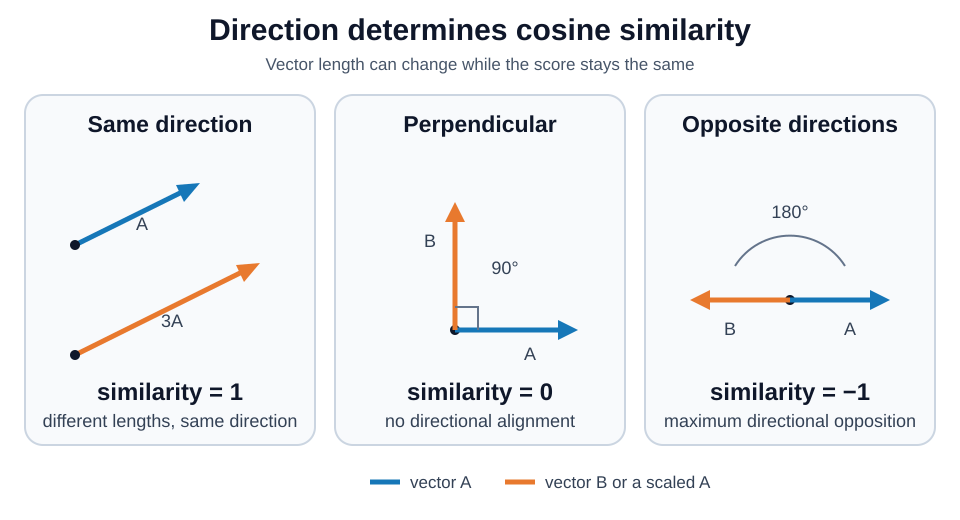
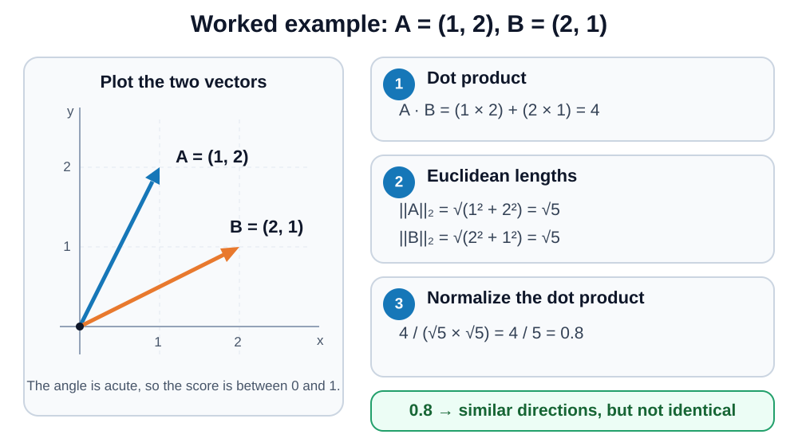
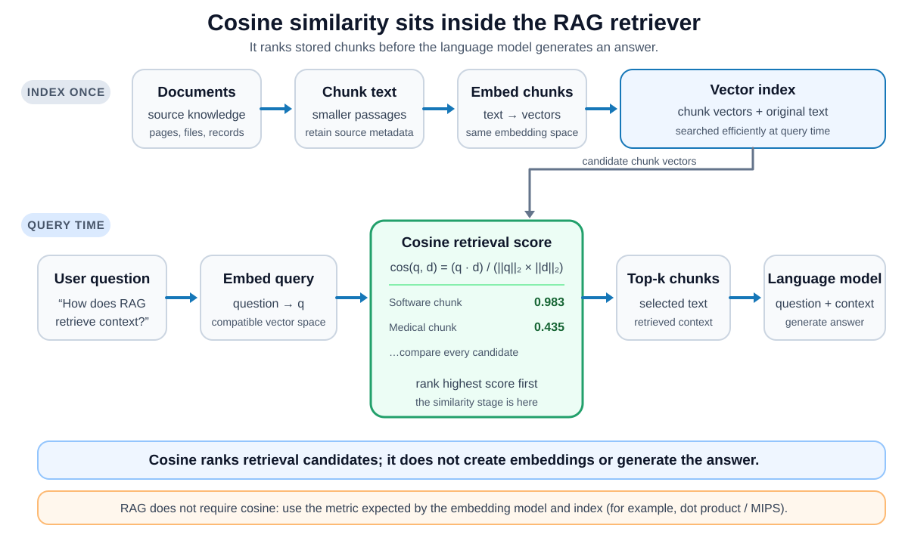

# Cosine Similarity

## Front

What is cosine similarity, how is it calculated and interpreted, where does it appear in a RAG pipeline, and which limitations matter when using it for vector search?

## Back

**Cosine similarity measures how closely two nonzero vectors point in the same direction.** It is the dot product divided by both vector lengths, so it compares direction while removing positive differences in magnitude. This card builds the geometric intuition, defines the formula, calculates one example, and finishes with implementation rules and common traps.

### Core mental model: compare direction, not length

Read the three panels from left to right. Parallel vectors have score `1`, perpendicular vectors have score `0`, and opposite vectors have score `-1`. The first panel also shows that multiplying a vector by a positive number changes its length but not its direction or cosine similarity.



For real, nonzero vectors, cosine similarity is between `-1` and `1`:

| Score | Geometric meaning | Practical reading |
|---:|---|---|
| `1` | Same direction | Maximum directional similarity |
| Between `0` and `1` | Acute angle | More aligned than perpendicular |
| `0` | Perpendicular | No directional alignment |
| Between `-1` and `0` | Obtuse angle | More opposed than perpendicular |
| `-1` | Opposite directions | Maximum directional opposition |

When every component is nonnegative, as with many term-frequency vectors, negative scores cannot occur. Vectors with negative components can produce negative scores, so do not assume the range is always limited to `[0, 1]`.

### Vocabulary and formula

- A **vector** is an ordered list of numeric components, such as `A = (1, 2)`.
- The **dot product** multiplies matching components and adds the products: `A · B = Σ AᵢBᵢ`.
- The **Euclidean norm** (L2 norm) is the vector's length: `||A||₂ = √(Σ Aᵢ²)`.
- A **unit vector** has norm `1`.

```text
cosine_similarity(A, B) = (A · B) / (||A||₂ × ||B||₂)
```

The numerator rewards components that point together. The denominator length-normalizes both vectors. Equivalently, normalize each vector to length `1` and take their dot product:

```text
 = A / ||A||₂
B̂ = B / ||B||₂
cosine_similarity(A, B) = Â · B̂
```

Therefore, if vectors are already L2-normalized, cosine similarity is just their dot product.

To recover the geometric angle, apply the inverse cosine. A commonly named distance-like conversion subtracts the similarity from `1`:

```text
angle(A, B)            = arccos(cosine_similarity(A, B))
cosine_distance(A, B)  = 1 - cosine_similarity(A, B)
```

The first expression returns radians unless the calculation tool converts the result to degrees. The second expression is convenient for ranking from smallest to largest, but it should not automatically be assumed to satisfy every mathematical distance-metric property.

### Worked example: `A = (1, 2)` and `B = (2, 1)`

The diagram separates the calculation into the dot product, the two lengths, and the final division. The vectors are neither parallel nor perpendicular, so the result must fall strictly between `0` and `1`.



The arithmetic is:

```text
A · B       = (1 × 2) + (2 × 1) = 4
||A||₂      = √(1² + 2²) = √5
||B||₂      = √(2² + 1²) = √5
similarity  = 4 / (√5 × √5) = 4 / 5 = 0.8
```

The angle is `arccos(0.8) ≈ 36.87°`. A score of `0.8` therefore means the vectors are closer to the same direction than to a perpendicular direction; it does not mean that they are “80% identical.”

### Why magnitude disappears

For any positive scalar `c`:

```text
cosine_similarity(A, cB) = cosine_similarity(A, B)
```

The dot product is multiplied by `c`, but `||cB||₂` is also multiplied by `c`, so the factors cancel. This is useful when direction or relative proportions matter more than size. For example, document vectors with similar term distributions can remain similar even when one document is much longer.

This is also a limitation. `A = (1, 1)` and `B = (100, 100)` have cosine similarity `1`, although they are far apart by Euclidean distance. If magnitude contains important information, cosine similarity alone discards it.

A negative scalar reverses direction rather than merely changing length:

```text
cosine_similarity(A, -B) = -cosine_similarity(A, B)
```

### Where cosine similarity appears in a RAG pipeline

**Cosine similarity belongs to the retrieval stage, between embedding the query and selecting the top chunks.** A common retrieval-augmented generation (RAG) pipeline has two paths:

- **Indexing:** split source documents into chunks, embed each chunk, and store its vector together with the original text and metadata in a vector index.
- **Query time:** embed the user's question in the compatible vector space, compare that query vector with indexed chunk vectors, rank the chunks, and pass the top `k` chunks to the language model as context.



For example, using the vectors from the audited schema:

```text
query q                  = (0.112, 0.993)
software chunk d₁        = (0.295, 0.955)  → cos(q, d₁) ≈ 0.983
medical chunk d₂         = (0.944, 0.331)  → cos(q, d₂) ≈ 0.435
```

The software chunk ranks above the medical chunk because `0.983 > 0.435`. Retrieval returns the associated **text**, not only the vector or score; that text becomes context for generation.

Cosine similarity does not understand language, build embeddings, or judge the generated answer. The embedding model determines what direction means, while cosine only compares the resulting numbers. RAG also does **not** require cosine similarity: the original RAG system used maximum inner-product search (MIPS), and other systems may use dot product or another model-compatible metric. With L2-normalized embeddings, dot-product and cosine rankings are identical.

### Minimal Python implementation

This implementation accepts equal-length real vectors and rejects a zero vector because the mathematical formula would divide by zero.

```python
from collections.abc import Sequence
from math import sqrt


def cosine_similarity(
    a: Sequence[float],
    b: Sequence[float],
) -> float:
    if len(a) != len(b):
        raise ValueError("vectors must have the same dimension")

    dot_product = sum(x * y for x, y in zip(a, b))
    norm_a = sqrt(sum(x * x for x in a))
    norm_b = sqrt(sum(y * y for y in b))

    if norm_a == 0.0 or norm_b == 0.0:
        raise ValueError("cosine similarity is undefined for a zero vector")

    return dot_product / (norm_a * norm_b)


score = cosine_similarity((1.0, 2.0), (2.0, 1.0))
print(f"{score:.3f}")
```

```text
0.800
```

In production, use a tested vector library for batching, sparse vectors, numerical stability, and hardware acceleration. If the library receives zero vectors, check its documented convention instead of assuming it matches the mathematical definition.

### Common mistakes and limits

- **Using a zero vector:** its norm is `0`, so the formula's denominator is `0` and its direction is undefined.
- **Comparing incompatible coordinates:** vectors must have the same dimension and each coordinate must represent the same feature space. Equal length alone is insufficient.
- **Confusing similarity with Euclidean closeness:** cosine ignores positive magnitude differences.
- **Treating `0.8` as 80% equality:** it is the cosine of an angle, not a percentage of matching content.
- **Assuming every dataset uses the full `[-1, 1]` range:** nonnegative vectors cannot produce negative dot products, while signed embeddings can.
- **Copying one universal threshold:** choose and test any cutoff on representative data from the actual retrieval task.
- **Assuming cosine distance is automatically a metric:** libraries often define `cosine_distance = 1 - cosine_similarity`, but that quantity should not be assumed to satisfy every metric property.

### One-sentence summary

> Cosine similarity is the dot product of two L2-normalized, nonzero vectors: it measures directional alignment from `-1` to `1`, ignores positive magnitude, and can rank compatible query and chunk embeddings during RAG retrieval.

## Sources

- [scikit-learn: Cosine similarity user guide](https://scikit-learn.org/stable/modules/metrics.html#cosine-similarity)

  Defines cosine similarity as the L2-normalized dot product and explains its unit-sphere interpretation.

- [scikit-learn: `cosine_similarity` API](https://scikit-learn.org/stable/modules/generated/sklearn.metrics.pairwise.cosine_similarity.html)

  Provides the normalized-dot-product formula, matrix input contract, and zero-vector example behavior.

- [Stanford Introduction to Information Retrieval: Dot products](https://nlp.stanford.edu/IR-book/html/htmledition/dot-products-1.html)

  Defines the dot product and Euclidean length, explains length normalization, and motivates cosine similarity for documents.

- [Stanford Introduction to Information Retrieval: Queries as vectors](https://nlp.stanford.edu/IR-book/html/htmledition/queries-as-vectors-1.html)

  Explains ranking documents by cosine similarity to a query vector.

- [Lewis et al.: Retrieval-Augmented Generation for Knowledge-Intensive NLP Tasks](https://arxiv.org/abs/2005.11401)

  Introduces RAG as a dense-index retriever coupled to a generator and documents its top-k maximum inner-product retrieval stage.

- [Sentence Transformers: Semantic Search](https://www.sbert.net/examples/sentence_transformer/applications/semantic-search/README.html)

  Shows the corpus-indexing and query-embedding workflow, cosine-based ranking, top-k retrieval, and the equivalence to dot product after L2 normalization.

- [SciPy: `scipy.spatial.distance.cosine`](https://docs.scipy.org/doc/scipy/reference/generated/scipy.spatial.distance.cosine.html)

  Defines cosine distance as `1 -` the normalized dot product.

- [NIST Dataplot: Cosine distance and cosine similarity](https://www.itl.nist.gov/div898/software/dataplot/refman2/auxillar/cosdist.htm)

  Gives the similarity and distance formulas and notes that the simple cosine-distance form is not a proper distance metric.
