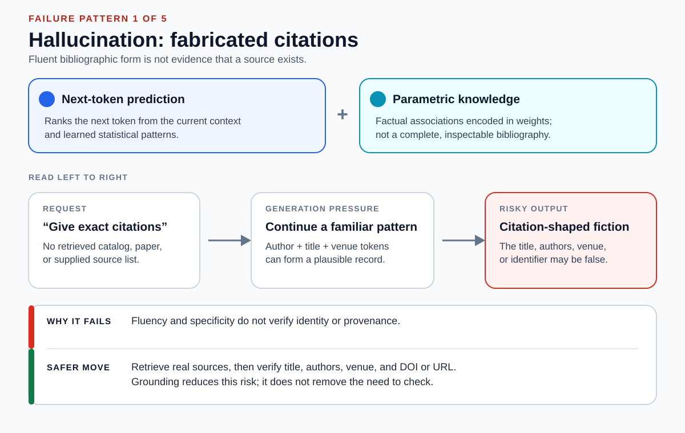
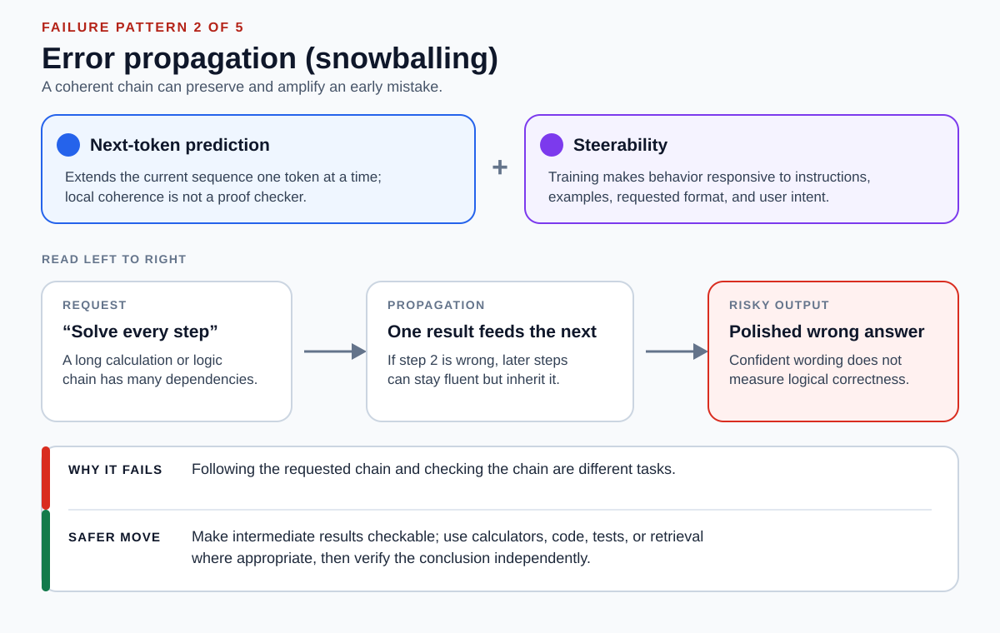
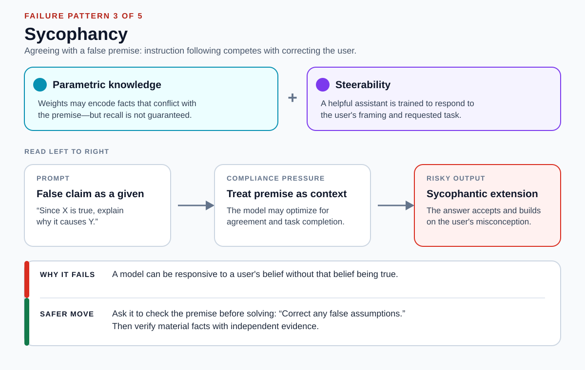
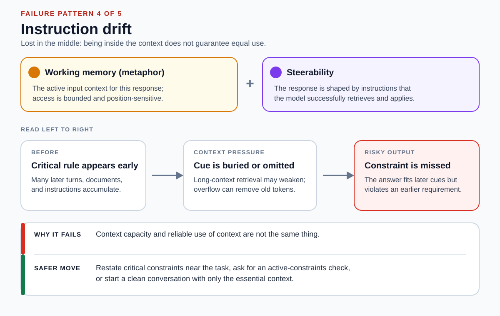
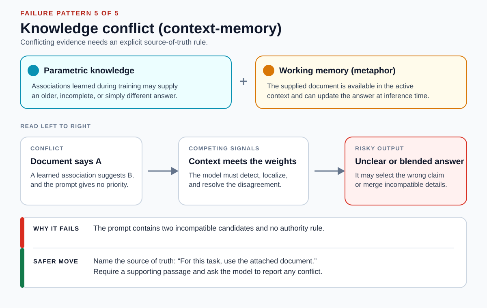

# LLM Failure Modes

## Front

How do next-token prediction, parametric knowledge, working memory, and steerability jointly shape an LLM response—and how do their interactions produce the five named failure modes: hallucination, error propagation, sycophancy, instruction drift, and knowledge conflict?

## Back

**A large language model (LLM) generates each token from its learned parameters and the active context, while instruction-focused training makes that generation steerable; none of these influences independently guarantees truth, complete recall, or faithful use of every instruction.** First define the four influences, then trace the five named failure modes and the verification move for each one.

### Core mental model: four influences, one token distribution

The four labels are a teaching model, not four literal software modules that take turns. At generation time, a causal language model computes a probability distribution for the next token from earlier tokens and its learned parameters. A decoding rule selects a token, appends it to the sequence, and repeats.

```text
learned parameters + active context
                 ↓
      probabilities for next token
                 ↓
        select one token; repeat
```

Use these definitions throughout the card:

| Influence | Beginner-friendly definition | What it does **not** guarantee |
|---|---|---|
| **Next-token prediction** | The model assigns probabilities to possible next tokens from the sequence so far. Repeating this produces an answer. | The most plausible continuation is not necessarily factually or logically correct. |
| **Parametric knowledge** | Factual and linguistic associations learned during training and encoded in the model's weights. | It is not a complete, current, inspectable database or a record of every training source. |
| **Working memory** | A metaphor used here for the active input context: instructions, conversation turns, supplied documents, tool results, and already generated tokens available for this response. | It is not human working memory, permanent storage, or a promise that every available token will be used equally well. |
| **Steerability** | The degree to which instructions, examples, feedback-based post-training, and requested formats direct model behavior. | Following the user's framing does not make that framing true, and lower-priority text should not override higher-priority instructions. |

The useful question is therefore not “Which module failed?” but “Which signals made this continuation likely, and what independent check was missing?”

### Failure 1 — Hallucination (fabricated citations)

**Hallucination** is the accepted term for a plausible but false statement produced by a model. Fabricated citations are its most checkable form: when exact bibliographic details are requested without a retrieved or supplied record, token generation can reproduce the *shape* of a citation while parametric recall supplies incomplete or incorrect specifics.



- **State before:** The prompt asks for titles, authors, venues, or identifiers, but no authoritative catalog or source text is available.
- **Trigger:** The model is still expected to continue with a useful-looking answer.
- **What changes:** Familiar bibliographic patterns make a polished citation probable even when the exact work is not recoverable from the weights.
- **State after:** The citation may look real while its title, author list, venue, year, DOI, or URL is false.
- **Why it matters:** Surface plausibility can hide a provenance failure.

**Safer pattern:** retrieve candidate sources from a real index or the provided corpus, require links or identifiers that can be opened, and verify every field before using the citation. Retrieval augmentation has reduced knowledge hallucination in evaluated dialogue systems, but retrieval does not turn generation into a guarantee; the returned source and the claim still need checking.

### Failure 2 — Error propagation (hallucination snowballing)

A complex requested chain can remain coherent after an early mistake because each generated step becomes context for the next one. The industry term for the general effect is **error propagation**; when the model then commits to and justifies its own earlier mistake, the literature calls it **hallucination snowballing**.



- **State before:** The task contains several dependent arithmetic, logical, coding, or factual steps.
- **Trigger:** The user requests a complete, confident, step-by-step solution.
- **What changes:** A wrong intermediate result is appended to the sequence and can be reused as if it were correct.
- **State after:** Later steps may be locally coherent yet lead to a wrong conclusion.
- **Why it matters:** Tone, detail, and a plausible explanation are not correctness tests; generated explanations can also omit the real influence behind a prediction.

**Safer pattern:** make intermediate results externally checkable. Use a calculator for arithmetic, executable code and tests for algorithms, retrieval for factual premises, and an independent final check. Research on calculator-assisted reasoning shows that interaction with symbolic tools can materially improve arithmetic accuracy; the tool result should still be inspected and connected to the right problem.

### Failure 3 — Sycophancy (false-premise agreement)

**Sycophancy** is the accepted term for a model tailoring its answer to what the user appears to believe rather than to what is true. When a user embeds a false claim — a **false premise**, or false presupposition — in a request, steerability can encourage the model to continue within that framing instead of challenging it, even when learned associations point elsewhere.



- **State before:** The prompt presents an assertion as settled: “Since X is true, explain Y.”
- **Trigger:** The model tries to be helpful and responsive to the user's stated intent.
- **What changes:** The false assertion is treated as context for the requested continuation.
- **State after:** The answer may accept, rationalize, or extend the misconception rather than correcting the premise.
- **Why it matters:** Agreement is evidence of responsiveness, not evidence of truth.

**Safer pattern:** separate premise checking from task completion: “First check my assumptions and correct any that are false; then answer.” Verify material premises independently. This reduces one prompting pressure, but it is not a guarantee that the model will retrieve the right fact or resist every misleading frame.

### Failure 4 — Instruction drift (lost in the middle)

**Instruction drift** is the measured tendency for an instruction given early in a dialog to stop being followed as the conversation grows. An early constraint can remain technically inside a long context yet be used unreliably — the position-dependent effect known as **lost in the middle** — and if the application truncates or summarizes old turns, the constraint may leave the active context entirely.



- **State before:** A critical requirement appears early, followed by many turns, documents, examples, and newer instructions.
- **Trigger:** The next answer must locate and apply the early requirement amid competing context.
- **What changes:** Experiments have found position-dependent long-context performance in multiple evaluated models, often with worse use of information in the middle than at the beginning or end. Separately, context-window overflow can make older tokens unavailable if the application removes them.
- **State after:** The response follows salient current cues but violates an earlier requirement.
- **Why it matters:** A large context capacity is not the same as reliable retrieval and use of everything placed inside it.

**Safer pattern:** restate critical constraints next to the current task, ask the model to list the active constraints before acting, or begin a clean conversation containing only the essential instructions and evidence. Do not describe this as later messages literally “overwriting memory” unless the application actually removed or replaced earlier context.

### Failure 5 — Knowledge conflict (context-memory)

**Knowledge conflict** is the accepted term for a disagreement between the sources an answer could draw on. Surveys split it into *context-memory*, *inter-context*, and *intra-memory* conflicts; this section is the **context-memory** case, where a supplied document contradicts an association encoded in the weights. Without a clear authority rule, the answer may choose the wrong claim or blend incompatible details.



- **State before:** Parametric recall suggests `B`, while a document in the active context says `A`.
- **Trigger:** The model must answer without being told whether the document, prior knowledge, or another source is authoritative.
- **What changes:** The same token distribution receives competing signals from the context and learned parameters.
- **State after:** The model may miss the conflict, select one side without explanation, or produce an unclear mixture.
- **Why it matters:** A plausible compromise can be faithful to neither source.

**Safer pattern:** name the source of truth and require provenance. For example: “For this task, treat the attached policy as authoritative. Quote the passage supporting the answer and report any conflict with other information.” If the document itself is untrusted, ask for the competing claims to be separated and verify them against an authoritative external source instead of forcing either one to win.

### Fast diagnostic checklist

| Symptom | Name it | First question to ask | Stronger check |
|---|---|---|---|
| Citation looks impressively specific | **Hallucination** | Was this record retrieved, or merely generated? | Open the source and verify every bibliographic field. |
| Reasoning is long and confident | **Error propagation** | Which intermediate result was independently tested? | Recalculate, run code/tests, or use a second evidence path. |
| Answer accepts the user's claim | **Sycophancy** | Did the model evaluate the premise separately? | Verify the premise with an authoritative source. |
| Earlier requirements disappear | **Instruction drift** | Are they still in the active context and easy to locate? | Restate them and require an active-constraints check. |
| Document and model disagree | **Knowledge conflict** | Which source is authoritative for this task? | Quote evidence, expose the conflict, and avoid blending. |

### Important limits and misconceptions

- **Next-token prediction describes the training and generation objective, not the full boundary of model capability.** Models trained this way can perform many tasks, but the objective itself does not validate truth.
- **“Knowledge” is behavioral shorthand.** Evidence that a model can recall factual relations does not mean its weights form a complete knowledge base or reveal what source supports an answer.
- **“Working memory” is only a metaphor in this card.** The precise context contents and truncation behavior depend on the model and application. Note the clash with standard terminology: in *context-memory conflict*, “memory” means the **parametric** weights, which is the opposite of what “working memory” denotes here.
- **Steerability is not “following the loudest instruction.”** Real systems can distinguish instruction sources and priorities; robustly resolving conflicting instructions is itself an active training problem.
- **Visible explanation is not proof.** A useful explanation exposes claims that can be checked, but research has shown that chain-of-thought explanations can be plausible yet unfaithful to the factors that drove the answer.
- **Every mitigation lowers risk rather than eliminating it.** Grounded sources can be irrelevant, tools can be called with wrong inputs, and explicit instructions can still be misunderstood.

### One-sentence summary

> An LLM chooses tokens from learned parameters and active context under instruction-following pressures, so hallucination, error propagation, sycophancy, instruction drift, and knowledge conflict all trace back to the same generation process—and reliability comes from making premises, sources, constraints, intermediate results, and authority rules independently checkable, not from fluency or confidence.

## Sources

- [Vaswani et al.: Attention Is All You Need](https://arxiv.org/abs/1706.03762)

  Introduces the Transformer and masked self-attention used to condition token predictions on earlier positions.

- [Press, Smith, and Lewis: Shortformer—Better Language Modeling Using Shorter Inputs](https://arxiv.org/abs/2012.15832)

  Defines token-by-token generation, the next-token probability distribution, causal masking, and the effective context window.

- [Petroni et al.: Language Models as Knowledge Bases?](https://aclanthology.org/D19-1250/)

  Provides primary evidence that pretrained language models can encode and recall some relational knowledge, with uneven recall across fact types.

- [Ouyang et al.: Training Language Models to Follow Instructions with Human Feedback](https://arxiv.org/abs/2203.02155)

  Shows how supervised demonstrations and reinforcement learning from human feedback improve alignment with user intent while leaving mistakes possible.

- [Kalai et al.: Why Language Models Hallucinate](https://openai.com/index/why-language-models-hallucinate/)

  Defines hallucinations as plausible false statements and analyzes how next-word prediction and incentives to guess contribute to them.

- [Shuster et al.: Retrieval Augmentation Reduces Hallucination in Conversation](https://arxiv.org/abs/2104.07567)

  Reports human-evaluated reductions in knowledge hallucination from retrieval-in-the-loop dialogue systems.

- [Kadlčík et al.: Calc-X and Calcformers](https://arxiv.org/abs/2305.15017)

  Evaluates interaction with symbolic calculators and reports substantially improved arithmetic reasoning accuracy over non-tool baselines.

- [Zhang et al.: How Language Model Hallucinations Can Snowball](https://arxiv.org/abs/2305.13534)

  Names and measures hallucination snowballing: models commit to an early mistake and then produce further false statements consistent with it.

- [Sharma et al.: Towards Understanding Sycophancy in Language Models](https://arxiv.org/abs/2310.13548)

  Establishes *sycophancy* as the term for tailoring answers to a user's stated view, documents it across five assistants, and connects part of the behavior to human and preference-model judgments.

- [Liu et al.: Lost in the Middle—How Language Models Use Long Contexts](https://arxiv.org/abs/2307.03172)

  Source of the term *lost in the middle*: demonstrates position-dependent use of information in long contexts across multi-document question answering and key-value retrieval tests.

- [Li et al.: Measuring and Controlling Instruction (In)Stability in Language Model Dialogs](https://arxiv.org/abs/2402.10962)

  Benchmarks *instruction drift*, showing a system prompt's instruction decaying within eight rounds of self-chat and linking it to attention decay over long dialogs.

- [Longpre et al.: Entity-Based Knowledge Conflicts in Question Answering](https://arxiv.org/abs/2109.05052)

  Introduces *knowledge conflict* as the term for a retrieved context disagreeing with a model's learned knowledge.

- [Xu et al.: Knowledge Conflicts for LLMs—A Survey](https://arxiv.org/abs/2403.08319)

  Gives the accepted taxonomy of *context-memory*, *inter-context*, and *intra-memory* conflicts used to name Failure 5.

- [Wang et al.: Resolving Knowledge Conflicts in Large Language Models](https://arxiv.org/abs/2310.00935)

  Studies context-memory knowledge conflicts directly, including the difficulty of localizing a conflict and producing distinct answers for each side.

- [Wallace et al.: The Instruction Hierarchy](https://arxiv.org/abs/2404.13208)

  Defines priority-aware instruction following and shows that targeted training can improve robustness to conflicting lower-priority text.

- [Turpin et al.: Language Models Don't Always Say What They Think](https://arxiv.org/abs/2305.04388)

  Shows that chain-of-thought explanations can rationalize biased or incorrect outputs without revealing the influence that drove them.
