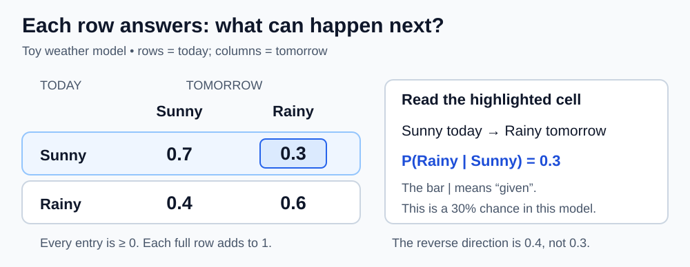
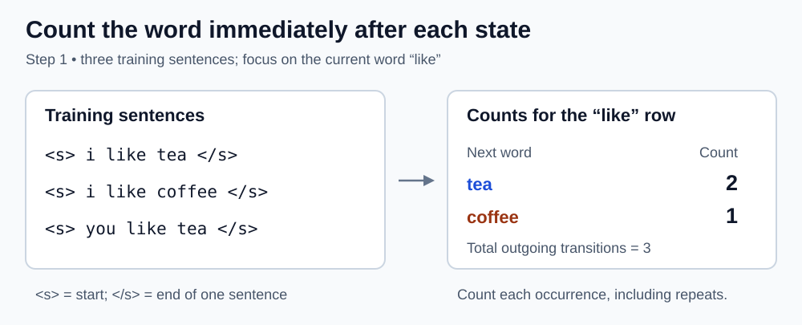
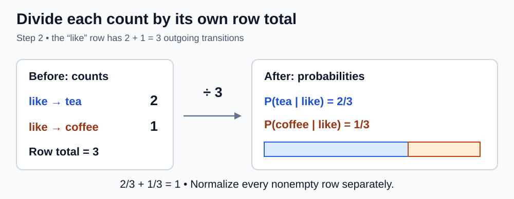
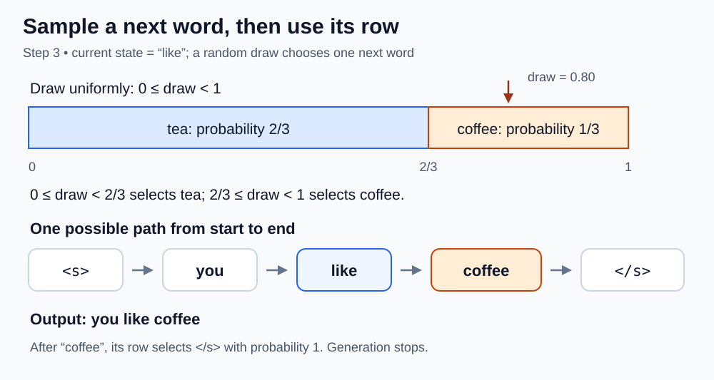

# Markov table

<sub>[Back to Artificial Intelligence](../Readme.md#content)</sub>

**A Markov table records the probability of each possible next state, given the current state.** The standard mathematical name is a **transition probability matrix**. Here, “Markov table” also covers a practical lookup table of transition counts that can be converted into probabilities.

In a simple text generator, the current state can be the last word, and its row answers “what word might follow?” This article explains how to read the table, build one from text, and use it to generate a sentence.

## States, transitions, and the Markov assumption

A **state** describes where the model is now; a **transition** moves it to the next state. A **Markov chain** is a sequence of states whose next-state probabilities depend only on the current state, once that state is known.

For a first-order word model, the current state is one word. After both `i like` and `you like`, the model consults the same `like` row. It has discarded the distinction between `i` and `you`.

```text
P(next state | current state, earlier history)
    = P(next state | current state)
```

`P` means probability; the vertical bar `|` means “given.” The equality defines the model's Markov property. Applying it to real language is an approximation: earlier words can matter.

We use a **time-homogeneous** model: its probabilities remain fixed during generation. The selected row changes as the state changes; the table itself does not.

## How to read a transition table

In this invented weather example, select today's row and then tomorrow's column. The highlighted cell means a 30% chance of rain tomorrow, given sunshine today.



| Current state ↓ / Next state → | Sunny | Rainy |
|---|---:|---:|
| Sunny | 0.7 | 0.3 |
| Rainy | 0.4 | 0.6 |

With this **row-stochastic** convention, every entry is nonnegative and every complete row sums to `1`. Staying in the same state is allowed: the `Sunny → Sunny` entry is `0.7`.

```text
P[i, j] = P(next state = j | current state = i)
```

The direction matters: `P(Rainy | Sunny) = 0.3`, while `P(Sunny | Rainy) = 0.4`. Neither is the unconditional probability of rain. Some books use columns for the current state; in that convention, columns sum to `1`. Always check the labels.

## From words to a table

A **token** is a unit the model processes; our example uses lowercase words. A **bigram** is a pair of adjacent tokens. A bigram language model predicts one token from the preceding token, so it is first-order with respect to tokens.

Our **corpus**, the text used to estimate the table, contains three sentences:

```text
i like tea
i like coffee
you like tea
```

We add `<s>` for the start of each sentence and `</s>` for its end. These are control markers, not words printed in the result.

The `<s>` row supplies the probabilities of the **first word**: two sentences start with `i` and one with `you`, giving `i: 2/3` and `you: 1/3`. Starting from this row preserves the observed sentence openings. Choosing a random word from the whole vocabulary could instead start with `like` or `tea`, which never begin a sentence in this corpus. The `</s>` marker tells the generator when to stop.

The following three steps use these sentences with their markers already added.

## Step 1 — Count adjacent token pairs



Read the diagram from left to right. The three sentences on the left already have boundary markers. Focus on the word immediately after each occurrence of `like`: `tea` in the first sentence, `coffee` in the second, and `tea` in the third.

Tallying those observations produces the row on the right: `tea: 2`, `coffee: 1`. Repeated observations contribute repeated counts; keeping only distinct successors would lose the `2:1` preference.

Apply the same counting rule to every current token, including `<s>` and the last word before `</s>`. Process each sentence separately, stopping at its end marker, so no pair joins the end of one sentence to the start of another.

## Step 2 — Normalize each row



Turn each nonempty count row into a probability distribution by dividing its entries by its total. This count-based estimate is **maximum likelihood estimation (MLE)**.

```text
P(next | current)
    = count(current → next) / total outgoing counts from current

P(tea | like)    = 2 / (2 + 1) = 2/3
P(coffee | like) = 1 / (2 + 1) = 1/3
```

The denominator is `3`, the outgoing total for `like`, not the corpus's `12` transitions. Dividing by `12` would answer a different question and would leave this row summing to `1/4`.

Here is the complete lookup table used by our generator. It lists only observed successors; omitted entries have probability `0`.

| Current state | Next-state counts | Next-state probabilities |
|---|---|---|
| `<s>` | `i: 2`, `you: 1` | `i: 2/3`, `you: 1/3` |
| `i` | `like: 2` | `like: 2/2 = 1` |
| `you` | `like: 1` | `like: 1/1 = 1` |
| `like` | `tea: 2`, `coffee: 1` | `tea: 2/3`, `coffee: 1/3` |
| `tea` | `</s>: 2` | `</s>: 2/2 = 1` |
| `coffee` | `</s>: 1` | `</s>: 1/1 = 1` |

When a row has only one observed successor, its count equals the row total. The resulting probability is `1`, meaning a 100% chance in this model.

The generator stops at `</s>`, so it never requests that marker's row. To express the same process as a full square transition matrix, add an **absorbing** end state: `P(</s> | </s>) = 1`, with all other entries in that row zero. This self-loop represents remaining finished; it is not an observed word pair.

## Step 3 — Sample, update the state, and repeat



Start at `<s>`. **Sampling** means choosing randomly according to the selected row's probabilities. Append the chosen word, make it the current state, and consult its row. Selecting `</s>` ends generation.

The diagram focuses on one choice after `like`. Assign `tea` the interval from `0` up to, but excluding, `2/3`, and `coffee` the interval from `2/3` up to, but excluding, `1`. A uniform random draw of `0.80` lands in the coffee interval. Tea occupies twice as much space, so it is twice as likely.

One possible complete path is:

```text
<s> → you → like → coffee → </s>
```

It produces `you like coffee`, a sentence absent from the corpus. Each adjacent pair was observed, so the model can combine them. Once it reaches `like`, its first-order state no longer records who likes the drink.

The probability of this complete path, starting at `<s>`, is the product of its transition probabilities:

```text
P(you like coffee, then end)
    = P(you | <s>) × P(like | you)
      × P(coffee | like) × P(</s> | coffee)
    = (1/3) × 1 × (1/3) × 1
    = 1/9
```

Always choosing the largest entry is **greedy selection**, a different rule from sampling. Here it always produces `i like tea`. Sampling can produce all four combinations of `i`/`you` and `tea`/`coffee`.

## A runnable Python example

This Python 3 example builds the counts and probabilities, then generates one sentence. Dictionaries store only observed transitions. `random.choices` accepts relative weights, so the sampler can use counts directly: weights `[2, 1]` give the same proportions as `[2/3, 1/3]`.

```python
from collections import Counter, defaultdict
from random import Random

sentences = ["i like tea", "i like coffee", "you like tea"]
counts = defaultdict(Counter)

for sentence in sentences:
    tokens = ["<s>", *sentence.split(), "</s>"]
    for current, following in zip(tokens, tokens[1:]):
        counts[current][following] += 1

probabilities = {}
for current, row in counts.items():
    row_total = sum(row.values())
    probabilities[current] = {
        word: count / row_total for word, count in row.items()
    }

rng = Random(7)
state = "<s>"
output = []

for _ in range(20):
    row = counts.get(state)
    if not row:
        raise ValueError(f"No outgoing transitions for {state!r}")
    state = rng.choices(list(row), weights=list(row.values()), k=1)[0]
    if state == "</s>":
        break
    output.append(state)

if state != "</s>":
    raise RuntimeError("Generation reached the transition limit")

print(round(probabilities["like"]["tea"], 3))
print(" ".join(output))
```

Example output:

```text
0.667
i like tea
```

The diagram shows a different valid sample. Selecting `</s>` exits the loop with `break`. After the loop, the separate `if` checks whether generation reached that end marker; if not, the 20-transition limit was exhausted and the code raises an error. This prevents a changed corpus from making generation loop indefinitely. Splitting on whitespace is sufficient for these prepared sentences; it is a deliberate simplification of tokenization.

## More context means larger states

An order-`k` token model keeps the previous `k` tokens. Its next-token lookup uses an `n`-gram of size `n = k + 1`.

| Language model | Context retained | Example lookup |
|---|---|---|
| Unigram | None | `P(tea)` |
| Bigram | One token | `P(tea \| like)` |
| Trigram | Two tokens | `P(tea \| you like)` |

A trigram model can distinguish `i like` from `you like`. In our corpus, `P(coffee | i like) = 1/2`, while the unsmoothed estimate of `P(coffee | you like)` is `0`.

This is still a first-order chain over **compound states**: after `(you, like)` emits `tea`, the new state is `(like, tea)`. A context-to-next-token lookup need not be square; the equivalent state-to-state matrix uses compound contexts on both axes.

With `V` possible tokens and context length `k`, there are up to `V^k` context keys and `V^(k+1)` context/next-token combinations. For `V = 100` and `k = 2`, that is up to `10,000` keys and `1,000,000` combinations. Storing only observed entries avoids allocating all those cells, but does not supply evidence for unseen contexts.

## Limits and common mistakes

- **Zero count does not prove impossibility.** Smoothing reserves probability for unseen transitions within the vocabulary; backoff uses a shorter context when evidence for a longer one is missing. A new word such as `milk` also needs an explicit vocabulary policy: smoothing existing entries does not automatically add a new token.
- **An empty row cannot be normalized.** If an input context has no outgoing counts, the denominator is zero. Define a fallback, reject that context, or use a deliberate stopping rule.
- **Frequency is not meaning or truth.** This table records observed local transitions. Our unseen output `you like coffee` does not establish anyone's actual preference.
- **Longer context needs more evidence.** The trigram example separates the two subjects but bases the `you like` row on one observation. More context can leave fewer examples per row.
- **Rows must cover all permitted outcomes.** A displayed subset of columns may sum to less than `1`; the complete probability distribution must still sum to `1`.

## Relation to neural language models

Both this generator and an autoregressive neural language model assign probabilities to the next token and feed generated tokens into subsequent predictions. An autoregressive Transformer uses **attention** to combine information from the available preceding tokens, giving different weights to their learned representations for the current prediction. Its prediction is computed by a neural network rather than retrieved from a fixed table indexed by one word.

The Markov example makes the shared prediction-and-generation loop easy to inspect. Its state choice also exposes the limitation directly: two histories ending in `like` get identical next-word probabilities, regardless of what came before.

# Sources

- [Stanford STAT 217: Markov chains, §0.1.1](https://web.stanford.edu/class/stat217/New12.pdf)

  Markov property, time homogeneity, transition matrices, path probabilities, and absorbing states.

- [Brigham Young University ACME Labs: Markov Chains](https://labs.acme.byu.edu/Volume2/MarkovChains/MarkovChains.html)

  Matrix orientation, word states, sentence boundaries, and sentence generation. The lab primarily uses column-stochastic matrices; this article uses rows.

- [Jurafsky and Martin: Speech and Language Processing, Chapter 3, N-gram Language Models](https://web.stanford.edu/~jurafsky/slp3/3.pdf)

  N-gram definitions, normalized count estimates, zero probabilities, smoothing, and backoff.

- [Princeton COS 126: Markov Model of Natural Language](https://www.cs.princeton.edu/courses/archive/spr17/cos126/assignments/markov.html)

  Order-`k` contexts, count-based lookup tables, weighted generation, and shifting the state after each generated symbol. Its worked model uses characters; this article uses words.

- [Python documentation: random.choices](https://docs.python.org/3/library/random.html#random.choices)

  Sampling with relative weights.

- [Vaswani et al.: Attention Is All You Need, §§3.1–3.2](https://arxiv.org/html/1706.03762v7)

  Autoregressive decoding and masked self-attention over earlier positions.
