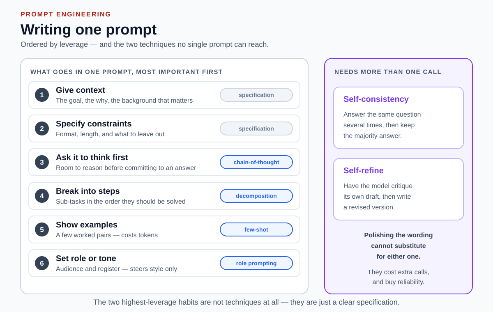

# Prompt-writing guidelines

## Front

Name the six habits that make a single prompt work, ordered by leverage. Which two are not named prompting techniques, and which two techniques can no single prompt reach?

## Back

**Ordered by leverage: give context, specify constraints, ask it to think first, break the task into steps, show examples, set role or tone.** The order matters more than the list — and the two highest-leverage habits are not techniques at all, just writing a clear specification.

| # | Guideline | What to write | Technique | Skip it when |
|---|---|---|---|---|
| 1 | **Give context** | Goal, why, relevant background | specification | Never |
| 2 | **Specify constraints** | Format, length, what to omit | specification | The output shape genuinely does not matter |
| 3 | **Ask it to think first** | Room to reason before answering | chain-of-thought | The model already reasons internally; it costs latency |
| 4 | **Break into steps** | Sub-tasks in solving order | decomposition | The task is genuinely single-step |
| 5 | **Show examples** | A few worked input/output pairs | few-shot | Instructions already pin the format; examples cost tokens and can over-constrain |
| 6 | **Set role or tone** | Audience and register | role prompting | You need accuracy — a persona steers style, not correctness |

Ranking is by how often a habit applies multiplied by how much it changes the answer. It is a rule of thumb, not a measured order.

### What one prompt cannot do

Two proven techniques need **more than one model call**, so no amount of rewording substitutes for them:

- **Self-consistency** — answer the same question several times, keep the majority.
- **Self-refine** — have the model critique its own draft, then revise it.

That boundary is the useful distinction: guidelines shape *one* message; the wider technique taxonomy also covers orchestrating *several*.

### Then iterate

None of the six is a one-shot ritual. Write the prompt, run it, find the *specific* failure, and change the one thing that caused it. The guidelines tell you what to vary; only testing tells you when to stop.

### Limits

- **Role prompting mainly steers tone.** A systematic study of persona system prompts found no reliable accuracy gain on objective tasks.
- **Context beats cleverness.** A specific, well-scoped request usually beats a keyword-stuffed one.

## Sources

- [Schulhoff et al.: The Prompt Report](https://arxiv.org/abs/2406.06608)

  Surveys 58 text prompting techniques and gives separate best-practice guidance for writing prompts.

- [Brown et al.: Language Models are Few-Shot Learners](https://arxiv.org/abs/2005.14165)

  Establishes in-context learning from examples placed in the prompt.

- [Wei et al.: Chain-of-Thought Prompting](https://arxiv.org/abs/2201.11903)

  Shows that eliciting intermediate reasoning steps improves complex reasoning.

- [Wang et al.: Self-Consistency Improves Chain of Thought Reasoning](https://arxiv.org/abs/2203.11171)

  Samples several reasoning paths and takes the majority answer.

- [Zheng et al.: When "A Helpful Assistant" Is Not Really Helpful](https://arxiv.org/abs/2311.10054)

  Finds that persona system prompts do not reliably improve model performance on objective tasks.
