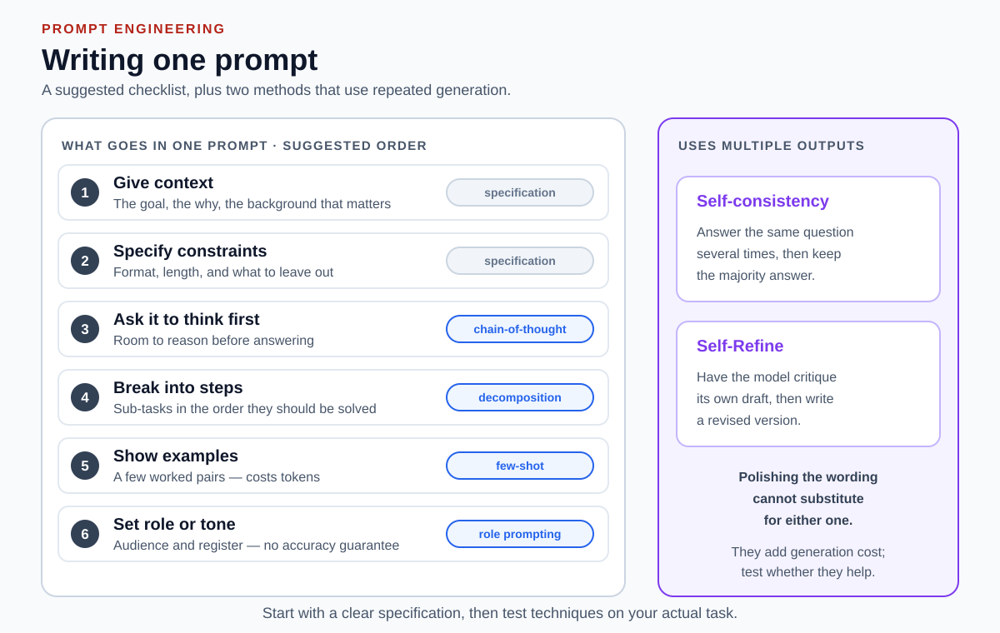

# Prompt-writing guidelines

[Back to Artificial Intelligence](../Readme.md#content)

# Front

Which six habits help you write a clear prompt, and how do they differ from methods that generate several outputs?

# Back

**Give context, specify constraints, ask it to think first, break into steps, show examples, and set role or tone.** These habits shape a message; methods that generate several outputs organize repeated generation.

The diagram's left panel gives a suggested order, not a measured ranking; the right introduces Self-consistency (sample and vote) and Self-Refine (draft, critique, revise).

| # | Guideline | What to write | Technique | Skip it when |
|---|---|---|---|---|
| 1 | **Give context** | Goal, why, relevant background | specification | Never |
| 2 | **Specify constraints** | Format, length, what to omit | specification | The output shape genuinely does not matter |
| 3 | **Ask it to think first** | Room to reason before answering | chain-of-thought | Tests on this task show no benefit from asking for intermediate steps |
| 4 | **Break into steps** | Sub-tasks in solving order | decomposition | The task is genuinely single-step |
| 5 | **Show examples** | A few worked input/output pairs | few-shot | Instructions already pin the format; examples cost tokens and can over-constrain |
| 6 | **Set role or tone** | Audience and register | role prompting | The audience and style are already clear from the request |

Use this order as an authoring checklist. Measure its usefulness on representative tasks for the model you use.

## Methods that generate several outputs

Two research methods use **multiple generated outputs** rather than one answer:

- **Self-consistency** — sample several reasoning paths for the same question and select the most common final answer.
- **Self-Refine** — generate a draft, generate feedback on it, and use that feedback to revise it; repeat as needed.

Polishing the wording alone cannot replace these sampling-and-voting or feedback-and-revision steps. The number of API calls depends on batching and orchestration. Neither method guarantees correctness.

## Then iterate

None of the six is a one-shot ritual. Write the prompt, run it, find the *specific* failure, and change the one thing that caused it. The guidelines tell you what to vary; only testing tells you when to stop.

## Limits

- **Role prompting mainly steers tone.** A systematic study of persona system prompts found no reliable accuracy gain on objective tasks.
- **Test the result.** Check whether the output meets your stated goal, format, and factual requirements.

# Sources

- [Schulhoff et al.: The Prompt Report](https://arxiv.org/abs/2406.06608)

  Surveys 58 text prompting techniques and gives separate best-practice guidance for writing prompts.

- [Brown et al.: Language Models are Few-Shot Learners](https://arxiv.org/abs/2005.14165)

  Establishes in-context learning from examples placed in the prompt.

- [Wei et al.: Chain-of-Thought Prompting](https://arxiv.org/abs/2201.11903)

  Shows that eliciting intermediate reasoning steps improves complex reasoning.

- [Wang et al.: Self-Consistency Improves Chain of Thought Reasoning](https://arxiv.org/abs/2203.11171)

  Samples several reasoning paths and takes the majority answer.

- [Madaan et al.: Self-Refine — Iterative Refinement with Self-Feedback](https://arxiv.org/abs/2303.17651)

  Defines the repeated draft, feedback, and refinement procedure.

- [Zheng et al.: When "A Helpful Assistant" Is Not Really Helpful](https://arxiv.org/abs/2311.10054)

  Finds that persona system prompts do not reliably improve model performance on objective tasks.
