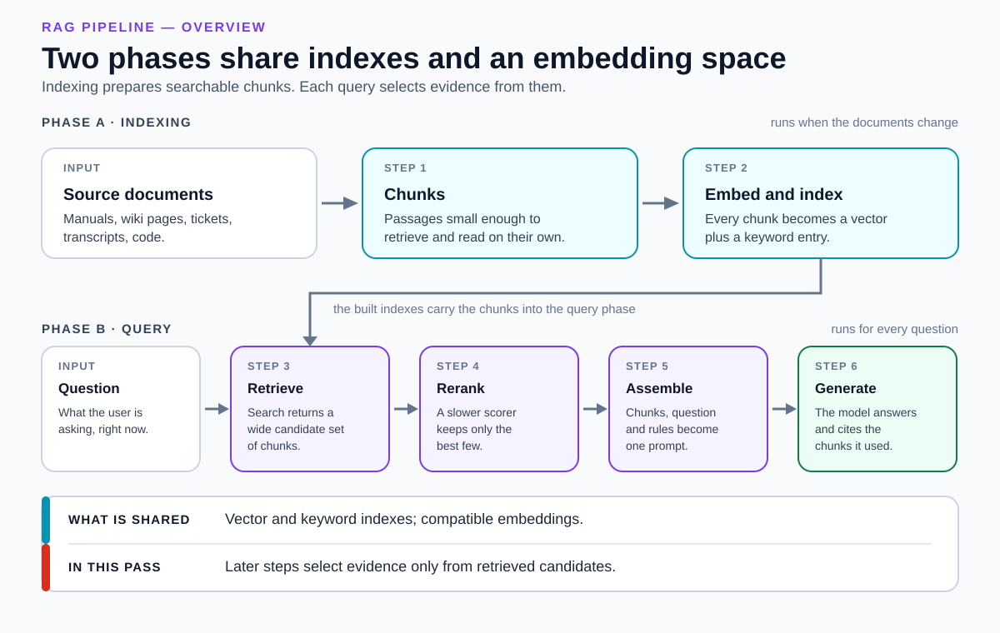
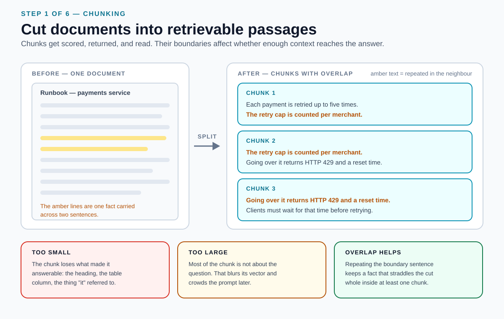
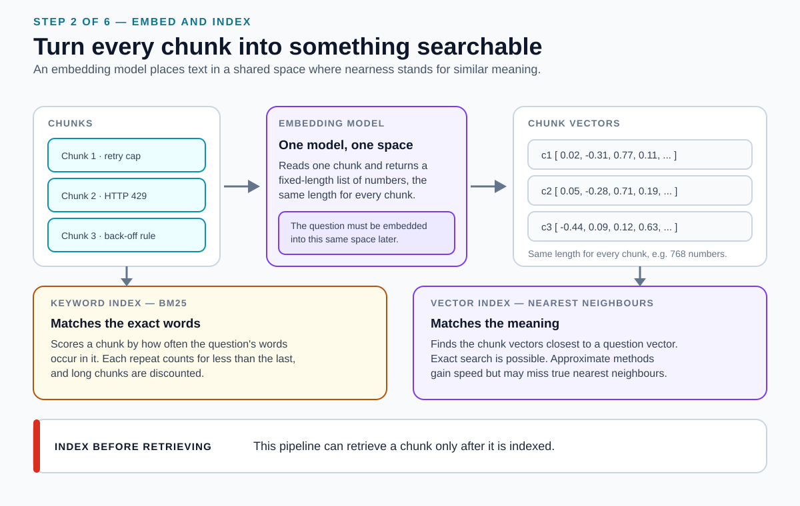
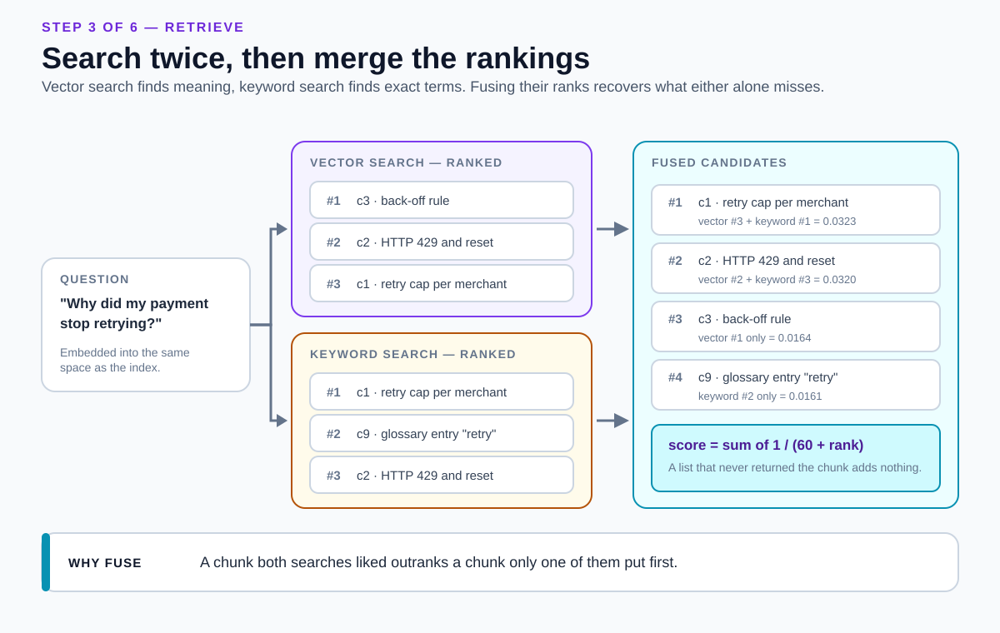
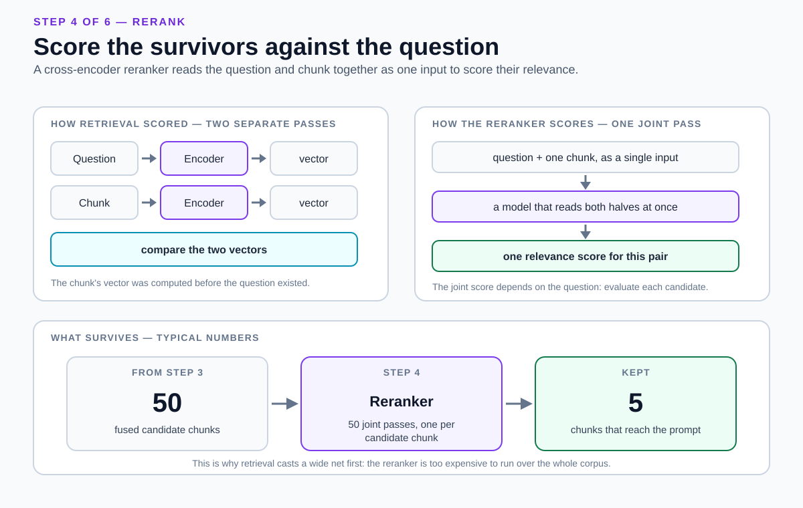
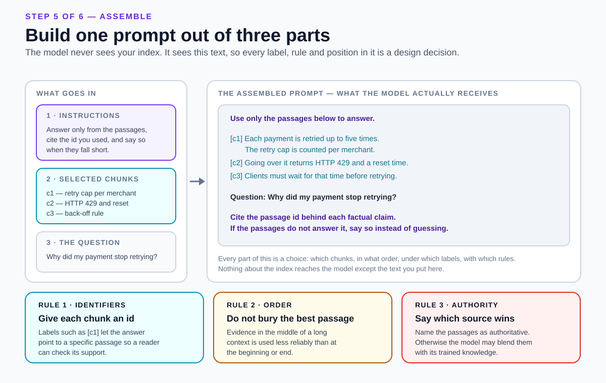
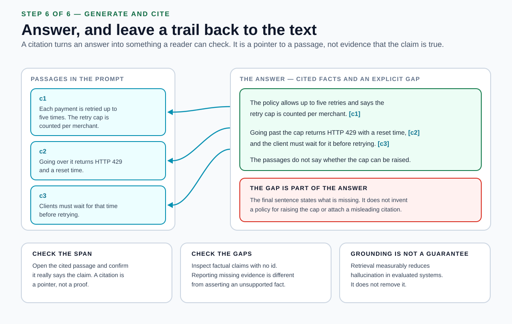

# RAG pipeline

<sub>[Back to Artificial Intelligence](../Readme.md#content)</sub>

**Retrieval-augmented generation (RAG)** answers a question by first fetching text from an external store and then generating the answer from that fetched text, instead of relying only on what the model absorbed during training.

The pipeline shown here has two phases. An **indexing phase** runs whenever the documents change and turns them into something searchable. A **query phase** runs for every question. Six steps span them: chunk, embed and index, retrieve, rerank, assemble the prompt, generate with citations. This is a common hybrid, citation-oriented design; RAG does not require every optional stage, such as keyword search or reranking.

This article introduces the core idea and vocabulary, then walks the six steps in order — for each one: the state before it, its trigger, what it changes, the state after, and why it matters — and closes with the failure modes and the limits worth knowing before you build one.

## The core idea: two memories, not one

RAG was introduced in 2020 as a way to combine two different stores of knowledge in one system.

- **Parametric memory** is what the model absorbed into its weights during training. It is always available and needs no lookup, but it is fixed at training time and you cannot inspect, correct, or permission-check an individual fact inside it.
- **Non-parametric memory** is an external index of documents that the system searches at question time. It can be read, corrected, access-controlled, and replaced — and replacing it changes what the system knows without retraining anything.

The original paper used the **December 2018 Wikipedia dump** for its main index. For its index-swap demonstration, it built an additional index from the **December 2016 DrQA Wikipedia dump** and tested the same model with each index on **82 world leaders whose positions changed between those dates**. Each cell below is the percentage of answers matching the leaders for that year:

| Index used | Correct for 2016 leaders | Correct for 2018 leaders |
|---|---|---|
| December 2016 | **70%** | 4% |
| December 2018 | 12% | **68%** |

Answers matched the index's year much more often than the other year. Both the matching and mismatched pairings support the conclusion: swapping the index changed the model's answers at test time, without retraining.



Read the diagram as two rows. The top row runs offline and builds vector and keyword indexes over the chunks. The bottom row runs online and queries those indexes. The elbow connector shows **the indexes shared by the two phases**; they also need compatible embedding models and preprocessing. In this single-pass pipeline, later stages can select evidence only from the returned candidates. Recovering missing source material requires another retrieval or context-expansion step.

## Vocabulary

Define these before reading the steps; each one is used later without further explanation. Retrieval recall and precision measure the passages returned for a question, not what the model absorbed during training.

| Term | What it means here |
|---|---|
| **Chunk** | One passage of a source document, stored and retrieved as a single unit. The chunk — not the document — is what gets scored, returned, and read. |
| **Embedding** | A fixed-length list of numbers produced from text by an *embedding model*. Texts with similar meaning are placed close together, so "near" can stand in for "similar". |
| **Vector search** | Finding the chunk vectors nearest to a question's vector. Search can be exact; at scale, approximate methods are often used to gain speed at the cost of potentially missing true nearest neighbours. |
| **Lexical search** | Word-overlap scoring, classically **BM25**: a chunk scores higher when it contains the question's words, with each extra repeat of a word counting for less than the last, and long chunks discounted. |
| **Top-N / top-k** | How many results a stage returns. Retrieval returns a wide `N`; reranking narrows it to a small `k` that fits in the prompt. |
| **Retrieval recall** | The fraction of all relevant chunks in the collection that are returned. Finding 4 of 5 relevant chunks gives 80% recall. This measures retrieval coverage; model memory is called trained knowledge here. |
| **Precision** | The fraction of returned chunks that are relevant. If 4 of 10 returned chunks are relevant, precision is 40%. |
| **Reranker** | Here, a **cross-encoder**: a slower model that reads a question and one chunk *together* as a single input and returns a relevance score for that pair. |
| **Grounding** | Requiring the answer to come from the supplied passages rather than from the model's trained knowledge. |
| **Citation** | A pointer from a claim in the answer back to the passage it came from, so a reader can check it. |

## Step 1 — Split the documents into chunks



- **State before:** whole documents of arbitrary length — a runbook, a policy PDF, a support thread.
- **Trigger:** the documents are added or updated.
- **What changes:** each document is cut into passages, usually with a deliberate overlap so consecutive chunks share a sentence or two.
- **State after:** a flat list of chunks, each carrying an identifier and its source.
- **Why it matters:** a chunk is the retrieval unit in this design. Its boundaries affect whether the returned passages contain enough context for an answer.

Chunk size is a real trade-off, not a default to accept. **Too small** and the chunk loses what made it answerable: the section heading, the table's column names, the noun that a later "it" referred to. **Too large** and most of the chunk is about something else, which blurs its embedding in Step 2 and crowds the prompt in Step 5. Production systems commonly keep chunks to a few hundred tokens. Overlap is the cheap insurance: when a fact straddles a cut, repeating the boundary sentence keeps that fact whole inside at least one chunk.

**How it fails:** a fact exists in your corpus but the retrieved chunks do not state it completely. Recovering it may require retrieving neighboring chunks, expanding context, or changing the chunking.

## Step 2 — Embed the chunks and build the indexes



- **State before:** a list of plain-text chunks.
- **Trigger:** the chunk list is ready, or a chunk changed.
- **What changes:** an embedding model converts each chunk into a fixed-length vector, and both a vector index and a keyword index are built over the chunk set.
- **State after:** two searchable structures over the same chunks.
- **Why it matters:** this is the step that makes "find text about X" possible at all, and it fixes the vocabulary of what can be found.

Two details cause most beginner confusion.

First, **the question must be placed in the same vector space as the chunks.** Comparing vectors only means something if both sides came from encoders trained together for that purpose. The classic dense retriever uses two encoders — one for questions, one for passages — trained jointly so that a question's vector and a relevant passage's vector have a high dot product. Embedding your chunks with one model and your questions with an unrelated one produces numbers that compare, and comparisons that mean nothing.

Second, **large vector indexes often use approximate search.** Exact search is possible, but approximate methods can reduce latency and resource use at the cost of missing some true nearest neighbours. Measure that trade-off on your data: a relevant chunk can be missed by the search algorithm even when its vector is close to the question.

Keeping a keyword index alongside the vector index is standard practice because the two fail differently. Vector search handles paraphrase; lexical search handles the exact token — an error code, a product SKU, a surname — that an embedding may smooth away.

**How it fails:** a stale index (the document changed, its vector did not), or a question embedded by a model that does not share the chunks' space.

## Step 3 — Retrieve candidates for the question



- **State before:** built vector and keyword indexes, and a question that has just arrived.
- **Trigger:** the user asks something.
- **What changes:** the question is embedded and searched against the vector index; the same question is searched against the keyword index; the two ranked lists are merged into one.
- **State after:** one ranked candidate list — typically tens of chunks, deliberately more than the answer needs.
- **Why it matters:** in this single retrieval pass, the candidates are all the source material later stages can select from. High retrieval recall leaves fewer relevant chunks missing.

A common way to merge two ranked lists is **reciprocal rank fusion (RRF)**, which ignores each system's raw scores — they can be on incomparable scales — and uses only positions:

```text
score(chunk) = sum over lists of  1 / (k + rank in that list)      with k = 60
```

Worked from the diagram, where chunk `c1` was ranked 3rd by vector search and 1st by keyword search, and `c3` was ranked 1st by vector search but never returned by keyword search:

```text
c1 = 1/(60+3) + 1/(60+1) = 0.0159 + 0.0164 = 0.0323
c3 = 1/(60+1) +      0   = 0.0164 + 0      = 0.0164
```

So `c1` wins. That is the point of the constant: `k = 60` flattens the top of each list, so a single system putting something first cannot dominate, while a chunk that both systems ranked reasonably rises. The value was chosen empirically and the original results were not sensitive to it.

**How it fails:** a needed chunk is absent from the candidate list. Without another retrieval or context-expansion step, later stages lack that evidence; the model may still produce a fluent but unsupported answer.

## Step 4 — Rerank and select the final context



- **State before:** a wide candidate list, ordered by a cheap score.
- **Trigger:** candidates are back and the prompt has limited room.
- **What changes:** a reranker scores each candidate by reading the question and that chunk together, and only the best few survive.
- **State after:** a short, ordered list of chunks — typically a handful.
- **Why it matters:** it helps the model focus on relevant evidence within a limited prompt budget. Selecting the strongest candidates can raise precision and reduce irrelevant context, though discarding a needed chunk can lower recall.

The reason a cross-encoder reranker can improve accuracy is structural. Retrieval encoded the question and the chunk **separately** — in fact the chunk's vector was computed long before the question existed — and then compared two summaries of them. A cross-encoder feeds question and chunk to one model as a single input, so every word of the question can be weighed against every word of the chunk. Improvement still depends on the model and task.

The reason it comes second is cost. Nothing can be precomputed, so the work is one model pass **per candidate**. Reranking 50 candidates is 50 passes; reranking a million-chunk corpus is not an option. This is exactly why Step 3 casts a wide, cheap net and Step 4 sorts what it caught. The two-stage shape — a fast first-pass retriever feeding a slower neural scorer over the top candidates — is the standard arrangement in modern retrieval.

In one published evaluation, adding a reranking stage on top of contextual hybrid retrieval cut the top-20 retrieval failure rate from 2.9% to 1.9%.

**How it fails:** `k` is set too high and marginal chunks dilute the prompt, or too low and a needed chunk is cut. Reranking alone cannot add a missing chunk to the candidate list.

## Step 5 — Assemble the grounded prompt



- **State before:** the selected chunks, the question, and no instructions.
- **Trigger:** the context set is final.
- **What changes:** instructions, the labelled chunks, and the question are composed into one prompt.
- **State after:** a single block of text — the only thing the model will see.
- **Why it matters:** the model has no access to your index, your scores, or your intent. It has this text. Every label, every ordering, and every rule in it is a design decision you made, including the ones you made by default.

Three decisions carry real weight.

**Label every chunk with an identifier.** Without an id, the model cannot cite, and you cannot check.

**Mind the position.** Models use information placed in the middle of a long context less reliably than the same information at its beginning or end — a measured effect, not a rumour. A short, well-ordered context beats a long one that buries its best passage.

**Name the authority.** The model's trained knowledge does not switch off because you supplied documents. When a passage and that trained knowledge disagree — the case surveys call a *context-memory conflict* — an unqualified prompt lets the two blend silently. State which one wins: *answer only from the passages; if they do not answer the question, say so.*

**How it fails:** contradictory chunks with no rule for resolving them, an instruction buried behind 20 passages, or a prompt that asks for an answer without giving permission to decline.

## Step 6 — Generate the answer and check its citations



- **State before:** one assembled prompt.
- **Trigger:** the prompt is sent.
- **What changes:** the model produces an answer conditioned on the passages and is instructed to tag factual claims with supporting passage identifiers; the tags still need checking.
- **State after:** an answer plus a trail back to the text — and, ideally, an explicit statement of what the passages did not cover.
- **Why it matters:** a citation is what converts an answer into something a reader can verify.

Be precise about what a citation is: **a pointer to a passage, not evidence that the claim is true.** Two checks follow from that. Open the cited passage and confirm it actually says the claim. Then inspect factual claims carrying *no* id: they may be unsupported or missing a citation. An explicit statement that the passages do not answer something reports an evidence gap; it does not assert the missing fact. Some APIs return citations as structured spans, with the exact quoted text and its location in the source document, precisely so that the pointer is machine-checkable rather than something the model typed.

Do not overstate the guarantee. Retrieval augmentation measurably reduces hallucination in evaluated dialogue systems, and citation-aware benchmarks show why the check still matters: on one long-form dataset, even the strongest systems left half of their generations without complete citation support.

**How it fails:** a real citation attached to a claim the passage does not support, or a confident answer to a question the passages never addressed.

## Where each stage fails

| Stage | Typical failure | The symptom you actually see | First check |
|---|---|---|---|
| Chunk | A fact is split across two chunks | The answer is half right and stops mid-thought | Read the retrieved chunks in full |
| Embed and index | Stale or mismatched vectors | A document you just fixed is still answered from the old text | Reindex and compare timestamps |
| Retrieve | The right chunk is not in the candidates | A fluent answer sourced from the wrong passage | Log the candidate list and search for the expected chunk in it |
| Rerank | Right candidates, wrong order or wrong `k` | The correct chunk was retrieved but never made the prompt | Log the pre- and post-rerank lists side by side |
| Assemble | No authority rule, or evidence buried mid-prompt | The answer contradicts a passage that was present | Print the exact prompt and read it as the model would |
| Generate | Uncited or wrongly cited claims | A citation that does not support its sentence | Verify each cited span against its source |

The order matters when debugging: work forwards. A generation problem is very often a retrieval problem wearing a generation costume.

## Limits and misconceptions

- **RAG is not always the right tool.** Anthropic's 2024 guidance suggests putting the whole knowledge base in the prompt when it is **smaller than 200,000 tokens (about 500 pages)**. Treat that as a starting point for a model with sufficient context capacity, not a universal cutoff: allow room for instructions, the question, and output, and evaluate answer quality, latency, and cost.
- **"Semantic search" does not mean "correct search".** Nearness in embedding space is a learned proxy for similarity, and a chunk can be topically near while being the wrong passage — an outdated policy, another region's rules, a different customer tier.
- **A bigger context window does not remove the need to retrieve well.** Long-context models still use middle-of-context evidence less reliably, so filling the window with marginal chunks can make an answer worse, not better.
- **Citations are checkable pointers, not proof.** They tell you where a claim allegedly came from; verifying that it is actually there remains a separate act.
- **Retrieval reduces hallucination, it does not remove it.** A grounded system can still misread a passage, blend it with trained knowledge, or answer confidently past the end of the evidence.
- **Reranking can improve precision, but cannot fetch missing evidence.** In the single-pass pipeline shown here, Steps 4–6 only work with the candidates from Step 3. Recovering missing chunks requires another retrieval or context-expansion step; poor chunk boundaries may also require rechunking and reindexing.

## Summary

RAG turns a question into an answer through six changes of state: a document becomes chunks, chunks become indexes, a question becomes a candidate list, a candidate list becomes a short context, a context becomes a prompt, and a prompt becomes a cited answer. In this single-pass design, retrieval determines which source material is available; reranking selects from it, and prompting and generation determine how it is used. Missing evidence calls for another retrieval or context-expansion step. Better wording alone cannot supply a missing source.

# Sources

- [Lewis et al.: Retrieval-Augmented Generation for Knowledge-Intensive NLP Tasks](https://arxiv.org/abs/2005.11401)

  The original RAG paper. Defines parametric versus non-parametric memory, retrieves the top-K documents by maximum inner product search over a FAISS index of 21 million 100-word Wikipedia chunks, and keeps the document encoder fixed. Section 3 specifies the main December 2018 index; Section 4.5 compares it with a December 2016 index on 82 changed world leaders, reporting all four index/year pairings shown above.

- [Manning, Raghavan and Schütze: Introduction to Information Retrieval — Evaluation of unranked retrieval sets](https://nlp.stanford.edu/IR-book/html/htmledition/evaluation-of-unranked-retrieval-sets-1.html)

  Defines retrieval recall and precision as the fractions of relevant items found and returned items that are relevant, respectively.

- [Faiss documentation: Faiss indexes](https://github.com/facebookresearch/faiss/wiki/Faiss-indexes)

  Documents exact vector search with flat indexes and approximate alternatives that trade search speed against the possibility of missing nearest neighbours.

- [Karpukhin et al.: Dense Passage Retrieval for Open-Domain Question Answering](https://arxiv.org/abs/2004.04906)

  Establishes the dual-encoder retriever with dot-product similarity between a question encoder and a passage encoder, indexed with FAISS, and reports 9–19% absolute gains in top-20 passage retrieval accuracy over BM25.

- [Robertson and Zaragoza: The Probabilistic Relevance Framework — BM25 and Beyond](https://www.staff.city.ac.uk/~sbrp622/papers/foundations_bm25_review.pdf)

  Source for the two BM25 properties used in this article: term-frequency saturation, where one term's contribution cannot exceed a limit, and soft document-length normalization controlled by `b`.

- [Cormack, Clarke and Büttcher: Reciprocal Rank Fusion Outperforms Condorcet and Individual Rank Learning Methods](https://plg.uwaterloo.ca/~gvcormac/cormacksigir09-rrf.pdf)

  Defines the RRF formula used here, fixes `k = 60` from a pilot study, explains that the constant limits the influence of a single outlier system's top rankings, and reports RRF beating Condorcet fusion and the best individual system.

- [Nogueira and Cho: Passage Re-ranking with BERT](https://arxiv.org/abs/1901.04085)

  The two-stage retrieve-then-rerank arrangement: roughly a thousand candidates from BM25, then a model that reads the query and passage together as one input, improving MRR@10 by 27% relative on MS MARCO.

- [Liu et al.: Lost in the Middle — How Language Models Use Long Contexts](https://arxiv.org/abs/2307.03172)

  Measures the position effect cited in Step 5: performance is highest when the relevant information sits at the beginning or end of the input context and degrades significantly in the middle.

- [Anthropic: Introducing Contextual Retrieval](https://www.anthropic.com/news/contextual-retrieval)

  Source for the practical figures: chunks of no more than a few hundred tokens, combining embeddings with BM25, retrieval failure rates falling from 5.7% to 2.9% with hybrid contextual retrieval and to 1.9% once reranking is added. Its September 2024 guidance suggests including the whole knowledge base in the prompt below 200,000 tokens (about 500 pages).

- [Shuster et al.: Retrieval Augmentation Reduces Hallucination in Conversation](https://arxiv.org/abs/2104.07567)

  Human-evaluated evidence that retrieval-in-the-loop dialogue systems substantially reduce knowledge hallucination, without claiming to remove it.

- [Gao et al.: Enabling Large Language Models to Generate Text with Citations](https://arxiv.org/abs/2305.14627)

  Introduces the ALCE benchmark and its citation recall and precision measures, and reports that on the ELI5 dataset even the best models lack complete citation support half of the time.

- [Xu et al.: Knowledge Conflicts for LLMs — A Survey](https://arxiv.org/abs/2403.08319)

  Names and categorises the conflict discussed in Step 5, including the context-memory case where supplied context disagrees with knowledge held in the model's parameters.

- [Anthropic: Citations](https://platform.claude.com/docs/en/build-with-claude/citations)

  Example of citations returned as structured spans — the quoted text plus its document index and character or page location — described as guaranteed valid pointers into the provided documents.
