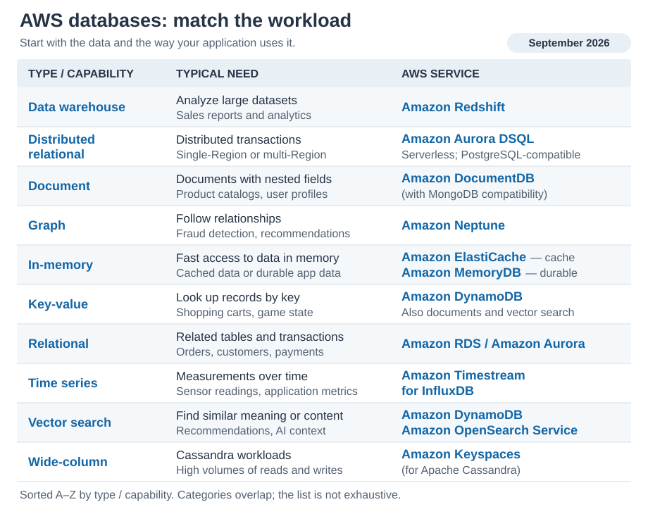

# AWS Databases

[Back to AWS](../Readme.md#content)

# Front

How do you match the main AWS database services to an application's data and workload?

# Back

**Choose by the data model and access pattern:** how the data is organized, and how the application reads or changes it. Different parts of an application can use different database services.

## Match the workload

Read each row from left to right: database type or capability, typical need, then an AWS service to consider. Amazon RDS means **Relational Database Service**. This September 2026 snapshot was verified on September 17, 2026; it is a starting map, not an exhaustive catalog.

Rows are sorted **alphabetically (A–Z) by the Type / capability name**.

## Distinctions to remember

- **Amazon RDS and Amazon Aurora:** relational application databases for related tables, joins, and transactions. **Amazon Redshift:** a data warehouse for analyzing large datasets and producing reports.
- **Amazon Aurora DSQL:** a serverless, distributed relational database with PostgreSQL compatibility and single-Region or multi-Region deployments.
- **Amazon ElastiCache:** a cache for frequently accessed data. **Amazon MemoryDB:** a durable database that keeps data in memory and can be the application's primary database. In-memory does not always mean temporary.
- **Amazon DynamoDB:** supports both key-value and document data. **Amazon DocumentDB:** a document database with MongoDB compatibility. Categories overlap; choose according to the required queries and interfaces.
- **Vector search:** finds similar meaning or content using numerical representations called embeddings. Amazon DynamoDB now provides native vector search; Amazon OpenSearch Service also supports it. These are examples of a capability shared by several services.
- **Amazon Keyspaces:** a wide-column database compatible with Apache Cassandra. **Amazon Neptune:** a graph database for following relationships between entities. **Amazon Timestream for InfluxDB:** a time-series database for measurements associated with timestamps.

For example, an online store might use **Amazon Aurora for orders**, **Amazon DynamoDB for shopping carts**, **Amazon ElastiCache for repeated reads**, and **Amazon Redshift for sales reports**. These are possible roles, not a required architecture.

## Updates to the reference image

The SVG simplifies the comparison in `databases.png` and uses current service names. **Amazon Timestream for LiveAnalytics** closed to new customers on June 20, 2025; AWS recommends that new customers evaluate **Amazon Timestream for InfluxDB** as an alternative.

# Sources

- [AWS Decision Guide: Choosing an AWS database service](https://docs.aws.amazon.com/decision-guides/latest/decision-guides/databases-on-aws-how-to-choose.html)
- [AWS: What is Amazon Aurora DSQL?](https://docs.aws.amazon.com/aurora-dsql/latest/userguide/what-is-aurora-dsql.html)
- [AWS overview: Compare database services](https://docs.aws.amazon.com/whitepapers/latest/aws-overview/database.html)
- [AWS: Choosing between ElastiCache and MemoryDB](https://docs.aws.amazon.com/AmazonElastiCache/latest/dg/related-services-choose-between-memorydb-and-redis.html)
- [AWS: What is Amazon DynamoDB?](https://docs.aws.amazon.com/amazondynamodb/latest/developerguide/Introduction.html)
- [AWS: Native vector search and AI integration in DynamoDB](https://docs.aws.amazon.com/amazondynamodb/latest/developerguide/ddb-ai-integration.html)
- [AWS: Vector search in Amazon OpenSearch Service](https://docs.aws.amazon.com/opensearch-service/latest/developerguide/vector-search.html)
- [AWS: Amazon Timestream FAQs](https://aws.amazon.com/timestream/faqs/)
- [AWS: Timestream for LiveAnalytics availability change](https://docs.aws.amazon.com/timestream/latest/developerguide/AmazonTimestreamForLiveAnalytics-availability-change.html)
