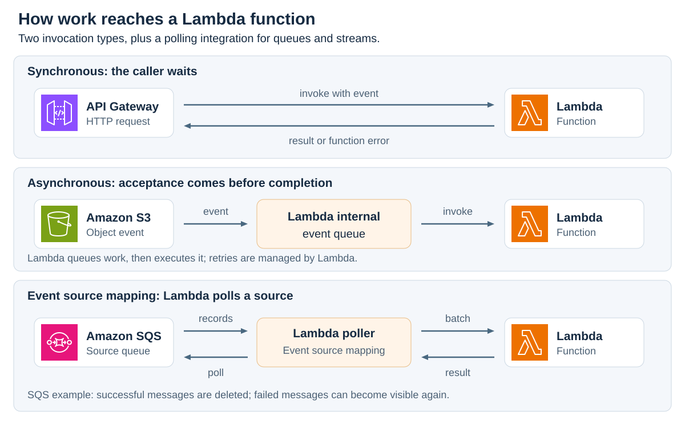
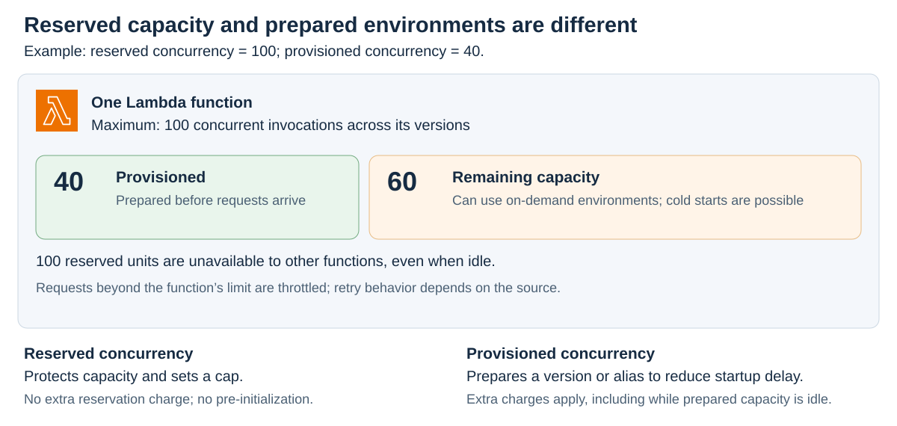
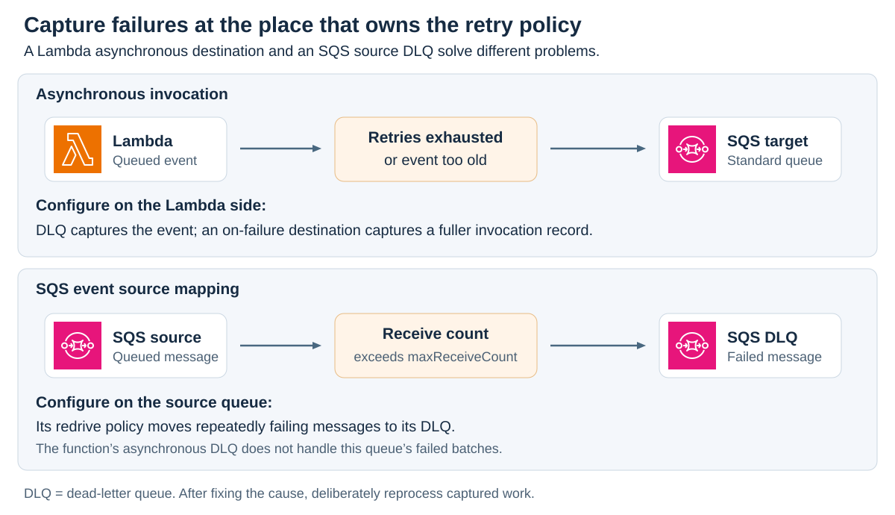

# AWS Lambda

<sub>[Back to AWS](../Readme.md#content)</sub>

**AWS Lambda** is a serverless, event-driven compute service that lets you run code for virtually any type of application or backend service without provisioning or managing servers. You supply the code, its configuration, and permissions. This article explains how Lambda Functions receive work, use resources, scale, share dependencies, publish versions, and handle failures.

The examples use the standard Lambda Functions execution model. Lambda also offers other capabilities, including Managed Instances, durable functions, and MicroVMs; their execution and billing models need separate treatment.

## Functions, handlers, and events

A **function** is a deployable unit of code and configuration. A **handler** is the entry point Lambda calls. An **invocation** is one call to the function, and its **event** is the input describing the work. A **runtime** provides the language environment in which the code executes.

For example, uploading a photograph to Amazon Simple Storage Service (**S3**) can produce an event identifying the bucket and object. A Lambda function can read that object and create a thumbnail. The notification contains information about the object; it does not pass the image bytes as the function's input.

**Serverless** means AWS operates the underlying compute infrastructure. You still choose permissions, handle errors, maintain application dependencies, and decide how the application stores its data. A function can contain interpreted source code, compiled code, and dependencies; “compiled code” alone is not a general definition of Lambda.

## Configuration and resource limits

The main settings answer four questions: what should run, how much compute may it use, how long may it run, and what may it access? Functions call AWS services through their application programming interfaces (**APIs**).

| Setting | Meaning |
| --- | --- |
| Runtime and handler | Select the language environment and the code entry point |
| Memory | **128–10,240 MB**, in 1-MB increments; CPU allocation increases with configured memory |
| Timeout | **1–900 seconds** per invocation; the default is **3 seconds** |
| Execution role | AWS Identity and Access Management (**IAM**) role that supplies permissions for the function's AWS API calls |
| Ephemeral storage | **512–10,240 MB** of temporary storage in `/tmp`, configured separately from memory |

More memory can also make CPU-bound work finish sooner. Measure duration and cost with realistic input instead of assuming that the smallest memory allocation is cheapest. Set timeout with room for slow dependencies and larger inputs; a limit close to average duration can cause avoidable failures.

The **15-minute maximum applies to one ordinary invocation**. A durable workflow can span multiple invocations and waits; that does not make an individual invocation run indefinitely.

`/tmp` belongs to one execution environment. It can hold downloaded files or intermediate results, but it is not shared durable storage. The first 512 MB has no additional ephemeral-storage charge; configured storage above that amount is billed by allocated size and duration. New accounts can have lower memory or concurrency quotas, so check the account's Service Quotas.

### Two directions of permission

The **execution role** answers “What may this function do?” A thumbnail function might need `s3:GetObject` on its input bucket and `s3:PutObject` on its output bucket. Its role can also allow writing logs to Amazon CloudWatch.

A **resource-based policy** on the Lambda function can answer “Which service or account may invoke this function?” For an S3 trigger, S3 needs permission to invoke Lambda. That permission does not grant the function permission to read S3; the execution role supplies that separately. Other invocation paths can also use the caller's IAM permissions.

A **downstream dependency** is a service the function calls while doing its work, such as a database, queue, or external API. Its capacity and access rules still matter when Lambda scales.

## How work reaches a function

There are two invocation types—synchronous and asynchronous—and a separate integration mechanism called an **event source mapping**, through which Lambda polls a queue or stream. These are often taught as three patterns. Read each row below from its source toward the function; return arrows show who receives the result.



### Synchronous invocation

The caller waits for a response. For example, Amazon API Gateway can invoke a function to serve a Hypertext Transfer Protocol (**HTTP**) request. A direct Invoke API call uses `InvocationType=RequestResponse`.

Lambda returns the result or function error to the caller. The caller or invoking service decides whether to retry; there is no universal automatic retry policy for every synchronous caller. A function error and an error that prevents invocation are different failure cases.

### Asynchronous invocation

Lambda accepts the event into an internal queue and returns an acknowledgment before the function finishes. S3 event notifications are an example; a direct Invoke API call uses `InvocationType=Event`.

Acceptance means the event was queued, not that the application work succeeded. Lambda later invokes the function and manages retries. A normal return value does not become a completed-work response to the original caller. Use a destination or application storage when another component needs the outcome.

For the thumbnail example, write results to a different bucket or use input-prefix filtering so output objects do not repeatedly trigger the same function.

### Polling through an event source mapping

An **event source mapping** is a Lambda resource connecting a supported queue or stream to a function. Lambda's pollers read records, form batches, and invoke the handler. Examples include Amazon Simple Queue Service (**SQS**), Amazon Kinesis Data Streams, and Amazon DynamoDB Streams.

For SQS, the mapping invokes the function synchronously with a batch. Lambda deletes successfully processed messages. On a failed batch, messages become available again after the visibility timeout; partial batch responses can identify only the failed messages for retry. The function must still tolerate duplicate delivery.

Stream processing uses source-specific ordering, checkpoint, and retry rules. Do not apply an SQS queue's delete-and-visibility behavior to DynamoDB or Kinesis streams.

This illustrative AWS Command Line Interface (**CLI**) command creates a mapping for an existing DynamoDB stream and function. Replace the example Amazon Resource Name (**ARN**) with the real stream ARN and give the function's role permission to read it:

```bash
aws lambda create-event-source-mapping \
  --function-name process-table-changes \
  --event-source-arn 'arn:aws:dynamodb:us-east-2:123456789012:table/orders/stream/2026-09-26T00:00:00.000' \
  --starting-position LATEST \
  --batch-size 500 \
  --maximum-batching-window-in-seconds 5
```

`LATEST` starts with new stream records. The batch size is an upper bound, and the batching window allows Lambda to gather records before invoking the function. The option names are `--starting-position` and `--maximum-batching-window-in-seconds`.

## Execution environments and cold starts

An **execution environment** is the isolated runtime instance that runs the handler. When Lambda needs a new environment, it initializes the runtime, dependencies, and initialization code before executing the handler. This extra startup work is a **cold start**.

Lambda may reuse an available environment for a later invocation—a **warm start**. Reuse can preserve initialized clients and cached files, but it is not guaranteed. Environments are eventually recycled, and another concurrent invocation may run elsewhere.

Store durable application state outside the environment, for example in S3 or DynamoDB. Reusing a software development kit (**SDK**) client is an optimization; relying on a global variable to remember every processed order is a correctness problem.

## Concurrency and scaling

**Concurrency** counts requests currently being processed. In the standard execution model, an environment handles one invocation at a time; overlapping invocations require more environments.

```text
Average concurrency ≈ average invocations per second × average duration in seconds

200 invocations/second × 0.25 seconds = 50 concurrent invocations
```

This estimates average demand. Bursts, slow requests, source limits, and request-rate quotas also affect capacity. A concurrency value is not a requests-per-second value.

The documented default is **1,000 concurrent executions shared across the account's functions in one Region**, with quota increases available. New accounts can start lower. Separately, each function can add up to **1,000 execution environments every 10 seconds** in each Region. This scaling rate replaces the old Region-specific burst table of 500, 1,000, or 3,000 environments.

### Reserved and provisioned concurrency

**Reserved concurrency** dedicates part of the account quota to a function and caps that function at the reserved amount. Other functions cannot borrow it, even when unused. It does not initialize environments. There is no additional charge for the reservation itself.

**Provisioned concurrency** initializes environments ahead of requests to reduce startup latency. It costs extra and is configured on a published version or alias, not `$LATEST`. The trigger must invoke that version or alias to use it.

The example combines both: the function has a limit of 100 concurrent invocations, with 40 environments prepared in advance. Additional traffic can use on-demand environments up to that limit.



When both are configured, provisioned concurrency cannot exceed reserved concurrency. Traffic above provisioned capacity can encounter cold starts; environment resets can also introduce initialization delays. Provisioning reduces startup latency rather than promising that every invocation has identical latency.

**Throttling** means an invocation cannot start because available capacity or a rate limit was exceeded. A synchronous caller can receive a throttling error, while queued work follows its integration's retry rules. Use concurrency limits to protect a slower downstream database as well as to allocate Lambda capacity.

## Deployment packages and layers

Deploy a function using a **`.zip` archive** or a **container image**. A **Lambda layer** is a separate `.zip` containing shared dependencies, a custom runtime, or configuration data. Lambda extracts layer contents into `/opt` in the execution environment.

Layers work with `.zip` functions, with up to **five layers per function**. Container-image functions package their dependencies in the image instead. A shared layer can reduce repeated dependency uploads, but does not remove those dependencies from the deployed function's size limits.

Each layer version has its own ARN. A function selects a specific version; publishing a newer layer does not silently update all its consumers. For example, two functions can both use `shared-library:3`, then migrate separately to `shared-library:4`.

## Versions and aliases

`$LATEST` is the editable, unpublished version. Deploying code updates it. Publishing creates a numbered snapshot of the code and most configuration, such as memory, handler, and layers.

A new publication requires a change to code **or a qualifying configuration setting**. Code changes are not the only way to make `$LATEST` eligible. Published code and most configuration are immutable, but operational settings such as destinations and provisioned concurrency can still be configured; AWS runtime patching also has its own management controls.

An **alias** is a named pointer to a published version. For example, callers can invoke `process-order:prod` while `prod` points to version `7`. After testing version `8`, update `prod` to point to `8`; reverting the pointer allows rollback. An alias can also distribute traffic between two versions for a gradual rollout.

An unqualified function ARN invokes `$LATEST`. Use a version or alias when callers need a deliberately selected deployment.

## Retries, destinations, and dead-letter queues

For asynchronous invocation, a function error triggers **two additional attempts by default**: approximately one minute before the first retry and two minutes before the next. Throttling and system errors follow a different retry path, with exponential backoff for up to **six hours by default**. Retry count and maximum event age are configurable.

Events can be delivered more than once, even without a function error. Make work **idempotent**: retrying the same event should not repeat its business effect. For example, use a stable event or order ID with an atomic database operation to prevent recording the same completed transaction twice.

The diagram separates Lambda's asynchronous failure capture from an SQS source queue's redrive policy. Both can use an SQS queue, but they capture failures at different places.



### Capturing failed asynchronous events

A Lambda **dead-letter queue (DLQ)** captures an event after processing attempts are exhausted or the event expires. Supported targets are an **SQS Standard queue** or an Amazon Simple Notification Service (**SNS**) **Standard topic**. It carries the original event with error attributes, rather than a full invocation record.

An **on-failure destination** captures a richer record containing request and response information. Destinations support SQS, SNS, Lambda, EventBridge, and S3; S3 is an on-failure target only. An on-success destination can capture successful results.

Give the execution role permission to send to the target. Monitor delivery failures as well as function errors: a failed attempt to write the failure record can otherwise leave a gap in recovery.

### SQS source failures use the queue's policy

For a function consuming SQS through an event source mapping, configure the **source SQS queue's redrive policy and DLQ**. The function's asynchronous DLQ does not replace that policy. The source queue tracks receives and can move repeatedly failing messages according to `maxReceiveCount`.

Inspect failed messages, fix the cause, and deliberately reprocess them. Merely placing a message in a DLQ does not repair or replay it.

## Cost and workload fit

For standard on-demand functions, the main charges are **request count** and **execution duration weighted by configured memory**, measured in GB-seconds. Provisioned concurrency, extra ephemeral storage, and connected services can add charges. Provisioned capacity can cost money while idle, so “pay only while the handler runs” is not a complete pricing rule.

Lambda fits bounded event-driven work such as API handlers, file processing, and queue consumers. When designing a workload, account for the invocation timeout, initialization latency, retry behavior, and downstream capacity. Larger or longer-running workflows need an execution model that accommodates their full lifecycle.

# Sources

- [What is AWS Lambda? — compute models and responsibilities](https://docs.aws.amazon.com/lambda/latest/dg/welcome.html)
- [Python handlers — events, entry points, and return values](https://docs.aws.amazon.com/lambda/latest/dg/python-handler.html)
- [Lambda quotas — memory, timeout, concurrency, and package limits](https://docs.aws.amazon.com/lambda/latest/dg/gettingstarted-limits.html)
- [Configuring memory — performance and resource allocation](https://docs.aws.amazon.com/lambda/latest/dg/configuration-memory.html)
- [Configuring timeout](https://docs.aws.amazon.com/lambda/latest/dg/configuration-timeout.html)
- [Configuring ephemeral storage](https://docs.aws.amazon.com/lambda/latest/dg/configuration-ephemeral-storage.html)
- [Execution roles](https://docs.aws.amazon.com/lambda/latest/dg/lambda-intro-execution-role.html)
- [Resource-based policies](https://docs.aws.amazon.com/lambda/latest/dg/access-control-resource-based.html)
- [Invocation methods](https://docs.aws.amazon.com/lambda/latest/dg/lambda-invocation.html)
- [Synchronous invocation — results and errors](https://docs.aws.amazon.com/lambda/latest/dg/invocation-sync.html)
- [Using Lambda with S3 — notifications, permissions, and recursion](https://docs.aws.amazon.com/lambda/latest/dg/with-s3.html)
- [Using Lambda with SQS — polling, batching, and duplicate processing](https://docs.aws.amazon.com/lambda/latest/dg/with-sqs.html)
- [Creating SQS event source mappings — queue permissions and redrive configuration](https://docs.aws.amazon.com/lambda/latest/dg/services-sqs-configure.html)
- [CLI: create-event-source-mapping — options and source-specific behavior](https://docs.aws.amazon.com/cli/latest/reference/lambda/create-event-source-mapping.html)
- [Execution environment lifecycle](https://docs.aws.amazon.com/lambda/latest/dg/lambda-runtime-environment.html)
- [Function best practices — reuse, idempotency, and capacity](https://docs.aws.amazon.com/lambda/latest/dg/best-practices.html)
- [Concurrency and scaling](https://docs.aws.amazon.com/lambda/latest/dg/lambda-concurrency.html)
- [Per-function scaling rate](https://docs.aws.amazon.com/lambda/latest/dg/scaling-behavior.html)
- [Reserved concurrency](https://docs.aws.amazon.com/lambda/latest/dg/configuration-concurrency.html)
- [Provisioned concurrency](https://docs.aws.amazon.com/lambda/latest/dg/provisioned-concurrency.html)
- [Lambda layers](https://docs.aws.amazon.com/lambda/latest/dg/chapter-layers.html)
- [Function versions](https://docs.aws.amazon.com/lambda/latest/dg/configuration-versions.html)
- [Function aliases](https://docs.aws.amazon.com/lambda/latest/dg/configuration-aliases.html)
- [Asynchronous errors and retries](https://docs.aws.amazon.com/lambda/latest/dg/invocation-async-error-handling.html)
- [Asynchronous destinations and dead-letter queues](https://docs.aws.amazon.com/lambda/latest/dg/invocation-async-retain-records.html)
- [Durable invocation — individual invocations versus overall execution](https://docs.aws.amazon.com/lambda/latest/dg/durable-invoking.html)
- [AWS Lambda pricing](https://aws.amazon.com/lambda/pricing/)
- [AWS Architecture Icons — official SVG artwork used in the diagrams](https://aws.amazon.com/architecture/icons/) — July 31, 2026 package; icon geometry and colors preserved. Original package paths are recorded in each SVG.
