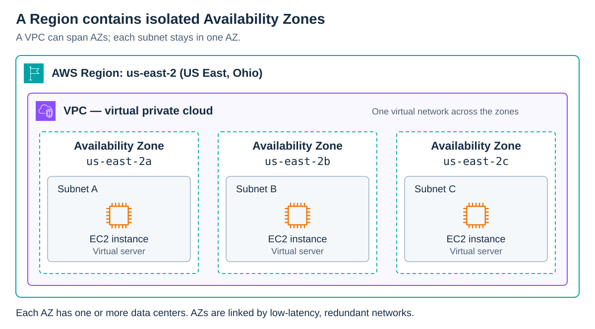
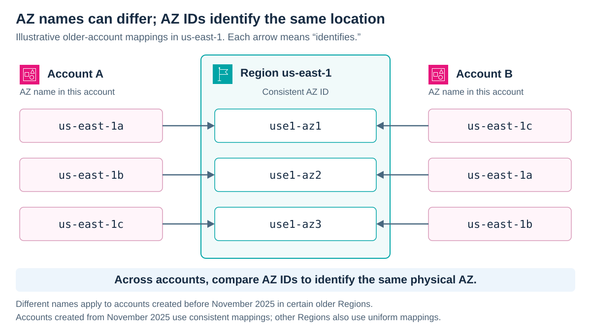

# AWS Regions and Zones

<sub>[Back to AWS](../Readme.md#content)</sub>

**An AWS Region is a separate geographic area; Availability Zones (AZs) are isolated locations within it.** Local Zones, AWS Outposts, and Wavelength Zones extend AWS infrastructure closer to users or workloads. First distinguish these locations, then distinguish an AZ's account-visible name from its consistent AZ ID.

## Types of AWS locations

| Location | What it means |
| --- | --- |
| **Region** | A geographic area designed to be isolated from other Regions. It contains multiple AZs. |
| **Availability Zone** | One or more discrete data centers within a Region, with redundant power, networking, and connectivity. |
| **Local Zone** | An extension of a Region near end users, where supported resources such as compute and storage can serve latency-sensitive applications. |
| **AWS Outposts** | AWS-managed infrastructure and services installed at customer premises, such as a data center or colocation facility. Local compute and storage support low latency and local processing, while remaining part of an AWS Region. |
| **Wavelength Zone** | AWS compute and storage at a communications service provider's location, close to mobile users, including 5G users. It is a logical extension of a parent Region for applications needing low latency. |

## Availability Zones

AZs are physically separate but connected by low-latency, high-bandwidth, redundant networks. Spreading an application across AZs helps it remain available if one AZ fails.

An AZ name is the Region code plus a letter: for example, `us-east-2a` is in `us-east-2` (US East, Ohio). An AZ can contain multiple data centers; it does not mean a single building.

The diagram shows how network resources fit into this structure. A **virtual private cloud (VPC)** is your logically isolated virtual network. It can span AZs in its Region, but each **subnet**—a range of IP addresses in the VPC—stays within one AZ. An Amazon Elastic Compute Cloud (**EC2**) instance is a virtual server launched in a subnet.



## AZ IDs

**Use the AZ ID to identify the same physical AZ across AWS accounts.** For example, `use1-az1` always identifies the same AZ in `us-east-1` (US East, N. Virginia), regardless of the account viewing it.

An AZ **name**, such as `us-east-1a`, can refer to different physical AZs in different accounts. AWS originally varied these mappings to distribute resources even when customers chose the first name in the list.

This rule has a qualification: account-specific mappings apply to **accounts created before November 2025 in certain older Regions**, including `us-east-1`. Accounts created starting November 2025 use consistent mappings; other Regions also use uniform mappings. Do not assume that every pair of accounts has different names for the same AZ.

In this illustrative older-account example, Account A's `us-east-1a` and Account B's `us-east-1c` refer to the same AZ, `use1-az1`. The arrows mean “identifies,” not network traffic. The mappings are examples, not values to copy into a deployment.



When coordinating resources across accounts—for example, sharing a subnet—compare **AZ IDs**, rather than relying on the letter suffix. To inspect your own mapping with the AWS Command Line Interface (AWS CLI):

```bash
aws ec2 describe-availability-zones \
  --region us-east-1 \
  --filters Name=zone-type,Values=availability-zone \
  --query 'AvailabilityZones[].{Name:ZoneName,ID:ZoneId}' \
  --output table
```

# Sources

- [AWS Regions and Availability Zones — infrastructure and isolation](https://docs.aws.amazon.com/global-infrastructure/latest/regions/aws-regions-availability-zones.html)
- [AWS Availability Zones — names and account mapping rules](https://docs.aws.amazon.com/global-infrastructure/latest/regions/aws-availability-zones.html)
- [AZ IDs — consistent identifiers and Regions with independent mappings](https://docs.aws.amazon.com/global-infrastructure/latest/regions/az-ids.html)
- [How AWS Local Zones work](https://docs.aws.amazon.com/local-zones/latest/ug/how-local-zones-work.html)
- [What is AWS Outposts?](https://docs.aws.amazon.com/outposts/latest/userguide/what-is-outposts.html)
- [What is AWS Wavelength?](https://docs.aws.amazon.com/wavelength/latest/developerguide/what-is-wavelength.html)
- [What is Amazon VPC?](https://docs.aws.amazon.com/vpc/latest/userguide/what-is-amazon-vpc.html)
- [Subnets for your VPC](https://docs.aws.amazon.com/vpc/latest/userguide/configure-subnets.html)
- [What is Amazon EC2? — instances as virtual servers](https://docs.aws.amazon.com/AWSEC2/latest/UserGuide/concepts.html)
- [AWS architecture icons — official SVG artwork used in the diagrams](https://aws.amazon.com/architecture/icons/)
