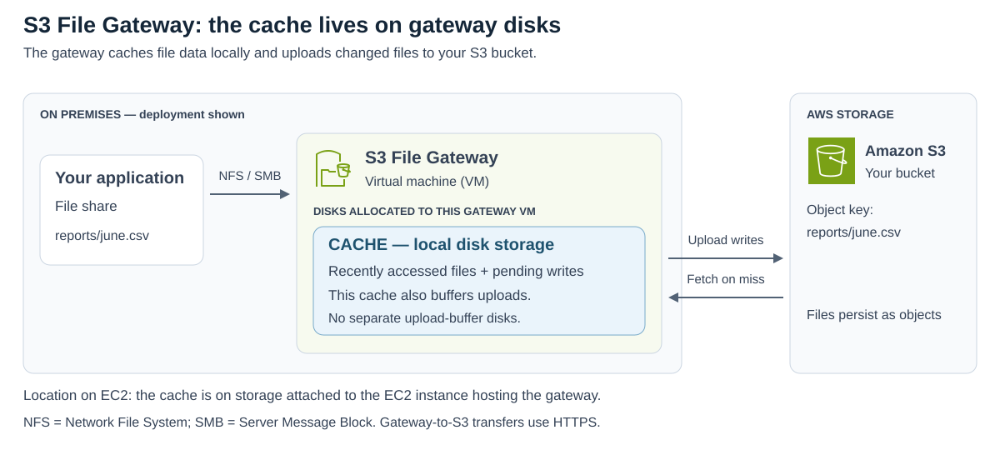
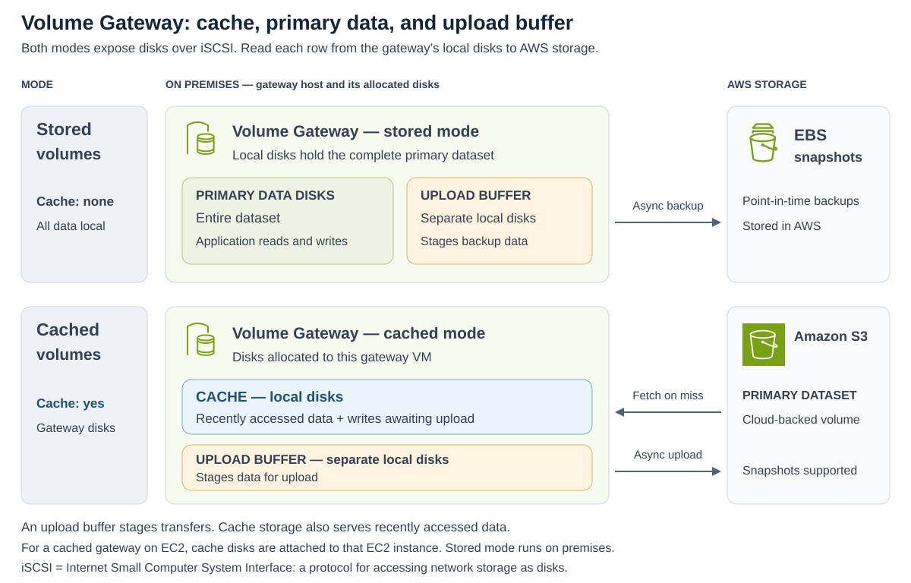
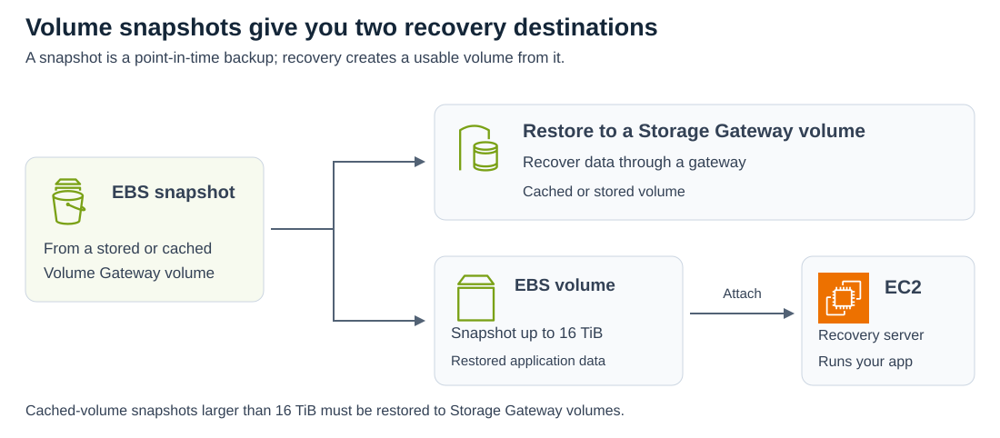
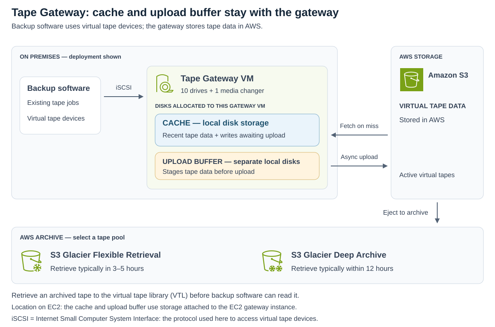

# AWS Storage Gateway

[Back to AWS](../Readme.md#content)

**AWS Storage Gateway connects on-premises applications to AWS storage through familiar file, block, or tape interfaces.** A gateway appliance runs near your applications and transfers data to AWS. The important choice is the interface your application needs and whether the complete dataset must remain local.

This article covers **Amazon S3 File Gateway**, **Volume Gateway** in stored and cached modes, and **Tape Gateway**, including their backup and disaster recovery behavior.

## Choose the interface your application needs

| Gateway | What the application sees | What AWS stores | Typical purpose |
| --- | --- | --- | --- |
| **S3 File Gateway** | A file share over Network File System (**NFS**) or Server Message Block (**SMB**) | Files mapped to objects in your Amazon Simple Storage Service (**Amazon S3**) bucket | File access to S3, backups, and archiving |
| **Volume Gateway** | Block storage: a disk presented over Internet Small Computer System Interface (**iSCSI**) | Cloud-backed volume data or point-in-time backups, depending on the mode | Keep primary data locally or in AWS, with volume recovery |
| **Tape Gateway** | Tape drives and a media changer over iSCSI | Virtual tapes in S3 and archived tapes in S3 Glacier storage classes | Continue using compatible tape backup software without physical tapes |

You can deploy the software appliance as a **virtual machine (VM)** on VMware ESXi, Microsoft Hyper-V, or Linux Kernel-based Virtual Machine (KVM). Supported gateway configurations can also run on **Amazon Elastic Compute Cloud (Amazon EC2)**. Stored Volume Gateways cannot run on EC2.

Here, “File Gateway” means **S3 File Gateway**. The separate **Amazon FSx File Gateway** has been unavailable to new customers since October 28, 2024; existing customers can continue using it.

## S3 File Gateway: a file interface to an S3 bucket

Applications mount an NFS share or map an SMB share exposed by the gateway. Each share is associated with an S3 bucket. The blue box below is **disk-based cache storage allocated to the gateway VM**. It holds recently accessed files and pending writes, so File Gateway uses its cache to buffer uploads without a separate upload-buffer disk allocation.

- **Protocols:** NFS versions **3 and 4.1**, and SMB versions **2 and 3**.
- **File-to-object mapping:** each file maps to an S3 object, with its path represented in the object key. AWS applications can also access the objects directly in S3.
- **Writes:** the gateway buffers data locally and updates S3 **asynchronously**. A completed local write does not mean the upload has already finished.
- **Reads:** recently accessed data is cached locally. A cache miss fetches the requested data from S3, so caching reduces latency and repeated downloads.
- **Encryption:** transfers to S3 use HTTPS. Server-side encryption supports S3-managed keys (**SSE-S3**), AWS Key Management Service keys (**SSE-KMS**), or dual-layer encryption with KMS keys (**DSSE-KMS**).

For example, an application can write `reports/june.csv` through the share and later process that object in AWS. The gateway supplies file access; S3 stores objects. Some file-system behavior differs: hard and symbolic links are unsupported, and renaming a file replaces the corresponding S3 object.

## Volume Gateway: block storage with two data-placement modes

A Volume Gateway exposes **iSCSI volumes** that application servers use as disks. Both modes support backups as **Amazon Elastic Block Store (Amazon EBS) snapshots**: point-in-time copies used to restore volumes.

Read the two rows below by asking **where the primary dataset lives and whether a gateway cache exists**. Blue boxes show cache storage; yellow boxes show the separate upload buffer that stages data for transfer to AWS. Stored mode has **no gateway cache allocation**: its local data disks hold the full primary dataset. Cached mode has both cache and upload-buffer disk allocations.

### Stored volumes: the entire primary dataset stays local

Applications read and write the full dataset on your on-premises storage. The gateway maps volumes to **direct-attached storage (DAS)** or **storage area network (SAN)** disks; you can use new disks or preserve existing data. AWS receives asynchronous backups as EBS snapshots.

Choose this mode when local access to **all** data matters and AWS provides the offsite backup. Local disks hold the application data, with additional disk space allocated to the upload buffer.

### Cached volumes: primary storage is in S3

The gateway keeps frequently accessed data locally while S3 holds the primary dataset. Local **cache storage** retains recent reads and data awaiting upload; an **upload buffer** stages transfers. A read missing from cache requires fetching data from AWS.

This reduces how much primary storage you must maintain on premises. The cloud volume remains block storage managed by Storage Gateway: **you cannot browse its data as ordinary S3 objects through the S3 console or S3 API**.

### Volume capacities

These are the documented per-gateway limits. GiB, TiB, and PiB mean gibibytes, tebibytes, and pebibytes; each larger unit equals 1,024 of the previous unit.

| Limit | Stored volumes | Cached volumes |
| --- | --- | --- |
| Size of one volume | 1 GiB–16 TiB | 1 GiB–32 TiB |
| Volumes per gateway | 32 | 32 |
| Total volume capacity per gateway | 512 TiB | 1,024 TiB (1 PiB) |

## Volume backups and disaster recovery

You can take on-demand snapshots or schedule them with Storage Gateway. **AWS Backup** also supports both stored and cached volumes, adding centralized backup schedules, retention policies, and monitoring. Its Volume Gateway backups are stored as EBS snapshots.

Snapshots are **incremental**: after the initial backup, subsequent snapshots store changed data. The gateway uploads changes through the snapshot point before creating the snapshot. Asynchronous transfer means data still waiting locally for upload is not yet protected in AWS.

The diagram shows two destinations for recovery: another Storage Gateway volume or an EBS volume for an EC2 application server.

For example, if a local application server and its storage are lost, a prepared recovery environment can launch the application on EC2 and attach an EBS volume restored from a gateway snapshot. An **Amazon Machine Image (AMI)** supplies the software image used to launch the EC2 instance. The snapshot restores the data; the AMI supplies the server software.

**Check the restoration limit:** a cached-volume snapshot larger than **16 TiB** can be restored to a Storage Gateway volume, but **not to an EBS volume**. A cached volume can be as large as 32 TiB, so the recovery destination must be part of the storage design. Treat the example as a recovery architecture, not a guaranteed recovery time.

## Tape Gateway: a virtual tape library backed by AWS

Tape Gateway presents a **virtual tape library (VTL)** to compatible backup applications. It replaces physical tape infrastructure while preserving the application's tape-based workflow. A virtual tape is a software equivalent of a tape cartridge; its data is stored in AWS.

The diagram places the **cache and upload buffer on disks allocated to the Tape Gateway VM**, with separate boxes for their roles. S3 holds the virtual tape data; ejecting a tape moves it to the selected AWS archive pool.

### VTL components

| Component | Role |
| --- | --- |
| **Tape Gateway appliance** | Provides the VTL, a local cache, and an upload buffer; uploads tape data asynchronously to S3 |
| **Virtual tapes** | Cartridges created as needed and written by backup software |
| **10 virtual tape drives** | Read and write tapes; presented as iSCSI devices |
| **One media changer** | Loads and unloads virtual tapes into drives; also an iSCSI device |
| **Archive** | Holds ejected tapes in S3 Glacier Flexible Retrieval or S3 Glacier Deep Archive |

A virtual tape can be **100 GiB–15 TiB**. One gateway supports up to **1,500 assigned tapes**, subject to a combined capacity of **1 PiB**. AWS documents no limit on the number or total capacity of archived tapes.

### Archiving and retrieving tapes

When backup software **ejects a tape**, Storage Gateway archives it according to its selected **tape pool**:

| Tape pool | Archive storage class | Typical time to retrieve a tape |
| --- | --- | --- |
| Glacier Pool | S3 Glacier Flexible Retrieval | **3–5 hours** |
| Deep Archive Pool | S3 Glacier Deep Archive | **Within 12 hours** |

**Archived tapes cannot be read directly.** Retrieve a tape to Tape Gateway through the Storage Gateway console or API, then use the backup application to read it. Retrieval is therefore part of planning a tape restore.

## Encryption and local storage responsibilities

Storage Gateway encrypts traffic between the appliance and AWS using **Transport Layer Security (TLS)** and encrypts cloud-stored data at rest. Volume and tape data use SSE-S3 by default, with SSE-KMS available. S3 File Gateway additionally supports DSSE-KMS as described above.

**Local storage is local to the gateway deployment.** The diagrams show on-premises gateway disks. For gateways hosted on EC2, cache and upload-buffer storage, where applicable, use disks attached to that EC2 instance, such as EBS volumes. Stored Volume Gateway remains an on-premises configuration.

Cloud encryption does not remove the need to protect the gateway host and its local disks. In particular, local data awaiting asynchronous upload must survive until it reaches AWS. For cached volumes, avoid unnecessary full-volume scans: they can fetch the entire cloud dataset and consume substantial bandwidth.

# Sources

- [AWS — What is Volume Gateway?](https://docs.aws.amazon.com/storagegateway/latest/vgw/WhatIsStorageGateway.html)
- [AWS — Creating a Volume Gateway: deployment platforms and stored-volume restriction](https://docs.aws.amazon.com/storagegateway/latest/vgw/create-volume-gateway.html)
- [AWS — What is Amazon S3 File Gateway?](https://docs.aws.amazon.com/filegateway/latest/files3/what-is-file-s3.html)
- [AWS — How Amazon S3 File Gateway works](https://docs.aws.amazon.com/filegateway/latest/files3/file-gateway-concepts.html)
- [AWS — Test your S3 File Gateway: cache behavior and file-operation limits](https://docs.aws.amazon.com/filegateway/latest/files3/GettingStartedTestFileShare.html)
- [AWS — S3 File Gateway local cache disks](https://docs.aws.amazon.com/filegateway/latest/files3/ManagingLocalStorage-common.html)
- [AWS — Encrypt objects stored by File Gateway in Amazon S3](https://docs.aws.amazon.com/filegateway/latest/files3/encrypt-objects-stored-by-file-gateway-in-amazon-s3.html)
- [AWS — FSx File Gateway availability change](https://docs.aws.amazon.com/filegateway/latest/filefsxw/DocumentHistory.html)
- [AWS — How Volume Gateway works: stored and cached architectures](https://docs.aws.amazon.com/storagegateway/latest/vgw/StorageGatewayConcepts.html)
- [AWS — Creating a storage volume](https://docs.aws.amazon.com/storagegateway/latest/vgw/GettingStartedCreateVolumes.html)
- [AWS — Volume Gateway quotas and EBS restoration limit](https://docs.aws.amazon.com/storagegateway/latest/vgw/resource-gateway-limits.html)
- [AWS — Backing up your volumes with Storage Gateway and AWS Backup](https://docs.aws.amazon.com/storagegateway/latest/vgw/backing-up-volumes.html)
- [AWS — Managing Volume Gateway: S3 access and full-volume scans](https://docs.aws.amazon.com/storagegateway/latest/vgw/managing-gateway-common.html)
- [AWS — Volume Gateway local disks and EC2 storage](https://docs.aws.amazon.com/storagegateway/latest/vgw/ManagingLocalStorage-common.html)
- [AWS — Amazon Machine Images in Amazon EC2](https://docs.aws.amazon.com/AWSEC2/latest/UserGuide/AMIs.html)
- [AWS — How Tape Gateway works](https://docs.aws.amazon.com/storagegateway/latest/tgw/StorageGatewayConcepts.html)
- [AWS — Tape Gateway local disks and EC2 storage](https://docs.aws.amazon.com/storagegateway/latest/tgw/ManagingLocalStorage-common.html)
- [AWS — Tape Gateway quotas](https://docs.aws.amazon.com/storagegateway/latest/tgw/resource-gateway-limits.html)
- [AWS — Tape pools and archive retrieval times](https://docs.aws.amazon.com/storagegateway/latest/tgw/CreatingCustomTapePool.html)
- [AWS — Data encryption using AWS KMS](https://docs.aws.amazon.com/storagegateway/latest/tgw/encryption.html)
- [AWS — Architecture icons](https://aws.amazon.com/architecture/icons/) — the diagrams embed official SVG artwork from the July 31, 2026 icon package; source filenames and checksums are recorded in each diagram's XML comments.
