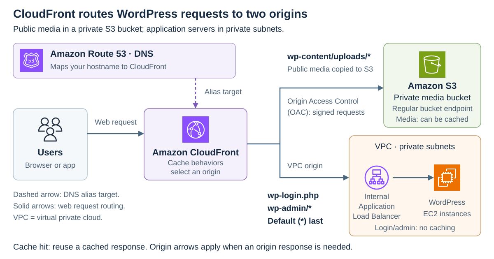

# Amazon CloudFront

[Back to AWS](../Readme.md#content)

# Front

How does Amazon CloudFront use edge caches to speed up web content delivery?

# Back

**Amazon CloudFront is a content delivery network (CDN)** that serves web content through worldwide **edge locations**—serving sites with caches. Reusing cached responses near viewers reduces latency (delay) and requests to the original content source.

## The delivery model

- **Origin:** the source of the content, such as an Amazon Simple Storage Service (S3) bucket or a web server.
- **Distribution:** the CloudFront configuration connecting origins to delivery and caching rules. Viewers use its domain name or your configured custom domain.
- **Cache behavior:** a rule that matches a request path and selects an origin and caching settings. The first match applies; the default is always checked last.

## How a request is served

1. The request reaches an edge location that can best serve it, typically the nearest in terms of latency.
2. A **cache hit** means a matching cached response can be reused. CloudFront returns it without contacting the origin.
3. On a **cache miss**, CloudFront retrieves the content, returns it to the viewer, and caches it when permitted.

**Regional edge caches** are larger caches between edge locations and origins. They can satisfy a miss before the origin is contacted. Some traffic takes a direct path: a `POST` request, for example, goes from the edge location straight to the origin.

The **time to live (TTL)** determines how long a cached response stays fresh. CloudFront's caching settings and origin headers such as `Cache-Control` determine this duration. After expiration, the next request normally triggers an origin check. If unchanged, the origin can return `304 Not Modified`, letting CloudFront reuse the cached file without downloading it again. Cached objects may also be removed early, so keep the original data at the origin.

## WordPress example

Both origins are private to prevent public viewers from bypassing CloudFront. Cache behaviors select:

- `wp-content/uploads/*`: public media copied to S3. **Origin Access Control (OAC)** signs requests; the private bucket's policy grants this distribution access.
- `wp-login.php`, `wp-admin/*`, and default (`*`): an internal **Application Load Balancer (ALB)** forwarding to WordPress on **Amazon Elastic Compute Cloud (EC2)**. Both use private subnets in a **virtual private cloud (VPC)**; a **CloudFront VPC origin** connects CloudFront to the ALB.

The login/admin behaviors match before the default and use the `CachingDisabled` policy (zero TTL). An **origin request policy** forwards their cookies and query strings without adding them to the **cache key** (the values used to match a cached response). Media responses can be cached.

Amazon Route 53 provides **Domain Name System (DNS)** resolution: its alias record points the hostname to CloudFront. Route 53 is neither a content origin nor a web proxy; web requests go directly to CloudFront.

Follow the solid arrows from Users; the dashed arrow shows the DNS alias. **Read the footer:** an origin arrow does not mean every request reaches that origin—a cache hit ends at CloudFront.

# Sources

- [What is Amazon CloudFront? — origins, distributions, and edge locations](https://docs.aws.amazon.com/AmazonCloudFront/latest/DeveloperGuide/Introduction.html)
- [How CloudFront delivers content — cache hits, misses, and regional edge caches](https://docs.aws.amazon.com/AmazonCloudFront/latest/DeveloperGuide/HowCloudFrontWorks.html)
- [Manage cache expiration — TTL, revalidation, and eviction](https://docs.aws.amazon.com/AmazonCloudFront/latest/DeveloperGuide/Expiration.html)
- [Cache behavior settings — path matching, origin selection, and the default behavior](https://docs.aws.amazon.com/AmazonCloudFront/latest/DeveloperGuide/DownloadDistValuesCacheBehavior.html)
- [Route 53 — route a domain to a CloudFront distribution](https://docs.aws.amazon.com/Route53/latest/DeveloperGuide/routing-to-cloudfront-distribution.html)
- [S3 origin access control — signed requests, bucket endpoints, and distribution-scoped permissions](https://docs.aws.amazon.com/AmazonCloudFront/latest/DeveloperGuide/private-content-restricting-access-to-s3.html)
- [CloudFront VPC origins — private subnets and internal load balancers](https://docs.aws.amazon.com/AmazonCloudFront/latest/DeveloperGuide/private-content-vpc-origins.html)
- [AWS WordPress guidance — media caching and login/admin bypass rules (Chinese)](https://aws.amazon.com/cn/blogs/china/using-amazon-cloudfront-aws-waf-wordpress/)
- [Managed cache policies — CachingDisabled](https://docs.aws.amazon.com/AmazonCloudFront/latest/DeveloperGuide/using-managed-cache-policies.html)
- [Origin request policies — forwarding headers, cookies, and query strings](https://docs.aws.amazon.com/AmazonCloudFront/latest/DeveloperGuide/controlling-origin-requests.html)
- [AWS architecture icons — official July 2026 SVG artwork used in the diagram](https://aws.amazon.com/architecture/icons/)
