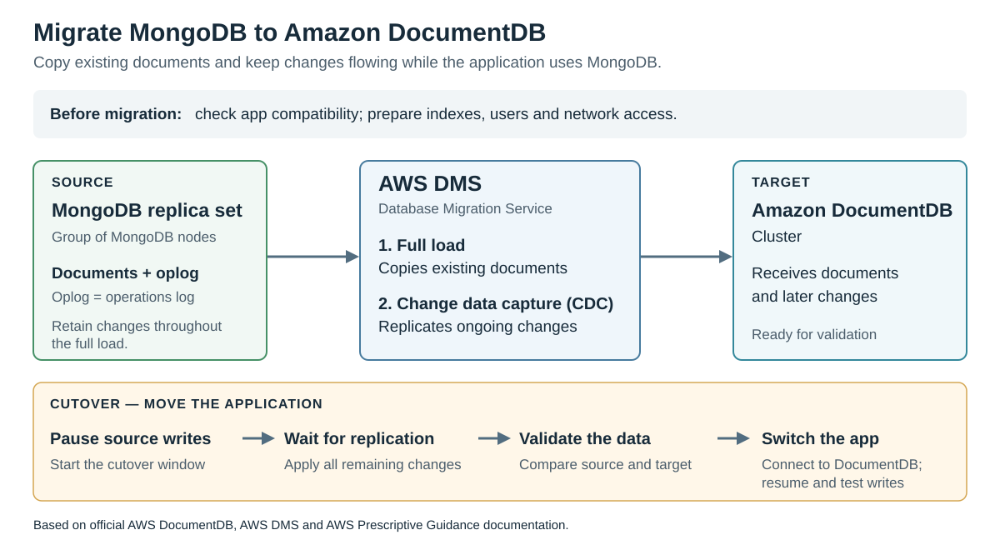
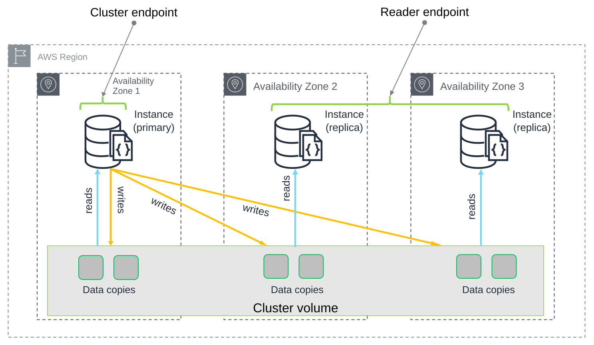

# Amazon DocumentDB

[Back to AWS](../Readme.md#content)

**Amazon DocumentDB is a fully managed document database with MongoDB compatibility.** It lets applications store and query documents while AWS operates the database infrastructure. This article explains the service, a MongoDB migration using AWS Database Migration Service, and the instance-and-storage architecture shown in AWS's documentation.

## Overview

A **document** contains named fields and values, which can include nested objects and arrays. A **collection** groups related documents. This model suits data whose fields vary, such as user profiles with different preferences or content-management records.

DocumentDB runs in an **Amazon Virtual Private Cloud (VPC)**, a private network in AWS. It provides continuous backups, recovery to a point in time, and automatic failover when a primary instance fails and a replica is available. You still configure database access, network rules, and capacity for your workload.

DocumentDB implements supported MongoDB application programming interfaces (APIs) on an AWS-built database engine. Existing MongoDB drivers and tools can be used, but supported operations and behavior differ. Check application queries, indexes, and features against the target DocumentDB version before migrating.

The architecture below describes an **instance-based cluster**. DocumentDB also offers elastic clusters, which use a different architecture.

## Migration from MongoDB to DocumentDB

**AWS Database Migration Service (AWS DMS)** can perform a full load of existing documents and then replicate ongoing changes using **change data capture (CDC)**. The diagram reads left to right: MongoDB supplies the data, DMS transfers it, and DocumentDB receives it. The lower band shows the separate application cutover.

For this migration, the MongoDB source must run as a **replica set** and retain its **operations log (oplog)** long enough to cover the full load. DMS needs this history to capture changes while the existing data is being copied. Configure the MongoDB source endpoint in **Document mode** for a DocumentDB target, and enable `_id` extraction for CDC as described in the DMS source guide.

The migration also includes checking compatibility, preparing the target cluster and network connectivity, and migrating compatible indexes and users. Copying documents alone does not finish the application migration.

**Cutover** means moving application traffic to the target. In the approach shown, pause writes to MongoDB, let the remaining changes reach DocumentDB, and validate the data. Then change the application's connection, resume writes on DocumentDB, and test the application. This combines the DocumentDB migration guidance with AWS's general cutover guidance; switching the application is a separate action from the DMS replication task.

## How an instance-based cluster works

A cluster separates **compute** from **storage**. Instances execute database operations; the shared **cluster volume** stores the data. An **Availability Zone (AZ)** is an isolated location within an AWS Region. The SVG recreates the supplied AWS diagram, with small label-placement adjustments for readability.

Read from the endpoints at the top toward the storage at the bottom. Yellow arrows show writes from the primary; blue arrows show reads into the instances. The six small blocks represent data copies in the shared volume.

- The **primary instance** accepts reads and writes. All changes to the cluster volume go through it.
- **Replica instances** serve reads and can be promoted if the primary fails. A cluster can have up to 15 replicas; two are shown here.
- The **cluster volume** maintains six data copies across three AZs. Storage replication is handled in this shared storage layer. Each database replica reads from the same logical volume.

This separation lets compute capacity change independently of storage. The six storage copies provide durability; replicas in different AZs improve compute availability and read capacity. Reads from replicas are eventually consistent, so they may briefly lag behind a completed write.

## Connection endpoints

An **endpoint** is the hostname and port used to connect to the database.

| Endpoint | Connects to | Behavior to remember |
| --- | --- | --- |
| Cluster endpoint | The current primary instance | Remaps to the new primary after failover. |
| Reader endpoint | An available replica | Distributes new connections across replicas, rather than balancing individual queries. With no replicas, it connects to the primary. |
| Instance endpoint | One specific instance | That instance can change role during failover. Avoid relying on it to remain the primary. |

AWS recommends connecting through the cluster endpoint in **replica-set mode**, which lets the driver discover cluster members. A driver read preference controls whether reads use the primary or replicas.

# Sources

- [AWS Developer Guide — What is Amazon DocumentDB?](https://docs.aws.amazon.com/documentdb/latest/devguide/what-is.html)
- [AWS Developer Guide — Document database use cases](https://docs.aws.amazon.com/documentdb/latest/devguide/document-database-use-cases.html)
- [AWS Developer Guide — Functional differences between DocumentDB and MongoDB](https://docs.aws.amazon.com/documentdb/latest/devguide/functional-differences.html)
- [AWS Developer Guide — Migration using AWS DMS: quick start](https://docs.aws.amazon.com/documentdb/latest/devguide/migration-quick-start.html)
- [AWS Developer Guide — Amazon DocumentDB migration runbook](https://docs.aws.amazon.com/documentdb/latest/devguide/docdb-migration-runbook.html)
- [AWS DMS User Guide — Using MongoDB as a source](https://docs.aws.amazon.com/dms/latest/userguide/CHAP_Source.MongoDB.html)
- [AWS Prescriptive Guidance — Cutover stage](https://docs.aws.amazon.com/prescriptive-guidance/latest/best-practices-migration-cutover/cutover-stage.html)
- [AWS Developer Guide — Amazon DocumentDB: how it works](https://docs.aws.amazon.com/documentdb/latest/devguide/how-it-works.html)
- [AWS Developer Guide — Original cluster architecture diagram](https://docs.aws.amazon.com/images/documentdb/latest/devguide/images/how-it-works-01c.png)
- [AWS Developer Guide — Understanding Amazon DocumentDB endpoints](https://docs.aws.amazon.com/documentdb/latest/devguide/endpoints.html)
