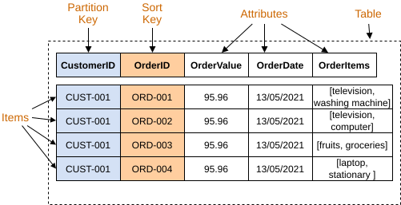
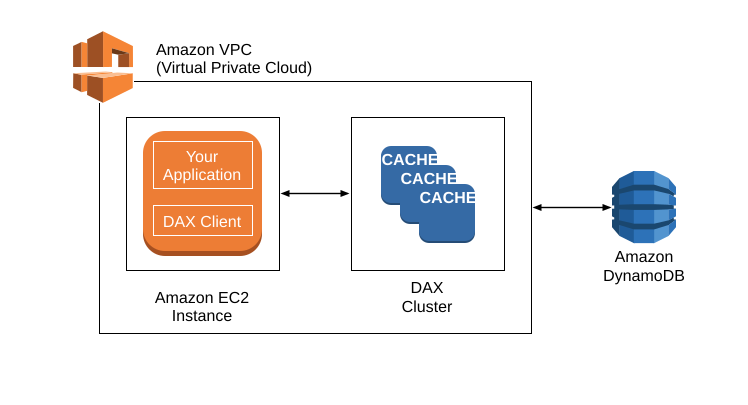

# Amazon DynamoDB

<sub>[Back to AWS](../Readme.md#content)</sub>

**Amazon DynamoDB is a fully managed, serverless NoSQL database that supports key-value and document data models.** You organize data around the reads and writes your application needs, and AWS manages the underlying servers and scaling. This article covers the data model, capacity, indexes, security, caching, and replication.

DynamoDB includes encryption at rest and offers continuous backups with point-in-time recovery, multi-Region replication through global tables, and caching through DynamoDB Accelerator (DAX). It also supports data import and export with Amazon S3, change capture with DynamoDB Streams or Kinesis Data Streams, and operational monitoring with Amazon CloudWatch. These are capabilities you configure according to your application's needs.

## Capacity modes

A table's **capacity mode** determines how read and write throughput is managed and billed.

- **On-demand:** pay for the read and write requests you make. DynamoDB manages throughput scaling, so you do not provision capacity units. AWS recommends this mode for most workloads, including variable or unpredictable traffic.
- **Provisioned:** specify read capacity units (**RCUs**) and write capacity units (**WCUs**). You pay for the capacity provisioned, even when it is unused. This can suit steady workloads whose demand you can reliably forecast. Auto scaling can adjust provisioned capacity within configured limits.

Capacity mode does not change the table's data model or query capabilities.

## Best practices

Design around **access patterns**: the specific ways your application will retrieve and update data.

- Keep items small and choose keys that distribute traffic across the table, avoiding a heavily accessed partition key that becomes a bottleneck.
- For large attributes, consider compression, splitting data into related items, or storing the large object in S3 and keeping its object identifier in DynamoDB. Compressed values cannot be meaningfully filtered without decompression.
- A DynamoDB item cannot exceed **400 KB**. If data is split between S3 and DynamoDB, the application must handle partial failures because a transaction cannot span both services.
- Separate tables by time period when the access pattern justifies it—for example, a high-volume event stream whose newest records receive most traffic. Reduce capacity for older periods. This is a specific time-series pattern, not a rule for every date attribute.
- For older, rarely accessed tables, consider the Standard-Infrequent Access table class. It trades lower storage cost for higher read/write cost; evaluate the actual access pattern before switching.

## Concepts

DynamoDB organizes data into **tables**, **items**, and **attributes**. A table contains items; an item contains named attributes and their values. Think of an item as one record, without assuming that all records must have identical fields.

Each item has a **primary key** that uniquely identifies it. A table uses one of two key structures:

- **Partition key only:** this value must be unique for every item.
- **Partition key and sort key:** their combination must be unique. Items may share a partition key when they have different sort keys.

In the example below, blue `CustomerID` is the partition key and orange `OrderID` is the sort key. Together they form the primary key. Each row is an item; all columns, including the keys, are attributes.



Thus, customer `CUST-001` can have orders `ORD-001` through `ORD-004`. `CustomerID` alone does not identify one order.

DynamoDB is **schemaless for non-key attributes**: different items can contain different fields and value types. The table's key attributes and their types are defined in advance.

### Reading and writing data

Use operations such as `PutItem`, `GetItem`, `UpdateItem`, and `Query`, or use the SQL-compatible PartiQL interface described below. NoSQL does not mean that SQL-like syntax is unavailable.

A `Query` targets one table or one named secondary index. For the table above, it requires an equality condition on `CustomerID` and can optionally restrict `OrderID`. For example, querying `CustomerID = CUST-001` retrieves that customer's orders in sort-key order. When using an index, the application supplies its name; DynamoDB does not automatically choose among indexes for this API operation.

DynamoDB does not provide relational joins. Model the data for known access patterns; perform additional aggregation or composition in application code or a suitable analytics service when needed.

### Read consistency

- **Eventually consistent reads** are the default. A read can briefly return an older value after a successful write.
- **Strongly consistent reads** return data reflecting prior successful writes. They are available on tables and local secondary indexes by setting `ConsistentRead` to `true`.
- **Global secondary indexes** support only eventually consistent reads.

For cross-Region reads, the global table's consistency mode also matters; see the global tables section.

## Indexes

A **secondary index** provides another key structure for reading table data. DynamoDB maintains it automatically and copies selected attributes into it; this copying is called **projection**.

| Property | Global secondary index (GSI) | Local secondary index (LSI) |
| --- | --- | --- |
| Key structure | Can use different partition and sort keys from the table | Same partition key as the table, with a different sort key |
| Scope | Can reorganize data from across the entire table | Alternate ordering within each table partition-key value |
| Creation | With the table or later | Only when the table is created |
| Deletion | Can be deleted independently | Cannot be deleted independently |
| Read consistency | Eventually consistent | Eventually or strongly consistent |
| Provisioned capacity | Has its own RCUs and WCUs | Uses the table's RCUs and WCUs |

A write to the base table can also require index maintenance. **Do not assume every write always costs exactly two writes.** The cost depends on which indexes and projected attributes change. Updating a GSI key can require removing one index entry and inserting another; an unrelated attribute change may require no GSI write. LSI maintenance consumes the table's write capacity.

Insufficient provisioned GSI write capacity can throttle writes to its base table, so plan for both workloads.

## Encryption at rest

DynamoDB encrypts stored user data using keys managed through **AWS Key Management Service (AWS KMS)**. You can choose:

- **AWS owned key:** the default; no additional encryption charge.
- **AWS managed key:** managed by AWS KMS in your account; KMS charges apply.
- **Customer managed key:** you create and control the key in your account; KMS charges apply.

DynamoDB handles encryption and decryption transparently when you access the table.

## Data types

DynamoDB's native attribute types are independent of the programming language used by your application.

| Category | Supported types | Example |
| --- | --- | --- |
| Scalar | String, Number, Binary, Boolean, Null | An order ID, amount, or paid flag |
| Document | List and Map | An ordered list of products or a delivery-address object |
| Set | String Set, Number Set, Binary Set | Unique product tags of one type |

Table primary-key attributes must be String, Number, or Binary. DynamoDB has no native date/time type: store dates as strings, commonly in ISO 8601 format, or as numeric timestamps. The diagram's dates are illustrative string values.

### Java mappings

Java types are converted by the SDK's object-mapping layer. For example, the legacy **AWS SDK for Java 1.x `DynamoDBMapper`** maps Java numeric types (`Byte`, `Integer`, `Long`, `Float`, `Double`, `BigDecimal`, `BigInteger`, and applicable primitives) to DynamoDB Number values. It also supports `String`, booleans, binary data, collections, and custom converters.

Its `Date` and `Calendar` values are stored as UTC ISO 8601 strings. This Java mapping does not limit DynamoDB itself to primitive Java types.

### Important limits

- **400 KB per item**, including attribute names and values. AWS uses 1 KB = 1,024 bytes here.
- **20 GSIs per table by default**, with quota increases available; **5 LSIs per table**.
- For a table with LSIs, each item collection—all table items and LSI entries sharing a partition-key value—has a **10 GB** limit.

Some quotas can be raised through AWS Service Quotas or AWS Support; hard constraints such as the item-size limit cannot.

## Calculating RCU and WCU

Capacity depends on **item size, operation type, and consistency**, not just the number of API calls. One batch request can read or write multiple items.

The examples below describe individual item operations in provisioned mode, before additional index work. Round each item up to the next 4 KB boundary for these reads or 1 KB boundary for writes.

### Read capacity units

| Read type | RCUs for one item up to 4 KB read per second | RCUs for one 8 KB item read per second |
| --- | --- | --- |
| Strongly consistent | 1 | 2 |
| Eventually consistent | 0.5 | 1 |
| Transactional | 2 | 4 |

One RCU therefore supports **two eventually consistent reads per second, each for an item up to 4 KB**. Transactional reads use twice the capacity of equivalent strongly consistent reads.

### Write capacity units

One WCU supports **one standard write per second for an item up to 1 KB**. A transactional write needs twice the capacity.

| Item size | WCUs for one standard write per second | WCUs for one transactional write per second |
| --- | --- | --- |
| 1 KB | 1 | 2 |
| 3 KB | 3 | 6 |

Updating just one attribute does not mean only that attribute's size is charged: `UpdateItem` uses the larger of the item's before and after sizes. On-demand mode uses read/write **request units** instead of provisioned units per second, with the corresponding size and consistency rules.

## DynamoDB Accelerator (DAX)

**DAX is a managed in-memory cache for DynamoDB, useful for repeated, eventually consistent reads.** A cache hit can reduce read latency from milliseconds to microseconds. DAX is optional; applications can also call DynamoDB directly.

The diagram shows an application on an Amazon Elastic Compute Cloud (EC2) instance using a DAX client. The application and DAX cluster are inside an Amazon Virtual Private Cloud (VPC). The client sends requests to DAX, which serves supported cached reads or forwards requests to DynamoDB. Arrows represent requests and responses.



DAX keeps an **item cache** for individual items and a separate **query cache** for `Query` and `Scan` results. A cache miss retrieves data from DynamoDB and populates the appropriate cache.

### Writes and cache consistency

DAX is a **write-through cache**. For a normal `PutItem`, `UpdateItem`, or `DeleteItem` sent through DAX, it first obtains a successful DynamoDB write, updates its item cache, and then returns success.

Important consequences:

- Writes made directly to DynamoDB do not immediately refresh DAX's cached items. Old data can remain until expiration or eviction.
- Changing an item does not invalidate cached `Query` or `Scan` results. Their own time to live (TTL), meaning cache lifetime, matters.
- Strongly consistent and transactional reads pass through to DynamoDB; DAX does not serve or populate its caches with those results.

### Consistency among cluster nodes

AWS recommends **at least three DAX nodes across multiple Availability Zones** for high availability. Cache changes replicate asynchronously between nodes, so two clients can briefly receive different values for the same item. Applications using cached reads must tolerate this eventual consistency.

## Global tables

**Global tables replicate DynamoDB data across AWS Regions**, allowing applications to read and write through regional replicas. They support applications near geographically distributed users and help recovery when a Region is impaired.

The current global tables implementation offers two consistency modes:

- **Multi-Region eventual consistency (MREC):** the default. Changes replicate asynchronously. Concurrent writes to the same item use last-writer-wins conflict resolution. A strongly consistent read in one Region can still miss a write that has not yet arrived from another Region.
- **Multi-Region strong consistency (MRSC):** writes replicate synchronously to at least one other Region before success. Strongly consistent reads on any replica return the latest item. This mode has specific Region and feature restrictions.

Choose the mode when creating the global table; it cannot be changed afterward. Use the documentation for the **current 2019.11.21 version**, rather than the legacy 2017.11.29 version.

## PartiQL

**PartiQL provides SQL-compatible syntax for DynamoDB reads and writes**, including `SELECT`, `INSERT`, `UPDATE`, and `DELETE`. DynamoDB supports a subset of PartiQL; this does not turn it into a relational database with joins.

For an `Orders` table with the keys shown in the first diagram, this example retrieves one customer's orders:

```sql
SELECT CustomerID, OrderID, OrderValue
FROM "Orders"
WHERE CustomerID = 'CUST-001';
```

The partition-key condition keeps this access targeted. A `SELECT` without a suitable partition-key equality or `IN` condition can require a full table scan, so SQL-like syntax does not remove the need to design access patterns.

# Sources

- [AWS: What is Amazon DynamoDB?](https://docs.aws.amazon.com/amazondynamodb/latest/developerguide/Introduction.html)
- [AWS: DynamoDB throughput capacity](https://docs.aws.amazon.com/amazondynamodb/latest/developerguide/capacity-mode.html)
- [AWS: DynamoDB provisioned capacity mode](https://docs.aws.amazon.com/amazondynamodb/latest/developerguide/provisioned-capacity-mode.html)
- [AWS: NoSQL design for DynamoDB](https://docs.aws.amazon.com/amazondynamodb/latest/developerguide/bp-general-nosql-design.html)
- [AWS: Storing large items and attributes](https://docs.aws.amazon.com/amazondynamodb/latest/developerguide/bp-use-s3-too.html)
- [AWS: Handling time series data](https://docs.aws.amazon.com/amazondynamodb/latest/developerguide/bp-time-series.html)
- [AWS: Core components of DynamoDB](https://docs.aws.amazon.com/amazondynamodb/latest/developerguide/HowItWorks.CoreComponents.html)
- [AWS: Key condition expressions for Query](https://docs.aws.amazon.com/amazondynamodb/latest/developerguide/Query.KeyConditionExpressions.html)
- [AWS: DynamoDB read consistency](https://docs.aws.amazon.com/amazondynamodb/latest/developerguide/HowItWorks.ReadConsistency.html)
- [AWS: Secondary indexes](https://docs.aws.amazon.com/amazondynamodb/latest/developerguide/SecondaryIndexes.html)
- [AWS: Global secondary indexes](https://docs.aws.amazon.com/amazondynamodb/latest/developerguide/GSI.html)
- [AWS: Local secondary indexes](https://docs.aws.amazon.com/amazondynamodb/latest/developerguide/LSI.html)
- [AWS: Encryption at rest](https://docs.aws.amazon.com/amazondynamodb/latest/developerguide/EncryptionAtRest.html)
- [AWS: Supported data types and naming rules](https://docs.aws.amazon.com/amazondynamodb/latest/developerguide/HowItWorks.NamingRulesDataTypes.html)
- [AWS: Supported data types for DynamoDBMapper for Java](https://docs.aws.amazon.com/amazondynamodb/latest/developerguide/DynamoDBMapper.DataTypes.html)
- [AWS: Quotas in DynamoDB](https://docs.aws.amazon.com/amazondynamodb/latest/developerguide/ServiceQuotas.html)
- [AWS: Constraints in DynamoDB](https://docs.aws.amazon.com/amazondynamodb/latest/developerguide/Constraints.html)
- [AWS: DynamoDB read and write operations](https://docs.aws.amazon.com/amazondynamodb/latest/developerguide/read-write-operations.html)
- [AWS: In-memory acceleration with DAX](https://docs.aws.amazon.com/amazondynamodb/latest/developerguide/DAX.html)
- [AWS: DAX—how it works](https://docs.aws.amazon.com/amazondynamodb/latest/developerguide/DAX.concepts.html)
- [AWS: DAX and DynamoDB consistency models](https://docs.aws.amazon.com/amazondynamodb/latest/developerguide/DAX.consistency.html)
- [AWS: How current DynamoDB global tables work](https://docs.aws.amazon.com/amazondynamodb/latest/developerguide/V2globaltables_HowItWorks.html)
- [AWS: PartiQL for DynamoDB](https://docs.aws.amazon.com/amazondynamodb/latest/developerguide/ql-reference.html)
- [AWS: PartiQL SELECT statements](https://docs.aws.amazon.com/amazondynamodb/latest/developerguide/ql-reference.select.html)
