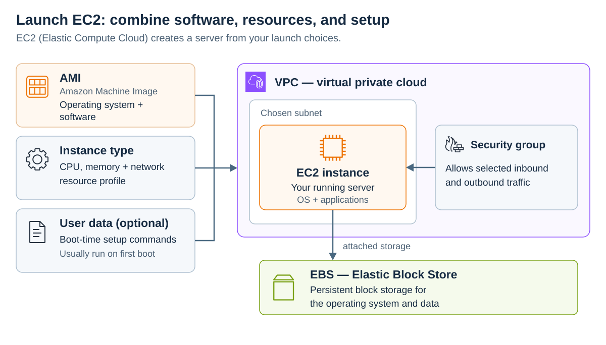
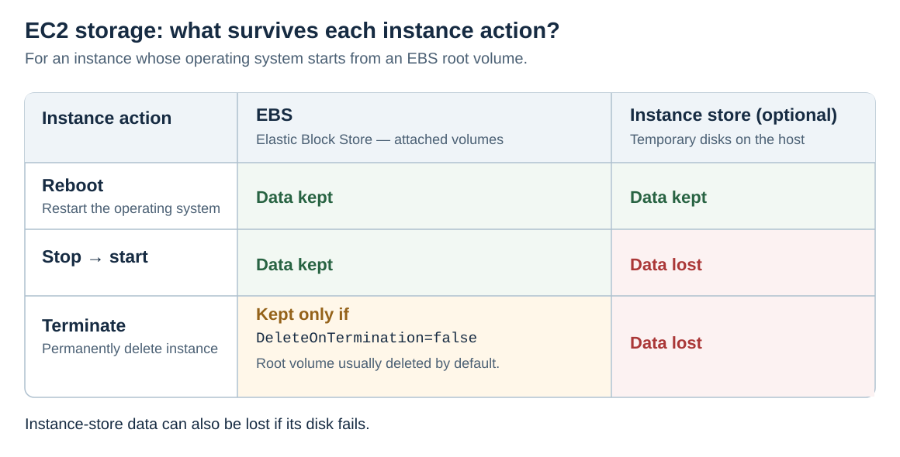

# Amazon EC2

[Back to AWS](../Readme.md#content)

**Amazon Elastic Compute Cloud (Amazon EC2) provides configurable computing capacity in AWS.** An **instance** is a server that runs your operating system and applications. You choose its software image, hardware resources, storage, networking, and purchasing option. AWS operates the underlying infrastructure; you manage the guest operating system and your software.

This article covers those choices, then explains storage persistence, access control, health checks, and instance networking.

## Use cases

- Run web, cloud-native, and enterprise applications.
- Run simulations and other **high-performance computing (HPC)** workloads.
- Develop, build, test, and sign applications for Apple platforms with EC2 Mac instances.
- Train **machine learning (ML)** models and run inference, which means using a trained model to make predictions.

## Amazon Machine Images (AMIs)

An **Amazon Machine Image (AMI)** is a reusable software image used to launch an instance. It supplies the operating system, any preinstalled software, and storage mappings. You can use AWS-provided images, choose another trusted publisher, or create your own image so that multiple instances start with the same software.

An AMI is specific to an AWS Region and must be compatible with the instance's processor architecture and other launch requirements. For example, an Arm image cannot boot on an x86 instance. The AMI selects the starting software; the **instance type** selects the hardware resource profile.

The diagram shows how the launch inputs fit together. The instance runs in a subnet of an **Amazon Virtual Private Cloud (VPC)**, your logically isolated network in AWS. A subnet belongs to an **Availability Zone (AZ)**, an isolated location within a Region. Security groups and storage are separate configuration choices.

## Instance types

An instance type specifies a combination of **virtual central processing units (vCPUs)**, memory, storage capabilities, and network performance. Families group related types; sizes offer different resource amounts within a family. Processor choices include Intel, AMD, and Arm-based AWS Graviton, so check software compatibility as well as capacity.

| Category | Main purpose |
| --- | --- |
| General purpose | Balance compute, memory, and networking for varied applications. |
| Burstable performance | Provide baseline CPU performance with the ability to burst above it using CPU credits. |
| Compute optimized | Favor workloads that need substantial CPU processing. |
| Memory optimized | Process large datasets in memory. |
| Storage optimized | Favor workloads that need substantial local storage throughput or input/output performance. |
| Accelerated computing | Use graphics processing units (GPUs) or other accelerators for workloads such as ML and graphics. |
| High-performance computing | Run demanding workloads such as large scientific simulations. |

“Micro” is an instance size, not a separate hardware category. Choose from measured workload needs rather than assuming every instance with the same vCPU count performs identically.

## Instance purchasing options

**A pricing discount and a capacity reservation solve different problems.** A discount reduces the rate for eligible usage; a reservation secures matching compute capacity in a particular location.

### On-Demand Instances

On-Demand lets you pay for running instances without a long-term commitment or upfront payment. It suits development, testing, and irregular workloads that need to run without Spot-style interruptions. The EC2 guide describes per-second compute billing with a 60-second minimum; check the selected configuration's pricing and any separate storage or software charges.

Selecting On-Demand does not automatically add servers when load rises. Configure **Amazon EC2 Auto Scaling** to adjust the number of instances according to policies and capacity limits.

### On-Demand Capacity Reservations

A Capacity Reservation reserves matching instance capacity in a specific AZ. You pay for an active reservation even when it is unused; it does not provide a discount by itself. Eligible Savings Plans or regional Reserved Instance discounts can apply to its usage.

An **immediate** reservation has no term commitment and can be canceled. A **future-dated** reservation starts later and has a commitment period and additional conditions. A reservation request still depends on AWS being able to supply the requested capacity.

### Reserved Instances

A **Reserved Instance (RI)** is a billing benefit for matching On-Demand usage in exchange for a one-year or three-year commitment. It is not an additional server that you launch.

- **Standard RIs** generally offer greater discounts with more limited changes.
- **Convertible RIs** allow exchanges into other eligible configurations, subject to AWS's exchange rules.
- Payment options are **All Upfront**, **Partial Upfront**, and **No Upfront**.

A **regional RI** applies within a Region and does not reserve capacity. A **zonal RI** applies to a specific AZ and includes a capacity reservation for the matching configuration. Actual savings depend on the configuration, term, and payment option.

### Savings Plans

**Savings Plans** discount eligible usage in exchange for a commitment to a spend amount per hour for one or three years.

- **Compute Savings Plans** provide flexibility across EC2 instance families and Regions and also cover eligible AWS Fargate and AWS Lambda usage.
- **EC2 Instance Savings Plans** apply to a selected instance family in one Region, with flexibility across sizes, operating systems, and tenancy within that scope.

Savings Plans do not reserve capacity. They are a separate purchasing choice from RIs, rather than an RI subtype.

### Scheduled Instances

Scheduled Instances were intended for recurring capacity windows, such as a weekly batch job. **AWS no longer allows new Scheduled Instance purchases.** For recurring workloads, consider scheduling ordinary compute capacity and evaluate discounts and capacity reservations separately.

### Spot Instances

Spot uses spare EC2 capacity at a discount. AWS can reclaim that capacity, so applications must tolerate interruptions and replacement instances. Suitable examples include restartable batch jobs, test workers, and distributed processing that saves progress to durable storage.

For stop or termination, AWS provides a two-minute interruption notice on a **best-effort basis**. Hibernation begins immediately when its notice is issued. Design recovery so that it does not depend on receiving the notice. Interruption tolerance matters more than simply describing a job as “not time-sensitive.”

## Tenancy

**Tenancy** controls whether the physical host is shared with other AWS accounts and how much host placement control you have.

| Option | What it means |
| --- | --- |
| Shared / default tenancy | Your instance can run on hardware shared with instances from other AWS accounts. AWS isolates the instances. |
| Dedicated Instances | Instances run on hardware dedicated to one AWS account. AWS manages host placement; you do not control a particular physical host. |
| Dedicated Hosts | A physical server is allocated for your use. You can control instance placement and see host socket/core information, which can support eligible existing software licenses and compliance requirements. |

Dedicated Hosts are billed per host and can use On-Demand pricing or eligible reservation discounts. Dedicated hardware does not remove your responsibility to secure the operating system and applications. Choose tenancy based on isolation, placement, and licensing requirements as well as cost.

## User data

**User data** supplies configuration or scripts at launch, for example to install packages and start an application. On Linux, shell scripts or **cloud-init** directives normally run during the first boot only, with root privileges. Windows launch agents can run batch or PowerShell scripts; repeat execution requires the appropriate configuration.

An AMI provides the starting software; user data customizes it during startup. Do not assume a reboot reruns the setup. Avoid storing passwords or long-lived keys in user data because software with access inside the instance can retrieve it.

## Storage options

**Block storage** presents a volume that the operating system can use like a disk. EC2's two main block-storage choices differ in where the data lives and how long it survives:

- **Amazon Elastic Block Store (EBS)** provides persistent volumes attached over the network. Volumes can exist independently of the instance, and EBS snapshots provide point-in-time backups.
- **Instance store** uses disks physically attached to the host on supported instance types. It is temporary storage for caches, buffers, and scratch files, or data that can be recovered from another copy.

The diagram compares lifecycle events for an instance with an EBS root volume and optional instance-store data. **Reboot**, **stop/start**, and **terminate** have different effects: both storage types survive a normal reboot, but instance-store data is lost on stop, hibernation, or termination. An underlying disk failure can also lose instance-store data.

For EBS, termination behavior depends on each volume's `DeleteOnTermination` setting. The root volume is normally deleted on termination unless configured otherwise. Check each volume's setting instead of assuming that “persistent” means “never deleted.”

### Root volumes and performance

The **root volume** holds the operating system used to boot the instance. AWS recommends EBS-backed AMIs because they use persistent root storage and launch faster than instance-store-backed AMIs. EBS-root instances can be stopped and started. Legacy instance-store-root instances are supported only on certain Linux instance types and cannot be stopped.

An EBS-backed launch creates volumes from the AMI's snapshots. Snapshot blocks are loaded into the volumes, and initial access can have higher latency until initialization completes. Fast snapshot restore or volume initialization can reduce that effect. Instance-store-backed launches copy the image from Amazon S3 to the local root volume.

Do not treat EBS as universally slower than instance store. Performance depends on the volume and instance types, provisioned limits, and workload. Starting an existing stopped EBS-root instance reuses its root volume; it does not recreate that volume from the AMI.

## Security

### Security groups

A **security group** is a virtual firewall associated with network interfaces. Its inbound and outbound rules allow traffic by criteria such as protocol, port, and source or destination. Security groups are **stateful**: response traffic for an allowed connection is permitted without a separate rule in the reverse direction.

Configure only the access the application needs. You remain responsible for guest operating system patches, application security, and access credentials.

### Key pairs

A key pair contains a public key and a private key. Keep the private key secure; AWS does not retain a copy that you can download later.

- **Linux:** the public key is installed on the instance, and the matching private key authenticates a Secure Shell (SSH) connection.
- **Windows:** the private key decrypts the initial administrator password, which is then used to connect to the instance, typically through Remote Desktop Protocol (RDP).

Key pairs are not mandatory for every access method. For example, **AWS Systems Manager Session Manager** can provide an interactive shell when the instance and permissions are configured for it.

## Status checks

EC2 distinguishes infrastructure health from guest and application health. Its current documentation lists four status-check types:

| Check | What it detects | Typical response |
| --- | --- | --- |
| System | Problems in the underlying AWS host or infrastructure. | Wait for AWS repair, use supported recovery, or stop/start an EBS-root instance. |
| Instance | Guest problems such as incorrect networking, exhausted memory, a damaged filesystem, or an incompatible kernel. | Investigate the guest configuration; repair or reboot as appropriate. |
| Attached EBS | Attached volumes cannot be reached or complete input/output operations; this metric is available on Nitro instances. | Investigate storage/host health and recover or replace affected resources. |
| Application | An opt-in check of an application's HTTP or HTTPS endpoint and configured response codes. | Investigate the application or its network path. |

The infrastructure and instance checks run automatically; application checks require configuration. A stop/start moves an EBS-root instance to another host in most cases, whereas a normal reboot stays on the same host. Remember that stopping loses any instance-store data. CloudWatch alarms can notify you about failed checks.

## Networking

### Instance metadata

The **Instance Metadata Service (IMDS)** exposes instance information and user data from inside the instance. Its IPv4 endpoint is `http://169.254.169.254`. Metadata includes items such as the instance ID, networking configuration, and temporary credentials for an attached role when applicable.

**IMDSv2** uses a session token: the client first requests a token, then includes it when requesting metadata. Require IMDSv2 to reject tokenless IMDSv1 calls. A metadata token is not encryption or an application-user access policy; continue to restrict which software can reach metadata and keep secrets out of user data.

### Elastic network interfaces

An **elastic network interface (ENI)** is a virtual network card in a VPC. It carries attributes such as IP addresses and security-group associations. You can create interfaces and attach them to compatible instances in the **same AZ**.

Each instance has a primary interface that cannot be detached. Additional interfaces can be moved between instances, subject to attachment limits; their attributes move with them. **Requester-managed interfaces** are created and controlled by AWS services, so you cannot manage them like ordinary user-created interfaces.

# Sources

- [AWS — What is Amazon EC2?](https://docs.aws.amazon.com/AWSEC2/latest/UserGuide/concepts.html)
- [AWS — Amazon Machine Images](https://docs.aws.amazon.com/AWSEC2/latest/UserGuide/AMIs.html)
- [AWS — Regions and Zones](https://docs.aws.amazon.com/AWSEC2/latest/UserGuide/using-regions-availability-zones.html)
- [AWS — EC2 instance types](https://docs.aws.amazon.com/AWSEC2/latest/UserGuide/instance-types.html)
- [AWS — Instance type specifications and categories](https://docs.aws.amazon.com/ec2/latest/instancetypes/ec2-instance-type-specifications.html)
- [AWS — Burstable performance concepts](https://docs.aws.amazon.com/AWSEC2/latest/UserGuide/burstable-credits-baseline-concepts.html)
- [AWS — EC2 Mac instances](https://docs.aws.amazon.com/AWSEC2/latest/UserGuide/ec2-mac-instances.html)
- [AWS — On-Demand Instances](https://docs.aws.amazon.com/AWSEC2/latest/UserGuide/ec2-on-demand-instances.html)
- [AWS — What is Amazon EC2 Auto Scaling?](https://docs.aws.amazon.com/autoscaling/ec2/userguide/what-is-amazon-ec2-auto-scaling.html)
- [AWS — Capacity Reservation concepts](https://docs.aws.amazon.com/AWSEC2/latest/UserGuide/cr-concepts.html)
- [AWS — Capacity Reservation pricing and billing](https://docs.aws.amazon.com/AWSEC2/latest/UserGuide/capacity-reservations-pricing-billing.html)
- [AWS — Reserved Instances](https://docs.aws.amazon.com/AWSEC2/latest/UserGuide/ec2-reserved-instances.html)
- [AWS — Regional and zonal Reserved Instances](https://docs.aws.amazon.com/AWSEC2/latest/UserGuide/reserved-instances-scope.html)
- [AWS — What are Savings Plans?](https://docs.aws.amazon.com/savingsplans/latest/userguide/what-is-savings-plans.html)
- [AWS — Savings Plans and RI comparison](https://docs.aws.amazon.com/savingsplans/latest/userguide/sp-ris.html)
- [AWS — Scheduled Instance purchase availability](https://docs.aws.amazon.com/AWSEC2/latest/APIReference/API_PurchaseScheduledInstances.html)
- [AWS — How Spot Instances work](https://docs.aws.amazon.com/AWSEC2/latest/UserGuide/how-spot-instances-work.html)
- [AWS — Spot interruption notices](https://docs.aws.amazon.com/AWSEC2/latest/UserGuide/spot-instance-termination-notices.html)
- [AWS — Dedicated Instances and Dedicated Hosts compared](https://docs.aws.amazon.com/AWSEC2/latest/UserGuide/dedicated-instance.html)
- [AWS — Dedicated Hosts](https://docs.aws.amazon.com/AWSEC2/latest/UserGuide/dedicated-hosts-overview.html)
- [AWS — Run commands with user data](https://docs.aws.amazon.com/AWSEC2/latest/UserGuide/user-data.html)
- [AWS — EC2 storage options](https://docs.aws.amazon.com/AWSEC2/latest/UserGuide/Storage.html)
- [AWS — What is Amazon EBS?](https://docs.aws.amazon.com/ebs/latest/userguide/what-is-ebs.html)
- [AWS — Root volumes](https://docs.aws.amazon.com/AWSEC2/latest/UserGuide/RootDeviceStorage.html)
- [AWS — Instance-store data persistence](https://docs.aws.amazon.com/AWSEC2/latest/UserGuide/instance-store-lifetime.html)
- [AWS — Instance lifecycle and host behavior](https://docs.aws.amazon.com/AWSEC2/latest/UserGuide/ec2-instance-lifecycle.html)
- [AWS — Preserve volumes on termination](https://docs.aws.amazon.com/AWSEC2/latest/UserGuide/preserving-volumes-on-termination.html)
- [AWS — Initialize EBS volumes](https://docs.aws.amazon.com/ebs/latest/userguide/initalize-volume.html)
- [AWS — Security responsibilities](https://docs.aws.amazon.com/AWSEC2/latest/UserGuide/ec2-security.html)
- [AWS — Security groups](https://docs.aws.amazon.com/AWSEC2/latest/UserGuide/ec2-security-groups.html)
- [AWS — EC2 key pairs](https://docs.aws.amazon.com/AWSEC2/latest/UserGuide/ec2-key-pairs.html)
- [AWS — EC2 status checks](https://docs.aws.amazon.com/AWSEC2/latest/UserGuide/monitoring-system-instance-status-check.html)
- [AWS — Instance metadata and user data](https://docs.aws.amazon.com/AWSEC2/latest/UserGuide/ec2-instance-metadata.html)
- [AWS — How IMDSv2 works](https://docs.aws.amazon.com/AWSEC2/latest/UserGuide/configuring-instance-metadata-service.html)
- [AWS — Elastic network interfaces](https://docs.aws.amazon.com/AWSEC2/latest/UserGuide/using-eni.html)
