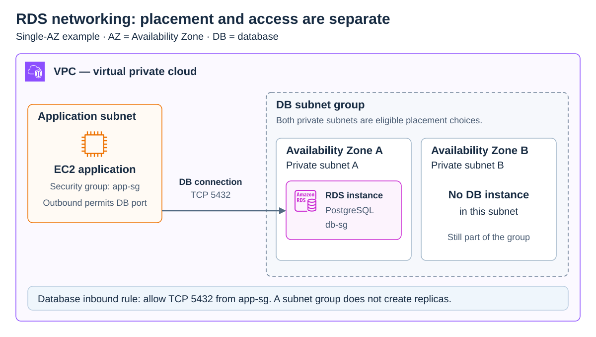
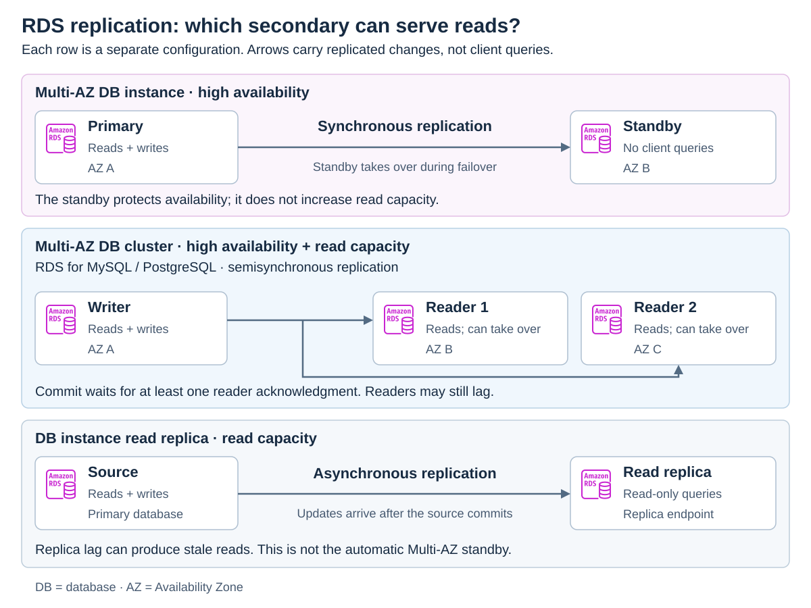

# Amazon RDS

[Back to AWS](../Readme.md#content)

**Amazon Relational Database Service (Amazon RDS) manages common tasks such as database setup, patching, backups, and failure recovery.** You still design your databases and tune your queries. Choose the database engine, capacity, network access, and availability configuration separately.

The key distinction is between **more capacity**, **high availability**, and **read scaling**. Adding a standby for recovery does not always give your application another database it can query.

## Engines and database instances

A **database (DB) instance** is an isolated database environment with a chosen amount of compute and memory. The **engine** is the database software running in that environment.

Amazon RDS supports **IBM Db2, MariaDB, Microsoft SQL Server, MySQL, Oracle Database, and PostgreSQL**. **Amazon Aurora** is also part of RDS and offers MySQL-compatible or PostgreSQL-compatible engines with a different storage architecture. An Aurora cluster uses one of these engine families; it does not run both simultaneously.

Features depend on the engine, version, instance class, and AWS Region. Do not assume that every engine supports every deployment or replica option.

## Storage and scaling

For non-Aurora RDS DB instances, storage uses **Amazon Elastic Block Store (Amazon EBS)**. Aurora uses a **shared cluster volume**, separate from its database instances, with data distributed across multiple Availability Zones.

| What needs to grow? | Mechanism | What changes? |
| --- | --- | --- |
| Compute or memory on one instance | **Vertical scaling**: change the DB instance class | The instance has more processing or memory capacity. |
| Capacity for read queries | **Horizontal read scaling**: add supported read replicas and route reads to them | More instances serve reads; this does not add independent writers to the same database. |
| Space for data | Increase allocated storage, or enable supported **RDS storage autoscaling** | More storage is allocated, independently of the instance class. |

With storage autoscaling enabled, RDS can increase allocated storage as free space runs low, up to your configured maximum. **Storage autoscaling does not automatically shrink storage, resize compute, or add read replicas.** Large data loads can still exhaust free space before another storage increase is possible.

Aurora's cluster storage grows automatically as data grows. **Aurora Serverless** additionally adjusts database compute capacity to application demand; compute scaling and storage growth are separate mechanisms.

## DB subnet groups and VPC access

A **virtual private cloud (VPC)** is an isolated virtual network. An **Availability Zone (AZ)** is an isolated location within an AWS Region. A **subnet** is a segment of a VPC’s IP address range within one AZ. A **DB subnet group** tells RDS which subnets it may use for database placement.

For ordinary Regional deployments, choose or create a subnet group with subnets in **at least two AZs**, even for a Single-AZ DB instance. A **Multi-AZ DB cluster requires at least three AZs**. RDS for SQL Server Multi-AZ documentation specifies at least two AZs; there is no general three-AZ requirement for SQL Server mirroring. Local Zone subnet groups have a separate one-subnet exception.

RDS selects an available IP address from a subnet in the group and assigns a network interface to the DB instance. Keep spare addresses for recovery and maintenance. Applications should connect using the DB endpoint's **Domain Name System (DNS) name**, because its underlying IP address can change.

The diagram shows a Single-AZ instance: both database subnets belong to the subnet group, but only one currently contains the database. A subnet group supplies placement choices; it does not create replicas.

A **security group** controls permitted network traffic. Being in the same VPC does not by itself allow an application on **Amazon Elastic Compute Cloud (Amazon EC2)** to connect to RDS. For example, with PostgreSQL listening on port `5432`, allow inbound Transmission Control Protocol (TCP) traffic to the database's security group from the application's EC2 security group on that port. The application's outbound rules must also permit the connection. Private database subnets keep the database away from direct internet access.

## Multi-AZ deployments and read replicas

Read each row below as a different configuration. The arrows show replication, not application requests. **Synchronous** replication keeps a standby in step with writes; **asynchronous** replication lets a reader catch up later. **Semisynchronous** replication waits for an acknowledgment from at least one reader, without waiting for every reader to apply the change.

### Multi-AZ DB instance: primary and standby

The **primary** handles application reads and writes. RDS maintains one **standby** synchronously in another AZ. **Applications cannot use this standby for reads or writes before promotion.** Its purpose is availability and recovery.

If a failure triggers **failover**, RDS promotes the standby to primary and updates the endpoint's DNS record. The application must re-establish its connections. RDS can then create a replacement standby. Automatic failover reduces recovery work, but it does not mean uninterrupted connections.

### Multi-AZ DB cluster: writer and two readable standbys

For supported **RDS for MySQL and RDS for PostgreSQL** configurations, a Multi-AZ DB cluster has one writer and two readers in three AZs. The readers serve read traffic and are automatic failover targets. Replication is **semisynchronous**, and readers can lag behind the writer.

This is a distinct RDS deployment type; it is **not an Aurora cluster**. The rule “a Multi-AZ standby cannot serve reads” applies to the DB **instance** deployment, not to every Multi-AZ deployment.

### Read replicas: asynchronous read scaling

RDS DB instance read replicas use the engine's native **asynchronous replication**. Direct suitable read queries to a replica to reduce load on the primary. **Replica lag** means a reader may not yet show a recent write.

A standalone read replica is not the automatic standby of a Multi-AZ DB instance. Supported replicas can be promoted to independent databases, with engine-specific restrictions. Check support for the selected engine and edition.

Aurora Replicas share the writer's cluster storage, offload reads, and can become the writer during automatic failover. They can still have replica lag; shared storage does not guarantee that every reader immediately sees a new write.

## RDS event notifications

RDS sends event notifications through **Amazon Simple Notification Service (Amazon SNS)**. An RDS event subscription selects the resources and event categories to monitor, such as failures, backups, or configuration changes, and an SNS topic delivers notifications to its subscribers.

For example: **RDS failover event → SNS topic → email notification**. Delivery options include email, text messages, and HTTP endpoints, depending on SNS support in the Region. These are service events, not notifications for every inserted or updated database row.

## Choosing a database service

**Online transaction processing (OLTP)** handles application transactions, such as creating orders. **Online analytical processing (OLAP)** analyzes larger datasets, such as sales history. Use these needs and the required level of administrative control to guide the choice.

| Need | Service to consider |
| --- | --- |
| An analytical data warehouse | **Amazon Redshift** |
| A managed relational database using a supported engine | **Amazon RDS** |
| Oracle or SQL Server with privileged database or operating-system customization | **Amazon RDS Custom**, with additional customer responsibilities and a supported configuration boundary |
| Full control over the operating system and database installation | A self-managed database on **Amazon EC2** |
| A managed MySQL-compatible or PostgreSQL-compatible database with distributed shared storage and read replicas | **Amazon Aurora** |
| Aurora compute capacity that automatically follows application demand | **Aurora Serverless** |

Aurora is not restricted to constant traffic or very large applications. Select provisioned or serverless capacity based on workload needs, supported features, and cost.

**RDS Custom for Oracle reaches end of support on March 31, 2027.** Account for this lifecycle limit when evaluating it for a new deployment.

# Sources

- [AWS — What is Amazon RDS? Engines, instances, storage, and management responsibilities](https://docs.aws.amazon.com/AmazonRDS/latest/UserGuide/Welcome.html)
- [AWS — RDS storage autoscaling and its limitations](https://docs.aws.amazon.com/AmazonRDS/latest/UserGuide/USER_PIOPS.Autoscaling.html)
- [AWS — Aurora DB clusters and shared storage](https://docs.aws.amazon.com/AmazonRDS/latest/AuroraUserGuide/Aurora.Overview.html)
- [AWS — Aurora storage and automatic resizing](https://docs.aws.amazon.com/AmazonRDS/latest/AuroraUserGuide/Aurora.Overview.StorageReliability.html)
- [AWS — Using Aurora Serverless](https://docs.aws.amazon.com/AmazonRDS/latest/AuroraUserGuide/aurora-serverless-v2.html)
- [AWS — Working with RDS in a VPC and DB subnet groups](https://docs.aws.amazon.com/AmazonRDS/latest/UserGuide/USER_VPC.WorkingWithRDSInstanceinaVPC.html)
- [AWS — Connecting an EC2 instance and an RDS database](https://docs.aws.amazon.com/AmazonRDS/latest/UserGuide/ec2-rds-connect.html)
- [AWS — SQL Server Multi-AZ requirements and recommendations](https://docs.aws.amazon.com/AmazonRDS/latest/UserGuide/USER_SQLServerMultiAZ.Recommendations.html)
- [AWS — Multi-AZ DB instance deployments](https://docs.aws.amazon.com/AmazonRDS/latest/UserGuide/Concepts.MultiAZSingleStandby.html)
- [AWS — Multi-AZ DB instance failover and DNS changes](https://docs.aws.amazon.com/AmazonRDS/latest/UserGuide/Concepts.MultiAZ.Failover.html)
- [AWS — Multi-AZ DB clusters and semisynchronous replication](https://docs.aws.amazon.com/AmazonRDS/latest/UserGuide/multi-az-db-clusters-concepts.html)
- [AWS — Creating a Multi-AZ DB cluster: engine and subnet requirements](https://docs.aws.amazon.com/AmazonRDS/latest/UserGuide/create-multi-az-db-cluster.html)
- [AWS — RDS DB instance read replicas](https://docs.aws.amazon.com/AmazonRDS/latest/UserGuide/USER_ReadRepl.html)
- [AWS — Aurora replication and replica lag](https://docs.aws.amazon.com/AmazonRDS/latest/AuroraUserGuide/Aurora.Replication.html)
- [AWS — RDS event notifications](https://docs.aws.amazon.com/AmazonRDS/latest/UserGuide/USER_Events.html)
- [AWS — Amazon RDS Custom and shared responsibilities](https://docs.aws.amazon.com/AmazonRDS/latest/UserGuide/rds-custom.html)
- [AWS — RDS Custom for Oracle end of support](https://docs.aws.amazon.com/AmazonRDS/latest/UserGuide/RDS-Custom-for-Oracle-end-of-support.html)
- [AWS — Choosing an AWS database service: OLTP and OLAP workloads](https://docs.aws.amazon.com/decision-guides/latest/decision-guides/databases-on-aws-how-to-choose.html)
- [AWS — What is Amazon Redshift?](https://docs.aws.amazon.com/redshift/latest/mgmt/welcome.html)
- [AWS Architecture Icons — official SVG artwork used in the diagrams](https://aws.amazon.com/architecture/icons/)
