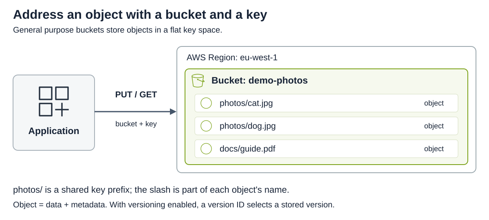
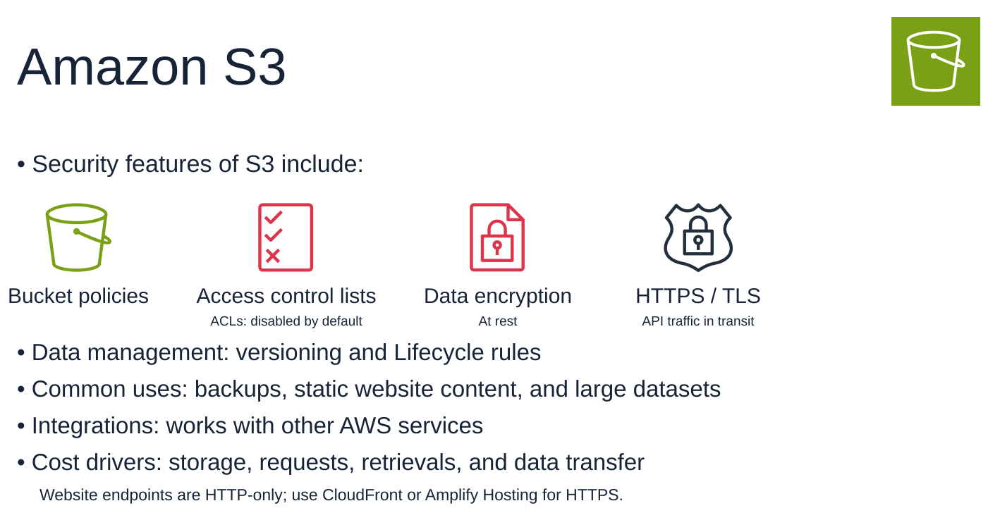

# Amazon S3

[Back to AWS](../Readme.md#content)

**Amazon Simple Storage Service (Amazon S3) stores data as objects in buckets.** It is part of Amazon Web Services (AWS), used for backups, static website content, archives, and large datasets. This article covers the object model, consistency, storage durability, request scaling, and controls for access and data protection. Unless stated otherwise, it describes **general purpose buckets**; specialized bucket types have different capabilities.

## Buckets, objects, and Regions

A **bucket** is a container created in an AWS Region. An **object** contains data and metadata, such as its content type. Its **key** identifies it within the bucket; with versioning enabled, a version ID identifies a particular stored version.

General purpose buckets have a **flat key space**. For example, `photos/cat.jpg` is one complete key. The `photos/` prefix groups related keys, and the console displays it like a folder, but it is not a filesystem directory.

The diagram shows one application addressing objects by bucket and key. `PUT` uploads an object; `GET` reads it. Both photo keys share a prefix; they remain separate objects in the same bucket.

S3 stores the data in the selected Region. It does not automatically copy your objects to another Region; that requires an explicit transfer or replication configuration.

## Consistency

**S3 provides strong read-after-write consistency for object writes and deletes in every AWS Region.** After a successful `PUT`, a subsequent `GET` returns the written data and `LIST` reflects the change. This also applies to overwrites and deletes; applications do not need to wait for replicas to catch up before reading a completed object write.

Updates to a single key are atomic: a concurrent reader sees the old or new object, never a partly written object. This does not create a transaction across multiple keys. Some bucket configuration changes still propagate asynchronously; AWS recommends waiting 15 minutes after first enabling versioning before issuing object writes or deletes.

## Durability, availability, and storage classes

**Durability** concerns keeping data intact over time. **Availability** concerns being able to access it when needed. A durable object can temporarily be unavailable.

S3 Standard stores data redundantly across at least three Availability Zones in a Region. An **Availability Zone (AZ)** consists of one or more discrete data centers. S3 checks data integrity and repairs lost redundancy. Multi-AZ storage is not a backup in another Region.

The following are **design targets**, not promises that every request succeeds:

| Storage class | Designed availability | AZs |
| --- | --- | --- |
| S3 Standard | 99.99% | At least 3 |
| S3 Intelligent-Tiering | 99.9% | At least 3 |
| S3 Standard-IA (Infrequent Access) | 99.9% | At least 3 |
| S3 One Zone-IA | 99.5% | 1 |
| S3 Glacier Instant Retrieval | 99.9% | At least 3 |
| S3 Glacier Flexible Retrieval | 99.99% after restoration | At least 3 |
| S3 Glacier Deep Archive | 99.99% after restoration | At least 3 |

All seven classes are designed for **99.999999999% annual object durability — eleven nines**. One Zone-IA does not protect against physical loss of its AZ. S3 Express One Zone is another single-AZ class, used with directory buckets; not all S3 storage spans multiple AZs.

Glacier Flexible Retrieval and Deep Archive require restoration before their data can be read. High durability therefore does not imply immediate retrieval.

## Request scaling

S3 automatically scales request capacity. AWS documents **at least 3,500 `PUT`/`COPY`/`POST`/`DELETE` or 5,500 `GET`/`HEAD` requests per second per partitioned prefix**. These are achievable baseline rates, not fixed ceilings.

There is no limit on the number of prefixes. Parallel requests across multiple prefixes can increase throughput. Scaling is gradual, so a sudden traffic increase can cause temporary `503 Slow Down` responses. Encryption with AWS Key Management Service (AWS KMS) can also make KMS request quotas relevant.

## Versioning and Lifecycle

**S3 Versioning** keeps multiple versions under the same key, helping recover from accidental overwrites, deletions, and application failures. With versioning enabled, simultaneous writes to one key are retained as separate versions.

| Bucket state | Meaning |
| --- | --- |
| Unversioned | Default; versioning has never been enabled. |
| Versioning-enabled | Writes receive distinct version IDs. |
| Versioning-suspended | Existing versions remain, but new writes use a `null` version ID and can replace an existing null version. |

After enabling versioning, you can suspend it but cannot return the bucket to the unversioned state. Objects already present retain their `null` version IDs; subsequent writes create new versions with distinct IDs.

In a versioning-enabled bucket, deleting a key **without a version ID** adds a **delete marker** as its current version. Ordinary reads then behave as if the object is deleted, while older versions remain retrievable. Removing the marker can restore access. Deleting a specific version ID permanently removes that version if permissions and retention controls allow it.

Each retained version consumes storage. **S3 Lifecycle** rules can transition objects to other storage classes or expire them. Separate rules can permanently remove noncurrent versions, so versioning does not guarantee that every past version remains forever.

## Amazon S3 security

The overview groups S3's permission controls, encryption at rest, and protection in transit. Its lower rows connect these controls to data management, common uses, integrations, and costs.

### IAM policies, bucket policies, and ACLs

**AWS Identity and Access Management (IAM)** defines permissions for identities such as users and roles. **Access control lists (ACLs)** are an older S3 permission mechanism.

| Mechanism | Where it is attached | Main question it answers |
| --- | --- | --- |
| IAM identity policy | User, group, or role | What may this identity do across AWS resources? |
| S3 bucket policy | A bucket; statements can target the bucket and its objects | Which principals may access these resources, and under what conditions? |
| S3 ACL | An individual bucket or object | Which AWS accounts or predefined groups receive the supported grants? |

**Both IAM and bucket policies can control object access**, including access to keys under a prefix. Bucket policies support cross-account access and have a 20 KB size limit. ACLs offer a narrower permission model; exceeding a policy-size limit is not a reason by itself to adopt ACLs.

For new buckets, **Object Ownership defaults to Bucket owner enforced**: ACLs are disabled, the bucket owner owns all objects, and policies control access. AWS recommends keeping ACLs disabled for most workloads. The older behavior in which an uploading account owns its objects applies when the **Object writer** ownership setting is selected.

Requests are denied unless the applicable authorization rules allow them. An explicit deny overrides an allow; it is inaccurate to say that S3 simply picks the “most restrictive policy.” Direct cross-account access typically needs permission from both the identity's account and the bucket's account. Other applicable controls can further restrict access.

**S3 Block Public Access** is enabled by default for new buckets. It can reject public access even when a bucket policy or ACL would otherwise grant it.

### Encryption

- **At rest:** S3 automatically encrypts new object uploads with server-side encryption using S3-managed keys (SSE-S3) as its base encryption level. Other configurations include AWS KMS keys.
- **In transit:** use HTTPS with Transport Layer Security (TLS). A bucket policy can deny requests that do not use secure transport. Encryption does not replace access permissions.

## Static websites and CORS

An S3 **website endpoint supports Hypertext Transfer Protocol (HTTP) only** and serves publicly readable content. This restriction does not apply to S3's application programming interface (API) endpoints, which support HTTPS, the secure form of HTTP. To serve website content over HTTPS, use AWS Amplify Hosting or Amazon CloudFront.

**Cross-Origin Resource Sharing (CORS)** lets a browser read permitted responses from a different origin, such as a page at `https://app.example.com` requesting an object from an S3 domain.

An S3 CORS configuration specifies allowed origins, methods, and headers. **CORS does not grant S3 permissions or make a bucket public**; the request must still satisfy the applicable access policies and other authorization controls.

## S3 Select

**S3 Select is no longer available to new customers; existing customers can continue using it.** It applies a subset of Structured Query Language (SQL) to **one object per request**, returning only matching data to reduce transfer volume and retrieval work.

Supported inputs include CSV (comma-separated values), JSON (JavaScript Object Notation), and Apache Parquet. CSV and JSON objects can use GZIP or BZIP2 compression; results are CSV or JSON. Server-side encrypted objects are supported, subject to the required permissions and encryption settings.

Existing customers can use the console, AWS Command Line Interface (AWS CLI), AWS software development kits (SDKs), or the `SelectObjectContent` API. The console returns at most 40 MB; use the CLI or API for larger results. The caller needs `s3:GetObject` permission.

## Object Lock

**S3 Object Lock protects individual object versions using a write-once-read-many (WORM) model.** It requires a versioning-enabled bucket. Once enabled for a bucket, Object Lock cannot be disabled and versioning cannot be suspended.

- **Retention period:** fixed retention protects a version until a specified date. Variable retention uses an event hold, with the retention end date determined when that hold is released.
- **Legal hold:** protects a version until an authorized user explicitly removes the hold. It is independent of retention periods.

| Retention mode | Protection |
| --- | --- |
| Governance | A user can bypass retention only with `s3:BypassGovernanceRetention` and an explicit `x-amz-bypass-governance-retention:true` request header. |
| Compliance | No user, including the account root user, can overwrite or delete a protected version during retention; the mode cannot be changed and the period cannot be shortened. |

New versions and delete markers can still be created for the same key. The locked version remains protected. Bypassing governance retention does not remove a legal hold.

AWS documents a Cohasset assessment of Object Lock for environments subject to SEC 17a-4, CFTC, and FINRA rules.

## Integrations and cost

S3 integrates with other AWS services. For example, object event notifications can trigger AWS Lambda processing or publish to Amazon Simple Notification Service (SNS) and Amazon Simple Queue Service (SQS).

Costs depend on stored data and storage class, requests, applicable retrieval and data-transfer charges, and optional management features. Versioning adds storage for retained versions; some classes also have minimum storage-duration charges.

# Sources

- [AWS: What is Amazon S3? — objects, Regions, and consistency](https://docs.aws.amazon.com/AmazonS3/latest/userguide/Welcome.html)
- [AWS: Naming Amazon S3 objects — keys and prefixes](https://docs.aws.amazon.com/AmazonS3/latest/userguide/object-keys.html)
- [AWS: Data protection — durability and Availability Zones](https://docs.aws.amazon.com/AmazonS3/latest/userguide/DataDurability.html)
- [AWS: Comparing S3 storage classes](https://docs.aws.amazon.com/AmazonS3/latest/userguide/storage-class-intro.html#sc-compare)
- [AWS: Optimizing Amazon S3 performance](https://docs.aws.amazon.com/AmazonS3/latest/userguide/optimizing-performance.html)
- [AWS: Retaining multiple versions with S3 Versioning](https://docs.aws.amazon.com/AmazonS3/latest/userguide/Versioning.html)
- [AWS: Deleting object versions](https://docs.aws.amazon.com/AmazonS3/latest/userguide/DeletingObjectVersions.html)
- [AWS: Managing the lifecycle of objects](https://docs.aws.amazon.com/AmazonS3/latest/userguide/object-lifecycle-mgmt.html)
- [AWS: Access control in Amazon S3](https://docs.aws.amazon.com/AmazonS3/latest/userguide/access-management.html)
- [AWS: Object Ownership and disabling ACLs](https://docs.aws.amazon.com/AmazonS3/latest/userguide/about-object-ownership.html)
- [AWS: IAM policy evaluation — allows and denies](https://docs.aws.amazon.com/IAM/latest/UserGuide/reference_policies_evaluation-logic_policy-eval-denyallow.html)
- [AWS: Cross-account policy evaluation](https://docs.aws.amazon.com/IAM/latest/UserGuide/reference_policies_evaluation-logic-cross-account.html)
- [AWS: Blocking public access to S3 storage](https://docs.aws.amazon.com/AmazonS3/latest/userguide/access-control-block-public-access.html)
- [AWS: Default encryption FAQ](https://docs.aws.amazon.com/AmazonS3/latest/userguide/default-encryption-faq.html)
- [AWS: Encryption in transit](https://docs.aws.amazon.com/AmazonS3/latest/userguide/UsingEncryptionInTransit.html)
- [AWS: Website endpoints and HTTPS options](https://docs.aws.amazon.com/AmazonS3/latest/userguide/WebsiteEndpoints.html)
- [AWS: Using CORS](https://docs.aws.amazon.com/AmazonS3/latest/userguide/cors.html)
- [AWS: Querying data with S3 Select](https://docs.aws.amazon.com/AmazonS3/latest/userguide/selecting-content-from-objects.html)
- [AWS: Locking objects with Object Lock](https://docs.aws.amazon.com/AmazonS3/latest/userguide/object-lock.html)
- [AWS: Managing Object Lock](https://docs.aws.amazon.com/AmazonS3/latest/userguide/object-lock-managing.html)
- [AWS: S3 event notifications and destinations](https://docs.aws.amazon.com/AmazonS3/latest/userguide/EventNotifications.html)
- [AWS: Billing reports and S3 charge categories](https://docs.aws.amazon.com/AmazonS3/latest/userguide/aws-billing-reports.html)
- [AWS Architecture Icons](https://aws.amazon.com/architecture/icons/) — official July 31, 2026 SVG package; S3 service, Bucket, Object, IAM Permissions, Encrypted Data, SSL padlock, and Generic Application artwork. Original vector geometry and colors are preserved in the local diagrams; the overview uses a flat background without gradients or blue corners.
