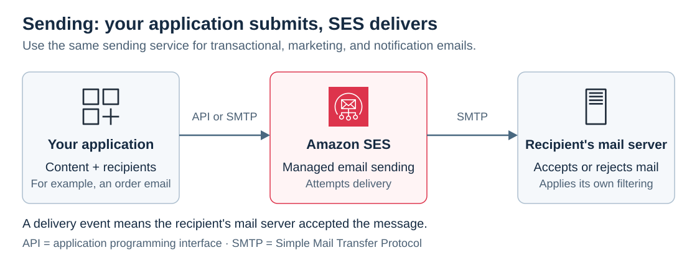
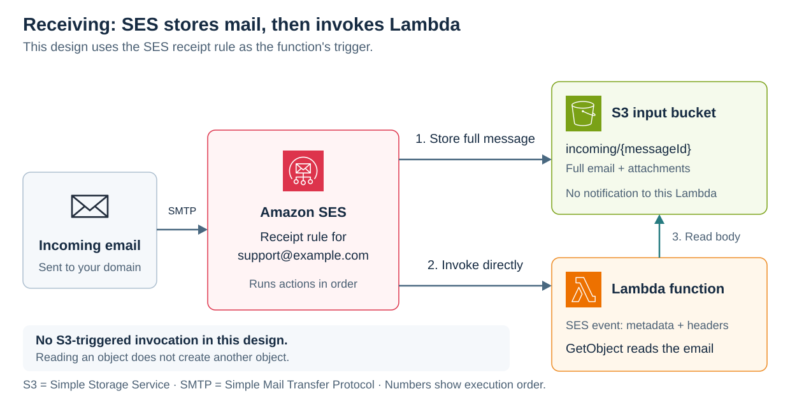

# Amazon Simple Email Service (SES)

[Back to AWS](../Readme.md#content)

**Amazon Simple Email Service (SES) is a managed service for sending and receiving email using your own email addresses and domains.** It handles email infrastructure so you do not have to operate your own mail servers. For sending, your application supplies the message; for receiving, you define how SES filters and processes incoming mail.

## Sending and use cases

- **Transactional messages:** order confirmations and password resets triggered by a customer's action.
- **Marketing emails:** offers and campaigns sent to customers.
- **Notifications:** timely updates from an application.
- **Bulk communications:** newsletters and other messages sent to many recipients.

Applications send through the SES **application programming interface (API)** or **Simple Mail Transfer Protocol (SMTP)** interface. The console is useful for test messages. Read the diagram from left to right: your application submits a message, and SES attempts delivery to the recipient's mail server.

### Sending controls

You must verify the email address or domain used as your sending identity. New accounts start in a **sandbox**, separately in each AWS Region: recipients must also be verified, except for SES mailbox simulator addresses. Production access removes this recipient restriction; sender verification still applies.

SES supports **Sender Policy Framework (SPF)**, **DomainKeys Identified Mail (DKIM)**, and **Domain-based Message Authentication, Reporting and Conformance (DMARC)**. These mechanisms help receiving systems check whether mail is authorized to use a domain; DMARC requires alignment of the visible From domain with a passing SPF or DKIM check.

Outbound mail uses shared **Internet Protocol (IP)** addresses by default. Dedicated IP addresses are available in standard or managed form. **Bring Your Own IP (BYOIP)** can reuse an eligible address range you own with standard dedicated IPs.

For delivery and engagement reporting, a **configuration set** selects which sending events to publish and where to publish them. Events include deliveries, bounces, complaints, opens, and clicks; destinations include Amazon CloudWatch, Amazon Simple Notification Service (SNS), and Amazon Data Firehose. A delivery event means the recipient's mail server accepted the email; it does not confirm inbox placement.

## Email receiving

SES can receive mail for your domains in supported AWS Regions. Before using receipt rules, verify the domain, publish a **mail exchanger (MX) record** in the **Domain Name System (DNS)** pointing to the Region's SES receiving endpoint, and grant SES permission to use the resources required by your actions.

SES receiving is designed for processing mail through AWS services. It does not provide the mailbox-access servers that a desktop email client uses to read an inbox.

### Recipient-based control: receipt rules

A **receipt rule** combines optional recipient conditions with an ordered list of actions. Conditions match the **SMTP envelope recipients**—the addresses supplied during mail delivery—not the message's visible `To:` or `Cc:` headers, and not the sender's address.

For example, a condition can match `support@example.com` or all addresses in `example.com`. A rule with no recipient conditions applies to all recipients in your verified domains. If no rule accepts the recipient, SES blocks the email rather than accepting it and silently deleting it.

Rules belong to a **rule set**. Only one set is active in a Region at a time. SES evaluates its rules in your chosen order and executes each matching rule's actions in order. Matching one rule does not automatically stop later rules; use a Stop action when that is intended.

### IP-based control: allow and block filters

IP filters allow or block incoming mail by its originating IP address or address range, during the SMTP conversation. They act before receipt-rule actions and do not inspect message content.

SES also uses its own block list of known spam sources. An explicit allow filter can permit mail from an address on that list. To accept only known sources, AWS documents a block filter for `0.0.0.0/0` together with allow filters for trusted addresses.

The default restriction on **Amazon Elastic Compute Cloud (EC2)** outbound port 25 traffic is a separate sending restriction. It is not a blanket SES receiving rule that rejects all mail originating from EC2.

### Spam, viruses, and authentication

SES checks incoming email authentication and can scan message content for spam and malware when scanning is enabled for the receipt rule. It exposes the results to your processing logic, including spam and virus verdicts.

**Receiving scan results do not automatically reject the message.** Your logic must decide what to do with a failed verdict. For example, a synchronously invoked Lambda function can inspect the results and stop further rule processing.

## Receipt-rule actions

| Action | What it does |
| --- | --- |
| **Deliver to Amazon Simple Storage Service (S3)** | Stores the email, including its body and attachments. The default maximum message size is 40 MB, including headers. An optional SNS notification reports the delivery. |
| **Publish to SNS** | Publishes the complete email in a notification to an SNS topic. The maximum email size is 150 KB, including headers; larger messages bounce. |
| **Invoke AWS Lambda** | Runs your code. The event contains metadata and headers, but **not the message body**. Store the email in S3 first if the function needs its content. |
| **Return bounce response** | Rejects the email by sending a bounce response to its sender. |
| **Stop rule set** | Ends evaluation of the remaining actions and rules. It does not itself send a bounce response. |
| **Add header** | Adds a custom header to the received message, usually before another action. |
| **Integrate with Amazon WorkMail** | Passes processing to WorkMail. WorkMail normally configures this integration for you. |

**An SNS action and an optional SNS notification are different:** the SNS action includes the email content; notifications attached to other actions contain information about the email, not its body.

## Example: archive and process support mail

**In this example, SES invokes Lambda directly.** Configure the receipt rule for `support@example.com` with an S3 action followed by a Lambda action. Do not also configure an S3 event notification to invoke that processing function for the same incoming objects.

Set the S3 action's object key prefix to `incoming/`. Configure the function with the same bucket and prefix; it uses `ses.mail.messageId` from the SES event to read `incoming/{messageId}` with `GetObject`. The diagram shows both SES actions separately and the function's read request.

If the function must control subsequent receipt actions, invoke it synchronously using `RequestResponse`. It can return `CONTINUE`, `STOP_RULE` (skip the current rule's remaining actions), or `STOP_RULE_SET` (skip all remaining rules and actions). An asynchronous invocation can process mail but cannot directly control that ongoing rule evaluation.

### What would trigger Lambda again?

**Creating an S3 object invokes Lambda only when a matching event notification is configured.** A `GetObject` call reads an existing object; it does not create one or emit an `ObjectCreated` notification.

Choose one invocation path for the same processing function:

| Design | Configuration |
| --- | --- |
| **SES invokes Lambda — shown above** | SES stores the email, then invokes the function through its Lambda receipt action. No S3 notification invokes that function for these objects. |
| **S3 invokes Lambda — alternative** | SES stores the email. An S3 `ObjectCreated` notification filtered to `incoming/` invokes the function. Omit the SES Lambda action for that processor; the function receives an S3 event with a bucket and object key. |

Enabling both paths would process the same arrival through two triggers. In the S3-triggered alternative, a loop can occur if Lambda writes another object that matches its own trigger. Save output in a separate bucket, or in a prefix such as `processed/` while the notification matches only `incoming/`.

Even with one trigger, asynchronous delivery can repeat an event. Make processing **idempotent**: use the SES message ID or S3 object key to recognize an already processed email so a retry does not create a second support ticket.

# Sources

- [AWS — What is Amazon SES?](https://docs.aws.amazon.com/ses/latest/dg/Welcome.html)
- [AWS — Set up email sending](https://docs.aws.amazon.com/ses/latest/dg/send-email.html)
- [AWS — Sandbox restrictions and production access](https://docs.aws.amazon.com/ses/latest/dg/request-production-access.html)
- [AWS — SPF, DKIM, and DMARC authentication](https://docs.aws.amazon.com/ses/latest/dg/send-email-authentication-dmarc.html)
- [AWS — Dedicated IP addresses](https://docs.aws.amazon.com/ses/latest/dg/dedicated-ip.html) and [Bring Your Own IP](https://docs.aws.amazon.com/ses/latest/dg/dedicated-ip-byo.html)
- [AWS — Monitor sending with event publishing](https://docs.aws.amazon.com/ses/latest/dg/monitor-using-event-publishing.html)
- [AWS — Email receiving](https://docs.aws.amazon.com/ses/latest/dg/receiving-email.html), [setup prerequisites](https://docs.aws.amazon.com/ses/latest/dg/receiving-email-setting-up.html), and [MX records](https://docs.aws.amazon.com/ses/latest/dg/receiving-email-mx-record.html)
- [AWS — Receiving concepts, filtering, and scan verdicts](https://docs.aws.amazon.com/ses/latest/dg/receiving-email-concepts.html)
- [AWS — Receipt rules and recipient conditions](https://docs.aws.amazon.com/ses/latest/dg/receiving-email-receipt-rules-console-walkthrough.html)
- [AWS — IP address filters](https://docs.aws.amazon.com/ses/latest/dg/receiving-email-ip-filtering-console-walkthrough.html)
- [AWS — S3 action](https://docs.aws.amazon.com/ses/latest/dg/receiving-email-action-s3.html), [SNS action and notification types](https://docs.aws.amazon.com/ses/latest/dg/receiving-email-action-sns.html), and [Lambda action](https://docs.aws.amazon.com/ses/latest/dg/receiving-email-action-lambda.html)
- [AWS — Bounce action](https://docs.aws.amazon.com/ses/latest/dg/receiving-email-action-bounce.html), [Stop action](https://docs.aws.amazon.com/ses/latest/dg/receiving-email-action-stop.html), [Add header action](https://docs.aws.amazon.com/ses/latest/dg/receiving-email-action-add-header.html), and [WorkMail action](https://docs.aws.amazon.com/ses/latest/dg/receiving-email-action-workmail.html)
- [AWS — SES message IDs and notification contents](https://docs.aws.amazon.com/ses/latest/dg/receiving-email-notifications-contents.html)
- [AWS — S3 event notifications, Lambda invocation, and recursive loops](https://docs.aws.amazon.com/lambda/latest/dg/with-s3.html)
- [AWS — GetObject retrieves an existing S3 object](https://docs.aws.amazon.com/AmazonS3/latest/API/API_GetObject.html)
- [AWS — Filter S3 notifications by object key prefix](https://docs.aws.amazon.com/AmazonS3/latest/userguide/notification-how-to-filtering.html)
- [AWS — Asynchronous Lambda retries and duplicate events](https://docs.aws.amazon.com/lambda/latest/dg/invocation-async-error-handling.html)
- [AWS Architecture Icons — official SVG artwork used in both diagrams](https://aws.amazon.com/architecture/icons/)
