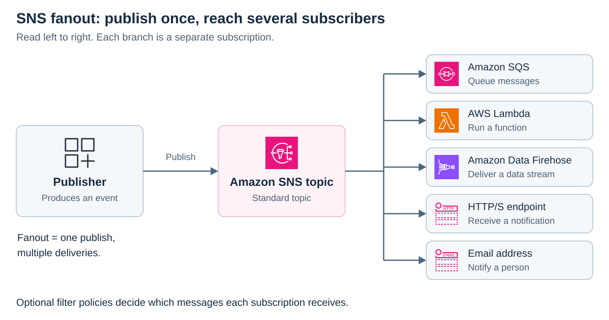
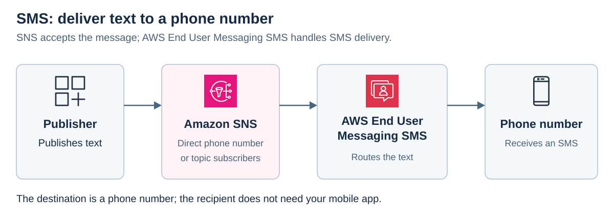
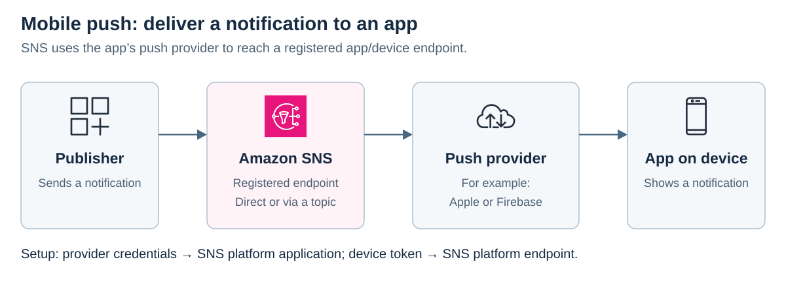

# Amazon Simple Notification Service (SNS)

<sub>[Back to AWS](../Readme.md#content)</sub>

**Amazon Simple Notification Service (Amazon SNS) is a fully managed publish/subscribe service that pushes messages from publishers to subscribers.** It supports application-to-application (A2A) messaging and application-to-person (A2P) notifications. The central idea is to publish once and let SNS distribute the message to interested recipients.

The sections below cover topics and fanout, SMS and mobile push, message sizes, filtering, and delivery retries.

## Publish/subscribe and fanout

A **publisher** produces a message. A **topic** is the named communication channel it publishes to. A **subscription** connects a topic to an **endpoint**, such as a queue, function, or email address. Publishers and subscribers do not need to communicate directly.

**Fanout** means that SNS sends a copy of a published message to each matching subscription. Read the diagram from left to right: one publish can cause several independent deliveries.



- **A2A:** deliver to Amazon Simple Queue Service (Amazon SQS) queues, AWS Lambda functions, Amazon Data Firehose delivery streams, or HTTP/S endpoints. For example, an order event can go to separate fulfillment and analytics queues.
- **A2P:** notify people through email, Short Message Service (SMS) texts, or mobile push notifications.

The diagram shows a **Standard topic**, which supports all SNS delivery protocols. Standard topics can deliver duplicates and do not guarantee ordering. First-in, first-out (**FIFO**) topics add ordering within message groups and deduplication; their subscriber options differ. Choose the topic type according to the required delivery behavior.

## SMS: send a text to a phone number

SNS can send directly to a phone number or to the phone numbers subscribed to a topic. The `Publish` operation uses `PhoneNumber` for direct SMS or `TopicArn` for a topic. An Amazon Resource Name (**ARN**) identifies an AWS resource.

SNS uses **AWS End User Messaging SMS** to deliver the text through the SMS network. The destination is a phone number, so the recipient does not need your mobile app.



For example, an application can send an order confirmation directly to the customer's phone number. SMS has encoding-dependent segment limits; SNS can split a longer text into multiple SMS messages.

## Mobile push: notify an installed app

Mobile push addresses an app on a device through a push provider, such as **Apple Push Notification service (APNs)** or **Firebase Cloud Messaging (FCM)**. SNS also documents Amazon Device Messaging, Baidu Cloud Push, and Windows push integrations.

A **platform application** in SNS holds the provider credentials. A **platform endpoint** represents an app/device registration and is created using its **device token**, the identifier supplied by the push provider. The diagram shows the delivery path after this setup.



Publish directly to the endpoint ARN through `TargetArn`, or subscribe that endpoint to a topic. SNS passes the notification to the push provider, which delivers it to the app/device. Notifications can appear as alerts, badge updates, or sounds. For example, a sports app can notify a user about a new score.

## Message sizes and large payloads

| Item | What it means |
| --- | --- |
| Normal SNS message | At most **256 KiB (262,144 bytes)**, except SMS. This is a byte limit, not a character limit; message attributes also count. |
| **64 KB** chunks | A **Standard-topic billing unit**. A single 256 KB publish is billed as four requests; it is not split into four subscriber messages for that reason. FIFO metering differs. |
| Extended client payload | The SNS Extended Client Libraries for **Java and Python** support payloads up to **2 GB** by storing the data in Amazon S3 and publishing an S3 object reference. |

The extended client does not raise SNS's native message limit. A compatible consumer must retrieve the referenced object from S3 to obtain the original payload.

## Message filtering

A **filter policy** is a JavaScript Object Notation (JSON) object attached to a subscription. Without one, the subscription receives every message published to its topic. With one, SNS delivers only messages that match the policy.

`FilterPolicyScope` selects what SNS examines:

- `MessageAttributes` (default): metadata sent alongside the message body.
- `MessageBody`: fields in the message body, which must be a well-formed JSON object.

For example, a fulfillment subscription can set `FilterPolicyScope` to `MessageBody` and use this policy:

```json
{
  "eventType": ["OrderPlaced"]
}
```

It accepts `{"eventType":"OrderPlaced","orderId":"123"}` and rejects `{"eventType":"OrderCancelled","orderId":"123"}`. The extra `orderId` field does not affect this policy. Other subscriptions can apply different policies to the same topic. Filter changes can take up to **15 minutes** to fully take effect.

## Delivery retries and dead-letter queues

SNS uses a delivery policy for each protocol to retry eligible delivery failures. **Only HTTP/S supports custom retry policies**, configured at topic or subscription level. These policies control retry counts and the delays between retries (**backoff**), including minimum/maximum delays and **linear, arithmetic, geometric, or exponential** patterns. The total HTTP/S retry time cannot exceed **3,600 seconds**.

An optional **dead-letter queue (DLQ)** is an SQS queue attached to an SNS **subscription**. It holds messages that SNS cannot deliver, including failures after retries are exhausted, for later analysis or reprocessing. Without a DLQ, SNS discards messages when delivery fails permanently. A filter mismatch is a decision not to deliver, rather than a delivery failure.

## Scale and integration boundaries

- **Large fanout:** AWS lists a default quota of **12.5 million subscriptions per Standard topic**. Publishing throughput and other quotas depend on the Region and resource type.
- **Routing:** subscriptions and filter policies determine recipients using message attributes or JSON message bodies.
- **External services:** SNS can deliver to compatible HTTP/S endpoints. It can also deliver through Data Firehose to supported third-party destinations such as Datadog, MongoDB, and Splunk.
- **Workflows:** Step Functions is not an SNS subscription protocol. To start a workflow from an SNS message, an intermediary such as a Lambda function can call `StartExecution`. The documented Step Functions → SNS integration works in the other direction: a workflow publishes a message to SNS.

# Sources

- [AWS — What is Amazon SNS?](https://docs.aws.amazon.com/sns/latest/dg/welcome.html)
- [AWS — Amazon SNS features and capabilities](https://docs.aws.amazon.com/sns/latest/dg/welcome-features.html)
- [AWS — Publish API: destinations and message limits](https://docs.aws.amazon.com/sns/latest/api/API_Publish.html)
- [AWS — Mobile text messaging with Amazon SNS](https://docs.aws.amazon.com/sns/latest/dg/sns-mobile-phone-number-as-subscriber.html)
- [AWS — Sending mobile push notifications with Amazon SNS](https://docs.aws.amazon.com/sns/latest/dg/sns-mobile-application-as-subscriber.html)
- [AWS — Amazon SNS message attributes](https://docs.aws.amazon.com/sns/latest/dg/sns-message-attributes.html)
- [AWS — Amazon SNS pricing: payload metering](https://aws.amazon.com/sns/pricing/)
- [AWS — Publishing large messages with Amazon SNS and Amazon S3](https://docs.aws.amazon.com/sns/latest/dg/large-message-payloads.html)
- [AWS — Amazon SNS message filtering](https://docs.aws.amazon.com/sns/latest/dg/sns-message-filtering.html)
- [AWS — Subscription filter policies](https://docs.aws.amazon.com/sns/latest/dg/sns-subscription-filter-policies.html)
- [AWS — Amazon SNS message delivery retries](https://docs.aws.amazon.com/sns/latest/dg/sns-message-delivery-retries.html)
- [AWS — Amazon SNS dead-letter queues](https://docs.aws.amazon.com/sns/latest/dg/sns-dead-letter-queues.html)
- [AWS — Amazon SNS endpoints and quotas](https://docs.aws.amazon.com/general/latest/gr/sns.html)
- [AWS — Subscribe API: supported protocols](https://docs.aws.amazon.com/sns/latest/api/API_Subscribe.html)
- [AWS — Fanout to Data Firehose delivery streams](https://docs.aws.amazon.com/sns/latest/dg/sns-firehose-as-subscriber.html)
- [AWS — Publish messages to SNS with Step Functions](https://docs.aws.amazon.com/step-functions/latest/dg/connect-sns.html)
- [AWS — Step Functions StartExecution API](https://docs.aws.amazon.com/step-functions/latest/apireference/API_StartExecution.html)
- [AWS Architecture Icons — official SVG artwork used in the diagrams](https://aws.amazon.com/architecture/icons/)
