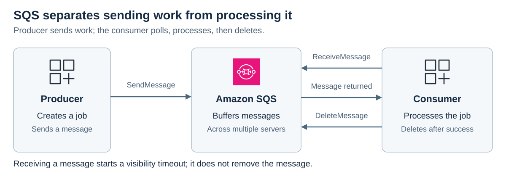
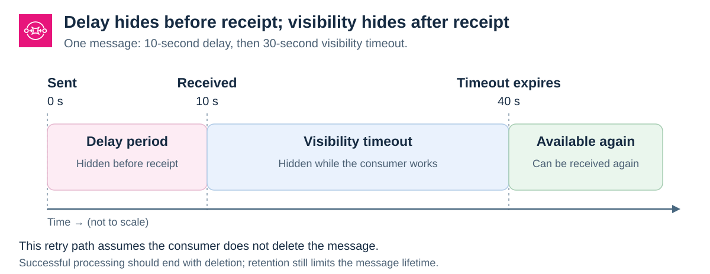
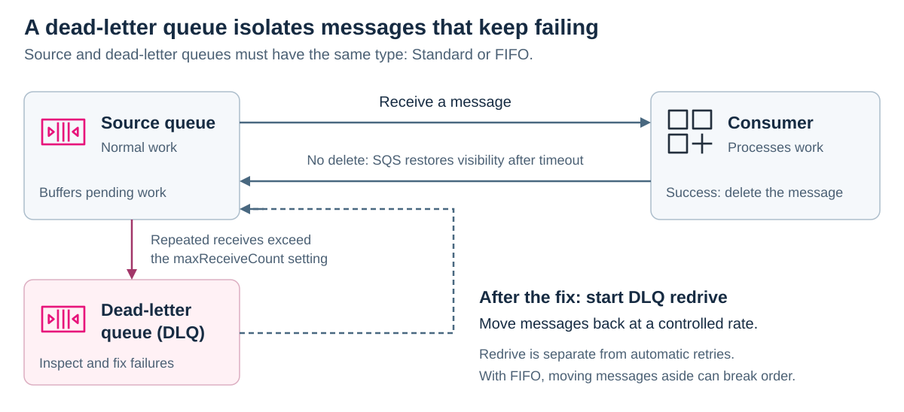

# Amazon Simple Queue Service (SQS)

[Back to AWS](../Readme.md#content)

**Amazon Simple Queue Service (SQS) is a managed message queue that decouples producers from consumers.** A producer can submit work while consumers are busy or unavailable; SQS buffers the messages until consumers receive them or their retention period expires. This article covers queue types, message timing, failure handling, quotas, and large payloads.

## Producers, queues, and consumers

A **producer** sends a message describing work or an event. The **queue** stores it redundantly across SQS servers. A **consumer** polls the queue, processes the returned message, and deletes it after successful processing. Multiple producers and consumers can use the same queue.

Read the diagram from the producer toward the consumer. The consumer sends both the receive request and the later delete request; receiving a message alone does not remove it.

For example, an image-upload service can enqueue a resizing job while background workers process earlier uploads. The queue separates accepting work from completing it.

## Standard and FIFO queues

SQS has **two queue types**: Standard and first-in, first-out (**FIFO**). A **dead-letter queue (DLQ)** is a queue configured to hold messages that repeatedly fail processing; it uses one of these two types.

| Property | Standard | FIFO |
| --- | --- | --- |
| Delivery | At least once; duplicate deliveries can occur | SQS deduplicates repeated sends within a five-minute deduplication interval |
| Ordering | Best effort; messages can arrive out of order | Strict ordering within each `MessageGroupId` |
| Throughput | Very high, nearly unlimited API calls per second | Depends on throughput mode, batching, message groups, and Region |
| Typical fit | Independent background jobs that tolerate retries and reordering | Related operations that must stay in order |

A FIFO **message group** is an ordered stream within a queue. For example, using an order ID as `MessageGroupId` keeps that order's events together while different orders can be processed concurrently. A single group does not provide parallel processing of its messages.

AWS calls FIFO deduplication **exactly-once processing**. Configure an explicit `MessageDeduplicationId` or content-based deduplication, which hashes the message body, excluding attributes. Retrying a send with the same deduplication ID within five minutes does not enqueue another copy.

**Application work can still be retried if a consumer processes a message but fails to delete it before visibility expires.** Design processing to be **idempotent**: repeating the same job should not repeat its business effect. For example, use a job ID to detect an operation that has already completed.

### FIFO throughput

A **partition** is an internal portion of queue storage managed by SQS.

In non-high-throughput mode, each FIFO partition supports **300 transactions per second per API action** (`SendMessage`, `ReceiveMessage`, or `DeleteMessage`). Batches of ten allow up to **3,000 messages per second per action**.

High-throughput FIFO supports higher Region-dependent quotas. For example, US East (N. Virginia), US West (Oregon), and Europe (Ireland) support up to **70,000 requests per second per action**, or **700,000 messages per second with full batches**. Distribute work across message groups to use parallel capacity. The old “300 messages/s or 10 MB/s hard limit” is not the current service limit.

## Message size and retention

- **Native message size:** 1 byte to **1 MiB (1,048,576 bytes)**. The former 256 KiB maximum is outdated.
- **Retention:** default **4 days**, configurable from **1 minute to 14 days**. SQS automatically deletes messages when their retention period expires, even if they were never processed.
- **Stored backlog:** no quota on the number of queued messages awaiting receipt. Retention still limits how long they can remain.

Retention controls message lifetime. Delay and visibility settings control when a consumer can receive a message during that lifetime.

## Delay queues and visibility timeout

A **delay queue** postpones the first delivery of newly sent messages. A **visibility timeout** temporarily hides a message after a consumer receives it. Both keep messages in the queue.

The example below uses a 10-second delay and a 30-second visibility timeout. The first receive occurs at 10 seconds. If processing does not end with deletion, the message becomes available again at 40 seconds.

### Delay queues

Set the queue's `DelaySeconds` to delay new messages by **0 seconds to 15 minutes**; the default is **0**. This can postpone work until a downstream component is ready.

Changing a Standard queue's delay does not affect messages already queued. For FIFO queues, changing the queue delay also affects messages already in the queue.

### Visibility timeout

Receiving a message starts its visibility timeout. The queue default is **30 seconds**, with an allowed range of **0 seconds to 12 hours**. Choose enough time to process and delete the message; an excessively long timeout also delays retries after a failure.

Use `ChangeMessageVisibility` with `VisibilityTimeout` to extend or shorten the timeout for a received message. Setting it to `0` makes the message available again. Extensions cannot push the timeout beyond **12 hours from the original receive request**.

After success, call `DeleteMessage` using the **latest receipt handle**, the token returned by the most recent receive of that message. A message ID does not replace this handle. Some SDKs or integrations perform deletion for the application after successful processing.

For Standard queues, duplicate delivery remains possible even during the visibility timeout. With FIFO, SQS does not return more messages from a group while an earlier received batch from that group remains in flight. A failed message can be retried before later messages in its group proceed.

## In-flight messages

A message is **stored** after sending and before receipt. It is **in flight** while received but not yet deleted, during its visibility timeout. If that timeout expires without deletion, it becomes available for another receive. After successful deletion, it is removed from the queue.

| Queue type | In-flight quota | Behavior at the quota |
| --- | --- | --- |
| Standard | Approximately **120,000**, depending on traffic and backlog | Short polling returns `OverLimit`; long polling stops returning new messages without that error |
| FIFO | **120,000** | SQS does not return an error, but further processing can be constrained |

Delete successfully processed messages promptly, monitor the in-flight count, and scale processing or spread work across queues when needed. Quota increases can be requested through AWS Support. FIFO's older 20,000-message limit is outdated.

## Short and long polling

**Polling** means asking SQS for messages with `ReceiveMessage`. It is separate from the visibility timeout, which applies after receipt.

| Mode | Effective wait time | Behavior |
| --- | --- | --- |
| Short polling, the default | `0` seconds | Samples a subset of SQS servers and responds immediately; it can return empty even when messages exist |
| Long polling | `1–20` seconds | Queries all servers and waits for an available message or the wait time to expire |

The request's `WaitTimeSeconds` overrides the queue setting. If omitted, SQS uses the queue's `ReceiveMessageWaitTimeSeconds` attribute, whose default is `0`.

Long polling returns when messages become available; it does not always wait the full duration. It reduces empty and false-empty responses, which can lower request costs. An empty response is still possible, including when the in-flight quota prevents more receives.

## Dead-letter queues

A **poison-pill message** repeatedly fails processing, for example because its contents are invalid. A DLQ isolates such messages so they can be investigated without continually retrying them in the source queue.

Configure the source queue's **redrive policy** with a DLQ and `maxReceiveCount`, the receive threshold for moving a message aside. This counts receives, not application exceptions. Allow enough retries for temporary failures.

The diagram shows the retry path and the separate movement into and out of a DLQ.

Create the DLQ explicitly. Its type must match the source: **Standard → Standard** or **FIFO → FIFO**.

### Benefits and tradeoffs

- Alarm when the DLQ contains messages, inspect message contents and application logs, and check whether processing needs more time.
- Use a DLQ when repeated failures should be isolated. For a temporarily unavailable dependency, choose a retry policy that gives it time to recover.
- If messages must keep retrying in the source queue, a DLQ cutoff may be inappropriate. SQS still cannot retain a message indefinitely: the retention limit applies.
- A FIFO DLQ can break the intended end-to-end order by removing a failed operation and allowing later ones to proceed. Avoid this when skipping an operation would invalidate the sequence, such as ordered video-editing instructions.

For Standard queues, moving to a DLQ preserves the original enqueue timestamp; give the DLQ a longer retention period than the source. For FIFO queues, the enqueue timestamp resets on the move.

### Moving messages back

After fixing the cause, use **DLQ redrive** to move messages to their source queue or another queue of the same type. Start at a controlled rate so the destination can handle the returning work. Redriven messages receive a new message ID and retention period, and can interleave with newly produced messages.

## Regions, security, and costs

Queues belong to a Region and do not automatically share messages with queues in other Regions. This does not prevent an application in another Region from calling a queue's endpoint.

SQS does not charge for data transfer when sending or receiving messages with all resources in the same Region, including Amazon EC2 and AWS Lambda. Cross-Region and internet transfers use standard AWS data-transfer charges. Use the current pricing page for the target Region and queue features instead of assuming one universal rate.

**Server-side encryption** protects message bodies at rest using SQS-managed keys or AWS Key Management Service (KMS) keys. HTTPS protects data in transit. SQS encryption at rest does not cover message attributes or queue metadata. SQS requests, S3 use for large payloads, and KMS calls can each contribute to the bill.

## SQS Extended Client Library

For payloads up to **2 GB**, the Amazon SQS Extended Client Libraries for Java and Python store the payload in **Amazon S3** and place an **S3 reference in SQS**. The consumer's extended client retrieves the payload from S3. This supports both Standard and FIFO queues.

The Java library supports storing every payload in S3 or offloading only larger payloads. AWS's Java guide describes a **256 KB offloading threshold**; that library behavior is separate from SQS's current **1 MiB native message limit**. The extended libraries are for synchronous clients. Account for S3 storage and request costs as well as SQS costs.

# Sources

Official AWS documentation and resources, checked September 18, 2026:

- [What is Amazon SQS? — architecture and message lifecycle](https://docs.aws.amazon.com/AWSSimpleQueueService/latest/SQSDeveloperGuide/welcome.html)
- [Standard queues — delivery, ordering, and scaling](https://docs.aws.amazon.com/AWSSimpleQueueService/latest/SQSDeveloperGuide/standard-queues.html)
- [FIFO queues](https://docs.aws.amazon.com/AWSSimpleQueueService/latest/SQSDeveloperGuide/sqs-fifo-queues.html)
- [FIFO delivery logic — message groups, batches, and retries](https://docs.aws.amazon.com/AWSSimpleQueueService/latest/SQSDeveloperGuide/FIFO-queues-understanding-logic.html)
- [FIFO exactly-once processing and deduplication](https://docs.aws.amazon.com/AWSSimpleQueueService/latest/SQSDeveloperGuide/FIFO-queues-exactly-once-processing.html)
- [High-throughput FIFO — partitions and message-group distribution](https://docs.aws.amazon.com/AWSSimpleQueueService/latest/SQSDeveloperGuide/high-throughput-fifo.html)
- [Message quotas — size, retention, throughput, and timing](https://docs.aws.amazon.com/AWSSimpleQueueService/latest/SQSDeveloperGuide/quotas-messages.html)
- [Standard queue quotas](https://docs.aws.amazon.com/AWSSimpleQueueService/latest/SQSDeveloperGuide/quotas-queues.html)
- [FIFO queue quotas](https://docs.aws.amazon.com/AWSSimpleQueueService/latest/SQSDeveloperGuide/quotas-fifo.html)
- [Delay queues](https://docs.aws.amazon.com/AWSSimpleQueueService/latest/SQSDeveloperGuide/sqs-delay-queues.html)
- [Visibility timeout](https://docs.aws.amazon.com/AWSSimpleQueueService/latest/SQSDeveloperGuide/sqs-visibility-timeout.html)
- [DeleteMessage — receipt handles and retry safety](https://docs.aws.amazon.com/AWSSimpleQueueService/latest/APIReference/API_DeleteMessage.html)
- [Short and long polling](https://docs.aws.amazon.com/AWSSimpleQueueService/latest/SQSDeveloperGuide/sqs-short-and-long-polling.html)
- [Using dead-letter queues — retries, ordering, and retention](https://docs.aws.amazon.com/AWSSimpleQueueService/latest/SQSDeveloperGuide/sqs-dead-letter-queues.html)
- [Configuring a dead-letter queue — matching queue types](https://docs.aws.amazon.com/AWSSimpleQueueService/latest/SQSDeveloperGuide/sqs-configure-dead-letter-queue.html)
- [Configuring dead-letter queue redrive](https://docs.aws.amazon.com/AWSSimpleQueueService/latest/SQSDeveloperGuide/sqs-configure-dead-letter-queue-redrive.html)
- [Amazon SQS FAQs — Region independence and retry behavior](https://aws.amazon.com/sqs/faqs/)
- [Encryption at rest in Amazon SQS](https://docs.aws.amazon.com/AWSSimpleQueueService/latest/SQSDeveloperGuide/sqs-server-side-encryption.html)
- [Amazon SQS pricing — requests, data transfer, S3, and KMS](https://aws.amazon.com/sqs/pricing/)
- [Managing large messages with the Extended Client Libraries](https://docs.aws.amazon.com/AWSSimpleQueueService/latest/SQSDeveloperGuide/sqs-managing-large-messages.html)
- [Extended Client Library for Java — S3 offloading behavior](https://docs.aws.amazon.com/AWSSimpleQueueService/latest/SQSDeveloperGuide/sqs-s3-messages.html)
- [AWS Architecture Icons — official SVG artwork used in the diagrams](https://aws.amazon.com/architecture/icons/) — July 31, 2026 package; original icon geometry and colors preserved.
