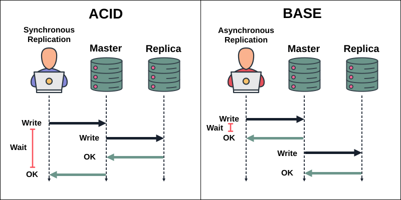
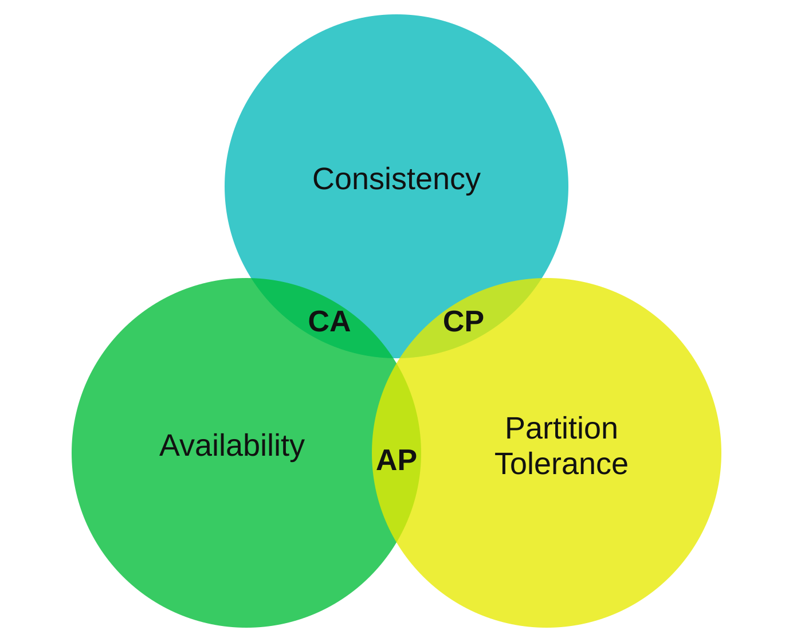

# ACID vs BASE

[Back to Computer Science](../Readme.md#content)

**ACID (Atomicity, Consistency, Isolation, Durability)** describes transaction guarantees.

**BASE (Basically Available, Soft state, Eventually consistent)** keeps services useful while allowing some data to converge later.

A system can combine them: a purchase can commit atomically in one database while its replicas or summary views catch up asynchronously.

First define the vocabulary, then compare when replicated writes return success and examine each ACID and BASE property. Next, use the CAP theorem — Consistency, Availability, Partition tolerance — to understand network failures. Finish by bringing the three ideas together to choose guarantees for different parts of one application.

## The vocabulary

- A **transaction** groups database operations into one unit. **Commit** accepts its changes; **rollback** cancels its transactional changes.
- An **invariant** is a rule that valid data must satisfy, such as “each order ID is unique.”
- A **replica** is another copy of data. **Replication** propagates changes between copies. The **primary**, labelled “Master” in the first diagram, accepts the writes in this example.
- **Local** guarantees apply within one database or transaction boundary. A guarantee about the whole distributed service must also account for communication between its nodes, or servers.

## Replication: when does the client receive success?

Read each panel from top to bottom: time moves down the dashed lines. Dark arrows carry writes, green arrows return acknowledgements (`OK`), and both brackets are labelled `Wait`. Compare the long bracket on the left with the short one on the right: the left client waits for replication, while the right client can receive success before replication completes. The lengths are schematic, not measured durations.

The drawing retains the reference's ACID and BASE headings; these illustrate a common comparison, **not a rule that ACID requires synchronous replication**.

**Synchronous replication, left:** the primary waits for the required replica acknowledgement before reporting success to the client. That adds a network round trip and a dependency on the replica. Systems can require selected replicas or a **quorum**, a required number of replicas; they need not wait for every copy.

**Asynchronous replication, right:** the primary can report success before the replica catches up. Reads from that replica may temporarily return old data. If the primary's storage is lost before replication completes, promoting the replica can lose acknowledged writes. Replication can start earlier than drawn; the defining feature is that the client response does not wait for it.

The meaning of a replica's `OK` matters: receiving a change, storing it durably, and applying it so queries can see it are different milestones. For example, PostgreSQL's `synchronous_commit = remote_apply` waits for visibility on the required synchronous standbys. Here, `synchronous_commit` is the setting and `remote_apply` is its value. A durable acknowledgement alone does not promise that every replica already serves the new value.

## ACID: four transaction properties

Consider a simplified transfer of 10 units between two accounts in the same database: A starts with 100, and B starts with 50. A successful transfer leaves A with 90 and B with 60.

### Atomicity — commit the whole transaction or none of it

The debit and credit form one transaction. If it cannot commit, neither change becomes part of the committed result. A failure after the debit must not leave only A reduced to 90.

Atomicity prevents a partially committed operation. It does not mean every transaction succeeds, or that other transactions cannot run at the same time.

The boundary matters: a database rollback does not automatically reverse an email already sent or a request already completed by another service.

### Consistency — preserve the rules that make the data valid

A correctly written transaction takes valid data to valid data. In this transfer, the combined balance remains 150. If overdrafts are forbidden, the application must also preserve that rule.

The database can enforce declared constraints, including unique keys, foreign keys, and checks on column values. Application code must implement business rules that those constraints do not express, with suitable isolation or locking when operations overlap.

ACID does not discover the intended business rules. Code that debits 10 and credits 9 can still commit atomically if nothing checks the missing unit. Here, **consistency means preserving invariants**, not making every replica identical at every instant.

### Isolation — control how concurrent transactions interact

Transactions can overlap in time without exposing arbitrary intermediate work to one another. The exact protection depends on the **isolation level**.

At **Serializable** isolation, committed results must match some execution of the transactions one at a time. Two simultaneous attempts to reserve the last item cannot both succeed if each transaction correctly checks and updates availability. The database may abort one transaction to prevent an invalid concurrent result.

In PostgreSQL, a **serialization failure** has SQLSTATE `40001` (`serialization_failure`). The application must retry the whole transaction, including the reads and decisions that determined its writes. Retrying only the failed statement is insufficient.

Weaker levels allow more interactions. For example, PostgreSQL's **Read Committed** level prevents reading another transaction's uncommitted changes, but two queries in one transaction can see different committed values. Therefore, “supports ACID transactions” does not establish that every transaction runs with serializable isolation.

### Durability — keep committed changes through supported failures

After a durable commit is acknowledged, the database can recover the accepted changes after a crash. The transfer should still be present after restart.

One mechanism is **write-ahead logging (WAL)**: persist a record of the changes before relying on modified data pages. Recovery can replay that log, so committing need not flush every changed page immediately.

Durability has a failure scope. A log on one disk cannot recover data after every copy of that disk's contents is destroyed. Storage settings, backups, and replication determine the failures the deployment can survive. Durability also does not prevent a later valid transaction from changing the same data.

For a concrete setting, PostgreSQL's `synchronous_commit = off` can report success before the transaction's WAL is flushed to durable storage. A crash can then lose recent acknowledged changes. The commit acknowledgement's meaning depends on the configured durability guarantees.

## BASE: three properties of an availability-oriented design

BASE is a broad design approach, not one transaction protocol or a fixed list of guarantees shared by every product.

Consider a product description replicated across two regions, **East** and **West**, with one replica in each for this example. A temporary delay in displaying an edited description may be acceptable, while the purchase itself needs stricter rules.

### Basically Available — keep useful operations working through partial failures

A failure in one component should not automatically make the entire service unusable. East might keep serving its local product descriptions while West is unreachable.

The service may return older data or offer reduced functionality, according to its contract. “Basically” is not a promise of 100% uptime, nor a precise equivalent of CAP's formal availability requirement. Identify which operations remain usable and what their responses promise.

### Soft state — a local view can change as background work catches up

A replica's current state need not be final when a client request ends. Delayed replication or reconciliation can change it without a new user action at that replica.

For example, West still shows the old product description after an edit in East. Later, the replication message arrives and West updates its copy. No second edit was necessary.

In this BASE sense, “soft” describes an evolving view; it does not require the authoritative data to exist only in memory or permit arbitrary data loss.

### Eventually consistent — converge once outstanding changes can be reconciled

If updates to an item stop, and communication and reconciliation can complete, the replicas eventually agree on its resolved value. During the intervening period, a read may see an older value.

The property alone gives no fixed deadline. It also does not automatically guarantee that a user immediately reads their own latest write; that is a separate **read-your-writes** guarantee.

Convergence needs a mechanism. Replication must deliver outstanding changes, and concurrent edits need a common resolution rule. “Wait long enough” cannot repair updates that were permanently lost. Agreeing on one final value also does not prove that every business invariant was preserved along the way.

## CAP theorem: what happens during a network partition?

This section reuses the CAP material and diagram from System Design's **Chapter 6: Design a Key-Value Store**, while qualifying its “two of three” and “CA cannot exist” shorthand: consistency and availability can coexist when partitions are excluded. The precise trade-off is: **during a network partition, a shared read/write service cannot guarantee both linearizable consistency and availability for every request.**

- **C — Consistency:** operations behave as if they use one up-to-date copy. More precisely, **linearizability** makes each operation appear to happen at one instant between its request and response, respecting real-time order. With no intervening write, a read started after a successful write must see that write.
- **A — Availability:** every request received by a non-failing node eventually completes with the operation's result. Rejecting a valid read merely because peers are unreachable does not satisfy this guarantee. CAP does not specify a response-time deadline or an uptime percentage.
- **P — Partition tolerance:** the model allows network communication between groups of nodes to fail, potentially indefinitely. The nodes themselves can still be alive and reachable by their clients.

The second diagram reuses Chapter 6's circles. Read **CP** and **AP** as shorthand for the guarantees prioritized during a partition; **CA** assumes partitions are outside the guarantee. The circles are a mnemonic, not a free choice to make network failures disappear.

### Why the trade-off is unavoidable

Return to the replicas in East and West. Both store `description = old`. Their network link fails. East accepts `description = new` and reports success. A client then reads from West, which cannot learn about that write.

| West's response | Consequence |
| --- | --- |
| Return `old` | The read completes, but breaks CAP consistency because the write already completed. |
| Wait for communication, or reject the read | The service preserves consistency by withholding an uncertain result, but cannot guarantee CAP availability if the partition persists. |

West cannot reliably invent the unseen value. Alternatively, the service could have prevented East's write from succeeding until coordination was possible; that sacrifices availability for the write instead.

### CP, AP, and CA in practice

- **CP:** preserve the required consistent view and restrict operations that cannot safely proceed. This does not require shutting down every node. A connected majority may continue while an isolated minority cannot serve those operations.
- **AP:** let reachable nodes continue the supported operations, accepting that their views can disagree. If the service promises eventual consistency, it must reconcile those views when communication resumes. CAP itself does not require eventual convergence.
- **CA:** consistency and availability can coexist when partitions are excluded. Once a partition occurs, a distributed service still faces the C/A trade-off. CA is not a third way to provide both guarantees through that partition.

## How ACID, BASE, and CAP fit together

The word **consistency** answers different questions:

| Context | Question |
| --- | --- |
| ACID consistency | Does this transaction preserve the data's rules? |
| BASE eventual consistency | Will outstanding updates converge to an agreed state? |
| CAP consistency | Do operations behave like one copy that respects real-time order? |

**ACID is not synonymous with CP, and BASE is not synonymous with AP.** ACID describes a transaction boundary; CAP concerns a distributed service's behaviour during partitions. Local ACID transactions can be part of a system that allows temporary disagreement elsewhere.

PostgreSQL illustrates the distinction: transactions can commit durably on the primary while streaming replication runs asynchronously. A lagging replica can then serve older data even though the primary used an ACID transaction.

For an application that sells products, a possible design is to enforce purchase and stock rules within a suitable transaction, then update descriptions, search views, or summaries asynchronously where delay is acceptable. Choose guarantees for each operation and its data boundary. Database labels alone do not answer those questions.

## Remember

- **ACID:** all-or-nothing changes, valid data, controlled concurrency, durable commits.
- **BASE:** useful service through partial failures, evolving local state, eventual convergence.
- **CAP:** when nodes cannot communicate, some operations must give up either the single-copy guarantee or guaranteed completion.

## Self-check

1. A transaction debits 10 units and credits 9, committing both changes together. Which ACID property can hold, and which intended rule is broken?
2. PostgreSQL returns SQLSTATE `40001`. What is the failure called, and what must the application retry?
3. Why is the right-hand `Wait` bracket shorter? Does that prove asynchronous replication is always faster?
4. Which PostgreSQL setting and value wait for an update to become visible on the required synchronous standbys?
5. Can an acknowledged transaction be lost after a crash with `synchronous_commit = off`?
6. West's product description changes without another user edit. How does this illustrate soft state, and what conditions allow eventual convergence? Does “Basically Available” promise 100% uptime?
7. East reports a successful write during a partition. Why can West not guarantee both a linearizable read and completion of every read request?
8. Can one application use local ACID transactions and asynchronously updated replicas? Does ACID alone determine its CAP category?

Check your answers

1. Atomicity can hold because both changes commit together. The intended consistency rule that the combined balance stays unchanged is broken: one unit is missing.
2. A serialization failure (`serialization_failure`). Retry the whole transaction, including the reads and decisions that selected its writes.
3. The right client does not wait for the replica acknowledgement. The bracket lengths illustrate that dependency; they are not performance measurements.
4. `synchronous_commit = remote_apply`, with synchronous standbys configured. `synchronous_commit` is the setting; `remote_apply` is the value.
5. Yes. Success can be returned before the WAL is durable, so a crash can lose those recent changes.
6. Background replication changes West's local view: soft state. If updates stop and communication and reconciliation complete, the replicas converge. Basically Available aims to keep useful operations working through partial failures; it does not promise 100% uptime.
7. West cannot learn the new value while the link is broken. Returning the old value breaks linearizability; withholding the read result sacrifices guaranteed completion if the partition persists.
8. Yes. Local transaction guarantees and replica freshness concern different boundaries. CAP behaviour also depends on which operations the distributed service allows during partitions.

# Sources

- [PostgreSQL 18 — Transactions: transaction boundaries, atomicity, and commit](https://www.postgresql.org/docs/18/tutorial-transactions.html)
- [PostgreSQL 18 — Constraints: enforcing data integrity rules](https://www.postgresql.org/docs/18/ddl-constraints.html)
- [PostgreSQL 18 — Transaction Isolation: Read Committed and Serializable](https://www.postgresql.org/docs/18/transaction-iso.html)
- [PostgreSQL 18 — Serialization Failure Handling: SQLSTATE 40001 and whole-transaction retries](https://www.postgresql.org/docs/18/mvcc-serialization-failure-handling.html)
- [PostgreSQL 18 — Write-Ahead Logging: durability and recovery](https://www.postgresql.org/docs/18/wal-intro.html)
- [PostgreSQL 18 — Standby Servers: synchronous and asynchronous replication](https://www.postgresql.org/docs/18/warm-standby.html)
- [PostgreSQL 18 — WAL configuration: acknowledgement and durability levels](https://www.postgresql.org/docs/18/runtime-config-wal.html#GUC-SYNCHRONOUS-COMMIT)
- [Dan Pritchett — BASE: An ACID Alternative, ACM Queue (2008; PDF copy)](https://awoc.wolski.fi/dlib/big-data/Pritchett08-baseACID-acmqueue.pdf)
- [AWS — ACID vs BASE: the Soft state explanation](https://aws.amazon.com/compare/the-difference-between-acid-and-base-database/)
- [Werner Vogels — Eventually Consistent, Revisited: convergence and client guarantees](https://www.allthingsdistributed.com/2008/12/eventually_consistent.html)
- [Seth Gilbert and Nancy Lynch — Perspectives on the CAP Theorem](https://groups.csail.mit.edu/tds/papers/Gilbert/Brewer2.pdf)
- [Eric Brewer — CAP Twelve Years Later: How the Rules Have Changed](https://www.infoq.com/articles/cap-twelve-years-later-how-the-rules-have-changed/)
- [System Design, Chapter 6 — CAP theorem section and reused CAP diagram](../../system%20design/06.%20Key-Value%20Store/Readme.md#cap-theorem)
- [phoenixNAP — replication diagram reference, recreated as SVG with a transparent canvas](https://phoenixnap.com/kb/wp-content/uploads/2025/03/transaction-replication-synchronous-vs-asynchronous.png)
