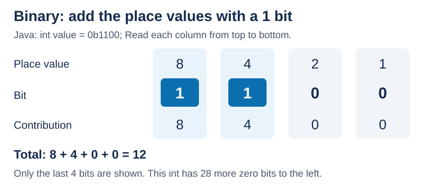
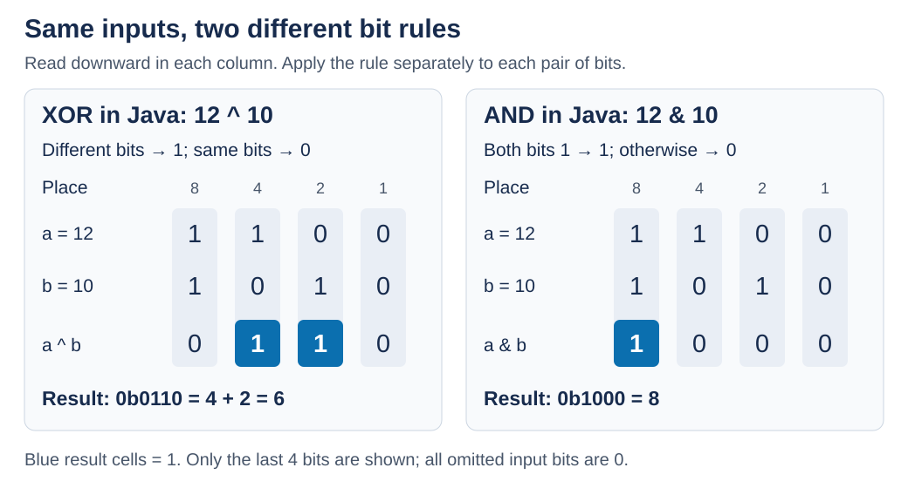

# Bitwise operations

<sub>[Back to Computer Science](../Readme.md#content)</sub>

**Bitwise operations work on the individual binary digits of integers.**

* Java's exclusive OR (**XOR**, `^`) produces `1` where corresponding bits differ.
* AND (`&`) produces `1` where both bits are `1`.

We will start with binary, then explore both operations and their uses.

## Numbers as bits

A **bit** is a binary digit: `0` or `1`. Decimal place values are 1, 10, 100, and so on. Binary place values double as you move left: **1, 2, 4, 8, 16, …**

For a nonnegative number, add the place values whose bits are `1`; zeros contribute nothing. Binary `1100` means decimal twelve: `8 + 4 = 12`.

Read each column below vertically: place value, bit, and contribution to the total.



Java's `0b` prefix marks binary digits. The value is the same however you write it:

```java
int decimal = 12;
int binary = 0b1100;
System.out.println(decimal == binary); // true
System.out.println(binary);            // 12
```

Run each snippet inside a `main` method; a complete program appears at the end.

A Java `int` has **32 bits**. Here we show only the last four bits of small nonnegative values; the omitted 28 bits are all zero. Leading zeros do not change a value: `0b0011` and `0b11` both mean `3`. The rightmost position is **bit 0**, then bit 1, bit 2, and so on moving left.

## One rule applied to every column

The inputs are called **operands**. Align their bit positions and apply the rule in every column independently. Bits stay in place; nothing carries into another column.

A **truth table** lists every possible pair of input bits:

| First bit | Second bit | XOR `^`: different? | AND `&`: both 1? |
| --- | --- | --- | --- |
| 0 | 0 | 0 | 0 |
| 0 | 1 | 1 | 0 |
| 1 | 0 | 1 | 0 |
| 1 | 1 | 0 | 1 |

The same inputs, twelve (`1100`) and ten (`1010`), produce different results. Read downward within each column. Blue result cells mark `1` bits.



## Exclusive OR (XOR): keep the differences

**XOR produces `1` when exactly one input bit is `1`.** “Exclusive” excludes the case where both are `1`. You can remember it as **different → 1; same → 0**.

For `12 ^ 10`, read the four columns from left to right:

- `1 ^ 1` gives `0`: the bits match.
- `1 ^ 0` gives `1`: the bits differ.
- `0 ^ 1` gives `1`: the bits differ.
- `0 ^ 0` gives `0`: the bits match.

The result is `0110`, whose set bits contribute `4 + 2 = 6`. A **set bit** means a bit whose value is `1`.

```java
int a = 0b1100; // 12
int b = 0b1010; // 10
int result = a ^ b;
System.out.println(result); // 6, binary 0110
System.out.println(a);      // 12: computing a ^ b did not change a
```

XOR compares individual bits and returns an integer, not a `boolean` saying whether the whole numbers differ. Java's `^` is **not exponentiation**: `2 ^ 3` is `1`, not eight.

### Flip selected bits with a mask

A **bitmask** is a bit pattern used to select positions. To **toggle** a bit means to flip it: `0` becomes `1`, and `1` becomes `0`.

With XOR, a mask bit of `1` flips the corresponding input bit; a mask bit of `0` leaves it alone. This follows directly from the truth table. For example, mask `0110` selects the middle two positions:

```java
int value = 0b1010; // 10
int mask  = 0b0110; // Select bit 2 and bit 1

value = value ^ mask;
System.out.println(value); // 12: 1010 ^ 0110 = 1100

value ^= mask;            // For this int variable: value = value ^ mask
System.out.println(value); // 10: 1100 ^ 0110 = 1010
```

Flipping the same selected bits twice restores the original value. XOR is useful for toggling options, but **toggling is not the same as enabling**: if a selected bit is already `1`, XOR turns it off.

### Why equal values cancel

Every bit matches itself, so a value XOR itself is zero. Every bit differs from zero exactly when it is `1`, so XOR with zero preserves the value:

```java
int x = 12;
int mask = 10;
System.out.println(x ^ x);          // 0
System.out.println(x ^ 0);          // 12
System.out.println((x ^ mask) ^ mask); // 12
```

## AND: keep the shared 1 bits

**AND produces `1` only when both input bits are `1`.** If either input bit is `0`, the result bit is `0`.

For `12 & 10`, the leftmost displayed column is `1 & 1`, so it produces `1`. The other three columns contain at least one zero, so they produce zeros. The result is `1000`, or decimal `8`.

```java
int a = 0b1100; // 12
int b = 0b1010; // 10
System.out.println(a & b); // 8, binary 1000
System.out.println(a & 0); // 0: no position has two 1s
System.out.println(a & a); // 12: each original 1 survives
```

### Keep only selected positions

For AND, think of the mask as a filter: **mask `1` lets the input bit through; mask `0` forces the result bit to zero**. Unlike XOR, AND cannot turn an input zero into a one.

```java
int value = 0b1101; // 13
int mask  = 0b0111; // Keep only the last three bits
int kept = value & mask;
System.out.println(kept);  // 5: 1101 & 0111 = 0101
System.out.println(value); // 13: the original is unchanged
```

The mask removes the contribution of the `8` position. To store that filtered result back in this `int` variable, write `value &= mask`, meaning `value = value & mask`.

### Check flags: one, any, or all

A **flag** is a bit representing an option. Give each independent flag its own position. Here, bit 0 means read, bit 1 means write, and bit 2 means execute; `1` means enabled.

```java
int read  = 0b001;
int write = 0b010;
int flags = 0b101; // Read and execute enabled; write disabled

boolean canRead  = (flags & read) != 0;
boolean canWrite = (flags & write) != 0;
System.out.println(canRead);  // true
System.out.println(canWrite); // false

int requested = 0b011; // Read and write
boolean hasAny = (flags & requested) != 0;
boolean hasAll = (flags & requested) == requested;
System.out.println(hasAny); // true: read is present
System.out.println(hasAll); // false: write is missing
```

A nonzero result means **at least one** selected flag is enabled. A result equal to the mask means **all** selected flags are enabled. Here, `101 & 011` is `001`: nonzero, but not `011`.

Use `!= 0` for the general presence check, not `== 1`: a selected bit may have value `2`, `4`, or another power of two. The parentheses are necessary here because Java groups equality comparisons before bitwise AND.

### Check whether an integer is odd or even

The rightmost bit has value `1`; all other place values are multiples of two. Therefore, keeping only the rightmost bit tells you whether a nonnegative integer is odd (`1`) or even (`0`):

```java
int number = 13; // Binary 1101
boolean isOdd = (number & 1) != 0;
System.out.println(isOdd);        // true
System.out.println((14 & 1) == 0); // true: 14 is even
```

This test also works for negative Java integers because of their two's-complement representation.

## Java details that prevent surprises

### Numeric types and negative numbers

Integer `^` and `&` work with `byte`, `short`, `char`, `int`, and `long`, not `float` or `double`. Java promotes small integer operands to `int` for these operations. If either operand is `long`, the operation and result use `long` (64 bits).

```java
byte a = 12;
byte b = 10;
int result = a ^ b; // The expression has type int
long wide = 12L & 10L;
System.out.println(result); // 6
System.out.println(wide);   // 8
```

Negative `int` values use **two's complement**: the top bit has negative weight. In 32 bits, all ones represent `-1`. The bit rules stay the same; the result is interpreted as a signed number.

```java
System.out.println(-1 & 12); // 12: all 32 bits of -1 are 1
System.out.println(-1 ^ 12); // -13: XOR with all ones flips every bit
```

Do not treat a four-bit teaching sketch as the full representation of a negative `int`.

### Bitwise AND versus conditional AND

With integers, `&` returns an integer. With two `boolean` values, `&` means both are true; `^` means exactly one is true.

`&&` accepts booleans and **short-circuits**: when the left side is false, Java skips the right side. Boolean `&` evaluates both sides (unless evaluation throws an exception).

```java
System.out.println(true ^ false); // true
System.out.println(true & false); // false

int divisor = 0;
boolean safe = divisor != 0 && 10 / divisor > 1;
System.out.println(safe); // false; division was skipped
```

Replacing `&&` with `&` in that last expression would attempt division by zero and throw an `ArithmeticException`.

## Run it and see the binary results

`Integer.toBinaryString` omits extra leading zeros: the XOR result prints `110`; the diagrams use `0110` for alignment. Save this program as `BitwiseDemo.java` and run `java BitwiseDemo.java`:

```java
public class BitwiseDemo {
    public static void main(String[] args) {
        int a = 12;
        int b = 10;
        System.out.println("a: " + Integer.toBinaryString(a)); // a: 1100
        System.out.println("b: " + Integer.toBinaryString(b)); // b: 1010
        System.out.println("XOR: " + (a ^ b)); // XOR: 6
        System.out.println(Integer.toBinaryString(a ^ b)); // 110
        System.out.println("AND: " + (a & b)); // AND: 8
        System.out.println(Integer.toBinaryString(a & b)); // 1000
    }
}
```

# Sources

- [Oracle tutorial — Bitwise operators](https://docs.oracle.com/javase/tutorial/java/nutsandbolts/op3.html)
- [Java Language Specification (JLS) §3.10.1 — Binary literals](https://docs.oracle.com/javase/specs/jls/se25/html/jls-3.html#jls-3.10.1)
- [JLS §4.2 — Integer types](https://docs.oracle.com/javase/specs/jls/se25/html/jls-4.html#jls-4.2)
- [JLS §15.22–15.23 — Operator rules](https://docs.oracle.com/javase/specs/jls/se25/html/jls-15.html#jls-15.22)
- [Integer API — toBinaryString](https://docs.oracle.com/en/java/javase/25/docs/api/java.base/java/lang/Integer.html#toBinaryString(int))
