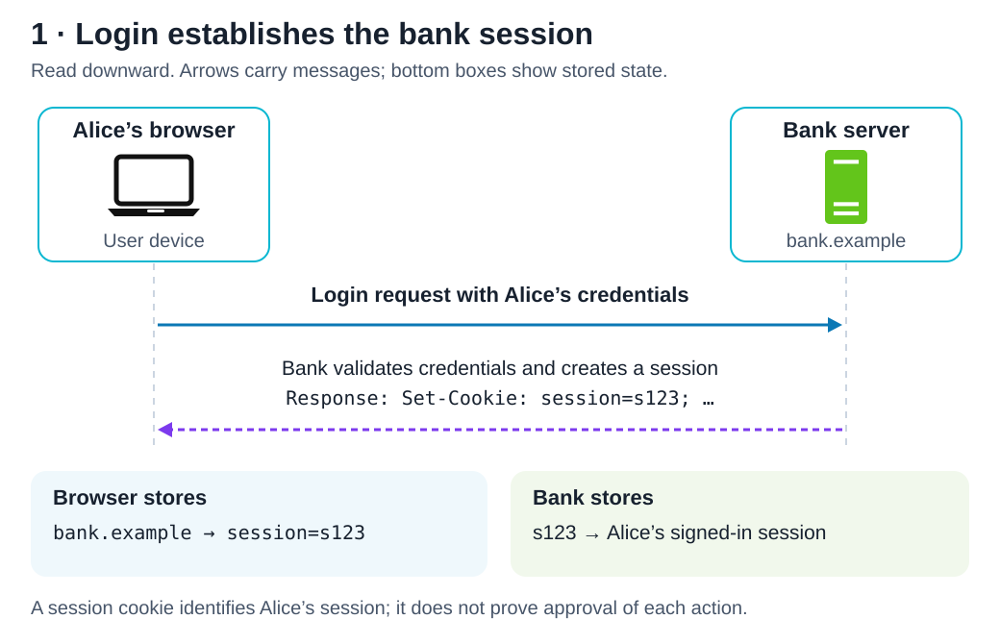
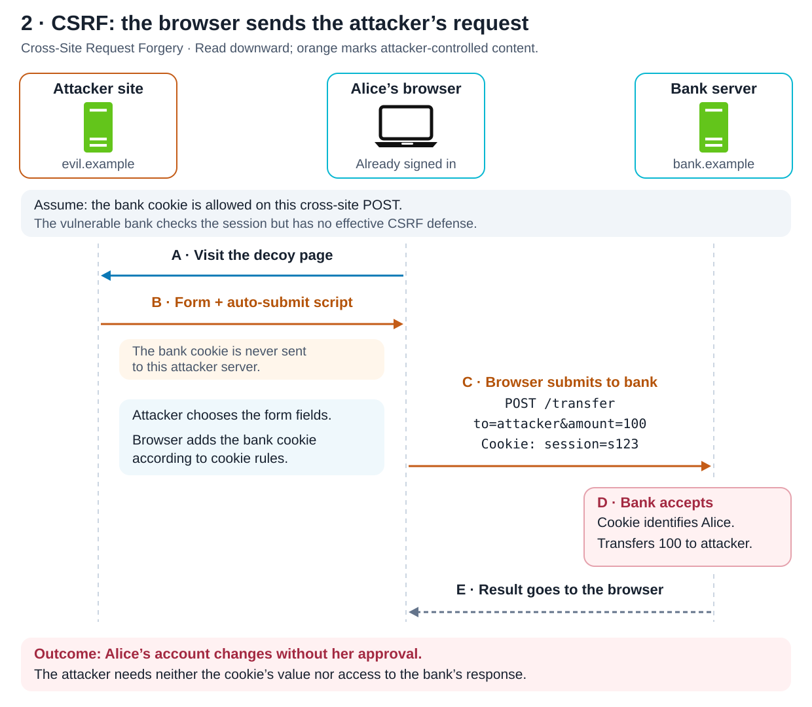
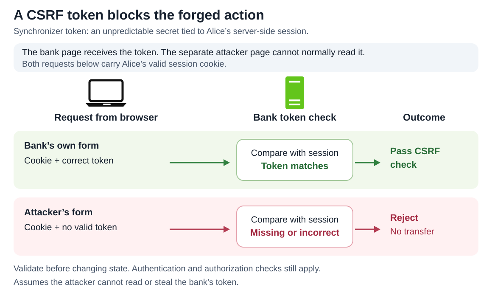

# Cross-Site Request Forgery

<sub>[Back to Computer Science](../Readme.md#content)</sub>

**Cross-Site Request Forgery (CSRF) tricks a browser into making an unwanted request using the victim's existing credentials.** A vulnerable server recognizes the user's session and performs an action the user never intended. The attacker usually needs neither the password nor the session cookie's value.

This article follows a cookie-authenticated bank session through an attack, then shows how a CSRF token breaks the sequence.

## The actors and the trust mistake

| Actor or term | Meaning in this example |
| --- | --- |
| Alice and her browser | Alice is the victim. Her browser stores cookies and sends eligible cookies with requests. |
| Bank, `bank.example` | The legitimate application. Its `/transfer` endpoint moves money. |
| Attacker site, `evil.example` | A separate site that serves a deceptive page containing a form aimed at the bank. |
| Session cookie | A browser-held identifier that lets the bank associate a request with Alice's authenticated session. |
| State-changing request | A request that changes application data, such as a transfer or an email-address change. |

For these domain-based URLs, a **site** under modern cookie rules is the scheme plus the **registrable domain**: a public suffix, such as `com` or `co.uk`, plus the label immediately before it. An **origin** is the scheme, full host, and port. Thus `https://shop.example.com` and `https://account.example.com` are same-site but cross-origin; ports also distinguish origins, not sites. `https://bank.example` and `https://evil.example` are cross-site because their registrable domains differ.

The browser selects cookies for the **request's destination**, subject to cookie and browser rules. Visiting another site does not necessarily end the bank session. The mistake is treating an authenticated request as sufficient evidence that Alice intended the action.

The diagrams use the repository's System Design laptop and server icons. Read sequence diagrams downward: vertical lines identify participants over time; horizontal arrows show messages.

## Step 1 — Establish the bank session



Initially, Alice has no authenticated bank session. She signs in, the bank establishes a session, and its response asks the browser to store a cookie. Afterward, an eligible request carrying that cookie identifies her to the bank.

For this deliberately vulnerable example, suppose the bank sends:

```http
Set-Cookie: session=s123; Path=/; Secure; HttpOnly; SameSite=None
```

`s123` is an illustrative placeholder. `Secure` restricts transmission to HTTPS; `HttpOnly` prevents JavaScript from reading the cookie. `SameSite=None` allows cross-site cookie use and requires `Secure`. With no `Domain` attribute, this cookie belongs only to `bank.example`.

**Assumption for the attack:** the browser permits this cookie on the cross-site form submission, and the bank has no effective CSRF check. Cookie restrictions can prevent this particular sequence; cookies are not universally attached to every cross-site request.

## Step 2 — Make the browser submit the attacker's action



Alice is still signed in when she follows a link to `evil.example`. That server returns a page with a bank-targeting form. The page submits it, causing **Alice's browser** to contact the bank. The attacker supplies the transfer fields; the browser supplies the eligible bank cookie.

The bank associates the cookie with Alice. Because it fails to validate the request's legitimacy, it transfers 100 units to the attacker. Alice's account has changed without her approval. The bank cookie was sent to the bank, never to the attacker site, and the attacker does not need to read the response.

A minimal teaching example of the page served by `evil.example` is:

```html
<form id="decoy" action="https://bank.example/transfer" method="post">
  <input type="hidden" name="to" value="attacker">
  <input type="hidden" name="amount" value="100">
</form>
<script>
  document.getElementById("decoy").submit();
</script>
```

This uses illustrative domains and assumes the bank accepts these form fields. The page never reads or sets the bank cookie. JavaScript merely automates submission; a deceptive submit button can also trigger a form-based attack.

## Why browser isolation does not stop this form

The **same-origin policy** generally prevents an attacker page from reading another origin's private content. It still permits many cross-origin writes, including ordinary form submissions. Blocking access to a response does not undo a transfer already performed.

**Cross-Origin Resource Sharing (CORS)** lets servers grant cross-origin script access. An ordinary form POST using `application/x-www-form-urlencoded` does not require a CORS preflight, the browser's permission-check request. Merely omitting CORS response headers does not stop this form from reaching the bank.

A different API design can require a custom request header on every mutation. That forces cross-origin script requests through preflight, where a strict origin allowlist can block them. The server must actually require the header and must not offer an equivalent unprotected form endpoint.

## How a CSRF token breaks the sequence

Token defenses require a value submitted explicitly in a form field or request header, beyond the cookies the browser attaches automatically. The expected value can be stored in different places.

### Synchronizer tokens: the reference is in the session

A **synchronizer CSRF token** is an unpredictable secret associated with the user's server-side session. The bank supplies it in its own page; that page includes it in a form field or request header. The bank compares the submitted token with the session's value before changing state. The diagram illustrates this storage model: both requests have Alice's session cookie, but only the legitimate form has the matching token.



The attacker can invent transfer fields but cannot normally read the bank page to obtain its token. A missing or incorrect token therefore causes rejection.

### Double-submit cookies: require a separate submitted value

A **double-submit cookie** pattern carries a token in a cookie and separately in a form field or request header. The browser attaches the cookie; the trusted page supplies the second value. The server checks that they match. An attacker who cannot read the target site's token cannot normally supply that matching value. **Checking only whether a second cookie is present** provides no such protection.

The naive equality check is vulnerable to **cookie injection**: if an attacker-controlled sibling subdomain can plant a parent-domain cookie with a known token, the attacker can submit the same value in a form. For new implementations, OWASP recommends signed double-submit tokens bound to the current login session. The server uses a secret key to validate the token and its session binding, rather than trusting equality alone.

### Django: a cookie-stored secret by default

**Django 6.0 defaults to `CSRF_USE_SESSIONS=False`.** Its CSRF secret lives in a cookie and is independent of the login session. The **masked form token** is a version of that secret scrambled with fresh randomness for each response; the scrambling leaves the underlying secret unchanged. Django recovers that secret from the submitted token and compares it with the cookie's secret; it does not merely check that the cookie exists. It rejects invalid tokens with HTTP `403 Forbidden` and also applies `Origin` checks, with strict `Referer` checking on HTTPS when `Origin` is absent.

Django documents cookie storage as safe within its protection model. Setting `CSRF_USE_SESSIONS=True` moves the secret into the Django session. The diagram above shows the synchronizer pattern, **not Django's default storage model**. Use a framework's maintained CSRF protection and keep tokens out of URLs.

## Additional defenses and important limits

| Control | What it contributes |
| --- | --- |
| Explicit `SameSite=Lax` or `Strict` | Limits cross-site cookie attachment. `Lax` blocks the illustrated cross-site POST, but allows cookies on safe top-level navigations such as GET. `Strict` excludes cross-site requests. Choose settings that fit legitimate flows. |
| Origin validation | Compare the request's `Origin` against exact trusted origins; use a carefully validated `Referer` fallback when appropriate. Handle absent headers explicitly. |
| Fetch Metadata | The browser's `Sec-Fetch-Site` header describes the relationship between sites. Reject unwanted cross-site mutations, with a defined fallback for missing headers. |
| Safe GET handlers | GET must not perform application actions such as transfers. Changing a vulnerable endpoint from GET to POST alone does not add CSRF protection. |

An untrusted sibling subdomain creates two distinct concerns: its requests can be same-site, weakening reliance on `SameSite` alone, and its ability to plant parent-domain cookies can undermine naive double-submit validation. An omitted `SameSite` attribute is also not equivalent to explicitly setting `Lax`: some browser defaults temporarily allow recent cookies on POST.

If a framework allows **method override** — treating an incoming GET as POST, for example — ensure that it cannot turn a GET carrying `Lax` cookies into an unprotected state change.

HTTPS protects transport, and `HttpOnly` protects cookie readability; neither proves that a request was intended. **Cross-site scripting (XSS)** means attacker-controlled script executes in the trusted site's context; it can often bypass CSRF defenses by accessing tokens or issuing legitimate-looking requests.

# Sources

- [OWASP — Cross Site Request Forgery: attack model, form attacks, and ineffective defenses](https://owasp.org/www-community/attacks/csrf)
- [MDN — Cross-site request forgery: attack prerequisites and defense choices](https://developer.mozilla.org/en-US/docs/Web/Security/Attacks/CSRF)
- [MDN — Using HTTP cookies: session storage and request cookies](https://developer.mozilla.org/en-US/docs/Web/HTTP/Guides/Cookies)
- [MDN — Set-Cookie: cookie scope, HttpOnly, Secure, and SameSite](https://developer.mozilla.org/en-US/docs/Web/HTTP/Reference/Headers/Set-Cookie)
- [MDN — Site: registrable domains and schemeful same-site rules](https://developer.mozilla.org/en-US/docs/Glossary/Site)
- [MDN — Same-origin policy: origins, cross-origin writes, and restricted reads](https://developer.mozilla.org/en-US/docs/Web/Security/Defenses/Same-origin_policy)
- [MDN — CORS: simple requests and preflight](https://developer.mozilla.org/en-US/docs/Web/HTTP/Guides/CORS)
- [OWASP — CSRF Prevention Cheat Sheet: synchronizer and double-submit tokens, cookie injection, origin checks, Fetch Metadata, and XSS limits](https://cheatsheetseries.owasp.org/cheatsheets/Cross-Site_Request_Forgery_Prevention_Cheat_Sheet.html)
- [Django 6.0 — CSRF protection: cookie secret, masked token, origin checks, and session-independent design](https://docs.djangoproject.com/en/6.0/ref/csrf/)
- [Django 6.0 — CSRF_USE_SESSIONS: default cookie storage and optional session storage](https://docs.djangoproject.com/en/6.0/ref/settings/#csrf-use-sessions)
- [Local System Design icon source — laptop and server symbols](../../system%20design/01.%20Scaling/images/single-server.svg)
