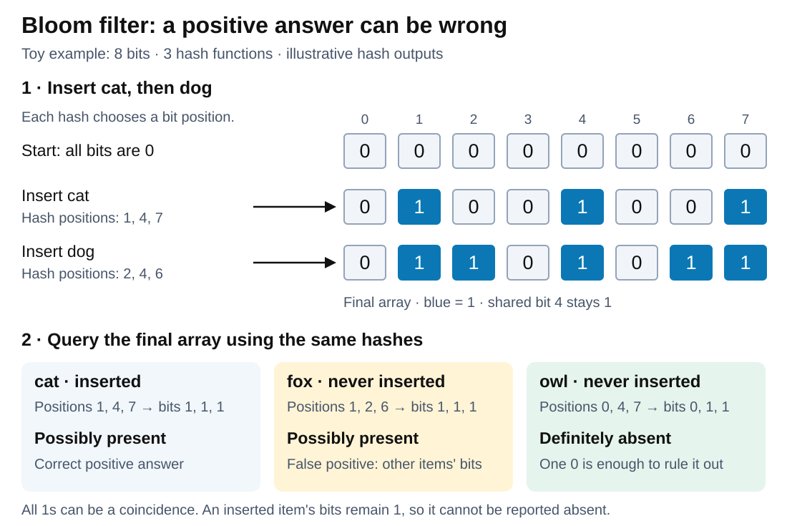
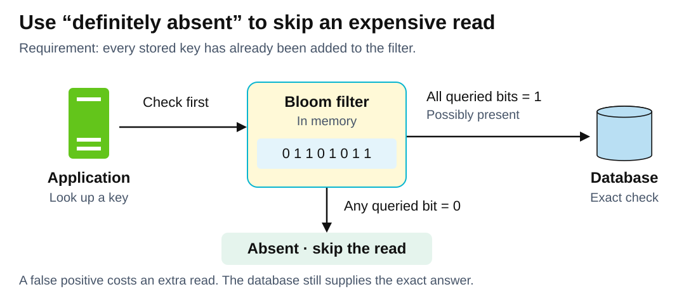

# Data structures. Bloom filter

<sub>[Back to Computer Science](../Readme.md#content)</sub>

# Front

How does a Bloom filter test set membership, and why can it return false positives but no false negatives?

# Back

A **Bloom filter** is a space-efficient probabilistic data structure, conceived by Burton Howard Bloom in 1970, that is used to test whether an element is a member of a set. False positive matches are possible, but false negatives are not – in other words, a query returns either **possibly present** or **definitely absent**. A positive can be wrong (**false positive**); a correctly maintained standard filter never reports an inserted item absent (**no false negatives**).

## How it works

It stores `m` **bits** (`0` or `1`), initially all `0`, instead of the items. Each of `k` **hash functions** consistently maps an item to a position from `0` to `m − 1`.

1. **Insert:** set the item's `k` positions to `1`; existing `1`s stay set.
2. **Query:** read the same positions. **Any `0` means absent; all `1`s mean possibly present.** Queries change nothing.

Below, `cat` and `dog` share bit `4`. Uninserted `fox` finds only `1`s: a false positive. `owl` finds a `0`: definitely absent. Hash outputs are illustrative.



Inserted items' bits remain `1`, explaining the absence of false negatives.

## Why it is useful

Read the branches: an absent result skips an expensive lookup; a possible match needs an exact check. **Every stored key must be represented in the filter.** False positives cost extra reads. Cassandra uses this to skip disk files that cannot contain a requested partition.



## Cost and limits

- **Time:** **O(k)** hash/bit operations; constant relative to item count for fixed `k` and hash cost. Longer inputs cost more to hash.
- **Space:** **m bits**. More bits per item reduce false positives; overfilling a fixed filter increases them.
- **Deletion:** clearing shared bits can create false negatives. Counting Bloom filters use counters to support deleting known inserted items.
- **No retrieval:** it cannot list items or return their values.

## Java: Guava

Use the **Guava** library.

Save as `BloomDemo.java` in your Java source directory:

```java
import com.google.common.hash.BloomFilter;
import com.google.common.hash.Funnels;
import java.nio.charset.StandardCharsets;

public class BloomDemo {
    public static void main(String[] args) {
        BloomFilter<CharSequence> filter = BloomFilter.create(
            Funnels.stringFunnel(StandardCharsets.UTF_8),
            100_000, 0.01);

        filter.put("cat");
        System.out.println(filter.mightContain("cat")); // true
        boolean maybe = filter.mightContain("fox");
        System.out.println(maybe ? "Check database" : "Absent");
    }
}
```

The **funnel** converts strings into UTF-8 bytes for hashing. `100_000` is the expected item count; `0.01` targets a **1% false-positive probability for absent queries** at that count. Guava chooses the array size and hash count. `put` inserts; `mightContain` tests. A `true` result still needs an exact check.

# Sources

- [Redis documentation — Bit arrays, hashing, membership checks, and capacity](https://redis.io/docs/latest/operate/oss_and_stack/stack-with-enterprise/bloom/)
- [Broder and Mitzenmacher — Network Applications of Bloom Filters: A Survey, §§2.1 and 2.5](https://www.eecs.harvard.edu/~michaelm/postscripts/im2005b.pdf)
- [Apache Cassandra documentation — Bloom filters and avoided disk reads](https://cassandra.apache.org/doc/latest/cassandra/managing/operating/bloom_filters.html)
- [Guava 33.7.1 — BloomFilter API contracts and sizing implementation](https://github.com/google/guava/blob/v33.7.1/guava/src/com/google/common/hash/BloomFilter.java)
- [Guava 33.7.1 — String funnel and character encoding](https://github.com/google/guava/blob/v33.7.1/guava/src/com/google/common/hash/Funnels.java)
- [Repository system design chapter 1 — Reused server SVG icon](../../system%20design/01.%20Scaling/images/single-server.svg)
- [Repository system design chapter 16 — Reused database SVG icon](../../system%20design/16.%20Proximity%20Service/images/final-design.svg)
