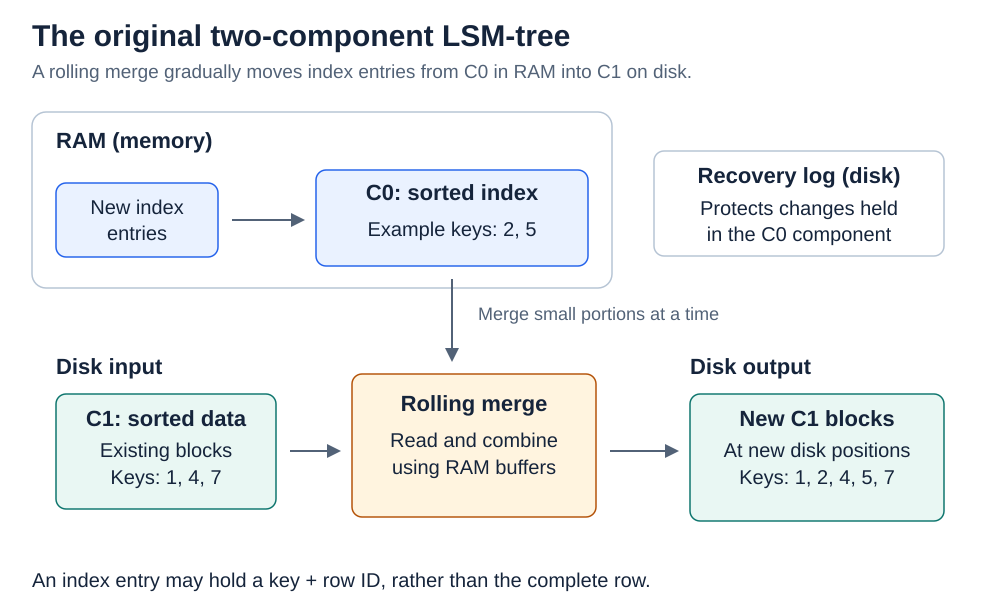
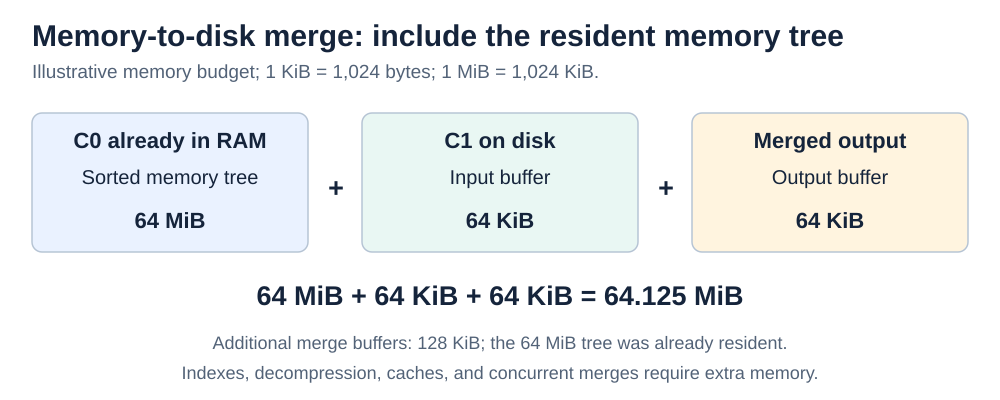
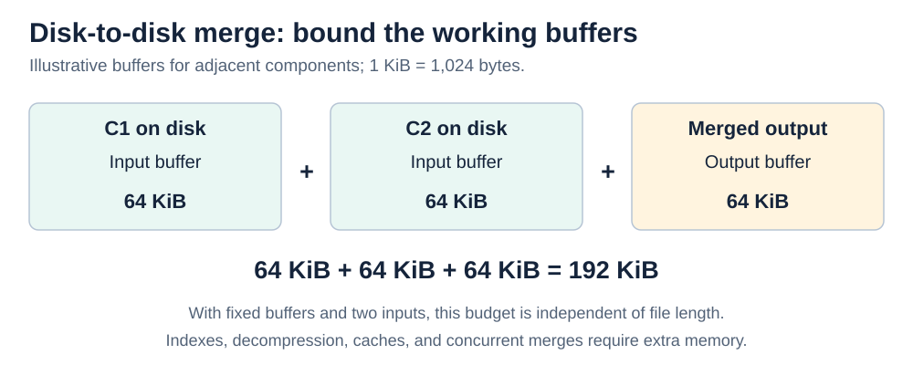
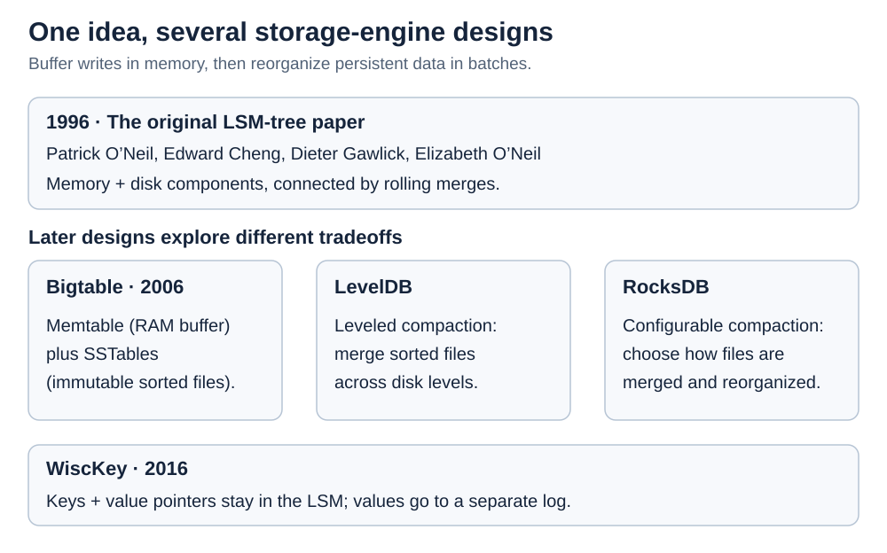

# Data structures. Log-structured merge-tree

[Back to Computer Science](../Readme.md#content)

A **log-structured merge-tree (LSM-tree)** is an ordered storage structure that **buffers changes in memory and moves them into larger sorted disk components through batched merges**. It reduces the cost of updating scattered disk pages, but pays for that efficiency with background rewriting, extra read work, and temporary storage.

The central idea is to separate **accepting a change** from **putting it into its final sorted position on disk**. This article explains the original memory/disk model, streaming merges, and the write and read paths of a modern implementation.

1. [Why batch writes?](#1-why-batch-writes)
2. [Vocabulary and the two-component model](#2-vocabulary-and-the-two-component-model)
3. [Rolling merge: combine two ordered streams](#3-rolling-merge-combine-two-ordered-streams)
4. [More components, disk merges, and levels](#4-more-components-disk-merges-and-levels)
5. [How writes reach durable sorted storage](#5-how-writes-reach-durable-sorted-storage)
6. [Updates, deletes, and snapshots](#6-updates-deletes-and-snapshots)
7. [How reads find the right version](#7-how-reads-find-the-right-version)
8. [The three main costs](#8-the-three-main-costs)
9. [From the original paper to modern engines](#9-from-the-original-paper-to-modern-engines)

## 1. Why batch writes?

A **B-tree** is a search tree designed around disk pages: each page contains many keys, keeping the tree shallow. In a conventional B-tree index, changes to unrelated keys can modify pages scattered across the storage device. A memory cache helps, but a working set much larger than that cache can require many small page reads and writes.

A mechanical hard disk must move its head and wait for rotation to access scattered locations. Transferring a large contiguous block amortizes that positioning cost across many entries. LSM-trees exploit this by collecting changes and processing them together.

Read the two paths below from left to right: one updates several existing pages; the other sorts changes in memory and writes a batch of new blocks.

A recovery log records operations in arrival order, while the searchable components organize entries by key. Reading and writing those components in batches spreads input/output (**I/O**) costs across many entries. Solid-state drives remove mechanical seeking, but the volume of data rewritten still affects performance and device wear.

## 2. Vocabulary and the two-component model

The 1996 paper by **Patrick O’Neil, Edward Cheng, Dieter Gawlick, and Elizabeth O’Neil** begins with two components, one in random-access memory (**RAM**) and one on disk:

| Term | Meaning |
| --- | --- |
| **Key** | The value used to order and find an entry, such as an account ID. |
| **C0** | A small, mutable, memory-resident sorted index. |
| **C1** | A larger disk-resident index, arranged into pages and larger blocks. |
| **Rolling merge** | An incremental process that moves a key range from a smaller component into a larger one. |
| **Compaction** | The modern term for reorganizing sorted inputs into replacement files, combining entries and removing obsolete ones when safe. |
| **Recovery log** | Persistent operation records from which lost memory state can be reconstructed. |

The diagram separates the memory index, disk blocks, and recovery log. The name **log-structured** comes from the Log-Structured File System: merged blocks go to new disk locations, preserving the old blocks until crash recovery no longer needs them.

The original paper studies **indexes over records**, including history records. An entry can contain an index key and a **row identifier (RID)** pointing to a record elsewhere. It does not require every full record to live inside the LSM-tree.

Modern key-value engines often use a **memtable** for the memory component and **SSTables** (*Sorted String Tables*) on disk. An SSTable is an immutable file of sorted entries. A **sorted run** is a sequence of entries ordered by key; it can occupy one file or several files with non-overlapping, ordered key ranges. Modern engines retain the paper’s buffering-and-merging idea while choosing their own file formats.

## 3. Rolling merge: combine two ordered streams

Because both inputs are sorted, merging does not require loading and sorting the whole dataset. Compare the first unconsumed key in each input, emit the smaller one, and advance that input. Repeat; when an input ends, copy the remainder of the other.

Here the selected memory keys are `A, D, G, K, M`, and the selected disk keys are `B, C, F, H, L`. The output contains all ten keys in order.

For input lengths `m` and `n`, this basic two-way merge takes **O(m + n)** comparisons and sequential processing. A buffered reader fetches a portion of a disk input at a time; a buffered writer accumulates output before writing a block. This is the merge phase of an external merge-sort algorithm, where “external” means the data need not fit in memory.

In the original **rolling** merge, a cursor advances through corresponding key ranges of C0 and C1, then wraps around. The engine constructs new blocks and updates the index as it progresses. **A full traversal of C1 happens over a merge cycle; no single C0 transfer rebuilds all of C1.**

Equal keys need additional rules. A key-value engine must decide which updates, older values, and deletion markers its readers still need. [Section 6](#6-updates-deletes-and-snapshots) explains those rules with a concrete version history.

### Memory-to-disk merge

C0 is already resident in RAM. Add a buffer for the disk input and a buffer for the output. The following is a deliberately simplified memory budget; these sizes are examples, not defaults from the 1996 paper.

With a `64 MiB` C0 and two `64 KiB` buffers, the total is `64.125 MiB`; the extra buffers use `128 KiB`. A kibibyte (`KiB`) is 1,024 bytes, and a mebibyte (`MiB`) is 1,024 KiB.

## 4. More components, disk merges, and levels

If C0 is tiny compared with C1, a cycle can process a large amount of existing disk data relative to the new entries it absorbs. Making C0 larger reduces that imbalance, but RAM costs more per byte than disk storage. Intermediate disk components reduce the size jump at each merge boundary without requiring a correspondingly larger memory budget.

The paper’s **Example 3.3** makes the imbalance concrete: with C1 **460 times** the size of C0, absorbing one page of C0 entries requires, on average, **460 C1 page reads and 460 C1 page writes** under that example’s assumptions.

The diagram shows illustrative capacity targets. Changes migrate between adjacent components; the omitted components account for the gap between `1 GiB` and `100 GiB`. A gibibyte (`GiB`) is 1,024 MiB.

The original model generalizes to `C0, C1, …, Ck`, with C0 in memory and the others on disk. The growth ratio and the number of components affect the balance between merging cost and lookup cost; a factor of ten is an example, not an LSM requirement.

### Disk-to-disk merge

The additional disk components introduce merges such as C1 into C2. Neither input needs to be fully loaded: use **two input buffers and one output buffer**.

For two input streams and three fixed-size `64 KiB` buffers, the basic budget is `192 KiB`, independent of the input lengths. Real engines also use memory for indexes, decompression, caches, and concurrent work; merging more streams requires more merge state.

### From components to levels

In **modern leveled compaction**, files are grouped into levels that play the role of the original disk components C1, C2, and so on. The numbering differs: LevelDB starts its disk levels at **level zero (L0)**.

A **flush** writes a memtable’s sorted contents into an SSTable. A flush into L0 adds that file separately from earlier files. Successive memtables can contain the same keys, so those files can have overlapping key ranges. Within each later level, file ranges do not overlap. A compaction selects files and overlapping files from the next level, producing replacement files for that part of the key space. LevelDB can also place a flushed file directly into a higher level when the relevant ranges do not overlap.

## 5. How writes reach durable sorted storage

This diagram uses a **modern LevelDB-style lifecycle**. A **write-ahead log (WAL)** serves the recovery-log role introduced in section 2: it records recent changes so memory state can be reconstructed after a crash. Foreground work accepts the write; background work flushes and compacts it.

For an insert or update, the engine appends a log record and updates the active memtable. When the memory buffer fills, the engine can freeze it, direct new writes to a fresh memtable, and flush the frozen contents into an SSTable.

**LevelDB writes are asynchronous by default:** `WriteOptions::sync` is `false`. Such a write can return after handing its log data to the operating system, so recent writes may be lost in a machine crash. Setting `WriteOptions::sync = true` makes the write wait for the log to reach persistent storage before returning. Avoiding that synchronization wait makes asynchronous writes much faster; batching several changes into one synchronous write can share the wait across them.

The original paper already includes recovery logging and merge checkpoints. Modern engines also track which output files constitute the live database. LevelDB uses a **MANIFEST**, a log of file-set metadata. As the write-path figure shows, a flush first writes and synchronizes the SSTable, then records it durably in the MANIFEST; only then can the old WAL be retired.

## 6. Updates, deletes, and snapshots

A **snapshot** is a stable view of the database at a particular point. In the following LevelDB-style example, each update or delete receives an increasing sequence number (`seq`), and a snapshot records a sequence number `s` as its cutoff.

**A read at snapshot `s` selects the newest entry for the key whose `seq ≤ s`.** If that entry holds a value, return it. If it is a **tombstone** (a deletion marker), or no qualifying entry exists, return “not found.” A value is **visible** when these rules select it for the reader. See [Multiversion concurrency control: vocabulary](../Multiversion%20concurrency%20control/Readme.md#vocabulary) for the broader idea of snapshot visibility.

An immutable disk file cannot be edited in place. An update therefore adds a new entry, and a delete adds a tombstone while older values may still exist in other files. This idea also appears in the original paper’s **delete node entry**, which carries the index key and RID of the entry to remove. Physical cleanup can wait until merging.

Consider three operations on `cat`. Each result in the last column is a read immediately after that row’s operation, before the next operation occurs:

| Entry | Stored operation | Read immediately after this operation |
| --- | --- | --- |
| `cat @ seq 10` | Put `"blue"` | `"blue"` |
| `cat @ seq 20` | Put `"green"` | `"green"` |
| `cat @ seq 30` | Delete: tombstone | Not found |

After all three operations, **a read at snapshot 20 returns `"green"`**: it skips the tombstone at sequence 30 and selects the value at sequence 20. A latest read at sequence 30 returns **not found**; the tombstone prevents it from falling through to `"green"`.

**Compaction can discard an entry only when all supported reads will still get the same result.** It must retain older versions needed by active snapshots. It must also retain a tombstone while dropping it could expose an older value that remains in another file.

Version rules belong to the storage engine. LevelDB and RocksDB use sequence numbers for snapshots, while Bigtable exposes timestamped cell versions. The original paper discusses timestamps and transaction-related indexing, but does not define the same snapshot scheme as LevelDB or RocksDB.

## 7. How reads find the right version

A read must combine the logical state spread across memory and disk. The diagram shows a modern point lookup—a request for one key—and the distinction between “not in this component” and “deleted.”

The engine checks memory state, including relevant frozen memtables, then candidate disk files as needed. It uses key ranges, indexes, and optional [**Bloom filters**](../Data%20structures.%20Bloom%20filter/Readme.md#how-it-works) to avoid unnecessary work. A Bloom filter can say **definitely absent** or **possibly present**. A possible match still needs an exact lookup; filters do not return values or decide snapshot visibility.

A **data block** stores a portion of the file’s ordered key-value entries. LevelDB’s SSTable layout is **data blocks → optional meta blocks (such as the filter block) → metaindex block → index block → footer**. The index has one entry per data block, containing a **block handle**: that block’s file offset and size. The metaindex holds handles to meta blocks, and the footer holds handles to the metaindex and index blocks.

For a point lookup, LevelDB seeks in the index to identify a candidate data block. If a block filter is configured, the block’s offset identifies the filter to consult; a definite absence avoids reading the data block. Otherwise, the engine searches that block for the requested key and sequence number.

LevelDB can stop at the first qualifying value or tombstone because it searches versions of a key **from newest to oldest**: the active memtable, the frozen memtable, L0 files newest first, then L1, L2, and subsequent levels. Within each candidate, it skips entries newer than the read’s snapshot. That ordering makes the first qualifying entry the one the read needs.

The original paper also considers **non-unique indexes**, where several records share a search key. For example, one account ID can identify many history records, and those records can be in any component. This search cannot stop at the first match: it must check every component to find all history for that account.

A **range scan**, such as all keys from `cat` through `owl`, combines ordered iterators from relevant memory and disk components. It reconciles duplicate versions and tombstones while producing the visible keys in order. Sorting makes this possible, but overlapping runs still create extra read work.

## 8. The three main costs

Batching moves work into merges; it does not eliminate it. Modern storage-engine documentation describes three useful costs:

| Cost | What it measures | Why an LSM-tree incurs it |
| --- | --- | --- |
| **Write amplification** | Physical bytes written relative to logical bytes written by the application. | Logging, flushing, and compaction can write the same logical information repeatedly. |
| **Read amplification** | The number of disk reads per query, using RocksDB’s tuning-guide definition. | One logical dataset is spread over multiple components and versions. |
| **Space amplification** | Physical storage relative to the live logical dataset. | Obsolete versions, tombstones, and compaction inputs/outputs coexist. |

Measurements must state what they count—for example, whether write amplification includes the WAL. A hypothetical application writing `1 GiB` while the measured storage writes total `8 GiB` has `8×` write amplification under that accounting.

**Leveled compaction** constrains overlap and space usage but can rewrite data repeatedly. **Tiered compaction**, called **universal compaction** in RocksDB, lets more sorted runs accumulate and can reduce rewriting at the expense of read and space costs. Actual results depend on workload, configuration, compression, and hardware.

If background compaction cannot keep up, pending files accumulate. Reads and space usage can worsen, and the engine may delay or pause incoming writes. This is a **write stall**: applications see increased write latency or interrupted throughput while background work catches up.

In **LevelDB 1.23**, once L0 holds **8 or more files**, a write may be delayed **1 ms**. At **12 or more files**, a write that needs a fresh memtable waits for compaction. A write needing a fresh memtable also waits if the previous memtable is still being flushed. RocksDB exposes stall information in its **Stalls** statistics and the **`STALL_MICROS`** counter, which records time spent delaying writes.

LSM-trees are especially useful when index inserts outnumber lookups, but their advantage over a B-tree depends on the workload. Compare sustained throughput, read latency, storage usage, and behavior during compaction when choosing between them.

## 9. From the original paper to modern engines

The common thread is buffered changes followed by ordered merging. The later systems below choose different file formats, version models, and compaction policies. Dates identify papers, not the first appearance of every listed feature.

Bigtable describes memtables and immutable SSTables in a distributed system. LevelDB is an embedded key-value engine with leveled sorted files. RocksDB develops that family with configurable compaction policies. **WiscKey** explores **key-value separation**: the LSM holds keys and value locations, while a separate log holds the values. Compaction then moves smaller entries, but value-log garbage collection and range-access costs become separate concerns.

The defining principle remains **buffer, order, and merge changes in batches**. Durability, version visibility, file layout, and compaction policy complete the design of a particular storage engine.

# Sources

- [Patrick O’Neil, Edward Cheng, Dieter Gawlick, and Elizabeth O’Neil — The Log-Structured Merge-Tree (LSM-Tree), 1996](https://db.cs.berkeley.edu/cs286/papers/lsm-acta1996.pdf)
- [LevelDB 1.23 — Implementation notes: logs, levels, compaction, and recovery](https://github.com/google/leveldb/blob/1.23/doc/impl.md)
- [LevelDB 1.23 — User documentation: durability, snapshots, iteration, and filters](https://github.com/google/leveldb/blob/1.23/doc/index.md)
- [LevelDB 1.23 — Table file format](https://github.com/google/leveldb/blob/1.23/doc/table_format.md)
- [LevelDB 1.23 — WriteOptions and the default sync setting](https://github.com/google/leveldb/blob/1.23/include/leveldb/options.h)
- [LevelDB 1.23 — Write queue, flush placement, snapshot reads, and write stalls](https://github.com/google/leveldb/blob/1.23/db/db_impl.cc)
- [LevelDB 1.23 — Building and synchronizing an SSTable](https://github.com/google/leveldb/blob/1.23/db/builder.cc)
- [LevelDB 1.23 — L0 slowdown and stop thresholds](https://github.com/google/leveldb/blob/1.23/db/dbformat.h)
- [LevelDB 1.23 — File search order and durable MANIFEST updates](https://github.com/google/leveldb/blob/1.23/db/version_set.cc)
- [LevelDB 1.23 — Index lookup, block filters, and data-block reads](https://github.com/google/leveldb/blob/1.23/table/table.cc)
- [RocksDB — Overview](https://github.com/facebook/rocksdb/wiki/RocksDB-Overview)
- [RocksDB — Compaction policies](https://github.com/facebook/rocksdb/wiki/Compaction)
- [RocksDB — Tuning guide: amplification and background-work limits](https://github.com/facebook/rocksdb/wiki/RocksDB-Tuning-Guide)
- [RocksDB — Snapshot sequence numbers and visibility](https://github.com/facebook/rocksdb/wiki/Snapshot)
- [RocksDB — Write stalls](https://github.com/facebook/rocksdb/wiki/Write-Stalls)
- [Fay Chang et al. — Bigtable: A Distributed Storage System for Structured Data, OSDI 2006](https://research.google.com/archive/bigtable-osdi06.pdf)
- [Lanyue Lu et al. — WiscKey: Separating Keys from Values in SSD-conscious Storage, FAST 2016](https://www.usenix.org/system/files/conference/fast16/fast16-papers-lu.pdf)
