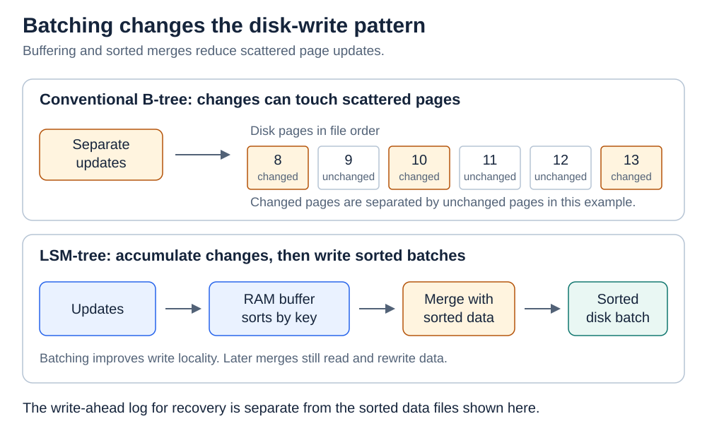
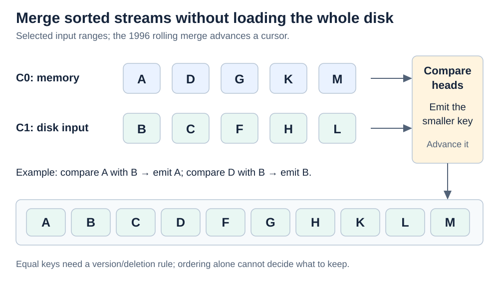
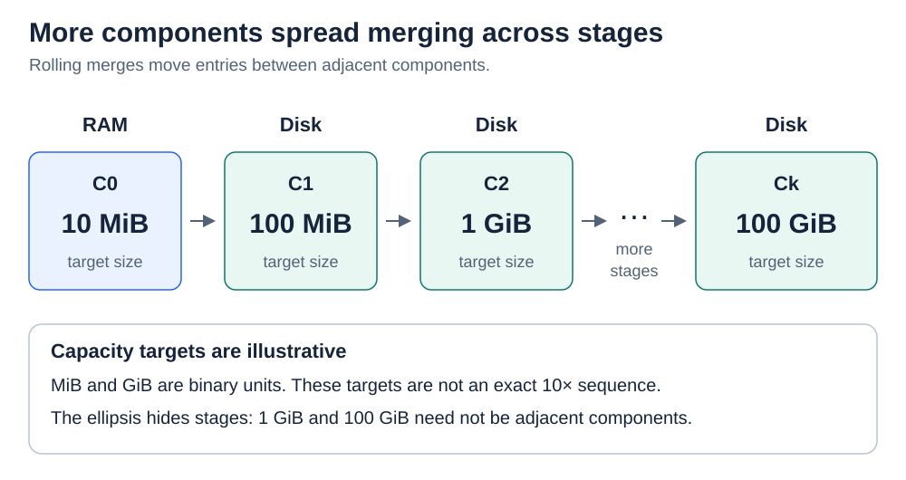
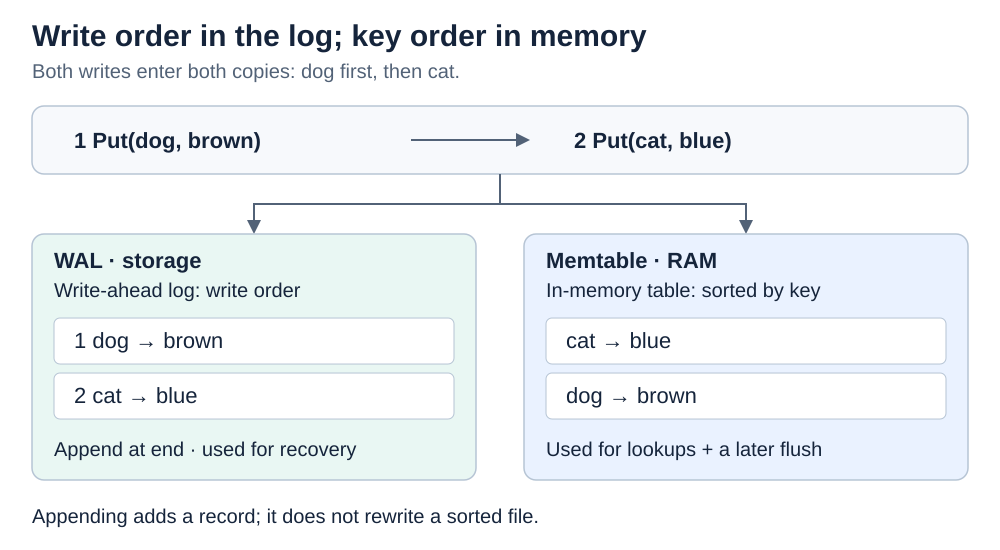
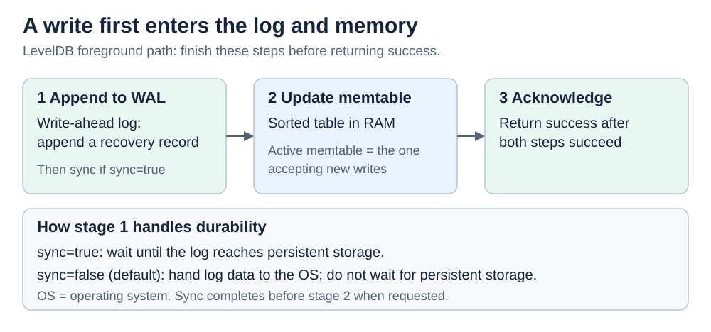
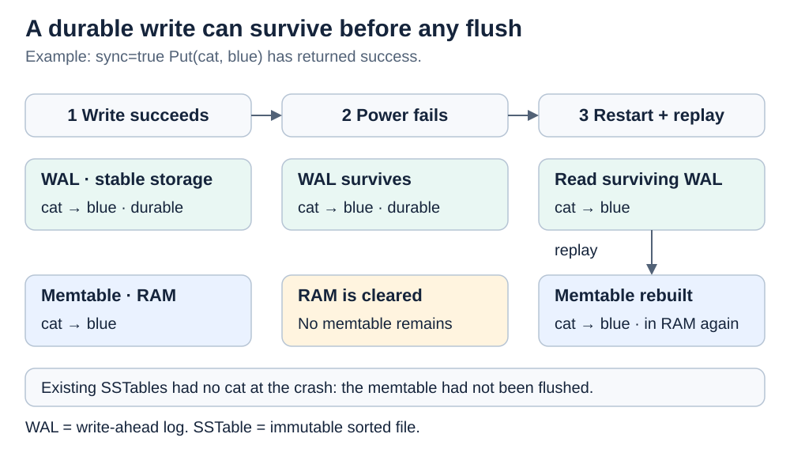
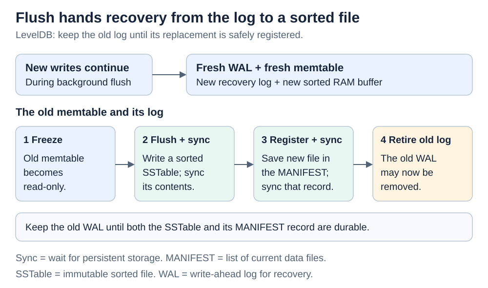
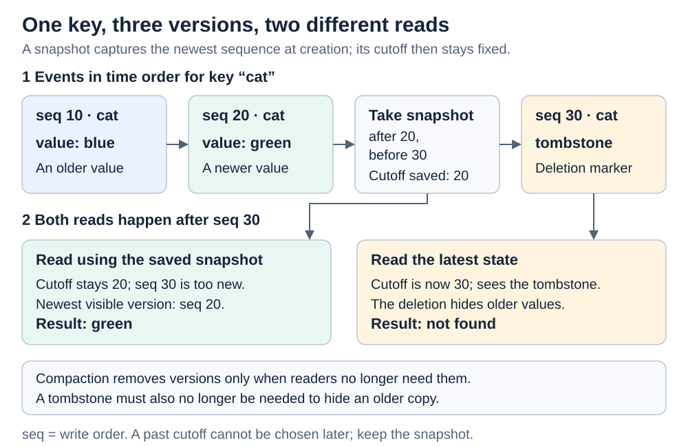
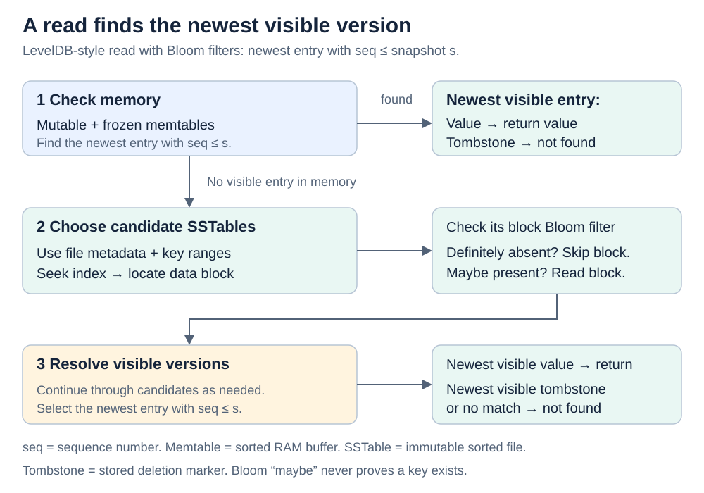
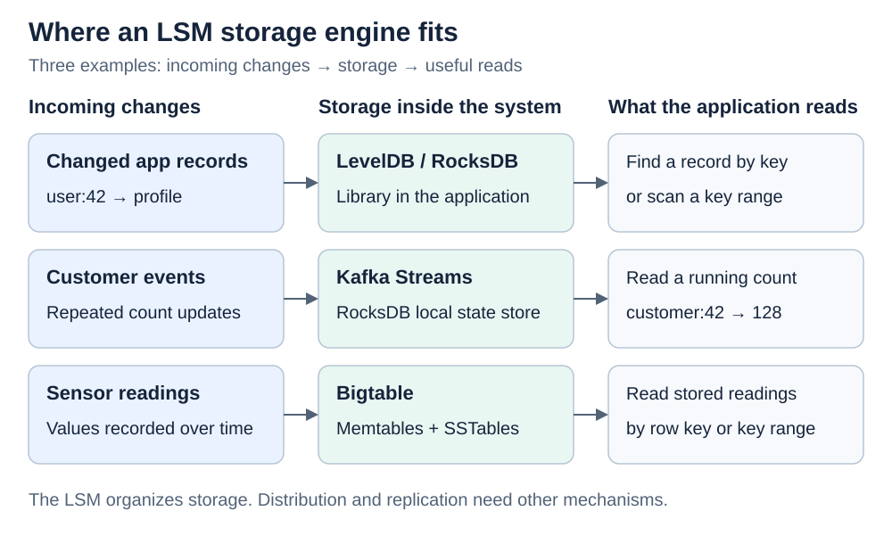

# Data structures. Log-structured merge-tree

[Back to Computer Science](../Readme.md#content)

A **log-structured merge-tree (LSM-tree)** **collects changes in memory, writes sorted batches to disk, and merges those batches over time**.

The sections cover why it batches writes, its pieces, merges and levels, durable writes, versions, reads, uses, and costs. A **storage engine** saves and retrieves data; “disk” includes solid-state drives.

## 1. Why batch writes?

A **key** identifies an entry, such as `cat` in `cat = "blue"`. A **B-tree** stores keys in disk pages (chunks of data). Updating unrelated keys can require many small reads and writes to scattered pages when memory caching is insufficient.

Compare the write patterns:

Scattered writes on a hard disk require head movement (**seeks**) and waiting for rotation. Sequential writes spread that positioning cost across many entries. Compaction rewrites data later (section 9), so fewer seeks need not mean fewer bytes. Solid-state drives have no moving head, but random writes still cost more there because of erase cycles and garbage collection. Rewrites still use write bandwidth and shorten drive life.

## 2. The pieces of a modern LSM engine

| Piece | What it does |
| --- | --- |
| **Memtable** | Holds recent changes in random-access memory (**RAM**), organized for lookups. |
| **SSTable** (*Sorted String Table*) | A disk file sorted by key. It is **immutable**: its contents are not edited after creation. |
| **Write-ahead log (WAL)** | Records recent changes for recovery if the memtable is lost (section 5). |
| **Flush** | Writes a memtable's sorted contents into an SSTable. |
| **Compaction** | Merges sorted data into replacement files and removes obsolete entries when safe. |

The name **log-structured** comes from the Log-Structured File System: merged blocks go to new disk locations instead of overwriting blocks still needed. Modern engines create replacement SSTables. **The WAL is a separate log for recovery.**

New and old values can coexist in different places; reads must choose the correct version.

## 3. How merging works

To merge sorted inputs, compare their next keys, copy the smaller one, and advance that input. When one input ends, copy the other's remainder. Disk inputs need not fit in memory.

Memory **buffers** hold portions of inputs and output. Equal keys need the version rules in section 6.

## 4. Why files are grouped into levels

Merging every batch with all disk data would repeatedly rewrite a large dataset. **Leveled compaction** instead merges selected files with overlapping files in the next level. A **key range** runs from a file's smallest key to its largest.

In LevelDB, disk levels start at **L0**. L0 files can have overlapping key ranges; within each later level, the ranges do not overlap. The diagram shows how compaction removes the overlap.

A flush often creates an L0 file; LevelDB can place it higher when ranges permit. In **LevelDB 1.23**, each level after L1 targets 10× the previous level's capacity. Four L0 files or a level reaching its size target can trigger compaction. Non-overlapping ranges mean a lookup for one key considers at most one file per level after L0.

## 5. How writes reach durable sorted storage

Before a flush, recent changes remain in RAM. **Power loss erases RAM**, so a write reported as successful could disappear without another saved copy.

To make writes **durable**—able to survive a crash—without flushing every change, the WAL records them in a file while the sorted batch remains in memory.

### Why logging fits batching

To **append** means to add to the end of a file. WAL records need no search for a sorted position; the memtable separately orders entries by key. The same changes have two representations:

In LevelDB's write path, “acknowledge” means report success; `sync` controls the durability wait.

### How a write survives a crash

LevelDB appends the WAL record before updating memory. With **synchronous** writes, it waits for persistent storage before updating the memtable and reporting success.

After a crash, **replaying** saved WAL records rebuilds the memtable, even if no SSTable held those writes:

Appending alone does not guarantee survival of a power failure: the operating system may still be holding the file write in memory. In LevelDB:

- **`sync = true`** waits for persistent storage before success.
- **`sync = false`**, the default, waits only for the log's handoff to the operating system. Completed writes survive a crash of just the database process, but a machine crash may lose recent writes.

**Synchronizing the WAL saves recovery records; flushing the memtable creates a sorted file.**

### When the old WAL is no longer needed

When a memtable fills, the engine freezes it (stops changes), starts a fresh memtable and WAL, and flushes the old memtable. LevelDB registers the SSTable in its **MANIFEST** (list of database files). It can remove the old WAL once both the file and registration are durable.

Flushing reads the memtable; WAL replay is for recovery. Compaction later reorganizes SSTables.

## 6. Updates, deletes, and snapshots

An update adds a new entry because SSTables cannot be edited. A delete adds a **tombstone**, a marker hiding older values until safe removal.

LevelDB assigns writes increasing sequence numbers (`seq`). A **snapshot** records the newest sequence number when the application creates it. Reads through it ignore later writes and choose the newest entry at or before its cutoff; a tombstone means “not found.”

The snapshot below is taken after write 20 and before deletion 30. Both reads happen afterward:

Compaction keeps versions needed by unreleased snapshots and tombstones that still hide older values. An application cannot request an arbitrary past sequence later: unprotected versions may be gone. See [multiversion concurrency control](../Multiversion%20concurrency%20control/Readme.md#vocabulary).

## 7. How reads find a value

For a **point lookup** (one key), LevelDB checks active and frozen memtables, then relevant SSTables from newer to older data. It skips versions newer than the snapshot. The first qualifying value or tombstone determines the answer.

“Absent here” means keep looking; “deleted” means return not found. An SSTable index locates a candidate **data block**, a chunk of entries.

Key ranges and optional [**Bloom filters**](../Data%20structures.%20Bloom%20filter/Readme.md#how-it-works) can skip reads. A filter says “definitely absent” or “possibly present”; a possible match needs an exact lookup.

A **range scan** (`cat` through `owl`) merges ordered memory and disk entries, applying the same version and deletion rules.

## 8. Where LSM-trees are used

LSM-trees suit many small writes combined with key lookups and ordered scans.

- **Embedded storage: LevelDB and RocksDB.** These libraries keep changing key-value records in local files, including datasets larger than memory.
- **Stream-processing state: RocksDB inside Kafka Streams.** Kafka Streams processes events; its persistent stores use RocksDB, an LSM engine, to save state between events—for example, `customer → count`. This state can exceed heap memory.
- **Large distributed datasets: Bigtable.** Memtables and SSTables store data such as sensor readings. Batching handles changes; sorted keys support related-record scans.

**An LSM-tree alone does not distribute or replicate data.** Bigtable adds these mechanisms.

## 9. The tradeoffs

| Cost | Meaning and cause |
| --- | --- |
| **Write amplification** | Logging, flushing, and compaction may write the same logical data several times. |
| **Read amplification** | One lookup may need several disk reads to find the right version. |
| **Space amplification** | Disk bytes / live-data bytes. Disk also holds old versions, tombstones, and compaction inputs and outputs. |

If compaction cannot keep up, files accumulate and the engine may slow or pause writes—a **write stall**.

Compare LSM and B-tree engines with realistic queries, including read work, compaction, and temporary space costs.

# Sources

- [The original LSM-tree paper](https://db.cs.berkeley.edu/cs286/papers/lsm-acta1996.pdf)
- [LevelDB 1.23: files, levels, and recovery](https://github.com/google/leveldb/blob/1.23/doc/impl.md)
- [LevelDB 1.23: durability, snapshots, and filters](https://github.com/google/leveldb/blob/1.23/doc/index.md)
- [LevelDB 1.23: writes, replay, and flushing](https://github.com/google/leveldb/blob/1.23/db/db_impl.cc)
- [LevelDB 1.23: table layout and block filters](https://github.com/google/leveldb/blob/1.23/doc/table_format.md)
- [LevelDB 1.23: SSTable synchronization](https://github.com/google/leveldb/blob/1.23/db/builder.cc)
- [LevelDB 1.23: file ranges and MANIFEST](https://github.com/google/leveldb/blob/1.23/db/version_set.cc)
- [RocksDB: architecture](https://github.com/facebook/rocksdb/wiki/RocksDB-Overview)
- [RocksDB: amplification and compaction costs](https://github.com/facebook/rocksdb/wiki/RocksDB-Tuning-Guide)
- [Kafka Streams 4.3: persistent state stores](https://kafka.apache.org/43/streams/developer-guide/processor-api/)
- [Bigtable: storage and use cases](https://docs.cloud.google.com/bigtable/docs/overview)
- [Bigtable paper: memtables and SSTables](https://research.google.com/archive/bigtable-osdi06.pdf)
- [WiscKey: LSM-trees on SSDs (§2.4)](https://www.usenix.org/system/files/conference/fast16/fast16-papers-lu.pdf)
