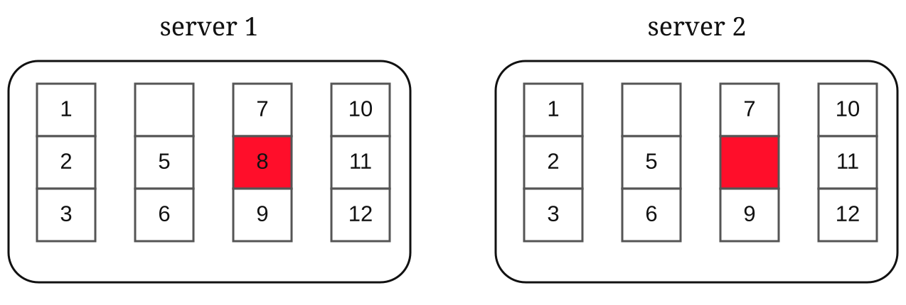
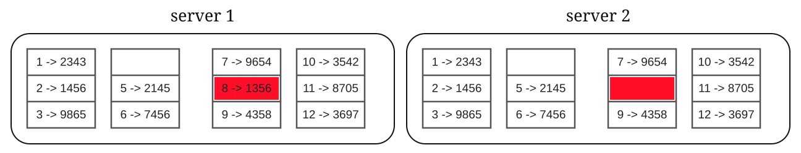
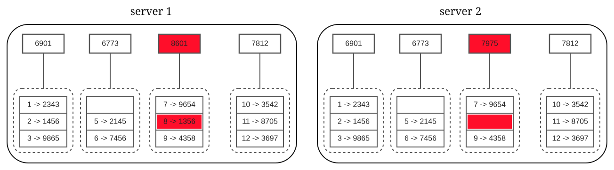
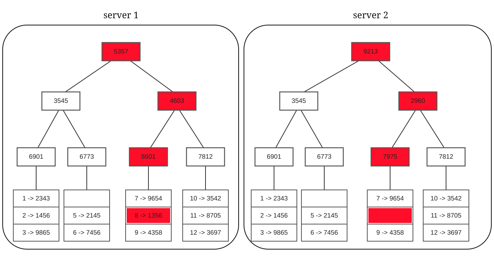
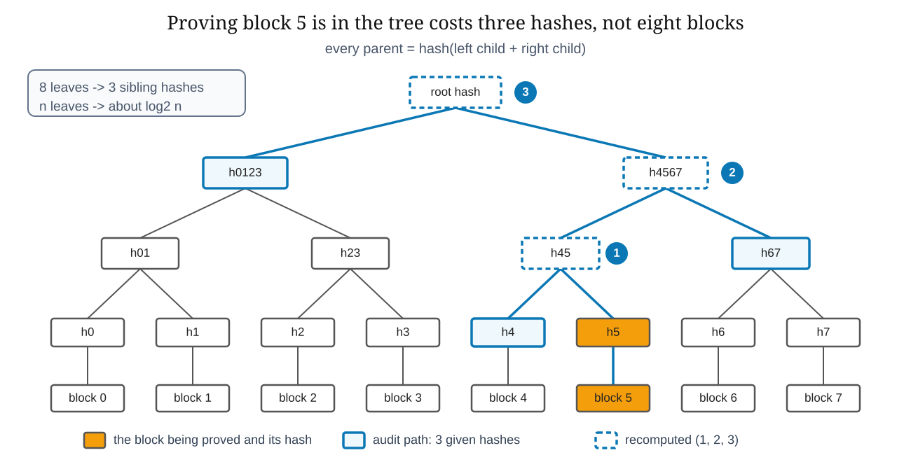

# Data structures. Merkle tree

[Back to Computer Science](../Readme.md#content)

# Front

How does a Merkle tree find the single block two replicas disagree on, or prove that one block of data belongs to a data set, without reading everything?

# Back

A **Merkle tree**, or hash tree, condenses a whole data set into one **root hash**. Each leaf holds the hash of one data block; each parent holds the hash of its children joined together. Changing any byte changes every hash above it up to the root, so comparing or proving data costs about `log2 n` hashes instead of `n` blocks. Ralph Merkle described the idea as *tree authentication* in a 1979 paper.

## How it is built

1. Split the data into blocks. Here a block is a bucket of keys held by two replicas, and key 8 is missing on server 2.

    

2. Hash every key in a bucket, so `1 -> 2343` means key 1 hashes to 2343.

    

3. Reduce each bucket to a single hash. That hash is a leaf.

    

4. Hash each pair of children into a parent, level by level, until one root hash is left. Each panel in the next figure is a finished tree.

## Comparing two copies

Two replicas exchange root hashes. Equal roots mean equal leaves and no synchronization. Unequal roots mean descending only into the children whose hashes differ, so the mismatched bucket is isolated in about `log2 n` comparisons and only that bucket is transferred. Each branch can be checked on its own, without downloading the whole data set. Both sides must bucket their keys the same way, or equal data gives different roots.

## Proving one block belongs

Now take a plain tree over 8 blocks numbered from 0. To prove block 5 is in it, a verifier needs only its **audit path**: the sibling hash at each level, `ceil(log2 n)` nodes at most. It rehashes upward and compares the result with a root it already trusts. Faking a proof would mean finding a hash collision, so a matching root is evidence the block is the one the tree was built over.

## Where it is used

- **Replica repair.** Dynamo and Cassandra keep one tree per key range and stream only the ranges whose hashes differ.
- **Certificate Transparency.** RFC 6962 logs TLS certificates in an append-only Merkle tree, so anyone can prove a certificate is in the log.
- **Bitcoin.** A block header carries only the root, so a light client checks a transaction from headers plus one branch.
- **Git.** A commit names its tree, which names its subtrees and blobs, so one commit id covers every object it reaches — a hash DAG, not a binary tree.
- **BitTorrent v2.** Each file is a tree over 16 KiB blocks, so a peer verifies every piece as it arrives.

## Two things to get right

- **Hash leaves and parents differently.** RFC 6962 prefixes `0x00` to a leaf and `0x01` to an internal node. Without that domain separation an internal node can be replayed as a leaf.
- **Rebuilding is not free.** Dynamo notes that when a node joins or leaves, many key ranges change and their trees must be recalculated.

# Sources

- [RFC 6962 — Certificate Transparency, Merkle Tree Hash and audit paths](https://www.rfc-editor.org/rfc/rfc6962#section-2)
- [Ralph C. Merkle — A Certified Digital Signature (1979, published CRYPTO '89)](http://www.ralphmerkle.com/papers/Certified1979.pdf)
- [Dynamo: Amazon's Highly Available Key-value Store, section 4.7](https://www.allthingsdistributed.com/files/amazon-dynamo-sosp2007.pdf)
- [Apache Cassandra — Dynamo architecture, anti-entropy repair](https://cassandra.apache.org/doc/latest/cassandra/architecture/dynamo.html)
- [Satoshi Nakamoto — Bitcoin: A Peer-to-Peer Electronic Cash System, sections 7 and 8](https://bitcoin.org/bitcoin.pdf)
- [Git — hash function transition, content-addressable object names](https://git-scm.com/docs/hash-function-transition)
- [BEP 52 — The BitTorrent Protocol Specification v2, merkle hash trees](https://www.bittorrent.org/beps/bep_0052.html)
