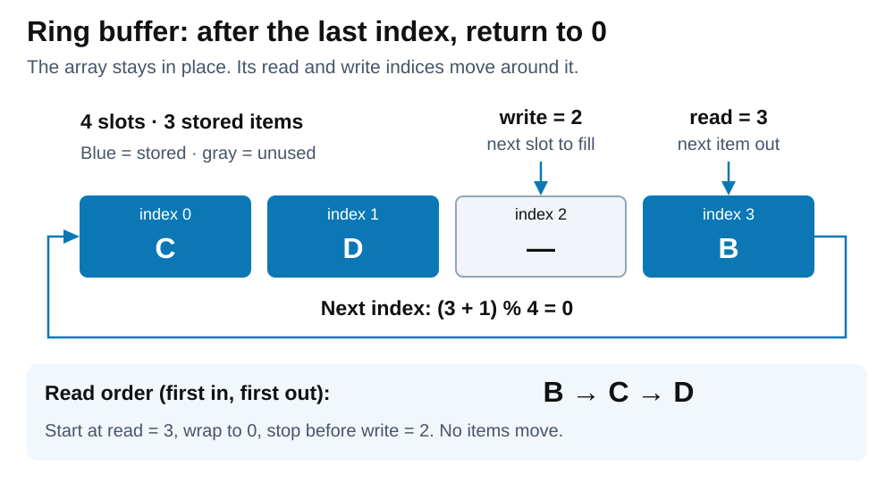
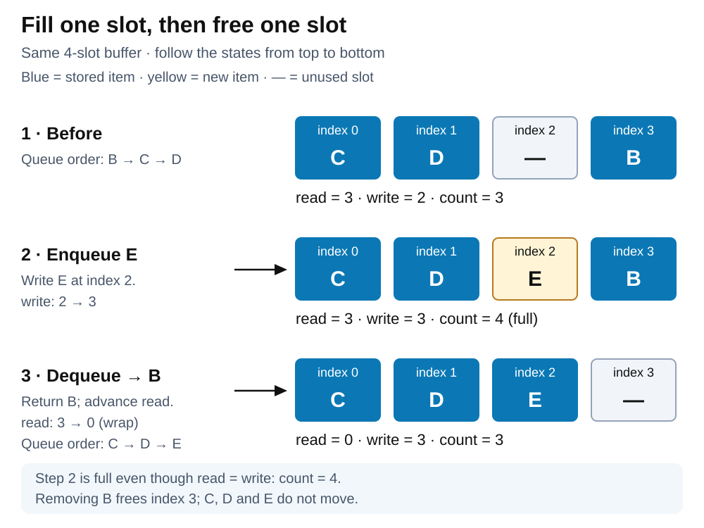

# Data structures. Ring buffer

[Back to Computer Science](../Readme.md#content)

# Front

How does a ring buffer reuse array slots, and how does a growable circular array differ?

# Back

A **ring buffer (circular buffer)** reuses array slots by wrapping indices from the end back to `0`. **Classic ring buffers have fixed capacity; growable circular arrays such as `ArrayDeque` add resizing.** Used as a **first in, first out (FIFO) queue**, it removes the oldest stored item first.

## Fixed-capacity example

This example keeps `N > 0` slots fixed and tracks:

- **`read`:** index of the next item to remove.
- **`write`:** index where the next item will be inserted, when space is available.
- **`count`:** number of stored items.

Advance either index with **`next = (index + 1) % N`**, where `%` means remainder. With four slots, index `3` advances to `0`. The memory is an array; its traversal is circular.

Below, the stored queue is **B → C → D**, even though the array begins with C. Start at `read`, then wrap around; `—` marks an unused slot.

## Add and remove without resizing

1. **Enqueue (add):** if not full, store the item at `write`, advance `write`, and increase `count`.
2. **Dequeue (remove):** if not empty, return the item at `read`, advance `read`, and decrease `count`. That slot becomes reusable.

Continue the same example: enqueue E, then dequeue B. Watch the indices and count; C and D stay in their original slots.

## Empty, full, and overflow

With a count, **`count == 0` means empty; `count == N` means full**. `read == write` can mean either. Alternatively, **omit the count and leave one slot unused**: `read == write` then means empty, and `N` slots hold at most `N − 1` items.

For this fixed-capacity design, a full buffer must **reject the new item, wait for space, or overwrite the oldest item**. Overwriting intentionally loses unread data; it is useful for keeping only the latest samples. With our indices, overwrite at `write`, advance **both** indices, and keep `count = N`. When empty, a dequeue must report no item or wait.

## Cost and use

- **Time (fixed capacity):** enqueue and dequeue take **O(1)** (work does not grow with item count) for fixed-size items or references, excluding any wait for space or data.
- **Space:** **O(N)** for `N` slots. Without resizing, operations reuse the allocated storage.
- **Uses:** bounded queues between a producer (which adds data) and a consumer (which removes it), or a rolling history of the latest samples.
- **Concurrency:** a ring buffer is not automatically safe for concurrent access. Sharing it across threads needs synchronization, such as a lock or a correctly designed atomic algorithm.

## Java examples

The first two are standard-library implementations, verified in **OpenJDK 25**; the others require libraries.

| Type | How it uses circular storage |
| --- | --- |
| `ArrayDeque` | Growable circular array supporting both ends. Not thread-safe. End operations are **amortized O(1)** (averaged over many operations); a resize allocates a larger array and copies items in **O(n)** for `n` stored items. |
| `ArrayBlockingQueue` | Fixed circular array with a count and lock. Thread-safe FIFO; when full, `put(e)` waits and `offer(e)` returns `false`. |
| Apache Commons Collections `CircularFifoQueue` | Fixed capacity; adding when full discards the oldest item. |
| LMAX Disruptor `RingBuffer` | Event slots allocated in advance and reused; sequence numbers track producer/consumer progress. |

# Sources

- [Linux Kernel — Circular buffers: indices, wraparound, reserved-slot design, and synchronization](https://www.kernel.org/doc/html/latest/core-api/circular-buffers.html)
- [Boost.Circular Buffer — Rationale: storage, constant-time operations, and applications](https://www.boost.org/doc/libs/latest/doc/html/circular_buffer/rationale.html)
- [Boost.Circular Buffer — Full and empty handling, overwrite policy, and thread safety](https://www.boost.org/doc/libs/latest/doc/html/circular_buffer/implementation.html)
- [Boost.Circular Buffer source — Stored size, full/empty checks, and index updates](https://github.com/boostorg/circular_buffer/blob/develop/include/boost/circular_buffer/base.hpp)
- [OpenJDK 25 — ArrayDeque: circular indices, resizing, complexity, and thread safety](https://github.com/openjdk/jdk/blob/jdk-25-ga/src/java.base/share/classes/java/util/ArrayDeque.java)
- [OpenJDK 25 — ArrayBlockingQueue: circular array, count, locking, and full-queue behavior](https://github.com/openjdk/jdk/blob/jdk-25-ga/src/java.base/share/classes/java/util/concurrent/ArrayBlockingQueue.java)
- [Apache Commons Collections — CircularFifoQueue source: wraparound and oldest-item eviction](https://commons.apache.org/proper/commons-collections/xref/org/apache/commons/collections4/queue/CircularFifoQueue.html)
- [LMAX Disruptor — User guide: ring buffer, event preallocation, and sequence tracking](https://lmax-exchange.github.io/disruptor/user-guide/)
