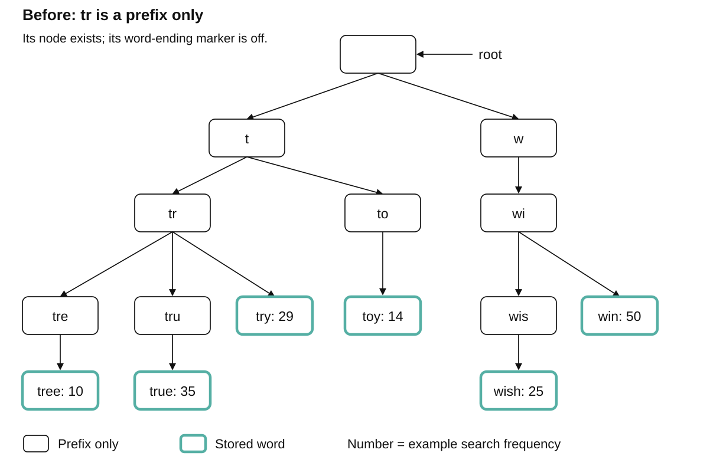
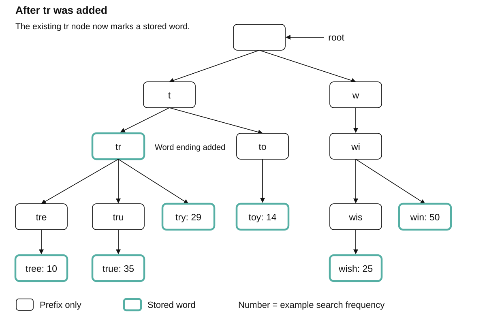

# Data structures. Trie

[Back to Computer Science](../Readme.md#content)

# Front

What is Trie?

# Back

**A trie (prefix tree) is a tree data structure that stores strings, such as words, along character paths.** Words with the same beginning share nodes, supporting exact-word and prefix lookups.

## How it works

A **prefix** is an initial sequence of characters, such as `tr` in `tree`. The **root** is the starting node and represents the empty prefix. In a basic character trie, each downward step adds one character; paths branch when the next character differs.

`tree`, `true`, and `try` share `root → t → tr`, then branch. Boxes show the whole prefix reached so far. Solid teal outlines mark stored words; black outlines mean prefix only. Numbers are optional example search frequencies.

## The lookup contrast

The `tr` node already exists, but its word-ending marker is off:

| Question | Result |
| --- | --- |
| Is `tr` a stored word? | **No:** its node has no word-ending marker. |
| Does any stored word start with `tr`? | **Yes:** the prefix path exists and leads to stored words. |
| Which stored words start with `tr`? | `tree`, `true`, `try`: explore only the subtree below `tr`. |

**Prediction: what changes when we add `tr` as a stored word?** Its existing node gains a word-ending marker, shown by a teal outline. **No new nodes are needed.** Its children stay: a stored word can also be a prefix of longer words.

## Time Complexity

For a fixed alphabet and constant-time child access:

- **Insert, exact lookup, or delete:** **O(L)** for a word of `L` characters.
- **Reach a prefix:** **O(P)** for `P` characters.
- **List matches:** **O(P + V + C)**, where `V` is the number of nodes visited in that subtree and `C` is the number of characters returned. Finding the prefix alone does not list its matches.

## Space Complexity

Let `S` be the total characters in all stored words. There are at most `S + 1` nodes, including the root: **O(S)** worst-case space for a fixed alphabet. Shared prefixes reduce the node count. An array of child pointers at every node can still use substantial memory.

## Where it is used

- **Autocomplete:** typing `tr` can suggest `tree`, `true`, and `try`.
- **Dictionary lookup and spell checking:** check whether a complete word is stored. Suggesting typo corrections needs extra matching logic.
- **Internet Protocol (IP) routing:** trie variants follow address bits to select the most specific matching network route.

Java SE 26 has no standard Collections trie. Apache Commons Collections provides `PatriciaTrie` for string prefix queries.

# Sources

- [Princeton Algorithms — Tries: prefix matching, word boundaries, and applications](https://algs4.cs.princeton.edu/52trie/)
- [Princeton Algorithms — TrieST implementation and operation costs](https://algs4.cs.princeton.edu/code/edu/princeton/cs/algs4/TrieST.java.html)
- [Linux Kernel documentation — LC-trie and longest-prefix route lookup](https://docs.kernel.org/networking/fib_trie.html)
- [Java SE 26 — Collections Framework](https://docs.oracle.com/en/java/javase/26/docs/api/java.base/java/util/doc-files/coll-index.html)
- [Apache Commons Collections — PatriciaTrie](https://commons.apache.org/proper/commons-collections/apidocs/org/apache/commons/collections4/trie/PatriciaTrie.html)
- [Repository chapter 13 — Search Autocomplete, adapted trie diagram](../../system%20design/13.%20Search%20Autocomplete/Readme.md)
