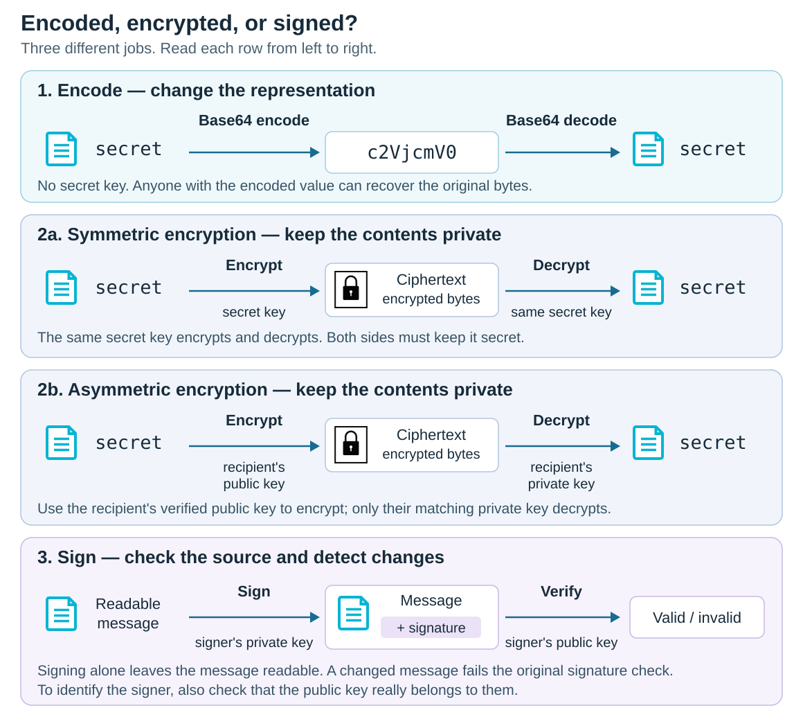

# Encoded vs Encrypted

<sub>[Back to Computer Science](../Readme.md#content)</sub>

# Front

How do encoding, encryption, and digital signatures differ, and why doesn't Base64 protect secrets?

# Back

**Encoding** changes how data is represented so it can be stored or transmitted; decoding needs no secret.

**Encryption** protects confidentiality: recovering the original data requires the correct decryption key.

A **digital signature** lets a recipient check who signed data and whether it changed; signing alone does not hide the data.

Read each row from left to right. Decoding recovers the original bytes without a key; decryption needs a key; signature verification returns a pass/fail result.



## Why doesn't Base64 protect secrets?

**Base64** represents bytes using a fixed alphabet of printable characters. Its rules are public and reversible, with no secret key. For example, `secret` becomes `c2VjcmV0`; anyone who obtains that value can decode it:

```python
import base64

print(base64.b64decode("c2VjcmV0").decode("utf-8"))  # secret
```

An unfamiliar-looking string is not evidence of secrecy. Base64 is useful for carrying binary data through text-based formats, but it adds no confidentiality.

## What changes with encryption?

Encryption turns **plaintext** (the original data) into **ciphertext** (encrypted data), using a cryptographic key. Secure encryption makes recovering plaintext without the correct decryption key computationally infeasible.

- **Symmetric encryption:** the same secret key encrypts and decrypts.
- **Asymmetric encryption:** the recipient has a mathematically related **public/private key pair**. The public key can be shared; the private key stays secret. A sender encrypts with the **recipient's public key**; the recipient decrypts with their **private key**. The sender must check that the public key really belongs to the recipient.

A common **hybrid** design uses asymmetric encryption to protect a symmetric key, then uses that symmetric key to encrypt the actual data.

Ciphertext can also be Base64-encoded for transport: decoding removes that representation layer, but the result is still encrypted.

## How do digital signatures fit in?

Signing uses the message and the **signer's private key** to produce a signature. Verification checks the message and signature using the **signer's public key**. Changing the message makes the original signature fail verification. Signing is a separate operation, not "encryption with the private key."

To identify the signer, you must also trust that the public key belongs to them, for example through a checked certificate. A valid signature does not make the message confidential or its claims true.

Existing signature algorithms include **RSA (Rivest–Shamir–Adleman)** signatures, **ECDSA (Elliptic Curve Digital Signature Algorithm)**, and **Ed25519**, a member of the **EdDSA (Edwards Curve Digital Signature Algorithm)** family.

For example, a signed file can remain readable while its signature lets you check its source and detect changes. Encrypt it as well when its contents must stay private.

# Sources

- [RFC 4648 — Base64 representation, decoding, and lack of confidentiality (§§1, 4, 12)](https://www.rfc-editor.org/rfc/rfc4648.html)
- [NIST — Encryption, plaintext, ciphertext, and keys](https://csrc.nist.gov/glossary/term/encryption)
- [NIST — Symmetric keys for encryption and decryption](https://csrc.nist.gov/glossary/term/symmetric_key)
- [RFC 8017 — Recipient public/private keys, hybrid encryption, and separate encryption/signature schemes (§§7–8)](https://www.rfc-editor.org/rfc/rfc8017.html)
- [NIST — Digital signatures: origin authentication, integrity, and non-repudiation](https://csrc.nist.gov/glossary/term/digital_signature)
- [FIPS 186-5 — Signature generation, verification, identity assurances, RSA, ECDSA, and EdDSA (§§3, 5–7)](https://nvlpubs.nist.gov/nistpubs/FIPS/NIST.FIPS.186-5.pdf)
- [RFC 8032 — EdDSA and Ed25519 signing and verification (§§3, 5.1)](https://www.rfc-editor.org/rfc/rfc8032.html)
