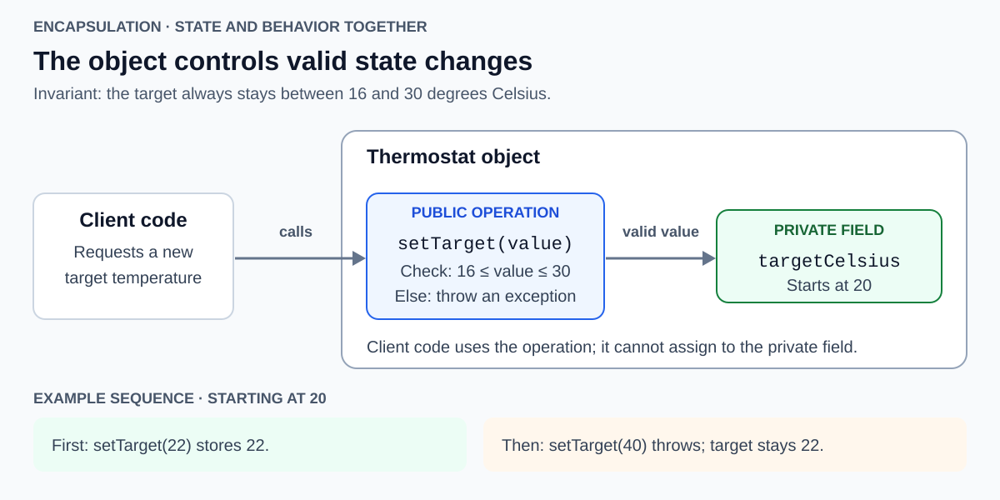
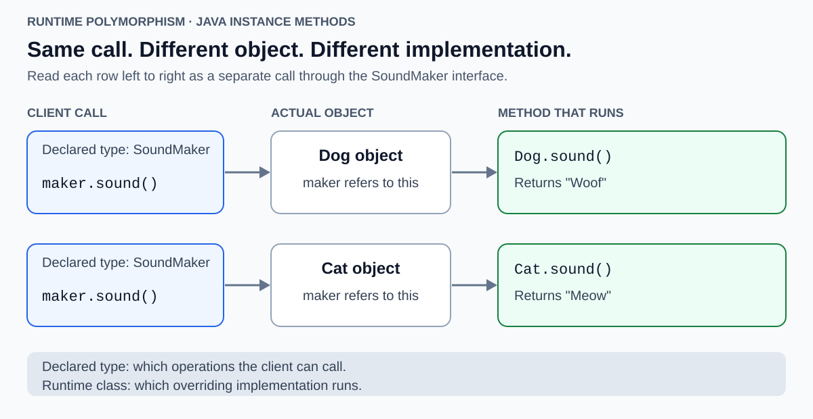

# Fundamental Principles of OOP

<sub>[Back to Computer Science](../Readme.md#content)</sub>

**Object-oriented programming (OOP) organizes software around objects that combine state with behavior.** Four commonly taught principles explain how those objects are designed and used: **encapsulation, abstraction, inheritance, and polymorphism**. This article builds the vocabulary, explains each principle with Java examples, and compares Java's forms of polymorphism: runtime dispatch, compile-time overloading, generics, and implicit conversions.

## Objects, classes, and contracts

An **object** is a particular entity in a running program. Its **state** is the data it holds; its **behavior** is the work it can perform. In Java, fields store state and methods define behavior. A thermostat object might store a target temperature and offer a method to change it.

A **class** defines how objects of that kind are structured and behave. An object created from a class is an **instance**. Two thermostat instances can have different target temperatures even though they use the same class definition. A **constructor** initializes a new instance.

A **client** is code that uses an object. A **contract** describes what the client may request and what the object promises in return, including valid inputs and results. Method names and parameter types express part of a contract; documentation and tests capture behavioral promises too.

| Principle | Question it answers | Example |
| --- | --- | --- |
| Encapsulation | Who controls access to state and its changes? | A thermostat validates a target before storing it. |
| Abstraction | What does the client need to know? | A client requests `sound()` without knowing how it is produced. |
| Inheritance | What can a more specialized class inherit? | `Dog` extends `Animal` and inherits its `name()` method. |
| Polymorphism | How can one operation support different implementations? | The same `sound()` call returns a dog or cat sound. |

## Encapsulation: keep state and its rules together

**Encapsulation bundles state with the behavior that manages it and controls access to implementation details.** An object can expose useful operations while keeping its fields private.

An **invariant** is a condition that must hold for the object's valid states. In this example, the target must remain between 16 and 30 degrees Celsius, inclusive. Read the diagram from left to right: the client calls a public operation, that operation checks the request, and only an accepted value reaches the private field.



This complete example can be saved as `ThermostatDemo.java`:

```java
class Thermostat {
    private int targetCelsius = 20;

    public void setTarget(int requested) {
        if (requested < 16 || requested > 30) {
            throw new IllegalArgumentException("Target must be 16..30 C");
        }
        targetCelsius = requested;
    }

    public int target() {
        return targetCelsius;
    }
}

public class ThermostatDemo {
    public static void main(String[] args) {
        Thermostat thermostat = new Thermostat();
        thermostat.setTarget(22);
        System.out.println(thermostat.target());

        try {
            thermostat.setTarget(40);
        } catch (IllegalArgumentException exception) {
            System.out.println(exception.getMessage());
        }
        System.out.println(thermostat.target());
    }
}
```

Output:

```text
22
Target must be 16..30 C
22
```

`setTarget(40)` throws **`IllegalArgumentException`** before assignment, leaving the target at `22`. The `catch` block handles that exception and prints its message, allowing the final `target()` call to run. Without the catch, the exception would escape `main` and terminate this demo before its final print.

Separate client code cannot assign directly to the private field. Adding `thermostat.targetCelsius = 40;` inside `ThermostatDemo.main` fails at compile time with `targetCelsius has private access in Thermostat`.

The validation is essential: making a field private but providing an unrestricted setter would still allow invalid values. A public method should express a permitted operation and preserve the object's rules.

## Abstraction: expose a useful contract

**Abstraction describes the relevant capabilities of an object while leaving out details the client does not need.** For the thermostat, the client works with a target temperature. It does not need to know how that value is represented internally.

Encapsulation and abstraction support each other, but emphasize different things:

- **Abstraction:** the client can request `setTarget(22)` and rely on its documented meaning.
- **Encapsulation:** the implementation owns the field and checks requests before changing it.

In the animal example below, a Java **interface** named `SoundMaker` declares the operation `String sound()`. Our example's contract is “return a non-null text representation of a sound.” Clients can use that operation without depending on a particular animal class. The compiler checks the method requirements; it does not prove the non-null behavioral promise.

This complete program combines the interface, class inheritance, and runtime calls. Save it as `OopDemo.java`:

```java
interface SoundMaker {
    String sound();
}

abstract class Animal implements SoundMaker {
    private final String name;

    protected Animal(String name) {
        this.name = name;
    }

    public String name() {
        return name;
    }
}

class Dog extends Animal {
    Dog(String name) {
        super(name);
    }

    @Override
    public String sound() {
        return "Woof";
    }
}

class Cat extends Animal {
    Cat(String name) {
        super(name);
    }

    @Override
    public String sound() {
        return "Meow";
    }
}

public class OopDemo {
    public static void main(String[] args) {
        Dog dog = new Dog("Rex");
        System.out.println(dog.name());

        SoundMaker[] makers = {dog, new Cat("Mimi")};
        for (SoundMaker maker : makers) {
            System.out.println(maker.sound());
        }
    }
}
```

Output:

```text
Rex
Woof
Meow
```

`@Override` asks the compiler to check that the method implements or overrides a method from a superclass or interface. The annotation helps catch mistakes; removing it leaves this program's output unchanged.

### Why Animal can omit sound()

An **abstract class** cannot be instantiated directly. It can supply shared fields and implemented methods while leaving some operations for concrete subclasses. **An abstract class may implement an interface without implementing all its abstract methods.** `Animal` inherits the abstract `sound()` requirement from `SoundMaker`; it does not have to repeat the declaration. It supplies the name-related state and behavior, while `Dog` and `Cat` implement `sound()`.

A **concrete class** is a class that is not abstract. It must provide or inherit implementations of all required abstract methods. These changes to the example show the rule in action. The diagnostic excerpts below were checked with `javac` 25; wording can vary between compiler versions.

| Change to the example | Compiler diagnostic |
| --- | --- |
| Remove the entire `sound()` method from `Dog`, leaving `Dog` concrete. | `Dog is not abstract and does not override abstract method sound() in SoundMaker` |
| Add `new Animal("Rex")` in `main`. | `Animal is abstract; cannot be instantiated` |

### Interfaces and abstract classes

| Java mechanism | Useful role |
| --- | --- |
| Interface | Define a capability that different classes can provide. A class can implement multiple interfaces. |
| Abstract class | Share instance state and implementation across related subclasses. A class can extend only one class. |

Abstraction is a design principle, not a synonym for Java's `abstract` keyword. An ordinary class with a useful public API can also provide an abstraction. Interfaces can also contain default method implementations; they are not limited to declarations without bodies.

## Inheritance: specialize an existing class

**Inheritance creates a subclass from a superclass.** The subclass can use inherited accessible members, add operations, and override eligible instance methods. In Java, `extends` declares class inheritance; `implements` declares that a class provides an interface's contract.

In the `OopDemo.java` example above, `Animal` is the superclass, and `Dog` and `Cat` are subclasses. Both inherit `name()`. Their constructors call `super(name)` to initialize the part defined by `Animal`. Constructors themselves are not inherited. The private `name` field remains controlled by `Animal`; subclasses use its method to read it.

Inheritance also creates a type relationship: a `Dog` can be used where an `Animal` is expected. Because `Animal` implements `SoundMaker`, a `Dog` is also usable as a `SoundMaker`.

### Preserve the parent's promises

A useful “is-a” relationship is about behavior, not just a label. A subtype should honor the contract clients rely on. If `sound()` promises a non-null string, a subclass returning `null` would violate that promise even though the code compiles. This is the concern behind the [Liskov substitution principle](../SOLID/Readme.md#l--liskov-substitution-principle).

### Reuse through composition

**Object composition** builds behavior by holding and using other objects. **Delegation** means passing some work to such a collaborator. A car can hold an engine and ask it to start: the car *has an* engine, so reusing engine behavior does not require making `Car` extend `Engine`.

As a design guideline, prefer a collaborator when the goal is simply to reuse its work. Choose inheritance when the specialized type can preserve the parent's contract and the shared class structure is useful.

## Polymorphism: one operation, different implementations

**Subtype polymorphism lets client code use objects of different classes through a common type.** For an overridden instance method, **dynamic dispatch** selects the implementation using the actual object's runtime class.

The diagram shows the calls in the `OopDemo.java` loop above. Read each row as a separate call. The variable has the same declared type, `SoundMaker`, and the client uses the same expression, `maker.sound()`. A `Dog` object selects `Dog.sound()`; a `Cat` object selects `Cat.sound()`. Each call runs the implementation for its actual object.



### Declared type and runtime class have different jobs

The **declared type** determines which members client code can use through a variable. `maker.sound()` compiles because `SoundMaker` declares `sound()`. Replacing it with `maker.name()` fails at compile time with `cannot find symbol`, identifying `method name()` on a variable of type `SoundMaker`. That interface does not declare `name()`, even though these particular objects have it.

The **runtime class** determines which overriding implementation of the selected instance method runs. Referring to a `Dog` through a `SoundMaker` variable does not turn it into another object or change its class.

The loop contains no dog-versus-cat branch. Another class can provide `SoundMaker`, and the same loop can call it once an instance is supplied. Sharing an `Animal` superclass is optional for this: an unrelated `Robot` class could implement `SoundMaker` directly.

## Kinds of polymorphism in Java

**Java teaching terminology often distinguishes compile-time polymorphism through overloading from runtime polymorphism through overriding.** The Java Language Specification describes the underlying rules as overload resolution and dynamic method lookup. A broader programming-language classification also includes **parametric polymorphism** through generics and **coercion** through implicit conversions. These classifications ask different questions: when a method choice is made, or how code accepts different types. State which classification you mean instead of assuming a universal count.

In this broader classification, **inclusion** means that an object of a specialized type can also be used through a more general type. **Ad hoc** groups overloading and coercion: separately defined operations or conversions handle particular types. **Parametric** means that a declaration uses a type parameter—a placeholder for a type, such as `T`—to work across types. These terms describe mechanisms; the compile-time and runtime labels describe when method choices are made.

| Form | Java mechanism | What varies? |
| --- | --- | --- |
| **Subtype / inclusion** | Superclass or interface references; runtime dispatch for overridden instance methods | Objects of different classes can be used through a common type. |
| **Ad hoc overloading**, commonly called compile-time or static polymorphism | Methods with the same name and different parameter lists | The compiler chooses among separately declared methods. |
| **Parametric** | Generic classes, interfaces, and methods, such as `List<T>` or `<T> T identity(T value)` | One declaration works with different type arguments. |
| **Coercion**, included in broader classifications | Permitted implicit conversions, such as `int` to `double` | A value is converted to a type the surrounding code accepts. |

### Runtime polymorphism: subtype implementations

The earlier `SoundMaker` example demonstrates this form: the same `maker.sound()` expression calls `Dog.sound()` or `Cat.sound()` according to the actual object's class. Both class inheritance and interface implementation can supply the common type. The polymorphism diagram shows this runtime choice.

### Compile-time polymorphism: overloaded methods

Overloading provides multiple methods with the same name but different parameter types or counts. The compiler selects a signature using the call's compile-time types and Java's applicable-method rules. **“Static polymorphism” does not mean the methods must have the `static` modifier:** instance methods can be overloaded too.

Using the `SoundMaker` and `Dog` definitions from `OopDemo.java`, save this additional class as `OverloadDemo.java` and compile the two files together:

```java
public class OverloadDemo {
    static String describe(SoundMaker maker) {
        return "SoundMaker overload";
    }

    static String describe(Dog dog) {
        return "Dog overload";
    }

    public static void main(String[] args) {
        SoundMaker maker = new Dog("Rex");
        System.out.println(describe(maker));
        System.out.println(describe(new Dog("Rex")));
        System.out.println(maker.sound());
    }
}
```

Output:

```text
SoundMaker overload
Dog overload
Woof
```

Although `maker` refers to a `Dog`, its declared type is `SoundMaker`, so `describe(maker)` selects `describe(SoundMaker)`. The expression `new Dog("Rex")` has type `Dog`, so the next call selects `describe(Dog)`. The final call uses runtime dispatch to run `Dog.sound()`.

**Overloading and overriding can both affect one call:** the compiler first selects the method signature; runtime dispatch then selects the overriding implementation if applicable. Overloading does not choose a signature from an argument's runtime class. Changing only the return type is not enough to create an overload.

Static method **hiding** is a separate mechanism: a subclass declares a static method matching one in its superclass. Selection uses compile-time type information; static methods are not overridden. Hiding is not the same as overloading or runtime dispatch.

### Parametric polymorphism: generics

A **type parameter**, such as `T`, stands for a type supplied or inferred when generic code is used. A generic method can express a relationship between its input and output types without declaring a separate overload for every type.

This example also uses the earlier `Dog` class. Save it as `GenericsDemo.java` and compile it together with `OopDemo.java`:

```java
public class GenericsDemo {
    static <T> T identity(T value) {
        return value;
    }

    public static void main(String[] args) {
        String text = identity("hello");
        Dog dog = identity(new Dog("Rex"));
        System.out.println(text);
        System.out.println(dog.sound());
    }
}
```

The output is `hello`, followed by `Woof`. The compiler infers `String` and `Dog` for the two calls. Both use the same method body, which returns its argument unchanged. By contrast, overloading declares separate methods, and subtype polymorphism can select different overriding bodies.

Java implements generics using **type erasure**: type parameters are replaced by their bounds, or by `Object` when unbounded, in the compiled representation. Generic use is checked at compile time; it does not create a separate runtime class for every type argument. Generics and subtype polymorphism can still be combined in the same design.

### Coercion: implicit conversion

**Coercion** means automatically converting a value to an accepted type. For example, `double amount = 5;` is an **assignment context**: Java widens the `int` value `5` to the `double` value `5.0`. Similarly, an **invocation context** permits an `int` argument to be widened when passed to a method parameter of type `double`.

Java specifies these rules as conversions; the label “coercion polymorphism” comes from the broader classification. The numeric value is converted to the required type; no subclass override is selected.

## Self-check

1. Why does `Animal` compile without implementing `sound()`, while a concrete `Dog` without that method fails?

   <details>
   <summary>Answer</summary>

   An abstract class can leave interface methods unimplemented. A concrete subclass must provide or inherit every required implementation.

   </details>

2. After `setTarget(22)`, what happens when the caller invokes `setTarget(40)`? How can it then inspect the target?

   <details>
   <summary>Answer</summary>

   The call throws `IllegalArgumentException` before changing the field, so the target remains `22`. Catch the exception, then call `target()`.

   </details>

3. With `SoundMaker maker = new Dog("Rex")`, which `describe` overload is selected, which `sound()` implementation runs, and why does `maker.name()` fail?

   <details>
   <summary>Answer</summary>

   The declared type selects `describe(SoundMaker)`; the actual `Dog` object selects `Dog.sound()`. `SoundMaker` has no `name()` method, so that call fails at compile time.

   </details>

4. How does `identity(T value)` differ from overloaded `describe` methods, and which conversion occurs in `double amount = 5;`?

   <details>
   <summary>Answer</summary>

   `identity` has one generic declaration with a type parameter; `describe` has separate overloads. The assignment widens `int` to `double`.

   </details>

# Sources

- [Microsoft Learn — Object-oriented programming: the four principles](https://learn.microsoft.com/en-us/dotnet/csharp/fundamentals/tutorials/oop)
- [Oracle Java Tutorials — What Is an Object? State, behavior, and encapsulation](https://docs.oracle.com/javase/tutorial/java/concepts/object.html)
- [Oracle Java Tutorials — What Is a Class? Classes and individual instances](https://docs.oracle.com/javase/tutorial/java/concepts/class.html)
- [Oracle Java Tutorials — Providing Constructors for Your Classes](https://docs.oracle.com/javase/tutorial/java/javaOO/constructors.html)
- [Oracle Java Tutorials — Interfaces: contracts and implementation independence](https://docs.oracle.com/javase/tutorial/java/IandI/createinterface.html)
- [Oracle Java Tutorials — Abstract Methods and Classes](https://docs.oracle.com/javase/tutorial/java/IandI/abstract.html)
- [Oracle Java Tutorials — Inheritance: members, constructors, and private state](https://docs.oracle.com/javase/tutorial/java/IandI/subclasses.html)
- [Oracle Java Tutorials — Using an Interface as a Type](https://docs.oracle.com/javase/tutorial/java/IandI/interfaceAsType.html)
- [Oracle Java Tutorials — Polymorphism](https://docs.oracle.com/javase/tutorial/java/IandI/polymorphism.html)
- [Oracle Java Tutorials — Overriding and Hiding Methods](https://docs.oracle.com/javase/tutorial/java/IandI/override.html)
- [Java Language Specification, Java SE 25 — §9.6.4.4: @Override, including interface methods](https://docs.oracle.com/javase/specs/jls/se25/html/jls-9.html#jls-9.6.4.4)
- [Java Language Specification, Java SE 25 — §8.4.2 Method Signature and §8.4.9 Overloading](https://docs.oracle.com/javase/specs/jls/se25/html/jls-8.html#jls-8.4.9)
- [University of Tartu — Polymorphism in Java: compile-time/static and runtime/dynamic teaching terminology](https://courses.cs.ut.ee/2018/oopn/spring/Main/PART5D)
- [Oracle Java Tutorials — Generic Methods: type parameters and type inference](https://docs.oracle.com/javase/tutorial/java/generics/methods.html)
- [Oracle Java Tutorials — Type Erasure](https://docs.oracle.com/javase/tutorial/java/generics/erasure.html)
- [Java Language Specification, Java SE 25 — §5.1.2 Widening Primitive Conversion and §5.3 Invocation Contexts](https://docs.oracle.com/javase/specs/jls/se25/html/jls-5.html#jls-5.1.2)
- [Java Language Specification, Java SE 25 — §5.2: Assignment Contexts](https://docs.oracle.com/javase/specs/jls/se25/html/jls-5.html#jls-5.2)
- [Luca Cardelli and Peter Wegner — On Understanding Types, Data Abstraction, and Polymorphism, §1.3: classification of polymorphism](https://www.classes.cs.uchicago.edu/archive/2012/spring/22300-1/papers/Cardelli-Wegner.pdf)
- [Barbara Liskov and Jeannette Wing — A Behavioral Notion of Subtyping](https://www.cs.cmu.edu/~wing/publications/LiskovWing94.pdf)
- [New York University — Object-Oriented Programming: composition, delegation, and criteria for using inheritance](https://cs.nyu.edu/~wies/teaching/oop-13/notes1003.html)
