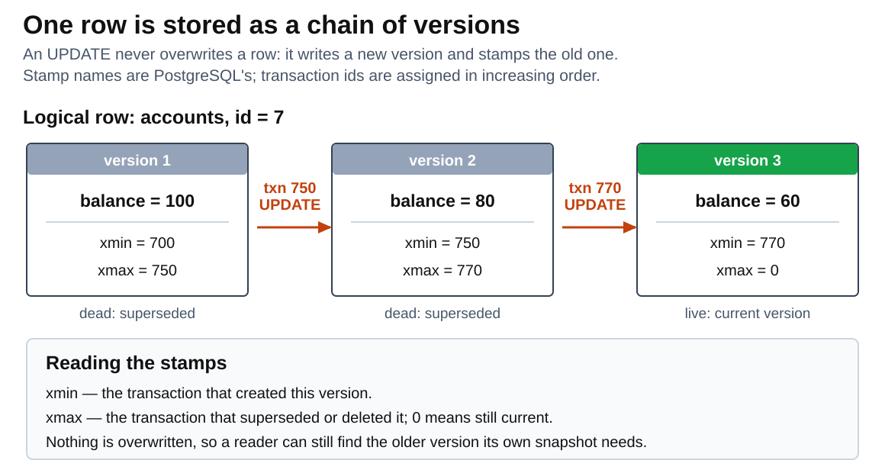
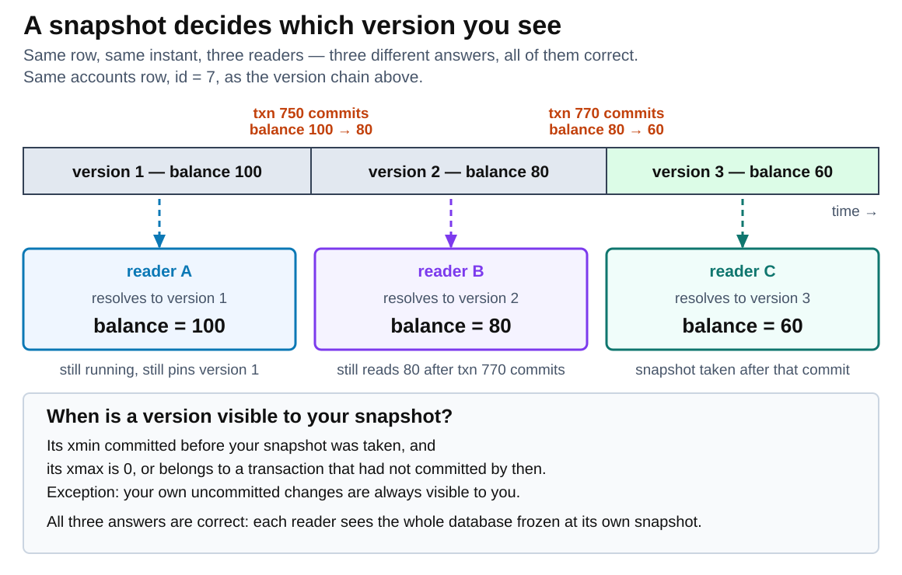
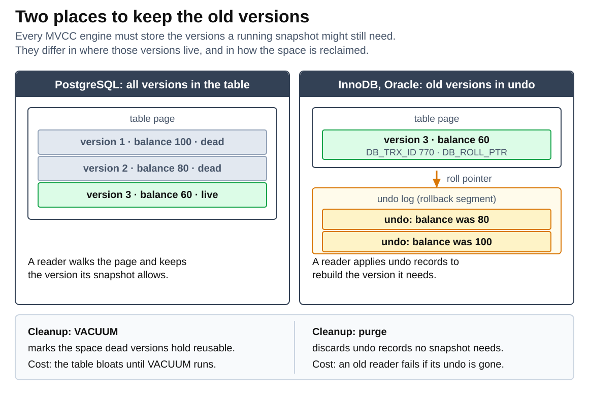
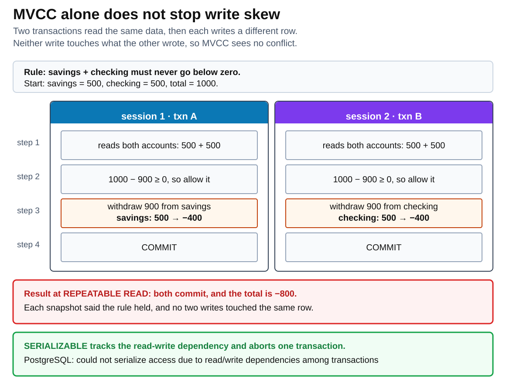

# Multiversion concurrency control

<sub>[Back to Computer Science](../Readme.md#content)</sub>

**Multiversion concurrency control (MVCC) lets readers and writers work on the same rows at the same time by keeping several versions of each row instead of one.**

A writer does not overwrite a row: it stores a new version and leaves the old one in place. A reader is given a *snapshot* — a point in time — and returns the newest version that was already committed at that point. Because a writer never destroys the version a reader still needs, PostgreSQL can state the whole benefit in one sentence: "reading never blocks writing and writing never blocks reading".

This article builds the idea in five moves: how one row becomes a chain of versions; how a snapshot picks one version out of that chain; where engines physically keep the old versions; what cleaning them up costs; and what MVCC still leaves you to handle yourself, namely colliding writers and the anomaly called write skew.

## The problem MVCC solves

With only one copy of each row, a database has to use locks to stop a reader from seeing a half-finished write. A reader takes a shared lock, a writer needs an exclusive one, and whoever arrives second waits. One long report then stalls every update to the rows it touches, and one slow update stalls every reader of those rows. The two workloads fight over the same resource even though they want different things from it.

MVCC removes that fight for the common case. The old version is still stored, so a reader never has to wait for a writer to finish — it reads the version that was current when its snapshot was taken. Explicit table- and row-level locks remain available for the points where you deliberately want to serialize access, but they stop being the default cost of every query.

## Vocabulary

- **Row version** — one stored copy of a row's contents at one moment in its history. PostgreSQL calls a stored version a *tuple*.
- **Transaction ID** — a number the database assigns to a transaction when it first writes, increasing over time. PostgreSQL abbreviates it *XID*; Oracle orders the same way using a *system change number* (SCN).
- **Snapshot** — the instant a transaction reads at, together with the set of transactions that had not committed yet at that instant.
- **Visible** — a version is visible to a snapshot when the snapshot's rules say that this is the version to return.
- **Dead version** — a version that no running or future snapshot can still need. It is garbage waiting to be collected.
- **Isolation level** — the per-transaction setting that decides which concurrency anomalies the database is obliged to prevent for you. It controls when your snapshot is taken and how a write conflict is resolved, so almost every behaviour below depends on it.
- **Snapshot isolation** — the behaviour you get when a single snapshot serves an entire transaction rather than a single statement. PostgreSQL's `REPEATABLE READ` and InnoDB's default `REPEATABLE READ` are snapshot isolation; SQL Server names such a level `SNAPSHOT` outright.

## A row is a chain of versions

A single logical row — one primary key, one thing in the world — is stored as a sequence of physical versions. Each `UPDATE` appends a new version and marks the previous one as superseded, so the history of the row accumulates rather than being replaced.



Read the diagram left to right as the row's history. Every PostgreSQL version carries two 4-byte stamps in its header: `t_xmin`, the insert XID stamp, records the transaction that created the version; `t_xmax`, the delete XID stamp, records the transaction that superseded or deleted it. Version 1 was created by transaction 700 and superseded by transaction 750, so it carries both stamps. Version 3 was created by transaction 770 and nothing has replaced it, so its `t_xmax` is still zero and it is the current version.

You do not have to take this on faith. PostgreSQL exposes those stamps as system columns on every table — `xmin` holds the ID of the transaction that inserted this version, and `xmax` holds the ID of the transaction that deleted it, or zero while the version has not been deleted — so you can select them by name:

```sql
SELECT xmin, xmax, id, balance FROM accounts WHERE id = 7;
```

That returns one row, because your own snapshot can see only one version of it. The stamps in that row are exactly the ones the diagram draws.

Two consequences follow immediately, and they explain most of MVCC's behaviour:

- A `DELETE` does not erase anything either. It only stamps the current version's `t_xmax` with the deleting transaction's ID. The bytes stay on disk until cleanup runs.
- Storage grows with the number of *writes*, not with the number of rows. A table holding a thousand live rows that has absorbed a million updates has stored a million versions.

## A snapshot decides which version you see

The version chain is the static picture. The behaviour comes from what happens when a reader meets that chain: the snapshot it holds selects exactly one version, and different readers at the same instant can legitimately select different ones.



The band across the top is the same row over time; each stretch is the period during which that version was the newest committed one. Each reader's snapshot instant drops into exactly one stretch, and that is the version it returns. Reader A snapshotted before transaction 750 committed, so it still reads 100. Reader B snapshotted between the two commits and reads 80 — and it keeps reading 80 even after transaction 770 commits, because its snapshot predates that commit. Reader C snapshotted last and reads 60. All three answers are correct: each reader sees a self-consistent picture of the entire database frozen at its own instant, not a mixture of old and new rows.

The rule is worth memorizing in the form the diagram states it. A version is visible to your snapshot when its `xmin` committed before your snapshot was taken, **and** its `xmax` is either zero or belongs to a transaction that had not committed by then. One exception matters more than all the others, and beginners meet it within minutes: a query always sees the effects of earlier statements in its own transaction, even though those statements have not committed yet. Without that exception, the rows you just inserted would be invisible to the transaction that inserted them.

Notice what the rule does *not* say. It never compares your transaction's ID with the version's. Visibility turns on whether the version's creating transaction had **committed** as of your snapshot, so a transaction numbered above yours that committed first is visible to you, while one numbered below yours that is still open is not. That is why the readers in the diagram carry no transaction number: in PostgreSQL a transaction that has not written anything is not assigned an ID at all.

### Read Committed takes a new snapshot per statement

In PostgreSQL's default isolation level, Read Committed, a query sees a snapshot taken as the instant that query begins to run. Successive commands in the same transaction therefore take successive snapshots, and can see different data as other transactions commit around them.

### Repeatable Read takes one snapshot per transaction

At Repeatable Read, the snapshot is taken at the start of the first non-transaction-control statement in the transaction and reused for every later query, so successive `SELECT` commands within one transaction see the same data:

```sql
-- session 1
BEGIN ISOLATION LEVEL REPEATABLE READ;
SELECT balance FROM accounts WHERE id = 7;   -- 80

-- session 2, running concurrently
UPDATE accounts SET balance = 60 WHERE id = 7;
COMMIT;

-- back in session 1, still inside the same transaction
SELECT balance FROM accounts WHERE id = 7;   -- still 80
COMMIT;
```

InnoDB draws the same line in the same place. Under its default `REPEATABLE READ`, every consistent read in a transaction uses the snapshot established by the first such read; under `READ COMMITTED`, each consistent read sets and reads its own fresh snapshot. Oracle names the two behaviours directly: statement-level read consistency, which every statement always gets, and transaction-level read consistency, which serializable and read-only transactions get.

## Where the old versions live

Every MVCC engine has to keep the versions a running snapshot might still need. They differ in *where*, and that single design choice explains most of the operational differences between them.



PostgreSQL keeps every version in the table itself. A reader walks the versions in the page and keeps the one its snapshot allows, which makes reads simple but leaves dead versions sitting in the table until `VACUUM` removes them.

InnoDB and Oracle keep only the newest version in the table and reconstruct older ones on demand. InnoDB adds three hidden fields to each row: `DB_TRX_ID` (6 bytes), the transaction that last inserted or updated it; `DB_ROLL_PTR` (7 bytes), a roll pointer into an undo log record in the rollback segment; and `DB_ROW_ID` (6 bytes), used when InnoDB has to generate a clustered index itself. Old versions of changed rows live in undo tablespaces, and a consistent read rebuilds an earlier version by applying those undo records. Oracle works the same way — it applies undo data to copies of data blocks to build *consistent read clones* of the blocks as they stood at the query's SCN.

A detail worth noticing: in InnoDB a deletion is internally an update that sets a delete-mark bit. The row and its index records are only physically removed later, when the update undo log record written for the deletion is discarded.

## Cleanup is the price MVCC always charges

Old versions accumulate, so every MVCC engine needs a garbage collector, and every one of them can be starved by the same thing.

In PostgreSQL, an `UPDATE` or `DELETE` cannot remove the old version immediately, because that version may still be visible to other transactions. `VACUUM` removes dead versions and marks the space they held available for reuse. It does not normally hand that space back to the operating system — only whole free pages at the very end of a table can be released. Shrinking the file itself is the job of `VACUUM FULL`, which rewrites the table with no dead space and needs an `ACCESS EXCLUSIVE` lock, so nothing else can use the table while it runs. In practice you rarely invoke either by hand: PostgreSQL ships an *autovacuum* daemon whose whole purpose is to run `VACUUM` and `ANALYZE` for you.

InnoDB's equivalent is **purge**, which discards update undo log records once no assigned snapshot could still need them to build an earlier row version. Insert undo logs are cheaper: they are only needed for rollback, so they can be discarded as soon as the transaction commits.

### One long transaction pins everything behind it

Cleanup can only remove a version that no snapshot can still need. Reader A in the visibility diagram is still running and still holds a snapshot from before the first commit — so *nothing* superseded since that moment can be collected, in that table or any other.

The failure mode differs by engine, but the cause is identical:

- PostgreSQL cannot vacuum the dead versions, so tables and their indexes bloat. Index growth is not a separate effect: a new row version normally needs its own entries in every index, so a million updates write a million sets of them. PostgreSQL skips that work only for a *heap-only tuple* update, where no indexed column changed and the new version fits on the same page as the old one.
- InnoDB cannot purge, so the undo log grows and the version chains that reads must walk get longer.
- Oracle reuses undo segments circularly. If the undo a long-running query needs has already been overwritten, that query fails with `ORA-01555 snapshot too old`; the `UNDO_RETENTION` setting is what buys it more time.

The practical rule is the same everywhere: an idle open transaction is not free. Commit or roll back promptly, and keep an eye on the oldest running transaction rather than on average query time.

### Transaction IDs are finite

PostgreSQL's XIDs are 32 bits. A cluster that runs for more than about four billion transactions would suffer *transaction ID wraparound*, where the counter returns to zero and past transactions suddenly look like future ones, making their output invisible — the documentation calls this catastrophic data loss. Preventing it is a second job of vacuuming: every table in every database must be vacuumed at least once every two billion transactions. This is why a long-blocked autovacuum is an availability problem, not a tidiness problem.

## Writers still collide

Snapshots solve reader/writer contention. They do not make two concurrent writers to the same row safe, because both would be writing over a version the other cannot see. Engines resolve this at write time, and the resolution depends on the isolation level.

At Read Committed, an `UPDATE` that finds a row already modified by a concurrent uncommitted transaction waits for that transaction to finish. If the first updater rolled back, the second proceeds against the original row. If the first updater committed, the second re-evaluates its own `WHERE` clause against the *updated* version, and there are two outcomes: if the updated version still matches the search condition, the change is applied to it; if the first updater's change moved the row out of that condition — or deleted the row outright — the row is skipped. That second outcome is the one that surprises people, because the statement reports zero rows updated and raises no error at all.

At Repeatable Read, the second transaction cannot silently re-target a newer version without breaking its own snapshot, so PostgreSQL refuses instead:

```text
ERROR:  could not serialize access due to concurrent update
```

That is not a bug to work around, it is the contract. Any application running above Read Committed needs a retry loop that begins the whole transaction again, because a retried statement inside the old transaction would still be using the old snapshot.

## What snapshots do not prevent: write skew

Repeatable Read prevents dirty reads and non-repeatable reads. In PostgreSQL it also prevents phantom reads, and the documentation is explicit that this is a stronger guarantee than the SQL standard demands — the standard says only which anomalies must *not* occur at each level, so an implementation is free to prevent more. Do not carry that particular guarantee to another engine without checking it there.

What no snapshot-isolation level prevents, PostgreSQL's included, is a serialization anomaly of the following shape.



The example is the overdraft case from the PostgreSQL wiki's page on Serializable Snapshot Isolation. Two sessions each read both of kevin's accounts, each sees a total of 1000, each concludes that a 900 withdrawal is allowed, and each withdraws from a *different* account. No two writes touch the same row, so nothing in the version machinery objects. Both commit, and the invariant that motivated the check — the total must not go below zero — is now violated by −800.

This is **write skew**: each transaction's decision was valid against the data it read, and became invalid because of what the other transaction wrote to data it did not read. Snapshot isolation cannot catch it, because catching it requires tracking what a transaction *read* and noticing that another transaction invalidated it.

PostgreSQL's `SERIALIZABLE` level does exactly that. Its Serializable Snapshot Isolation monitors read/write dependencies using non-blocking predicate locks — they appear in `pg_locks` with mode `SIReadLock` — and aborts a transaction whose commit would produce a result inconsistent with every possible serial ordering:

```text
ERROR:  could not serialize access due to read/write dependencies among transactions
```

If your correctness depends on a rule spanning rows that different transactions write separately, snapshot isolation is not enough. Use `SERIALIZABLE`, or take an explicit lock on the thing the rule is about.

## Beyond PostgreSQL, InnoDB, and Oracle

SQL Server offers row versioning as an option rather than as the default. Turning on `READ_COMMITTED_SNAPSHOT` makes the `READ COMMITTED` level use row versions for statement-level read consistency, and the separate `SNAPSHOT` isolation level gives transaction-level read consistency. In both, read operations take no page or row locks — only a schema stability (`Sch-S`) table lock — which is the same readers-don't-block-writers property under a different name.

## Common mistakes

- **Assuming MVCC means "no locks".** It removes *read* locks. Two writers to the same row still serialize, and `SELECT ... FOR UPDATE` or `SELECT ... FOR SHARE` is a locking read that deliberately opts out of the consistent-read snapshot.
- **Treating a serialization error as a failure.** At Repeatable Read and above, "could not serialize access" is the expected way a conflict surfaces. Retry the whole transaction.
- **Thinking `DELETE` reclaims space.** It marks versions dead. `VACUUM` or purge later makes that space reusable, but the table file itself only shrinks under `VACUUM FULL`.
- **Holding a transaction open across user think-time or a slow external call.** That snapshot pins every dead version created since it started, across the whole database.
- **Expecting snapshot isolation to enforce a multi-row invariant.** It will not. That needs `SERIALIZABLE` or an explicit lock.

## Summary

MVCC stores a new version on every write instead of overwriting, gives each reader a snapshot, and resolves reads by returning the newest version committed before that snapshot. Readers and writers therefore stop blocking each other. The costs are that old versions must be stored somewhere — in the table for PostgreSQL, in an undo log for InnoDB and Oracle — that a garbage collector must remove them, that a single long-running transaction can stop that collector entirely, and that snapshots alone do not prevent write skew.

# Sources

- [PostgreSQL — Introduction to concurrency control: the MVCC model and why reading never blocks writing](https://www.postgresql.org/docs/current/mvcc-intro.html)
- [PostgreSQL — Transaction isolation: snapshot timing per level, the Read Committed WHERE re-evaluation, phantom reads versus the SQL standard, and the serialization errors](https://www.postgresql.org/docs/current/transaction-iso.html)
- [PostgreSQL — Database page layout: the `t_xmin` insert XID stamp and `t_xmax` delete XID stamp in the tuple header](https://www.postgresql.org/docs/current/storage-page-layout.html)
- [PostgreSQL — System columns: `xmin` and `xmax` as selectable columns, and zero for an undeleted row version](https://www.postgresql.org/docs/current/ddl-system-columns.html)
- [PostgreSQL — Heap-only tuples: when an update can avoid writing new index entries](https://www.postgresql.org/docs/current/storage-hot.html)
- [PostgreSQL — Routine vacuuming: why old versions survive an UPDATE, VACUUM versus VACUUM FULL, autovacuum, and transaction ID wraparound](https://www.postgresql.org/docs/current/routine-vacuuming.html)
- [PostgreSQL — Transaction ID functions: a transaction gets no ID until it performs a database update](https://www.postgresql.org/docs/current/functions-info.html)
- [PostgreSQL wiki — Serializable Snapshot Isolation, including the overdraft protection write-skew example](https://wiki.postgresql.org/wiki/SSI)
- [MySQL — InnoDB multi-versioning: the DB_TRX_ID, DB_ROLL_PTR, and DB_ROW_ID hidden fields, undo logs, and purge](https://dev.mysql.com/doc/refman/8.4/en/innodb-multi-versioning.html)
- [MySQL — Consistent nonlocking reads: snapshot timing per isolation level and which statements opt out](https://dev.mysql.com/doc/refman/8.4/en/innodb-consistent-read.html)
- [Oracle — Data concurrency and consistency: undo segments, consistent read clones, and ORA-01555 snapshot too old](https://docs.oracle.com/en/database/oracle/oracle-database/23/cncpt/data-concurrency-and-consistency.html)
- [Microsoft — Transaction locking and row versioning guide: READ_COMMITTED_SNAPSHOT and SNAPSHOT isolation](https://learn.microsoft.com/en-us/sql/relational-databases/sql-server-transaction-locking-and-row-versioning-guide)
