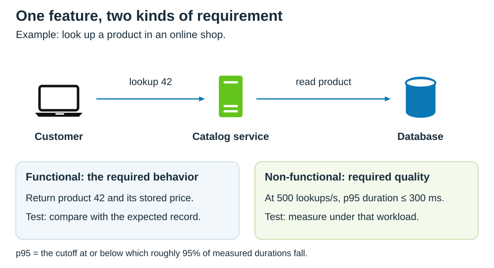
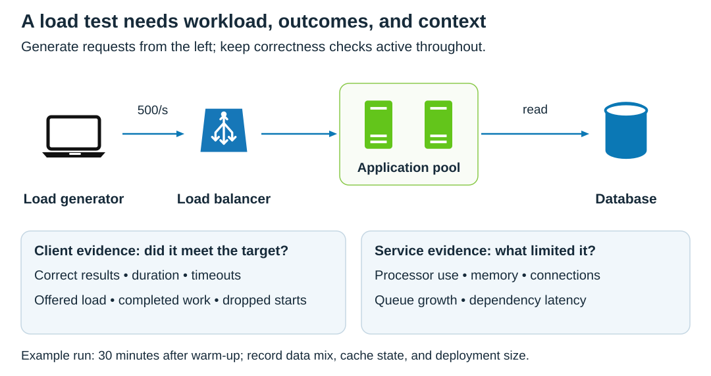
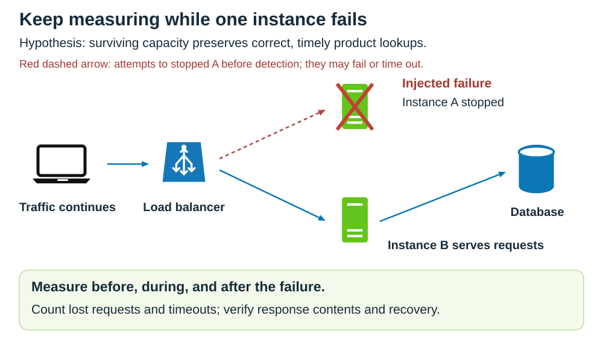
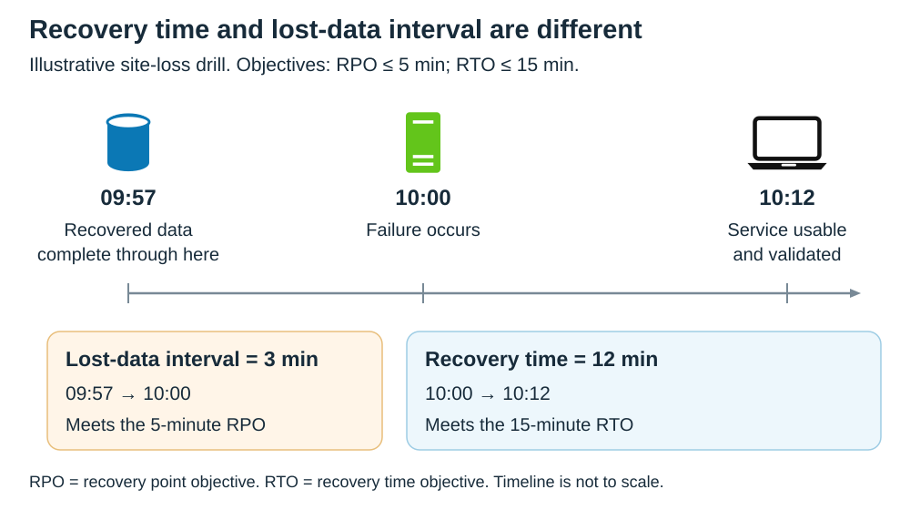

# Non-functional requirements and how to test them

<sub>[Back to Computer Science](../Readme.md#content)</sub>

**Functional requirements specify the behavior a system must provide. Non-functional requirements specify the qualities that behavior must have, such as speed, availability, security, and ease of use.** Both are requirements: a feature can return the right answer and still be unusable because it is too slow or frequently unavailable.

This article distinguishes the two and turns quality goals into testable criteria. **Performance is the worked example**, with a k6 template. The other qualities are covered through acceptance criteria and suggested tests, with extra explanation of resilience and recovery. Documented production examples from Netflix, Shopify, and Cloudflare are followed by guidance on maintaining evidence after release.

Numerical targets outside those company examples are **illustrative requirements**, not industry defaults or those companies’ commitments.

## 1. Functional versus non-functional requirements

A **functional requirement** describes an observable capability or rule: given an input and a situation, what result or state change must occur? For an online shop, examples include finding a product, calculating an order total, and rejecting a purchase when stock is exhausted.

A **non-functional requirement (NFR)** describes a required quality of a system or capability under stated conditions. Examples include responding within a time limit, continuing service during a failure, and making checkout usable with assistive technology. These are often called **quality attributes**. Projects may also group constraints, such as a required deployment environment, under NFRs; classification varies, so write the actual obligation explicitly.

Read the same product lookup in two ways: the functional test checks the returned product; the quality tests check the conditions under which that lookup remains useful.



| Requirement | Example | Evidence that addresses it |
| --- | --- | --- |
| Functional behavior | Looking up product `42` returns product `42` and its stored price. | Submit a known request and compare the response with the expected record. |
| Performance | At 500 lookups per second, the 95th percentile of request duration is at most 300 milliseconds. | Generate that workload and measure the duration distribution. |
| Availability | At least 99.9% of eligible lookups succeed over a rolling 30-day window. | Measure eligible attempts and successful outcomes throughout the window. |
| Recoverability | After loss of the primary site, restore the agreed customer functions within 15 minutes. | Rehearse that failure and time recovery through successful user operations. |

**The boundary is useful, but not absolute.** “Reject access to another customer’s order” is a concrete functional rule that supports the quality goal of confidentiality. Security testing can therefore include ordinary integration tests. A requirement does not become non-functional simply because its test needs special tooling.

**Latency** is the time an operation takes. “Use a cache” is an implementation choice unless the project explicitly mandates it. “Serve this workload within this latency limit” is the quality outcome the cache is supposed to help achieve.

## 2. Make the requirement measurable

“Fast,” “scalable,” and “highly available” do not define a pass condition. A useful requirement identifies the operation, conditions, measure, threshold, and observation window. Record who owns it and why the target matters.

**p95**, the 95th percentile, is a cutoff: roughly 95% of measurements are at or below it. **Throughput** is completed work per unit time; the **arrival rate** is how quickly new work is offered. Specify both: offering 500 requests per second does not prove that 500 succeed per second.

A **warm-up** is an initial period of representative traffic that lets startup work settle, such as filling caches and opening reusable connections. **Steady state** is the period when behavior has become sufficiently stable for the intended measurement. For a steady-state requirement, measure after warm-up and record how you decided it was complete. Startup measurements remain useful: if the requirement covers the first requests after startup, test those separately rather than excluding them.

For example, an invented catalog requirement could be:

> After a separate warm-up, sustain 500 product lookups per second for 30 minutes against the specified test deployment. Use a representative one-million-product data set and agreed query distribution. At least 99.9% of attempts must return the expected product. Across all attempts, p95 request duration must be at most 300 ms. The generator must start every scheduled iteration.

Make the measurement boundary explicit. A server timer omits work outside the server. A browser measurement can include network and rendering delays. Record deployment size, software revision, data size, request mix, cache state, client location, and timeout policy so another engineer can interpret the result.

### SLI, SLO, and error budget

A **service level indicator (SLI)** measures delivered service. A **service level objective (SLO)** is a target for that indicator over a defined window. For a request-based availability objective:

```text
success SLI = successful eligible requests / all eligible requests
example SLO = success SLI >= 99.9% over a rolling 30 days
error budget = 0.1% of eligible requests in that window
```

Define “eligible” and “successful” before measuring. Include timeouts and service failures; document how invalid client input is treated. A request that never reaches the application may need to be observed at a client or edge boundary. A fast error response must not improve your assessment of successful service.

For an illustrative window containing 1,000,000 eligible requests, a 99.9% objective permits 1,000 unsuccessful requests. This request budget is not automatically a downtime budget: busy and quiet minutes contain different numbers of requests.

Passing a 30-minute experiment supplies evidence about that experiment. It cannot establish compliance with a 30-day production SLO. Production measurements must continue after release.

## 3. Match the quality to the test

NFR testing is broader than load testing. The following are example acceptance criteria to tailor to a product, with an experiment that can produce relevant evidence.

| Quality and meaning | Example acceptance criterion | How to test it |
| --- | --- | --- |
| **Performance:** response time and work completed | Meet the catalog duration and success limits at 500 requests/second. | Run representative requests; record latency percentiles, successes, timeouts, and completed throughput together. |
| **Scalability:** ability to handle more work as resources grow | Doubling application instances supports at least 1.7× successful throughput with the same duration limit. | Compare deployments with the same data and workload mix. Observe whether the database or another dependency becomes the limit. |
| **Resilience:** ability to withstand disruption and recover | Removing one application instance at the agreed load leaves success rate at least 99.9% over the exercise. | Inject the failure while sending traffic; measure customer outcomes during detection, rerouting, and recovery. |
| **Durability:** preservation of accepted data | No acknowledged order is lost after the specified single-node failure. | Keep an independent record of acknowledged writes; recover, read them back, and compare identifiers and contents. |
| **Recoverability:** restoration after disruption | Recovery time at most 15 minutes; lost-data interval at most 5 minutes for a site-loss scenario. | Restore the workload from the recovery copy, run customer operations, and compare recovered data with the write record. |
| **Security:** protection against unauthorized use | Every operation in the agreed role-and-resource access matrix enforces its policy. | Test allowed and denied combinations, including another customer’s resource identifier; inspect returned data and side effects. |
| **Usability and accessibility:** people can complete the intended tasks | Checkout meets the agreed Web Content Accessibility Guidelines (WCAG) 2.2 AA scope; at least 9 of 10 participants complete the specified task unaided. | Combine accessibility tools, keyboard and screen-reader review, and observed task sessions. Report the sample and remaining barriers. |
| **Maintainability and operability:** ability to change and operate the service | An on-call engineer using a **runbook** (a written operational procedure) restores the previous release within 10 minutes in the test scenario. | Rehearse rollback with that engineer; time restoration and verify data/schema compatibility and customer behavior. |
| **Resource efficiency:** work delivered within a resource budget | The agreed workload uses no more than the allocated infrastructure budget while meeting its quality targets. | Measure resources and calculate cost per successful operation using the same accounting boundary for each comparison. |

The numbers above are test proposals. Select them from user needs and failure consequences. A usability session with ten participants offers evidence about that sample; it does not prove that 90% of all users will succeed.

For security, an access matrix covers one part of the problem. Threat analysis, code review, dependency analysis, and targeted penetration testing address other failure modes. For accessibility, an automated scan alone cannot establish conformance; knowledgeable human evaluation is required.

## 4. Performance testing: choose the right workload

In this test layout, the laptop icon represents a load generator. Its measurements describe requests, while service **telemetry** (operational measurements such as memory use and connection counts) helps explain the result. The load balancer distributes traffic across application instances; storage remains part of the tested request path.



Different traffic profiles answer different questions:

| Test | Workload | What it can reveal |
| --- | --- | --- |
| Smoke | A few requests | A broken script, incorrect test data, or an unavailable endpoint before a larger run. |
| Expected-load | Normal or agreed peak traffic | Whether the required workload meets the quality limits. |
| Stress / breakpoint | High load; progressively increase it when finding a limit | **Saturation** (a resource reaching its capacity limit), the first violated target, and behavior when capacity is exceeded. |
| Spike | A sudden increase and decrease | Whether the system handles abrupt demand and returns to normal afterward. |
| Soak | Sustained traffic over a longer period | Gradual deterioration, such as growing memory use or queues. |

A **virtual user (VU)** is a simulated execution worker. With a fixed number of VUs in a closed workload model, each worker waits for its previous iteration to finish. When responses slow down, fewer new requests arrive. That can hide overload when the real requirement is to accept an independent arrival rate.

An **open workload model** schedules new iterations independently of previous completions. Use it for an arrival-rate requirement, and verify that the generator has enough capacity. In k6, `dropped_iterations` reports scheduled iterations that could not start, including when there were insufficient VUs for an arrival-rate test.

Realism matters as much as request count. Vary product identifiers, popular versus rare queries, payload sizes, and cache hits. A million requests for one cached product do not represent searching a million-product catalog. Record dependency stubs: replacing a payment provider with a fake response limits what the experiment can establish about checkout.

### A k6 acceptance-test template

**k6** is a load-testing tool. This JavaScript template checks one public catalog endpoint. It assumes `/products/42` returns HTTP `200` with a JSON object containing numeric `id: 42`; replace the endpoint and assertion with the application’s actual contract. The fixed identifier keeps the example small; use representative test data for the full requirement above.

```javascript
import http from 'k6/http';
import { check } from 'k6';

export const options = {
  scenarios: {
    catalog: {
      executor: 'constant-arrival-rate',
      rate: 500,
      timeUnit: '1s',
      duration: '30m',
      preAllocatedVUs: 500,
      maxVUs: 1500,
      gracefulStop: '5s',
    },
  },
  thresholds: {
    http_req_duration: ['p(95)<=300'],
    checks: ['rate>=0.999'],
    dropped_iterations: ['count==0'],
  },
};

export default function () {
  const response = http.get(`${__ENV.BASE_URL}/products/42`, {
    redirects: 0,
    timeout: '2s',
  });

  let correct = false;
  try {
    correct = response.status === 200 && response.json().id === 42;
  } catch {
    // An invalid or absent JSON response is an unsuccessful lookup.
  }
  check(correct, { 'expected product returned': value => value });
}
```

The scenario settings control how work is offered and how the run ends:

- `rate: 500` with `timeUnit: '1s'` schedules 500 iterations per second for `duration: '30m'`. Here, each iteration sends one request.
- `preAllocatedVUs: 500` prepares 500 workers before the run. `maxVUs: 1500` permits k6 to add workers during the run up to a total of 1,500. These are worker counts, not request rates. Allocating workers during a run adds overhead, so preallocate enough for the expected workload when practical.
- `gracefulStop: '5s'` gives in-progress iterations up to five seconds to finish after the 30-minute scheduling period. No new iterations start during that grace period; unfinished ones are then interrupted. It does not add a pause between requests.

For initial sizing, use **VUs ≈ arrival rate in iterations/second × whole iteration duration in seconds**, then add headroom for variation and slow responses. For example, 500 iterations/second × 0.2 seconds suggests about 100 busy workers before headroom; at 2 seconds, it suggests about 1,000. Include all requests and script work in the iteration duration. The template's 500/1,500 values are illustrative allocations: retune them using measured durations and generator resources, and retain the `dropped_iterations` check. A larger cap alone does not establish that the generator sustained the requested rate.

After installing k6, save this as `catalog.js`. Send representative traffic until the chosen warm-up conditions are met, then start this measured run against the same deployment. This command uses a local example address:

```bash
k6 run -e BASE_URL=http://127.0.0.1:8080 catalog.js
```

There is one request and one combined correctness check per iteration. The thresholds therefore require p95 duration at most 300 ms, at least 99.9% correct lookups, and no dropped iterations. The duration metric includes sending, waiting, and receiving, but excludes initial name lookup and connection setup; it is not a browser page-load measurement.

Checks record assertion results. **Thresholds make the run pass or fail**, and a failed threshold gives k6 a nonzero exit code suitable for a build pipeline. If you add multiple checks per request, their aggregate pass rate no longer equals the fraction of correct requests; keep a separate per-request success metric.

Inspect the time series as well as the aggregate report. A whole-run percentile can hide a short bad interval. Also inspect generator utilization, completed request count, application errors, database connections, and queue growth. A failed generator-capacity criterion means the intended workload was not demonstrated, even if the latency threshold passed.

## 5. Resilience testing: verify the customer outcome during failure

A **fault injection** experiment deliberately introduces a specified failure, such as terminating an instance or delaying a dependency. **Failover** means transferring work to a surviving component.

This hypothetical experiment removes one application instance while requests continue. The question is whether the surviving route preserves the agreed customer behavior, including response correctness and latency. Green server icons mean application instances; the red cross identifies the injected failure. The dashed red arrow represents requests still directed to stopped instance A before the load balancer detects its failure; these attempts may fail or time out. Solid blue arrows show the surviving request path.



Write the hypothesis and failure scope before the run: for example, “With two application instances and 500 lookups per second, stopping one instance preserves the exercise’s success and latency targets.” Define how long to observe, how to stop the injection, and which degradation triggers an immediate stop. Begin in a representative test environment; any production exercise needs a bounded affected population, live observation, and a practiced recovery action.

Measure across the failure transition. Starting measurement only after failover misses the requests lost while the system detected the failure. Keep correctness assertions active under load; an error page served quickly is still an error.

Use distinct experiments for process crashes, dependency timeouts, delayed responses, and loss of a site. One passing instance-termination test does not establish resilience to all of them. Likewise, adding a second application instance does not prove the storage dependency can survive failure.

## 6. Recovery testing: separate downtime from data loss

**Recovery time objective (RTO)** is the maximum acceptable restoration time after disruption. **Recovery point objective (RPO)** is the maximum acceptable lost-data interval, measured backward from the disruption. RPO is a time interval, not a count of records.

Read the timeline from left to right. In this invented drill, the failure occurs at 10:00, recovered data is complete through 09:57, and the agreed service is usable again at 10:12. The measured lost-data interval is 3 minutes and recovery takes 12 minutes. These meet example objectives of RPO ≤ 5 minutes and RTO ≤ 15 minutes.



Test restoration, not merely backup creation. Restore a real recovery copy into an isolated environment, start the required dependencies, and exercise the customer functions in scope. Compare recovered records with an independent write log, including the latest acknowledged writes and their timestamps. Record missing or corrupted data; do not assume a successful restore command proves completeness.

For the agreed scenario, time the full recovery path, including detection, decisions, data restoration, and service validation. An application process becoming healthy is not the endpoint if users still cannot perform the required operation. A zero-data-loss requirement needs its own failure scope and evidence; a five-minute backup recovery target cannot satisfy it.

## 7. Production examples: what companies actually tested

These are historical engineering reports. The quality goals below summarize the motivation and evidence in those reports; they do not imply unpublished numerical requirements or describe the companies’ current systems.

### 7.1. Netflix: dependency latency and customer engagement — 2015

**Quality targeted:** resilience when a dependency becomes slow. Netflix measured its normal customer engagement through video plays starting per second and hypothesized that it would remain stable during the experiment.

**Test performed:** the Subscriber service handles user management and authentication. Netflix added 30 ms of latency to calls from Subscriber to its primary cache, first for 20% of that traffic and then for 50%.

**Observed result:** at 50%, engagement deviated significantly from the expected steady state. Engineers identified mitigations, including reducing an upstream service’s thread-pool count. Later experiments confirmed improved Subscriber resilience.

**Lesson to apply:** observe a meaningful customer outcome and repeat the experiment after a repair. The specific latency and traffic fraction define the evidence; this result does not prove resilience to every dependency failure.

### 7.2. Shopify: full-scale holiday rehearsals — report published January 2023

**Quality targeted:** capacity and resilience for Black Friday/Cyber Monday (BFCM).

**Tests performed:** Shopify scaled its platform to expected holiday deployment sizes and generated multiple flows, including browsing and buying, merchant administration, flash sales, and Storefront API traffic. Some exercises also routed requests away from one U.S. cloud region to check the remaining region’s capacity.

**Observed result:** scaling the number of instances sometimes overloaded dependencies through connection counts even without additional request load. Responses included scaling dependent services and changing the architecture to share connections through intermediaries.

**Lesson to apply:** rehearse the deployment size as well as the request rate. Shopify also documented limits in geographic traffic generation and caching realism. A successful synthetic exercise supplies evidence, while real traffic can still behave differently.

### 7.3. Cloudflare: an outage exposed gaps in recovery assumptions — November 2023

**Quality at issue:** control-plane availability and disaster recovery. The **control plane** manages configuration; it is distinct from the systems carrying customer traffic.

**What happened:** a data-center failure caused a control-plane and analytics outage during November 2–4. Cloudflare reported that its network and security services continued operating, while affected management and analytics functions needed recovery. This was an unplanned incident, not a scheduled fault-injection test.

**Documented response:** the postmortem called for tested disaster-recovery plans for generally available products, testing the extent of damage caused by failures, and stronger chaos exercises that remove entire core facilities. These were announced remediation actions; the postmortem is not evidence that every action had already been completed.

**Lesson to apply:** define separate customer journeys and recovery objectives, then exercise the loss of their real dependencies. A high-availability architecture diagram alone does not validate those objectives.

## 8. Keep evidence useful after release

Tie each requirement to its owner, test scenario, pass condition, and latest result. Preserve the workload, deployment revision, data assumptions, measurement window, and observed limitations with the report. A result without its conditions is difficult to reproduce or compare.

Use small correctness and authorization tests on changes, repeatable performance comparisons on a stable environment, and scheduled larger load or recovery exercises where appropriate. Observe production SLIs continuously. When a failed experiment or incident exposes a missing condition, update the requirement and its test together.

Quality goals can compete: redundancy costs resources, and stronger controls may add user interaction. Choose targets according to the product’s needs, then verify that the combined design meets them. The practical question is: **what must the user be able to do, under which conditions, and what evidence will show that the required quality holds?**

# Sources

- [SEBoK — Definition of non-functional requirements and contrast with functional requirements](https://sebokwiki.org/wiki/Non-Functional_Requirements_(glossary))
- [SEBoK — System requirements, measurable criteria, ownership, and varying categories](https://sebokwiki.org/wiki/System_Requirements)
- [SEBoK — Quality attributes and tradeoffs](https://sebokwiki.org/wiki/Systems_Engineering_and_Quality_Attributes)
- [Google SRE Workbook — SLIs, SLOs, error budgets, and measurement boundaries](https://sre.google/workbook/implementing-slos/)
- [Grafana k6 — API workload models, test types, correctness, and performance](https://grafana.com/docs/k6/latest/testing-guides/api-load-testing/)
- [Grafana k6 — Open versus closed workload models](https://grafana.com/docs/k6/latest/using-k6/scenarios/concepts/open-vs-closed/)
- [Grafana k6 — Constant-arrival-rate executor and worker allocation](https://grafana.com/docs/k6/latest/using-k6/scenarios/executors/constant-arrival-rate/)
- [Grafana k6 — Sizing arrival-rate workers, preallocation, and allocation overhead](https://grafana.com/docs/k6/latest/using-k6/scenarios/concepts/arrival-rate-vu-allocation/)
- [Grafana k6 — Graceful stopping and interrupted iterations](https://grafana.com/docs/k6/latest/using-k6/scenarios/concepts/graceful-stop/)
- [Grafana k6 — Warm-up and steady-state load profiles](https://grafana.com/docs/learning-hub/k6-performance-testing/03-establishing-a-baseline/17-designing-load-profile/)
- [Microsoft — Cold starts, cache initialization, and application warm-up](https://github.com/MicrosoftDocs/SupportArticles-docs/blob/main/support/azure/app-service/troubleshoot-performance-slow-web-app.md)
- [Microsoft — Initial connection costs and reuse through connection pooling](https://learn.microsoft.com/en-us/sql/connect/ado-net/sql-server-connection-pooling)
- [Grafana k6 — Thresholds and exit status](https://grafana.com/docs/k6/latest/using-k6/thresholds/)
- [Grafana k6 — Built-in metrics, request-duration boundary, checks, and dropped iterations](https://grafana.com/docs/k6/latest/using-k6/metrics/reference/)
- [Grafana k6 — Automated performance testing and limits of release gates](https://grafana.com/docs/k6/latest/testing-guides/automated-performance-testing/)
- [AWS Well-Architected — Recovery time and recovery point objectives](https://docs.aws.amazon.com/wellarchitected/latest/reliability-pillar/rel_planning_for_recovery_objective_defined_recovery.html)
- [AWS Well-Architected — Testing recovery paths, capacity, and runbooks](https://docs.aws.amazon.com/wellarchitected/latest/reliability-pillar/rel_planning_for_recovery_dr_tested.html)
- [OWASP — Authorization testing with role, feature, and data matrices](https://cheatsheetseries.owasp.org/cheatsheets/Authorization_Testing_Automation_Cheat_Sheet.html)
- [OWASP — Security testing throughout the development lifecycle](https://owasp.org/www-project-web-security-testing-guide/v42/3-The_OWASP_Testing_Framework/0-The_Web_Security_Testing_Framework)
- [W3C WAI — Evaluating accessibility with tools and human review](https://www.w3.org/WAI/test-evaluate/)
- [W3C — Web Content Accessibility Guidelines 2.2](https://www.w3.org/TR/WCAG22/)
- [Netflix TechBlog — Chaos Engineering Upgraded, September 25, 2015](https://netflixtechblog.com/chaos-engineering-upgraded-878d341f15fa)
- [Shopify Engineering — Performance Testing At Scale—for BFCM and Beyond, January 27, 2023](https://shopify.engineering/scale-performance-testing)
- [Cloudflare — Postmortem on the Control Plane and Analytics Outage, November 4, 2023](https://blog.cloudflare.com/post-mortem-on-cloudflare-control-plane-and-analytics-outage/)
- Diagram icon provenance: editable laptop, server, and database shapes adapted from this repository’s [System Design — Scaling database diagram](../../system%20design/01.%20Scaling/images/database.svg), and the load balancer from [System Design — News feed building](../../system%20design/11.%20News%20Feed%20System/images/news-feed-building.svg).
- [Related CS card — p50 vs p95: percentile intuition and measurement with k6 and Prometheus](../p50%20vs%20p95/Readme.md)
