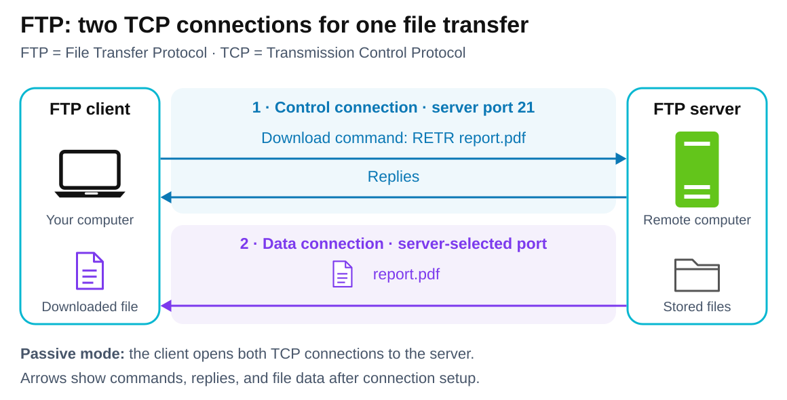

# FTP — File Transfer Protocol

[Back to Computer Science](../Readme.md#content)

# Front

How does FTP transfer files using separate control and data connections?

# Back

**FTP (File Transfer Protocol)** lets a client upload files to a server and download files from it. It uses separate **TCP (Transmission Control Protocol)** connections for instructions and the data being transferred.

## Two connections, two jobs

| Connection | What it carries |
| --- | --- |
| **Control** | Login, commands, and server replies. The client connects to server port **21** by default; this connection stays open during a transfer. |
| **Data** | File contents or directory listings. Its ports depend on how the data connection is opened. |

In this passive-mode example, `RETR report.pdf` requests a download over the control connection. The file travels back over the separate data connection. Read the upper control lane first, then the lower data lane; arrows show traffic direction.

## Active vs passive

These modes change **who opens the data connection**, not whether files can be uploaded or downloaded:

- **Active:** the client tells the server where to connect; the server opens the data connection back to the client, traditionally from server port **20**.
- **Passive:** the server announces a listening port; the client connects to it. This avoids an incoming connection through the client's firewall. The server's data port must still be reachable.

**Port 20 is not used for every FTP transfer.** In passive mode, the server selects a data port separately from control port 21.

## Encryption is separate

**Plain FTP does not encrypt credentials or files.** The similarly named alternatives work differently:

- **FTPS (File Transfer Protocol Secure)** extends FTP with **Transport Layer Security (TLS)**. It keeps FTP's commands, separate control/data connections, and active/passive modes. Both connections need protection separately.
- **SFTP (SSH File Transfer Protocol)** is an independent protocol using **Secure Shell (SSH)**. It does not use FTP underneath.

## Is FTP still used?

**Yes. FTP is still used directly as a complete file-transfer protocol built on TCP.** For example, AWS Transfer Family still offers FTP endpoints, but restricts them to internal networks because FTP lacks encryption. For transfers over public networks, that service requires SFTP or FTPS.

# Sources

- [RFC 959 — FTP: connections, commands, active/passive behavior, and ports (§§2.3, 3.2, 4.1, 8)](https://www.rfc-editor.org/rfc/rfc959.html)
- [RFC 2428 — Passive data ports and firewall behavior (§§3–4)](https://www.rfc-editor.org/rfc/rfc2428.html#section-3)
- [RFC 2577 — Plain FTP transmits passwords and data without encryption (§§5–6)](https://www.rfc-editor.org/rfc/rfc2577.html#section-6)
- [RFC 4217 — Securing FTP control and data connections with TLS (§§4, 7, 9)](https://www.rfc-editor.org/rfc/rfc4217.html)
- [AWS Transfer Family — FTPS name and TLS encryption](https://docs.aws.amazon.com/transfer/latest/userguide/tf-server-endpoint.html)
- [AWS Transfer Family — Current FTP support and internal-network restriction](https://docs.aws.amazon.com/transfer/latest/userguide/create-server-ftp.html)
- [OpenSSH manual — SFTP transfers over an encrypted SSH transport](https://man.openbsd.org/sftp)
