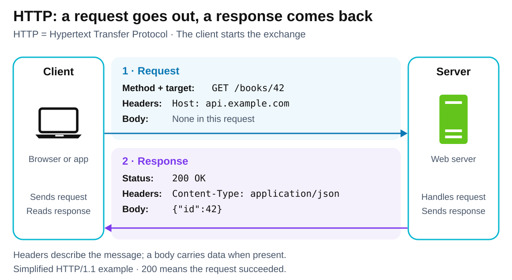

# HTTP — Hypertext Transfer Protocol

[Back to Computer Science](../Readme.md#content)

# Front

How does HTTP let a client interact with a server?

# Back

**HTTP (Hypertext Transfer Protocol)** defines how applications exchange **requests and responses**. A **client**, such as a browser, asks a **server** to act on a **resource**—something identified by an address, such as a page or a book record. The server returns the result.

## Follow one exchange

1. **Request:** the client sends a **method** (the requested action), a target, and **headers** (named fields carrying extra information). A **body** can carry data for the server to process.
2. **Response:** the server returns a **status code** describing the outcome, headers, and a body when applicable.

Read the top arrow first: `GET /books/42` asks for book `42`. The lower arrow returns `200 OK` and the book data. `Host` identifies the server's hostname; `Content-Type` identifies the body's format. Here, `application/json` means **JSON (JavaScript Object Notation)**, a structured data format.

The example request has no body. Other methods, such as `POST`, can send a body for processing, for example a submitted form.

## Reading the result

The first digit groups status codes: **1xx** information, **2xx** success, **3xx** redirection, **4xx** client error, **5xx** server error. `200 OK` means the request succeeded.

## What “stateless” means

Each request's meaning can be understood independently of earlier requests. Applications can still remember users: a server can set a **cookie**, a small value the browser stores and returns on later matching requests. A cookie can carry a session identifier that links requests to stored login state.

## HTTPS and versions

**HTTPS (Hypertext Transfer Protocol Secure)** uses **TLS (Transport Layer Security)** to authenticate the server, encrypt messages, and detect tampering in transit. Default ports are **80** for `http` and **443** for `https`.

The request–response meaning stays the same across versions:

- **HTTP/1.1:** readable message lines, usually over **TCP (Transmission Control Protocol)**.
- **HTTP/2:** binary message framing; multiple exchanges share a TCP connection concurrently.
- **HTTP/3:** uses **QUIC**, a secure transport protocol carried over **UDP (User Datagram Protocol)**. QUIC provides reliable delivery.

# Sources

- [RFC 9110 — HTTP semantics: resources, messages, statelessness, HTTPS, methods, and status codes (§§3–4, 7.2, 8.3, 9, 15)](https://www.rfc-editor.org/rfc/rfc9110.html)
- [RFC 9112 — HTTP/1.1 request/response format and optional message bodies (§§2–4, 6)](https://www.rfc-editor.org/rfc/rfc9112.html)
- [RFC 6265 — Cookies and session identifiers (§3.1)](https://www.rfc-editor.org/rfc/rfc6265.html#section-3.1)
- [RFC 8259 — JSON data format and application/json media type (§§1, 11)](https://www.rfc-editor.org/rfc/rfc8259.html)
- [RFC 9113 — HTTP/2: binary framing and multiplexed exchanges over TCP (§2)](https://www.rfc-editor.org/rfc/rfc9113.html#section-2)
- [RFC 9114 — HTTP/3: shared HTTP semantics, QUIC reliability, and UDP (§§1–3)](https://www.rfc-editor.org/rfc/rfc9114.html)
