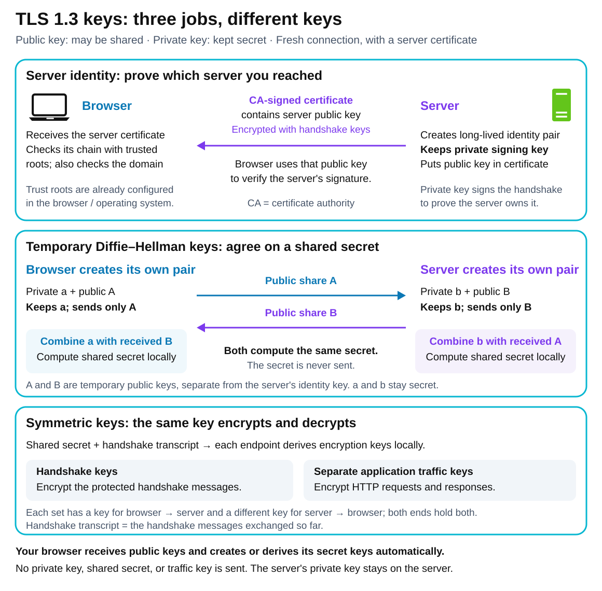
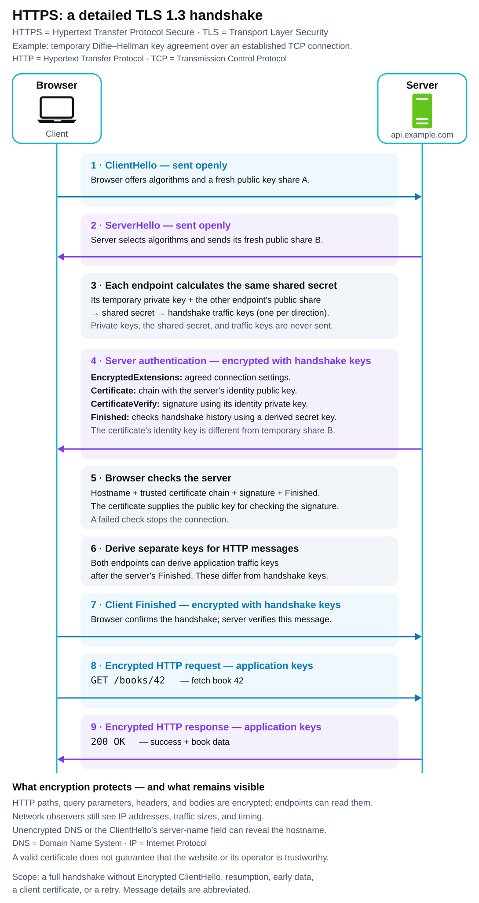

# HTTPS — Hypertext Transfer Protocol Secure

[Back to Computer Science](../Readme.md#content)

# Front

How does HTTPS use public, private, and shared keys to protect a browser's connection?

# Back

**HTTPS (Hypertext Transfer Protocol Secure)** is **HTTP (Hypertext Transfer Protocol)** protected by **TLS (Transport Layer Security)**. TLS authenticates the server, encrypts messages, and detects tampering in transit. The default server port is **443**.

## Which keys does the browser get?

A **public/private key pair** has two linked parts: the public key can be shared; the private key stays secret. Your browser handles these automatically.

- **Server identity keys:** the server operator creates a pair and keeps the private key to sign handshake messages. The browser receives the public key inside a **certificate**, a document signed by a **certificate authority (CA)**. It checks the hostname, dates, and issuer chain against root CA certificates already trusted by the browser/operating system. It uses the certificate's public key to verify the server's signature.
- **Temporary exchange keys:** the browser and server each generate a fresh, separate pair. They exchange only public shares. Each combines its own temporary private key with the other's public share to calculate the same shared secret. This is **ephemeral (temporary) Diffie–Hellman key agreement**.
- **Symmetric traffic keys:** both sides derive these from the shared secret and handshake messages. Each direction has its own shared key, with separate keys for handshake and application traffic. Neither the private keys nor the shared secret or traffic keys are sent across the network.

The browser never receives the server's private key. The diagram separates received public information from keys created or derived locally.

## Follow a full TLS 1.3 handshake

A **handshake** is the setup exchange. Read downward: `ClientHello` and `ServerHello` exchange public shares; both sides derive handshake keys. The server's certificate and proof of identity then travel **encrypted**. `CertificateVerify` is the server's signature; `Finished` checks the handshake history using a derived secret key. The browser verifies these before sending its own `Finished` and an HTTP request.

This example shows a fresh connection with server authentication; it can carry many HTTP requests. Resumption and optional client certificates use different flows.

## What remains visible?

HTTP paths, query parameters, headers, and bodies are encrypted. Observers can still see **IP (Internet Protocol) addresses, packet sizes, and timing**. Domain names may also appear in unencrypted **DNS (Domain Name System)** lookups or the initial TLS handshake.

## Where protection ends

TLS endpoints can read the contents. If a reverse proxy forwards decrypted requests to an application server, that next connection needs separate protection. HTTPS does not protect stored data or prove that a website is honest.

# Sources

- [RFC 9110 — HTTPS, server identity, connections, GET, and 200 OK (§§3.3, 4.2.2, 4.3.3–4.3.4, 9.3.1, 15.3.1)](https://www.rfc-editor.org/rfc/rfc9110.html)
- [RFC 9846 — Current TLS 1.3 specification: full handshake, certificates, signatures, Finished, and key derivation (§§2, 4.5, 7; July 2026 revision of RFC 8446)](https://datatracker.ietf.org/doc/html/rfc9846)
- [RFC 8446 — Original TLS 1.3 specification: temporary Diffie–Hellman shares and observable traffic patterns (§7.4.2, Appendix E.3)](https://datatracker.ietf.org/doc/html/rfc8446)
- [RFC 5280 — Certificate contents and validation (§§4.1, 6.1.3)](https://www.rfc-editor.org/rfc/rfc5280.html)
- [MDN — TLS protection, symmetric encryption, and server authentication](https://developer.mozilla.org/en-US/docs/Web/Security/Defenses/Transport_Layer_Security)
- [Let's Encrypt — Domain validation and issuing a certificate for a server's public key](https://letsencrypt.org/how-it-works/)
- [Mozilla — Root certificates distributed with Mozilla software (§1)](https://www.mozilla.org/en-US/about/governance/policies/security-group/certs/policy/#1-introduction)
- [RFC 8744 — IP addresses, DNS queries, and server-name privacy (§1)](https://www.rfc-editor.org/rfc/rfc8744.html#section-1)
- [RFC 9849 — Encrypted ClientHello can protect the server name in the handshake (§1)](https://www.rfc-editor.org/rfc/rfc9849.html#section-1)
- [NGINX — Securing the separate connection from a reverse proxy to upstream servers](https://docs.nginx.com/nginx/admin-guide/security-controls/securing-http-traffic-upstream/)
- [Chromium security team — Why HTTPS does not establish website trustworthiness](https://blog.chromium.org/2023/05/an-update-on-lock-icon.html)
