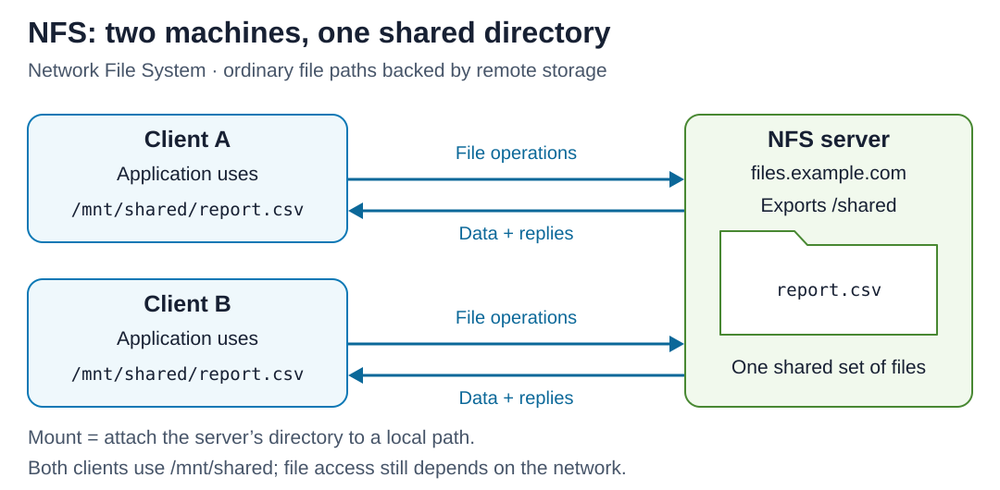

# NFS — Network File System

[Back to Computer Science](../Readme.md#content)

# Front

When is NFS useful, and how does it let several machines work with the same files?

# Back

**NFS (Network File System)** is a protocol for accessing files on another computer through ordinary file paths. A client **mounts** a shared directory: it attaches that remote directory to its own directory tree. NFS is useful when several machines need the **same shared files**, while applications expect to open, read, and write files as usual.

## How it works

1. The **server exports** a directory: it makes it available to permitted clients over the network.
2. Each **client mounts** that export at a local path, such as `/mnt/shared`.
3. The operating system's NFS client handles remote file operations and returns the results to the application. Permissions still control access.

In this example, both machines mount `files.example.com:/shared` at `/mnt/shared`. Their paths `/mnt/shared/report.csv` refer to the same server file. Follow the arrows from either client to the shared storage and back.

## Where it is used

- **Linux/Unix workstations:** shared home or project directories let users reach their files from different machines.
- **Application servers:** several web servers can share uploaded images, documents, or other content. For example, server A saves an upload to the shared directory; server B can later read it to answer another request.
- **Containers:** Kubernetes can mount an existing NFS share into multiple Pods (groups of containers). The files remain when a Pod is removed.
- **Cloud storage:** Amazon Elastic File System (EFS) provides a managed shared file system accessed through NFS.

## When it is a good fit

Consider NFS when an application already works with directories and files, and multiple machines need access to those files. A shared content directory can remove the need to maintain a separate synchronized copy on every application server.

## Important limits

- **It still depends on the network and server.** Remote access adds latency; an outage can make file operations wait or fail. A local-looking path does not provide an independent offline copy.
- **Sharing does not coordinate application writes.** Clients cache data, so changes are not always visible instantly. Applications updating the same file need coordination, such as file locks, to avoid conflicting writes.
- **Encryption depends on configuration.** NFS traffic is not automatically encrypted just because the share uses NFS. Configure access restrictions and suitable transport protection for the deployment.

# Sources

- [Red Hat — NFS sharing, project directories, exports, and client mounts](https://docs.redhat.com/en/documentation/red_hat_enterprise_linux/4/html/system_administration_guide/network_file_system_nfs)
- [RFC 7530 — NFSv4 file access, permissions, caching, and locking](https://www.rfc-editor.org/rfc/rfc7530.html)
- [Linux NFS manual — Mounts, failure behavior, cache consistency, and security](https://man7.org/linux/man-pages/man5/nfs.5.html)
- [Kubernetes — NFS volumes shared between Pods and persistence after Pod removal](https://kubernetes.io/docs/concepts/storage/volumes/#nfs)
- [Amazon EFS — NFS support, home directories, and shared application content](https://docs.aws.amazon.com/efs/latest/ug/whatisefs.html)
