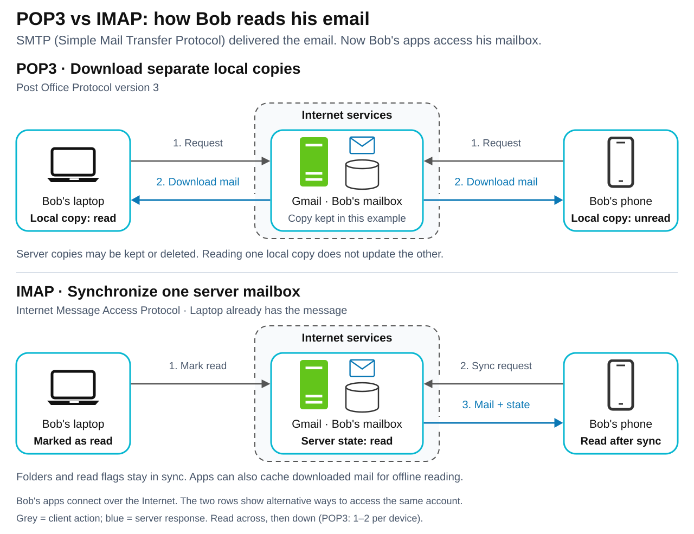

# POP3 vs IMAP

[Back to Computer Science](../Readme.md#content)

# Front

How do POP3 and IMAP differ when you use the same mailbox on a laptop and a phone?

# Back

**POP3 (Post Office Protocol version 3)** downloads messages for an app to manage as local copies. **IMAP (Internet Message Access Protocol)** lets apps access a shared server mailbox and synchronize its folders and message state, such as read/unread status.

Both access stored mail after **SMTP (Simple Mail Transfer Protocol)** delivers it. For example, Bob uses `bob@gmail.com` on a laptop and a phone. These protocols let him retrieve messages when his devices reconnect; neither replaces SMTP for sending mail.

## Same message, two devices

Compare the diagram's two alternatives for Bob's mailbox. Bob marks a message already on his laptop as read: POP3 leaves the phone's local read status independent; IMAP lets the phone obtain the updated status from the server after synchronization. The POP3 example keeps the server copy available for both devices to download.

Grey arrows show client requests/actions; blue arrows show server responses carrying mail or state. Numbers order the example's steps: POP3's 1–2 pair repeats independently for each device; IMAP's 1–3 sequence shows the read flag reaching the phone.

## What changes on the other device?

| Action | POP3 | IMAP |
| --- | --- | --- |
| Mark a message read | Changes the app's local state; POP3 has no shared read/unread flag. | Updates a server flag that other clients can synchronize. |
| Organize folders | Folders are managed locally by the app; POP3 does not manage server folders. | Apps can create and manage server folders and move messages between them. |
| Delete mail | A client can request server deletion. Copies already downloaded by another device remain independent. | Removing a message from the server mailbox is reflected in other clients after synchronization. |
| Read while offline | Previously downloaded messages are available locally. | Previously cached or downloaded messages can be read locally; changes synchronize after reconnecting. |

**POP3 does not require deleting every downloaded message.** Leaving server copies allows other devices to download them, subject to the provider's retention policy, but does not add shared folders or read-state synchronization. IMAP's shared state makes it useful for keeping several devices consistent.

## Encrypted connections

With **TLS (Transport Layer Security)** active from connection setup, the default ports are **995 for POP3** and **993 for IMAP**. TLS encrypts the connection; it does not change either protocol's mailbox model.

# Sources

- [RFC 1939 — POP3: purpose, retrieval/deletion commands, retained copies, and limits (§§1–2, 5–8)](https://www.rfc-editor.org/rfc/rfc1939.html)
- [RFC 9051 — IMAP: server mailboxes, synchronization, flags, and commands (Abstract; §§2.3.1–2.3.2, 6)](https://www.rfc-editor.org/rfc/rfc9051.html)
- [RFC 8314 — Implicit TLS for POP3 and IMAP, ports 995/993 (§§3.1–3.2)](https://www.rfc-editor.org/rfc/rfc8314.html#section-3.1)
