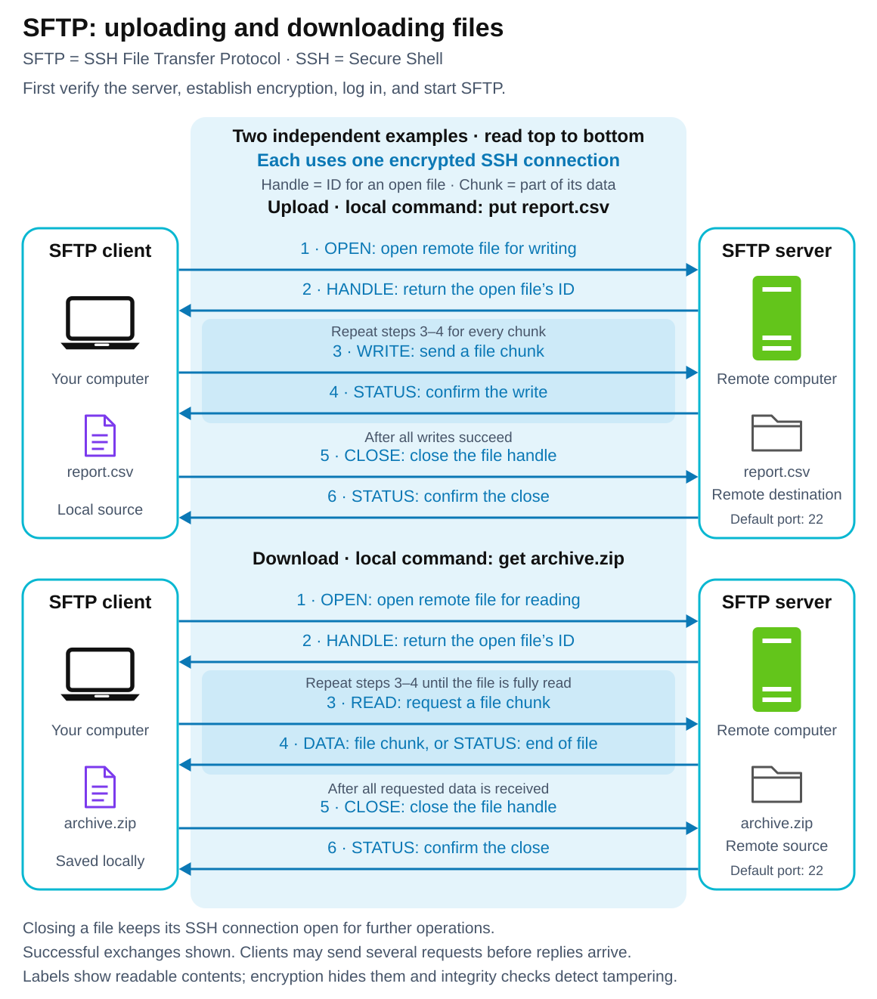

# SFTP — SSH File Transfer Protocol

<sub>[Back to Computer Science](../Readme.md#content)</sub>

# Front

How does SFTP transfer files securely, and how does it differ from FTP and FTPS?

# Back

**SFTP (SSH File Transfer Protocol)** transfers and manages remote files, normally over **SSH (Secure Shell)**. SSH encrypts the traffic so network observers cannot read its contents and checks **integrity** to detect tampering. File operations, replies, and file data share **one protected connection**.

## How a transfer works

The client connects to the server using **TCP (Transmission Control Protocol)**, normally at server port **22**. The server must provide an SFTP service; SSH access alone does not guarantee that it is enabled.

1. **Verify the server.** Its **host key** identifies it. On a first connection, check the displayed **fingerprint** (a short identifier for the key) against a trusted value, such as one supplied by the administrator.
2. **Authenticate the user.** Inside the encrypted SSH connection, the server verifies your account using a public key or password, for example.
3. **Use SFTP.** The client requests file operations such as upload, download, list, rename, or delete. The server performs the permitted operations and returns results through the same SSH connection.

Read each independent example top to bottom: uploads send file chunks; downloads request chunks before receiving them. Each uses **one protected SSH connection**. Closing a file keeps SSH open; the diagram's labels show contents that travel encrypted.



## Clients

**Terminal and scripts:** OpenSSH `sftp`. **Graphical apps:** WinSCP (Windows), FileZilla Client, and Cyberduck (macOS/Windows).

## Where it is used

- **Business partners:** exchange reports and other files securely.
- **Data imports:** automate transfers from partner servers into cloud storage, for example with AWS Transfer Family.
- **Website maintenance:** upload media or plugins, and download backups.

## Example: upload a report

Assume `report.csv` exists locally and your account can write to the server's existing `/uploads/` directory. With the OpenSSH client, connect from your shell:

```bash
sftp alice@files.example.com
```

After authentication, type these commands at the SFTP prompt:

```text
put report.csv /uploads/report.csv
bye
```

`put` uploads the local file; `get` downloads a remote file. `bye` ends the session.

## SFTP vs FTP vs FTPS

| Protocol | Protection and connections |
| --- | --- |
| **FTP (File Transfer Protocol)** | Plain FTP sends credentials and data without encryption. It uses separate control and data connections. |
| **FTPS (FTP secured with TLS)** | Adds **TLS (Transport Layer Security)** to FTP. Control and data connections still need protection separately. |
| **SFTP** | Uses SSH for protection, with file operations and data in the same connection. It does not use FTP underneath. |

SFTP therefore needs no FTP-style active/passive mode, which determines who opens the separate data connection.

# Sources

- [OpenSSH sftp manual — Encrypted transport, interactive commands, and SFTP service selection](https://man.openbsd.org/sftp.1)
- [IETF SSH File Transfer Protocol Internet-Draft — SSH subsystem, open/read/write/close requests, and replies (§§3, 8–9)](https://www.ietf.org/archive/id/draft-ietf-secsh-filexfer-13.txt)
- [RFC 4253 — SSH encryption, integrity protection, and usual server port 22 (§§1, 4.1)](https://www.rfc-editor.org/rfc/rfc4253.html)
- [OpenSSH ssh manual — Server host keys, fingerprint verification, and user authentication](https://man.openbsd.org/ssh.1)
- [RFC 959 — FTP control/data connections and active/passive setup (§§2.3, 3.2)](https://www.rfc-editor.org/rfc/rfc959.html)
- [RFC 2577 — Unencrypted FTP passwords and data (§§5–6)](https://www.rfc-editor.org/rfc/rfc2577.html)
- [RFC 4217 — Securing FTP control and data connections with TLS (§§3, 7–9)](https://www.rfc-editor.org/rfc/rfc4217.html)
- [WinSCP — Windows SFTP client, graphical interface, and scripting](https://winscp.net/eng/docs/introduction)
- [FileZilla — Client support for SFTP](https://filezillapro.com/docs/v3/features-v3/filezilla-protocols/)
- [Cyberduck — SFTP client for macOS and Windows](https://cyberduck.io/)
- [AWS Transfer Family — Partner file exchange and automated cloud transfers](https://docs.aws.amazon.com/transfer/latest/userguide/creating-connectors.html)
- [WordPress.com — SFTP for website files, media, plugins, and backups](https://wordpress.com/support/sftp/)
