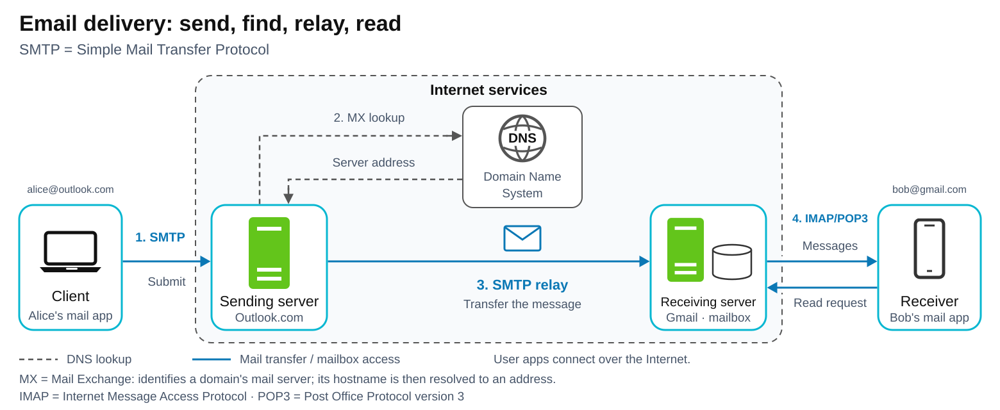

# SMTP — Simple Mail Transfer Protocol

[Back to Computer Science](../Readme.md#content)

# Front

What does SMTP do in email delivery, and why do mail apps use IMAP or POP3 to read mail?

# Back

**SMTP (Simple Mail Transfer Protocol)** sends email from a mail app to a mail server and relays it between mail servers toward the recipient's mailbox. Separate mailbox-access protocols provide the commands to read mail already stored there.

## Follow a message

Example: `alice@outlook.com` sends to `bob@gmail.com` using mail apps configured for SMTP and IMAP/POP3. The provider icons represent simplified server roles.

Follow the numbered steps: Alice **submits** mail to Outlook.com's sending service. It queries the **Domain Name System (DNS)** for **Mail Exchange (MX)** records to find Gmail's receiving service and resolves its hostname to a network address. SMTP then **relays** (forwards) the message to Gmail for storage in Bob's mailbox. **Both providers and DNS are inside the Internet-services box**; the user apps connect to them over the Internet. Dashed arrows show DNS lookup; solid arrows show mail transfer and mailbox access. Email does not pass through DNS.

## Why IMAP or POP3 is needed

Bob's mail server can accept and store mail while his phone is offline. When he reconnects, his app needs to ask: "Which messages are in my mailbox?" and "Give me this message."

**SMTP transfers messages between mail systems.** It has no standard commands to list or fetch messages already stored in a user's mailbox. A server receiving mail over SMTP is accepting an incoming delivery, not retrieving an existing inbox.

Mailbox-access protocols provide those operations:

- **IMAP (Internet Message Access Protocol)** lets an app read and manage mail on the server, synchronizing folders and read/unread state across devices.
- **POP3 (Post Office Protocol version 3)** provides simpler list-and-download access, with the option to delete messages from the server.

This separation lets Bob read stored mail when convenient, without his phone running its own SMTP delivery server.

## How a transfer works

The sending app or server acts as an SMTP **client**. It exchanges commands and replies with the receiving server:

1. `EHLO` introduces the client.
2. `MAIL FROM` gives the return address for delivery errors; `RCPT TO` identifies a recipient.
3. `DATA` starts the transfer of message headers and body after the server gives permission.

A final `250` reply after the message data means that server **accepted responsibility for delivery**. It does not prove Bob received or read the message. Temporary failures can cause mail to be queued and retried later.

## Common ports

**TLS (Transport Layer Security)** encrypts a connection.

| Port | Typical role |
| --- | --- |
| `25` | Relay between mail servers. |
| `587` | Submission from a mail app; `STARTTLS` upgrades the connection to TLS. |
| `465` | Submission with implicit TLS: encryption starts at connection setup. |

# Sources

- [RFC 5321 — SMTP: mail flow, commands, acceptance, retries, and DNS/MX lookup (§§2.1, 3.2–3.3, 4.2.5, 4.5.4, 5.1)](https://www.rfc-editor.org/rfc/rfc5321.html)
- [RFC 6409 — Submission versus relay, mailbox access, and ports 25/587 (§§1, 2.1, 3.1)](https://www.rfc-editor.org/rfc/rfc6409.html)
- [RFC 8314 — TLS for email submission; STARTTLS on 587 and implicit TLS on 465 (§3.3)](https://www.rfc-editor.org/rfc/rfc8314.html#section-3.3)
- [RFC 9051 — IMAP: server mailboxes, message access, flags, and synchronization](https://www.rfc-editor.org/rfc/rfc9051.html#abstract)
- [RFC 1939 — Why POP3 exists; listing, retrieving, and deleting stored mail (§§1, 5)](https://www.rfc-editor.org/rfc/rfc1939.html#section-1)
