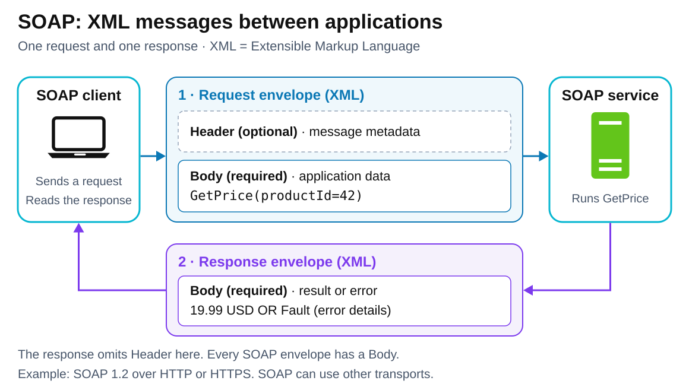

# SOAP — Simple Object Access Protocol

<sub>[Back to Computer Science](../Readme.md#content)</sub>

# Front

How does SOAP structure messages exchanged between a client and a web service?

# Back

**SOAP** (originally *Simple Object Access Protocol*) is a protocol for exchanging structured messages using **XML (Extensible Markup Language)**. It defines a standard message envelope and processing rules so applications can understand the same message structure.

## Inside a SOAP message

- **`Envelope` — required:** the outer wrapper identifying the message as SOAP.
- **`Header` — optional:** information about handling the message, such as a transaction identifier. When present, it comes before `Body`.
- **`Body` — required:** the application data, such as a price request or its result.
- **`Fault`:** structured error information inside `Body`. In SOAP 1.2, a fault occupies the Body by itself and includes a machine-readable `Code` and a human-readable `Reason`.

Follow the request from the client to the service, then the response back. In this example, the client asks for product `42`'s price; the service returns `19.99 USD` or a SOAP fault. Both directions carry a SOAP envelope.



## Minimal request: SOAP 1.2

The optional Header is omitted. `GetPrice` and `productId` are names defined by this example service.

```xml
<s:Envelope xmlns:s="http://www.w3.org/2003/05/soap-envelope"
            xmlns:p="https://example.com/prices">
  <s:Body>
    <p:GetPrice>
      <p:productId>42</p:productId>
    </p:GetPrice>
  </s:Body>
</s:Envelope>
```

The `s` and `p` prefixes distinguish SOAP elements from the service's own elements. The SOAP namespace shown here identifies **version 1.2**.

## Message, contract, and transport

**WSDL (Web Services Description Language)** can describe the service's contract: its operations, expected messages and data types, and network addresses. That tells the client what a valid `GetPrice` request should contain; SOAP supplies the message framework.

**HTTP (Hypertext Transfer Protocol)** can carry SOAP messages. In the HTTP request/response pattern shown above, the client sends the envelope in a `POST` request, and the server returns an envelope in the response. For SOAP 1.2, the content type is `application/soap+xml`.

SOAP can use other underlying protocols too. Its core message framework does not itself provide encryption or reliable delivery; those require additional mechanisms.

## Where it is still used (September 2026)

Current examples are integrations with established business software:

- **Customer records:** Salesforce exposes SOAP services for querying, creating, and updating records.
- **Human resources and payroll:** Workday exchanges employee data and connects external payroll systems through SOAP services.
- **Enterprise finance:** Workday exposes accounting, financial-reporting, and banking-related data through SOAP services.

SOAP remains useful when the vendor or partner system you need to connect to exposes the required operation through a SOAP contract.

# Sources

- [W3C — SOAP 1.2 Messaging Framework: processing, envelope, faults, namespaces, and extension boundaries (§§1, 4, 5)](https://www.w3.org/TR/soap12-part1/)
- [W3C — SOAP 1.2 Primer: HTTP request/response and content type (§4.1.2)](https://www.w3.org/TR/soap12-part0/)
- [W3C — WSDL 2.0: messages, operations, bindings, and endpoints (§1.1)](https://www.w3.org/TR/wsdl20/)
- [W3C — SOAP 1.1: the original Simple Object Access Protocol name](https://www.w3.org/TR/2000/NOTE-SOAP-20000508/)
- [Salesforce — Current SOAP endpoints and record operations (June 2026)](https://help.salesforce.com/s/articleView?id=000386036&language=en_US&type=1)
- [Workday — Production SOAP service directory: Human Resources, Payroll Interface, Financial Management, and Cash Management (2026R1)](https://community.workday.com/sites/default/files/file-hosting/productionapi/index.html)
