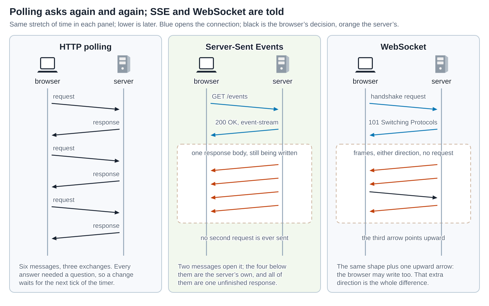
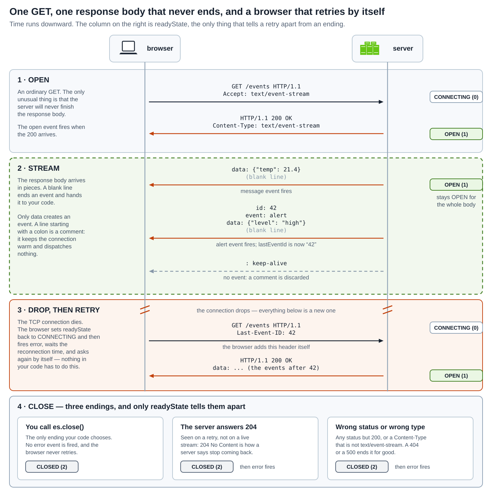
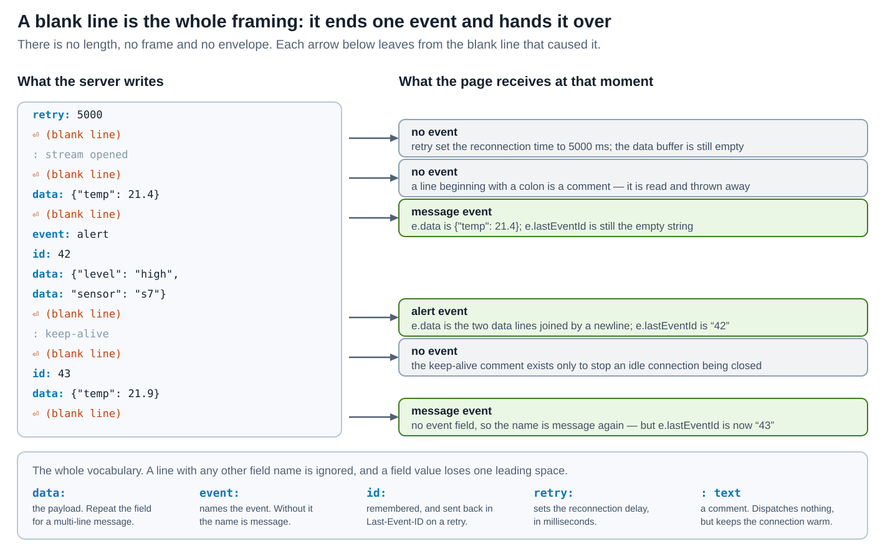
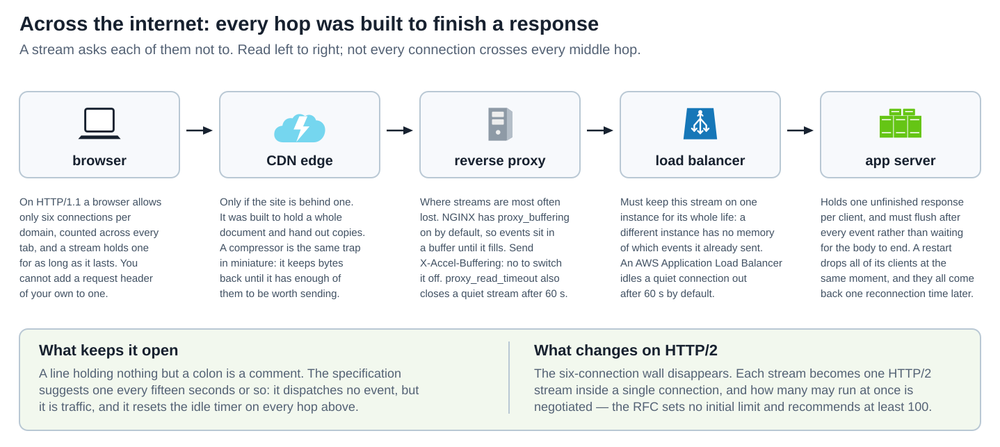
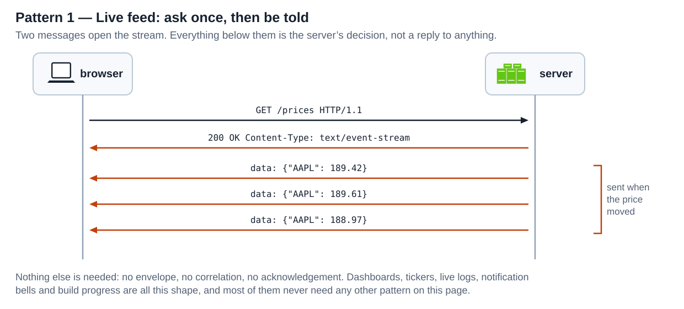
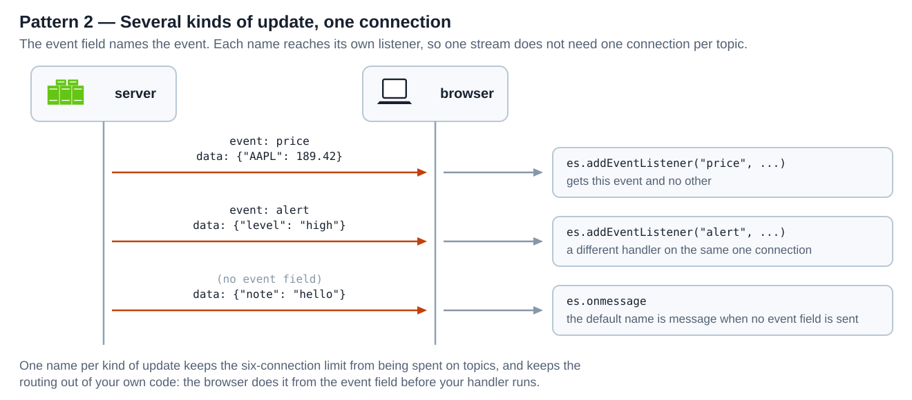
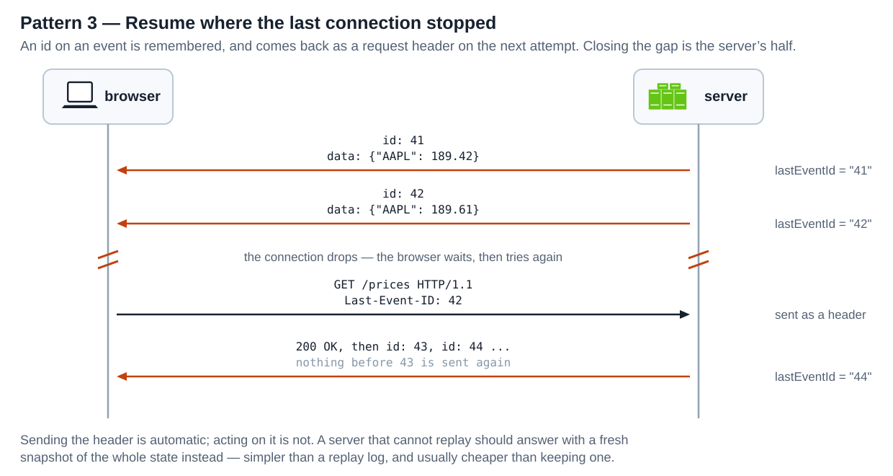
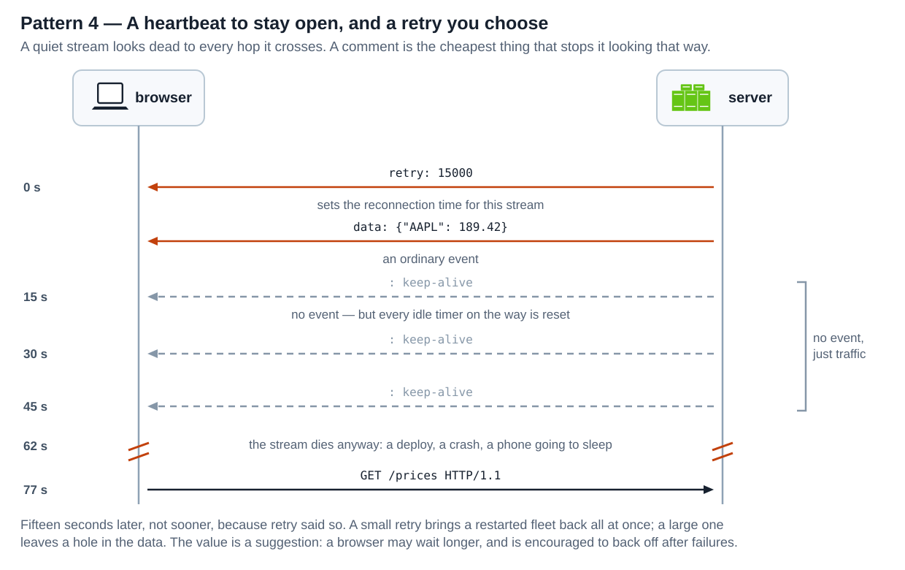
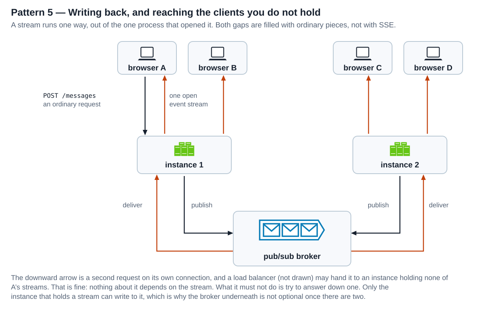

# SSE — Server-Sent Events

<sub>[Back to Computer Science](../Readme.md#content)</sub>

**Server-Sent Events** is one ordinary HTTP GET whose response never ends: the server writes lines of text into it whenever it likes, and when the connection breaks the browser opens a new one by itself.

[HTTP](../Protocols.%20HTTP/Readme.md) gives a server no way to speak first — every response exists because some request asked for it — and the usual workaround is to ask again on a timer. SSE takes the other route. It leaves the request-and-response shape completely intact and simply declines to finish the response.

That single decision is why the whole thing is small. There is no handshake to negotiate, no framing to parse, no new URL scheme, and nothing for an intermediary to fail to understand: it is an HTTP response with `Content-Type: text/event-stream` that has not ended yet. What you get in exchange for that smallness is reconnection and resumption handled for you, and what you give up is the ability for the client to say anything back on the same connection.

This article builds the model in the order you need it: what SSE is and how it sits between polling and a [WebSocket](../Protocols.%20WebSocket/Readme.md), the life of one connection from the opening request to the three different ways it can end, the wire format that fills the response body, the browser API that reads it, what the hops between a browser and a server do to a response that refuses to finish, and then **five patterns** that nearly every SSE application is assembled from, followed by the limits that survive all of them. The running examples are a price feed for the ticker `AAPL` and a sensor reading, because between them they cover the two shapes everything else varies on.

The specification is the **WHATWG HTML Standard**, in its section on server-sent events. It is a living standard, so there is no version number to quote; the API it defines is called `EventSource`, and the media type it defines is `text/event-stream`.

## What SSE is

Compare the three panels below over the same stretch of time.

On the left, **polling**: the browser asks, the server answers, six messages arranged as three exchanges. Every server message exists because a request preceded it, so a change that happens just after an answer waits for the next tick of the timer before anyone hears about it.

In the middle, the same period with **SSE**. Two messages open it: a `GET` and a `200 OK`. Everything below them is inside the dashed block, and the important thing about that block is not that the messages are unprompted — it is that they are all still *the same response*. The server has not finished writing the body it began writing when it answered `200`. There is no second request and no second response.

On the right, a **WebSocket**, for contrast. The same shape, plus one arrow that points upward: the browser may write too. That extra direction is the entire difference, and it is what the whole of the WebSocket protocol exists to provide.



Two things in that picture are easy to misread.

The first is what makes the middle panel cheap. It is not that fewer bytes travel — a busy stream may carry far more than a slow poll. It is that the request, its header block, and the connection setup are paid for **once** rather than every few seconds, and that the browser learns of a change at the moment the server does rather than at the moment it next happens to ask.

The second is what the right-hand panel costs. A WebSocket buys that upward arrow with a protocol switch, its own framing, and — because nothing in it reconnects on its own — reconnection, resumption and heartbeats that you write yourself. If nothing ever flows upward, you are paying for all of that to use half of it.

### The words you need

Six terms recur throughout, and the rest of the article assumes them.

* An **event stream** is the whole thing: one HTTP response with the media type `text/event-stream`, whose body the server is still writing.
* An **event** is one item in that stream. It becomes one event in the page's DOM (Document Object Model), delivered to a listener like any click.
* A **field** is one line of the body, written as `name: value`. There are exactly four field names, and the next-but-one section takes them apart.
* A **comment** is a line beginning with a colon. It is read and thrown away, which turns out to be useful rather than pointless.
* The **last event ID** is a string the browser remembers from the stream and sends back as a request header the next time it connects. It is how a reconnection stops being a fresh start.
* The **reconnection time** is how long the browser waits before trying again. It has an initial value the browser chooses, and the server may change it.

There is no new URL scheme: an event stream lives at an ordinary `https://` URL. There is no new port, no upgrade, and no negotiation. A server that can write `Content-Type: text/event-stream` and not close the socket is already an SSE server.

## The life of one connection

This is the diagram to spend time on, because almost every question about SSE is really a question about which band of it you are in. Read it downward. The notes on the left say what is happening, the middle carries the messages, and the column on the right holds `readyState`, the one property on the object that says where in its life the connection is — and which, as the fourth band shows, is the only thing that tells a retry apart from an ending.



**Band 1, OPEN.** The browser sends a `GET`. The specification lets it add `Accept: text/event-stream`, and it sets the request's cache mode to `no-store` so that nothing along the way is tempted to serve a saved copy. The server must answer with status `200` **and** `Content-Type: text/event-stream`. If either is wrong, there is no stream. On success the browser fires `open` and `readyState` becomes `OPEN` (1). Redirects work normally: `301` and `307` are followed as they would be for any request.

**Band 2, STREAM.** The response body arrives in pieces, and the browser turns each finished piece into a DOM event. Notice the third message in this band: `: keep-alive` is a comment, it reaches the browser, and it produces no event at all. `readyState` stays `OPEN` for the whole body.

**Band 3, DROP, THEN RETRY.** The connection dies. The browser sets `readyState` back to `CONNECTING` (0), fires `error`, waits the reconnection time, and issues the `GET` again — adding a `Last-Event-ID` header carrying the last `id` it saw. None of that is your code. The break marks on the lifelines are there because everything below them is a **different connection**, with its own request and its own `200`.

**Band 4, CLOSE.** Three endings, and the fourth band leaves the sequence form because they are alternatives rather than steps.

### One error event, two different meanings

This is the single most common source of confusion, and bands 3 and 4 are the reason. **`error` fires in both of them.** It fires when the browser is about to retry, and it fires when the browser has given up forever. It is a plain `Event` either way: no status code, no reason, nothing to inspect.

The distinction lives in `readyState`, which the browser always updates *before* it fires `error` — so by the time your handler runs, the new value is already there to read:

```javascript
es.addEventListener("error", () => {
  if (es.readyState === EventSource.CONNECTING) {
    // Band 3: a retry is already scheduled. Show "reconnecting"; do nothing else.
  } else if (es.readyState === EventSource.CLOSED) {
    // Band 4: this is the end. Nothing further will arrive.
  }
});
```

Treating every `error` as fatal tears down a connection the browser was about to restore. Treating every `error` as transient leaves a page waiting forever for a stream that has been closed for good.

### The three ways a stream ends

**You call `close()`.** The only ending your own code chooses. It aborts the fetch and sets `readyState` to `CLOSED`. No `error` event is fired, and the browser never retries. Calling it on an already-closed object does nothing.

**The server answers `204 No Content`.** This is how a server says *stop coming back*, and it is worth being precise about when you will see it: a live stream is a `200` that has not ended, so the `204` is the answer to a **reconnection attempt**, not something that arrives mid-stream. Because the status is not `200`, the browser fails the connection — `error` fires, `readyState` becomes `CLOSED`, and there are no further attempts. This is the clean way to end a finite stream, such as a build that has finished or a job that has completed.

**The status or the media type is wrong.** Any status other than `200`, or a `Content-Type` that is not `text/event-stream`, has exactly the same effect. A `404` for a stream that no longer exists, a `500` from a crashed handler, or an HTML error page served with `text/html` all end the stream permanently rather than triggering a retry — which is usually what you want, and occasionally a nasty surprise when a proxy returns a `502` during a deploy.

## The wire format

The body is text, and it is always UTF-8 — there is no way to ask for another encoding, and a leading byte order mark is stripped before anything else happens. Lines may end with CRLF, LF, or a bare CR; the parser accepts all three.

Everything else follows from one rule: **a blank line ends an event and hands it to the page.** There is no length prefix, no frame header, and no envelope. Read the diagram left to right — the stream on the left, and beside each blank line what the page received at that moment.



### Four rules that catch people out

**A blank line with no `data` dispatches nothing.** This is why the first two blank lines in the diagram produce no event. `retry` and a comment both did something useful, but neither put anything in the data buffer, and an empty data buffer is discarded rather than delivered as an empty message. It also means a stray blank line in your output is harmless.

**Several `data` lines become one string joined by newlines.** Each `data` field appends its value plus a line feed, and the final line feed is removed when the event is dispatched. So two `data` lines carrying half a JSON document each arrive as one string with a `\n` in the middle — which is exactly how you send anything containing a newline, since a raw newline would otherwise end the line and, if the next line were blank, the event.

**`id` persists; `event` does not.** After an event is dispatched, the event-type buffer is cleared, so an event with no `event` field is named `message` again even if the one before it was named `alert`. The last event ID buffer is deliberately *not* cleared: once a stream has sent `id: 42`, every later event carries `lastEventId` of `"42"` until the server sends a different one. An `id` whose value contains a NUL character is ignored outright.

**A malformed field is silently ignored, not an error.** `retry: soon` does nothing, because the value must be ASCII digits. A field name the specification does not define does nothing. A line with no colon at all is treated as that field name with an empty value — so a bare `data` line appends an empty string plus a newline, which is the idiomatic way to put a blank line inside a message. Nothing about any of this reports a problem: a typo in a field name produces a stream that runs perfectly and delivers nothing.

One more detail worth knowing before you write a server: **a field value loses exactly one leading space.** `data: hello` and `data:hello` both carry `hello`. `data:  hello` carries ` hello`, with one space. And an event left incomplete when the stream ends — fields written but no blank line after them — is discarded rather than delivered.

## What the browser gives you

The API is `EventSource`, and its shape explains several of the patterns further down.

```javascript
const es = new EventSource("/prices");
// cross-origin and needing cookies:
//   new EventSource("https://api.example.com/prices", { withCredentials: true })

es.addEventListener("open",    () => console.log("streaming"));
es.addEventListener("message", (e) => render(JSON.parse(e.data), e.lastEventId));  // no event field
es.addEventListener("alert",   (e) => banner(JSON.parse(e.data)));                 // event: alert
es.addEventListener("error",   () => {
  if (es.readyState === EventSource.CLOSED) giveUp();              // otherwise a retry is coming
});

es.readyState;   // 0 CONNECTING, 1 OPEN, 2 CLOSED
es.close();      // CLOSED, no error event, no retry
```

Four details in that snippet matter more than they look.

* **The constructor takes a URL and one option, and that option is `withCredentials`.** There is no way to set a request header, so there is no `Authorization` header on an `EventSource` request. Credentials travel as cookies — same-origin automatically, cross-origin only when `withCredentials` is true, which also requires the server to allow credentialed CORS (Cross-Origin Resource Sharing) — or as a query parameter, which is the weakest choice because URLs end up in logs. There is also no way to send a request body, which is why the fifth pattern exists.
* **Every event object carries `lastEventId`.** It is the resumption cursor described above, readable from any handler, and it is what you would persist if you wanted to resume across a page reload rather than merely across a dropped connection.
* **`error` tells you nothing by itself.** Pair it with `readyState`, as above. Nothing in the API reports *why* a stream failed; a `404` and a dropped cable are indistinguishable from the page's point of view.
* **There is no backpressure signal and nothing to send.** A WebSocket gives you `bufferedAmount` because you can write into it; an `EventSource` is read-only, so the only queue that can grow is in the server and the kernel, where your page cannot see it.

A server side is correspondingly small. Three things are easy to forget; two of them are visible in the response below — the media type, and the header that tells the proxy in front of you not to buffer — and the third is flushing after every event instead of letting the runtime batch, which lives in the code that writes the body rather than in the body itself:

```text
HTTP/1.1 200 OK
Content-Type: text/event-stream
Cache-Control: no-store
X-Accel-Buffering: no

data: {"AAPL": 189.42}

: keep-alive

data: {"AAPL": 189.61}

```

## How it works over the internet

Everything above describes two endpoints. A real stream crosses several machines, every one of which was built on the assumption that a response is a thing that finishes. Read the row below from left to right; the notes under each hop say what that hop does to a response that does not.



### Buffering is the failure you will actually meet

The symptom is unmistakable once you have seen it: events do not arrive one at a time, they arrive in a burst of twenty, and then nothing for a minute, and then another burst. Nothing is broken; something in the middle is collecting them.

**NGINX buffers proxied responses by default.** `proxy_buffering` is `on`, which means NGINX reads the response into a buffer and passes it along when that buffer fills or the response ends — and this response never ends. The documented way to switch it off for one response, without changing the configuration for everything else, is for the upstream application to send `X-Accel-Buffering: no`, which NGINX reads and obeys. The same NGINX also closes a connection when the upstream has transmitted nothing for `proxy_read_timeout`, which defaults to **60 seconds**.

**A CDN (content delivery network) or an edge cache is the same trap at a larger scale**, and a compressor is the same trap in miniature: compression works by holding bytes back until it has enough of them to be worth emitting, which is precisely the behaviour you are trying to prevent. If you compress an event stream, the compressor must be told to flush at every event boundary.

**A load balancer adds the problem that outlives the connection: state.** The stream belongs to one process on one instance, and what that process knows — which events it has already sent this client — lives in its memory. An AWS Application Load Balancer's `idle_timeout.timeout_seconds` attribute defaults to **60 seconds**, so a quiet stream crossing one is closed on the minute unless something keeps it busy.

The answer to every timeout above is the band headed *What keeps it open* in the diagram, and it is remarkably cheap: **a line consisting of nothing but a colon**. It is a comment, so it dispatches no event, but it is traffic, so it resets the idle timer on every hop at once. The specification's own advice is one every fifteen seconds or so, and it says why: legacy proxies are known to drop HTTP connections after a short timeout. The specification also warns that HTTP chunking done by a layer unaware of the timing requirements can hurt, and suggests disabling chunking for event streams if it does.

### The six-connection wall

A browser allows only about **six** simultaneous HTTP/1.1 connections per domain, counted across every tab, and an open event stream holds one of them for as long as it lasts. Open your application in seven tabs and the seventh hangs — not slowly, but completely, waiting for one of the other six to let go. The specification names this problem directly and offers three ways out: unique domain names per connection, letting the user turn the feature off per page, or sharing one `EventSource` between tabs through a shared worker.

The fourth and usual answer is **HTTP/2**, where the wall disappears. Each stream becomes one HTTP/2 stream multiplexed inside a single connection, and how many may run at once is negotiated through `SETTINGS_MAX_CONCURRENT_STREAMS` — RFC 9113 sets no initial limit on it and recommends that it be no smaller than 100.

This is the point at which SSE's smallness pays off most visibly. A WebSocket had to have its bootstrap redefined for HTTP/2, because that version has no `Upgrade` field and no `101` status. SSE needed nothing: it was only ever a response body, so it travels over HTTP/1.1, HTTP/2 and HTTP/3 unchanged, and every pattern below applies identically on all three.

## Patterns

These five are what SSE applications are actually built from, and they have a pleasing property: the first four are each built from exactly one field of the wire format, in the order *The wire format* introduced them. The fifth is about everything the protocol deliberately does not do.

They share one premise worth stating first. SSE delivers text from a server to a browser and does nothing else — no addressing, no correlation, no acknowledgement, no upward channel, no idea that two connections from the same person are related. Everything in this section either fills one of those gaps or exploits a field that was put there to help.

### 1. Live feed

The browser asks once. Every message after that is the server's decision.

Read the diagram downward. A `GET` goes up, a `200 OK` comes back, and then three `data` messages arrive with nothing between them — the bracket beside them marks the point: they were sent when the price moved, not when anybody asked.



This is the pattern SSE was designed for and the one most systems only ever need. Price tickers, dashboards, notification bells, live logs, build progress, and the "your export is ready" toast are all this shape, and none of them needs any other pattern on this page. The whole client is three lines: construct, listen for `message`, render.

It is worth being clear about when this is *not* enough. The moment the browser genuinely needs to send on the same channel — a collaborative editor's keystrokes, a game's input, anything where round-trip latency upward matters — a [WebSocket](../Protocols.%20WebSocket/Readme.md) is the right tool and pattern 5 below is a workaround rather than a design.

### 2. Several kinds of update on one stream

A page rarely wants one kind of update. It wants prices *and* alerts *and* the occasional system notice, and the naive answer — one `EventSource` per kind — spends the six-connection budget from *The six-connection wall* on topics.

The `event` field solves this without any work on your side. Each event names itself, and the browser routes it to the listener registered under that name before your handler runs. In the diagram — which puts the server on the left, the one figure here that does, so the listener boxes can sit beside the browser — `event: price` reaches the `price` listener and the `alert` listener never sees it. The third message has no `event` field at all, which is the case to remember: its name is `message`, the default, so it reaches `onmessage` and *not* the named listeners.



Two consequences follow. Because the name is chosen per event rather than per connection, adding a new kind of update costs one more `addEventListener` and no new connection. And because `onmessage` only ever receives the unnamed events, a stream that starts naming everything will silently stop reaching a handler that was written against `onmessage` — a rewrite of the server that adds `event:` lines to messages that did not have them is a breaking change to the client, even though nothing about it looks like one.

### 3. Resume where the last connection stopped

The browser reconnects for you, but reconnecting is not the same as not having missed anything. Between the last event of the old connection and the first of the new one there is a gap, and closing it is the point of the `id` field.

The diagram reads downward and has two acts. Two events arrive carrying `id: 41` and `id: 42`, so the browser's last event ID becomes `"42"`. The lifelines then break — everything below is a second, brand-new connection — and the browser reissues the `GET` with `Last-Event-ID: 42` in the header list. The server reads it and sends only what came after.



Three parts of that are easy to get wrong.

* **Only the sending is automatic.** The browser adds the header without being asked; nothing makes the server act on it. A server that ignores `Last-Event-ID` produces a stream that reconnects flawlessly and loses data every time, and the client cannot tell.
* **Replay, or snapshot.** A server that can replay sends the events after the cursor. A server that cannot should send a fresh snapshot of the whole state instead — simpler than a replay log, usually cheaper than keeping one, and correct for a dashboard where only the current value matters.
* **The id must survive the trip.** It goes out in a response body and comes back in a request header, so keep it short, opaque and free of NUL, CR and LF. A sequence number or an opaque cursor is right; a JSON blob is asking for trouble.

### 4. A heartbeat, and a retry you choose

The `retry` field and the comment line are the two pieces of the format that never carry any data, and between them they decide how a stream behaves when nothing is happening.

The diagram puts elapsed time down the left. At zero seconds the server sends `retry: 15000`, setting the reconnection time for this stream, and then a real event. At fifteen, thirty and forty-five seconds it sends `: keep-alive` — dashed, because those arrive at the browser and produce nothing. At sixty-two seconds the stream dies anyway, because something always does, and at seventy-seven seconds the browser tries again: fifteen seconds later, not sooner, because `retry` said so.



The comment is doing two jobs at once. It resets the idle timers described in *How it works over the internet*, and it is also how a server discovers a client that vanished without closing — a write to a socket nobody is reading eventually fails, and a stream that never writes never finds out.

`retry` is more subtle, and the honest framing is that it is a **suggestion with a floor, not a schedule**. The value sets the reconnection time, but the specification explicitly permits a browser to wait longer, and encourages exponential backoff after a failed attempt and waiting for the operating system to report that the network is back. So a large `retry` reliably slows reconnection down; a small one does not reliably speed it up. Choose it for the fleet rather than for one client: when an instance restarts, every stream it held dies at the same instant, and a `retry` of 500 ms brings all of them back at the same instant too.

### 5. Writing back, and reaching the clients you do not hold

The last pattern is about the two things SSE does not do, and it is the architecture every non-trivial SSE application converges on.

The first gap is direction. A stream runs one way, and `EventSource` cannot send a body. So the upward half of the conversation is **an ordinary HTTP request** — a `POST` on its own connection, with its own headers, its own authentication, and no relationship to the stream whatsoever. In the diagram that is the single downward arrow from browser A.

The second gap is ownership. A stream is an open response held by one process, and a process can only write into responses it is holding. Instance 1 physically cannot write to a stream that instance 2 owns. Underneath both of them therefore runs a broker that every instance subscribes to, so that a message arriving anywhere is published once and delivered to every instance, each of which writes it into the streams it holds.



The `POST` and the stream being separate is the part people trip over. The load balancer may send that `POST` to an instance that holds none of browser A's streams — and that is fine, because nothing about the `POST` depends on the stream. What it must not do is try to answer down the stream, because the instance that received it may have no way to reach it. The reply either comes back in the `POST`'s own response, or it goes to the broker and reaches the browser through whichever instance is holding its stream.

Redis Pub/Sub, Kafka, NATS and a database's own `LISTEN`/`NOTIFY` all serve as the broker; the requirement is only that one process can publish and every other can read. Two consequences follow. Each instance must still keep a local map from topic to open streams, because a subscription is per instance rather than per client. And because the broker is now in the delivery path, its failure is a delivery failure even though every stream is still perfectly open.

## Limits worth knowing

* **Nothing flows upward, and nothing ever will.** This is a design decision, not an omission. If the client needs to send on the same channel, you want a WebSocket; if it needs to send occasionally, pattern 5 is genuinely fine.
* **Text only, and UTF-8 at that.** There is no binary event. Sending bytes means encoding them — base64, most often — which costs roughly a third more size and makes the stream harder to read while debugging, the one thing SSE is otherwise unusually good at.
* **There is no delivery guarantee.** Writing an event does not mean the browser received it. `id` and `Last-Event-ID` give you a *resumption* mechanism, which is not the same thing: it only helps if the server can still produce what came after the cursor. If a message matters, acknowledge it at the application level.
* **Six connections per domain on HTTP/1.1.** Counted per browser and domain, across every tab. Serve over HTTP/2 or share one stream between tabs with a shared worker; do not assume a user has exactly one tab open.
* **A restart drops every client at once.** There is no handover of an open response to a new process. A rolling deploy is a synchronised mass reconnection, which is why the `retry` value in pattern 4 is a fleet-wide decision.
* **Open streams are the capacity limit.** The cost is no longer requests per second but responses held open, each with its buffers and its per-client state, whether or not anything is flowing. Idle streams are not free.
* **Nothing about it is authenticated by default.** It is an HTTP request, so it carries whatever HTTP authentication you attach to it — and since you cannot set a header, in a browser that means cookies. Checking the origin and validating a session are your server's work, exactly as for any other endpoint.
* **Not every problem needs a stream.** If updates are rare and a little staleness is acceptable, polling is less machinery, survives every intermediary above without configuration, and cannot leak an open connection. SSE earns its complexity when updates are frequent enough, or timely enough, that asking repeatedly is the wrong shape.

## Self-check

1. A colleague says SSE is "WebSockets over HTTP". What is wrong with that description?

   <details>
   <summary>Answer</summary>

   Two things. It is not a protocol layered over HTTP at all — it is an HTTP response body with a particular media type, which is why it needed no redefinition for HTTP/2 while WebSocket did. And it is one-directional: the browser cannot send anything on it. The half that makes a WebSocket a WebSocket is precisely the half SSE does not have.

   </details>

2. Your server answers the stream request with `200 OK` and `Content-Type: application/json`. What does the browser do?

   <details>
   <summary>Answer</summary>

   It fails the connection: `error` fires, `readyState` becomes `CLOSED`, and it does not retry. Both conditions must hold — status `200` **and** `Content-Type: text/event-stream`. Getting the status right and the media type wrong is a permanent failure, not a transient one.

   </details>

3. Your `error` handler calls `es.close()` and shows "disconnected". Users report that a brief network blip disconnects them permanently. Why?

   <details>
   <summary>Answer</summary>

   Because `error` fires on a retry as well as on an ending. A blip puts `readyState` at `CONNECTING` with a reconnection already scheduled; calling `close()` there cancels the recovery the browser was about to perform. The handler must branch on `readyState`: `CONNECTING` means a retry is coming, `CLOSED` means it is over.

   </details>

4. The server writes `retry: 5000`, then a blank line. Nothing appears in the page. Is something broken?

   <details>
   <summary>Answer</summary>

   No, that is correct behaviour. A blank line dispatches an event only if the data buffer is non-empty, and `retry` puts nothing in it. The reconnection time was set; no event was ever due.

   </details>

5. Your page streams fine from its own origin, but the cross-origin build receives no cookies, and the `Authorization` header you set never arrives. What is going on?

   <details>
   <summary>Answer</summary>

   Two separate limits of the API, not a server bug. The constructor takes a URL and exactly one option, `withCredentials`, so there is no way to set a request header at all — an `Authorization` header is simply not possible. Credentials travel as cookies instead: automatically on the same origin, and cross-origin only when `withCredentials` is true *and* the server allows credentialed CORS. A query parameter is the remaining option and the weakest one, because URLs end up in logs.

   </details>

6. Events arrive in bursts of twenty every minute instead of one at a time, and only in production. Where do you look first?

   <details>
   <summary>Answer</summary>

   At buffering in whatever sits in front of the application, because that is the hop that is not there locally. NGINX has `proxy_buffering on` by default, so it collects the response until a buffer fills; the per-response fix is for the application to send `X-Accel-Buffering: no`. A CDN, an edge cache or a compressor holding bytes back produces the same symptom, and so does an application that never flushes after writing an event.

   </details>

7. Your stream dies exactly every sixty seconds, but only when nothing is happening. What is going on, and what is the fix?

   <details>
   <summary>Answer</summary>

   An idle timeout on an intermediary: NGINX's `proxy_read_timeout` defaults to 60 s, and an AWS Application Load Balancer's `idle_timeout.timeout_seconds` also defaults to 60 s. The fix is a comment line — nothing but a colon — every fifteen seconds or so. It dispatches no event but it is traffic, so it resets the timer on every hop at once.

   </details>

8. Your server sends `id:` on every event and the browser reconnects cleanly, yet users still lose messages across a blip. What did you forget?

   <details>
   <summary>Answer</summary>

   The server half. The browser sends `Last-Event-ID` automatically; acting on it is not automatic. If the handler ignores that header and starts from "now", the stream reconnects perfectly and drops everything that happened during the gap. Either replay what came after the cursor, or send a fresh snapshot of the whole state.

   </details>

9. A rewrite adds `event: update` to messages that previously had no `event` field. Nothing else changes. What breaks?

   <details>
   <summary>Answer</summary>

   Every client listening on `onmessage`. An event with no `event` field is named `message`; once it is named `update`, only a listener registered for `update` receives it. `onmessage` goes quiet with no error anywhere, on either side.

   </details>

10. You open the app in seven tabs and the seventh never connects. Why, and what are the options?

    <details>
    <summary>Answer</summary>

    The browser's HTTP/1.1 limit of about six connections per domain, counted across all tabs, and each open stream holds one. Serve the stream over HTTP/2, where each one becomes a multiplexed stream and the concurrent limit is negotiated — RFC 9113 sets no initial limit and recommends at least 100. Otherwise share a single `EventSource` between tabs through a shared worker, which the specification suggests by name.

    </details>

11. A client needs to send a chat message, and its stream is open on instance 1. Why can it not just write up the stream, and where does the message go?

    <details>
    <summary>Answer</summary>

    Because the stream is a response body: it runs one way, and `EventSource` has no way to send anything. The message goes as an ordinary `POST` on its own connection, which the load balancer may route to any instance. That instance publishes to a broker every instance subscribes to, and each instance writes the message into the streams it is holding — because only the process holding a stream can write to it.

    </details>

12. You need a live progress bar for a job that finishes. How should the stream end, and how will the page know?

    <details>
    <summary>Answer</summary>

    Cleanest is for the page to call `close()` when it receives the event saying the job is done: `readyState` becomes `CLOSED`, no `error` fires and nothing retries. If the server must be the one to end it, it closes the response and then answers the browser's reconnection attempt with `204 No Content` — which fails the connection, so `error` fires once, `readyState` becomes `CLOSED`, and the retries stop. Simply closing the response without either of those produces an endless reconnect loop.

    </details>

13. You are about to add a `retry: 500` so that clients recover quickly from a deploy. What is worth checking first?

    <details>
    <summary>Answer</summary>

    That you are not building a thundering herd. Every stream an instance held dies at the same instant, so a short reconnection time brings all of them back at the same instant, at the worst possible moment. It may not even buy what you think: `retry` sets the reconnection time, but a browser is explicitly allowed to wait longer and is encouraged to back off after a failure — so a large value reliably slows reconnection down while a small one does not reliably speed it up.

    </details>

# Sources

Primary specifications and vendor documentation, opened and checked on 2026-09-22. The WHATWG HTML Standard is the backbone: the `EventSource` interface, the processing model, the reconnection rules, the `Last-Event-ID` header and the whole wire format come from it directly. MDN supplies the browser-side connection limits, RFC 9113 the HTTP/2 concurrency setting, and the NGINX and AWS pages the concrete sixty-second timeouts and the buffering defaults. The `AAPL` feed, the sensor readings, the lettered browsers and every message body in the diagrams are teaching examples.

- [WHATWG HTML Standard — Server-sent events](https://html.spec.whatwg.org/multipage/server-sent-events.html)
- [§9.2.1 Introduction](https://html.spec.whatwg.org/multipage/server-sent-events.html#server-sent-events-intro) — the worked examples of `data`, `event` and named event types; that "the default event type is 'message'"; that "event streams are always decoded as UTF-8. There is no way to specify another character encoding"; that requests "can be redirected using HTTP 301 and 307 redirects as with normal HTTP requests"; and that "a client can be told to stop reconnecting using the HTTP 204 No Content response code".
- [§9.2.2 The EventSource interface](https://html.spec.whatwg.org/multipage/server-sent-events.html#the-eventsource-interface) — the constructor taking a URL and an `EventSourceInit` whose only member is `withCredentials`; the `readyState` constants `CONNECTING` (0), `OPEN` (1) and `CLOSED` (2) and their definitions; the `onopen`, `onmessage` and `onerror` handlers; and `close()`, which "must abort any instances of the fetch algorithm started for this `EventSource` object, and must set the `readyState` attribute to `CLOSED`".
- [§9.2.3 Processing model](https://html.spec.whatwg.org/multipage/server-sent-events.html#sse-processing-model) — that user agents "may set (`Accept`, `text/event-stream`)" in the request header list and set the request's cache mode to "no-store"; that the connection fails "if res's status is not 200, or if res's `Content-Type` is not `text/event-stream`"; the *reestablish the connection* steps, which set `readyState` to `CONNECTING`, fire `error`, wait the reconnection time, may add "an exponential backoff delay to avoid overloading a potentially already overloaded server", and set the `Last-Event-ID` header when the last event ID string is not empty; and the *fail the connection* steps, which set `readyState` to `CLOSED`, fire `error`, and after which "it does not attempt to reconnect".
- [§9.2.4 The `Last-Event-ID` header](https://html.spec.whatwg.org/multipage/server-sent-events.html#the-last-event-id-header) — that the header "reports an `EventSource` object's last event ID string to the server when the user agent is to reestablish the connection", and that its value is "essentially any UTF-8 encoded string, that does not contain U+0000 NULL, U+000A LF, or U+000D CR".
- [§9.2.5 Parsing an event stream](https://html.spec.whatwg.org/multipage/server-sent-events.html#parsing-an-event-stream) — that "this event stream format's MIME type is `text/event-stream`", that the UTF-8 decode strips one leading byte order mark, and that lines may be separated by CRLF, a single LF, or a single CR.
- [§9.2.6 Interpreting an event stream](https://html.spec.whatwg.org/multipage/server-sent-events.html#event-stream-interpretation) — that a line starting with a colon is ignored; that a line with no colon is processed "using the whole line as the field name, and the empty string as the field value"; that a field value loses one leading U+0020 SPACE; the semantics of `event`, `data`, `id` (ignored when the value contains NUL) and `retry` (ignored unless the value is only ASCII digits), with any other field ignored; the *dispatch the event* steps, where an empty data buffer returns without dispatching, a trailing LF is removed, the event is a `MessageEvent` with `data`, `origin` and `lastEventId`, and the type is `message` unless the event type buffer overrides it; that "the buffer does not get reset, so the last event ID string of the event source remains set to this value until the next time it is set by the server"; and that at the end of the file "the incomplete event is not dispatched".
- [§9.2.7 Authoring notes](https://html.spec.whatwg.org/multipage/server-sent-events.html#authoring-notes) — that "legacy proxy servers are known to, in certain cases, drop HTTP connections after a short timeout" and that authors can therefore "include a comment line (one starting with a ':' character) every 15 seconds or so"; that "HTTP chunking can have unexpected negative effects on the reliability of this protocol"; and that clients supporting "HTTP's per-server connection limitation might run into trouble when opening multiple pages", with unique domain names, a per-page switch, or "sharing a single `EventSource` object using a shared worker" offered as the ways out.
- [MDN — Using server-sent events](https://developer.mozilla.org/en-US/docs/Web/API/Server-sent_events/Using_server-sent_events) — that "this is a one-way connection, so you can't send events from a client to a server"; that "by default, if the connection between the client and server closes, the connection is restarted" and is terminated with `close()`; that consecutive `data:` lines are concatenated with a newline between them; the requirement that the server respond with the MIME type `text/event-stream`; the `withCredentials` option for a cross-origin stream; and the connection limits — that when not used over HTTP/2 the maximum number of open connections "is per browser and is set to a very low number (6)", counted per browser plus domain across all tabs.
- [MDN — The EventSource interface](https://developer.mozilla.org/en-US/docs/Web/API/EventSource) — that an `EventSource` instance "opens a persistent connection to an HTTP server, which sends events in `text/event-stream` format", that the connection "remains open until closed by calling `EventSource.close()`", that "unlike WebSockets, server-sent events are unidirectional", and the `open`, `message` and `error` events.
- [RFC 9113 — HTTP/2](https://www.rfc-editor.org/rfc/rfc9113.html) — `SETTINGS_MAX_CONCURRENT_STREAMS` (0x03): "Initially, there is no limit to this value. It is recommended that this value be no smaller than 100, so as to not unnecessarily limit parallelism."
- [NGINX — `ngx_http_proxy_module`](https://nginx.org/en/docs/http/ngx_http_proxy_module.html) — `proxy_buffering`, whose default is `on` and which, when enabled, "receives a response from the proxied server as soon as possible, saving it into the buffers", and which "can also be enabled or disabled by passing 'yes' or 'no' in the 'X-Accel-Buffering' response header field"; and `proxy_read_timeout`, whose default is `60s` and after which, "if the proxied server does not transmit anything within this time, the connection is closed".
- [AWS — Application Load Balancers](https://docs.aws.amazon.com/elasticloadbalancing/latest/application/application-load-balancers.html) — the `idle_timeout.timeout_seconds` load balancer attribute: "The idle timeout value, in seconds. The default is 60 seconds."
- Local icon sources: [System Design: stateful chat architecture](../../system%20design/12.%20Chat%20System/images/high-level-statefull-arch.svg) supplies the laptop symbol, [System Design: chat high-level design](../../system%20design/12.%20Chat%20System/images/high-level-design.svg) the load-balancer symbol, [System Design: CDN comparison](../../system%20design/18.%20Google%20Maps/images/cdn-vs-no-cdn.svg) the server symbol, [System Design: YouTube high-level design](../../system%20design/14.%20Youtube/images/high-level-design.svg) the CDN cloud symbol, and [System Design: Google Drive high-level design](../../system%20design/15.%20Google%20Drive/images/high-level-design.svg) the server-rack and queue symbols, copied as editable vector shapes into this article's diagrams.
