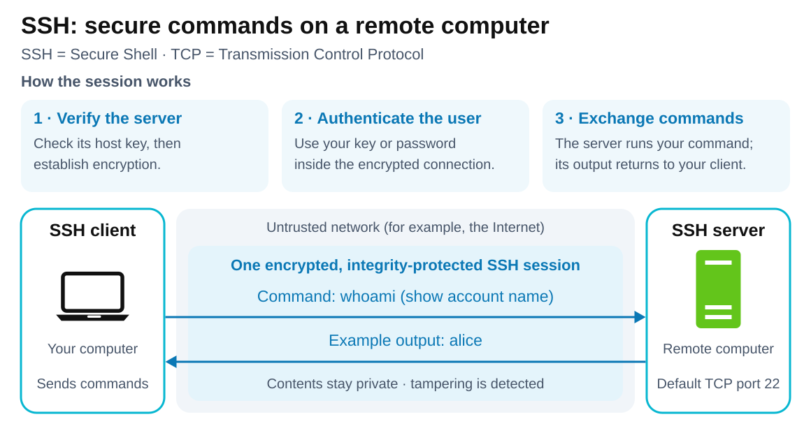

# SSH — Secure Shell

<sub>[Back to Computer Science](../Readme.md#content)</sub>

# Front

What is SSH used for, and how does a secure session work?

# Back

**SSH (Secure Shell)** is a protocol for secure remote login and command execution over an untrusted network. It verifies identities, **encrypts** data so network observers cannot read it, and checks **integrity** so changes to the data are detected.

## Typical uses

- **Server administration:** log in to inspect logs, edit configuration, or restart services.
- **Automation and deployment:** run remote commands from scripts to deploy applications or perform maintenance.
- **File transfer:** upload and download files with **SFTP (SSH File Transfer Protocol)**, which runs over SSH.
- **Git access:** clone, fetch, and push repositories using an SSH remote.
- **Tunnelling (port forwarding):** carry a selected connection, such as database access, through SSH. SSH encrypts the client-to-SSH-server part of the route.

## How a session works

The SSH client on your computer connects to an SSH server, normally over **TCP (Transmission Control Protocol)** at server port **22**.

1. **Verify the server and establish encryption.** The client checks the server's **host key**, a cryptographic identity for that server. A key exchange establishes keys used to protect the connection.
2. **Authenticate the user.** Inside the protected connection, the server verifies the user, for example with a password or a public key. With public-key authentication, the client proves possession of the matching private key; the private key is never sent to the server.
3. **Run commands remotely.** The client sends commands; the server executes them and returns output. Both directions use the same protected SSH connection.

Read the setup steps first, then follow the arrows: `whoami` goes to the server, and the example account name `alice` comes back. The labels show the readable contents; these travel encrypted across the network.



## Example

With an accessible SSH server and an account named `alice`:

```bash
ssh alice@server.example.com
```

After authentication, this opens a remote shell: commands you type run on the **server**. Add a command to run it directly instead:

```bash
ssh alice@server.example.com whoami
```

## Two identities to remember

**The host key identifies the server; user authentication identifies you.** On a first connection, verify the displayed host-key **fingerprint** (a short identifier derived from the key) through a trusted source, such as the server administrator. Blindly accepting it can let an impostor pose as the server. OpenSSH remembers accepted host keys in `~/.ssh/known_hosts` and warns if they change.

# Sources

- [RFC 4251 — SSH architecture, secure channels, and host-key trust (§§1, 4.1)](https://www.rfc-editor.org/rfc/rfc4251.html)
- [RFC 4253 — Transport protection, server port 22, and key exchange (§§1, 4.1, 7.2)](https://www.rfc-editor.org/rfc/rfc4253.html)
- [OpenSSH ssh manual — Commands, user authentication, known hosts, and fingerprint verification](https://man.openbsd.org/ssh.1)
- [OpenBSD whoami manual — Prints the effective user name](https://man.openbsd.org/whoami.1)
- [OpenSSH sftp manual — File transfers over SSH](https://man.openbsd.org/sftp.1)
- [Pro Git — The SSH protocol for repository access](https://git-scm.com/book/en/v2/Git-on-the-Server-The-Protocols)
