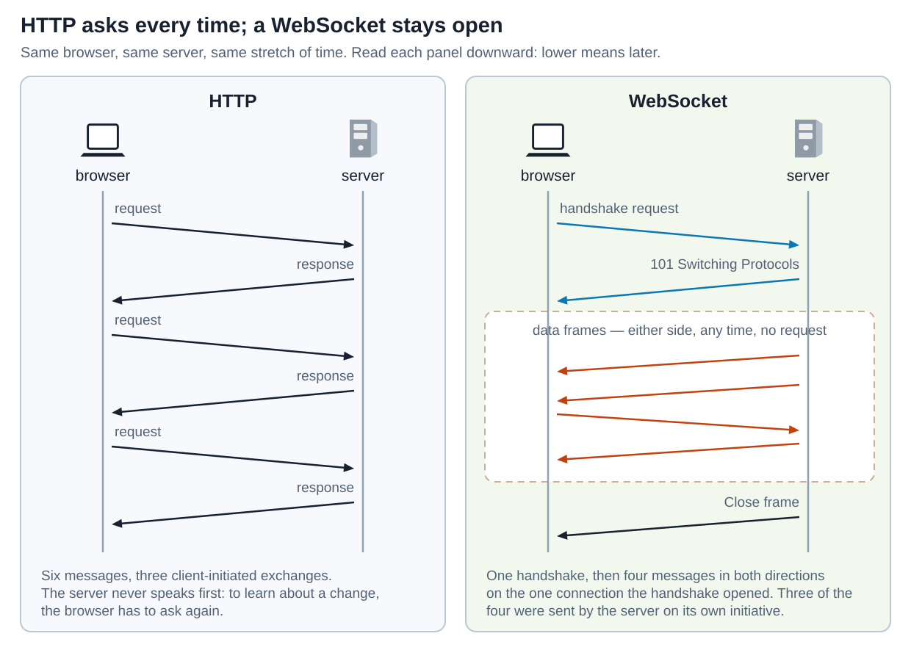
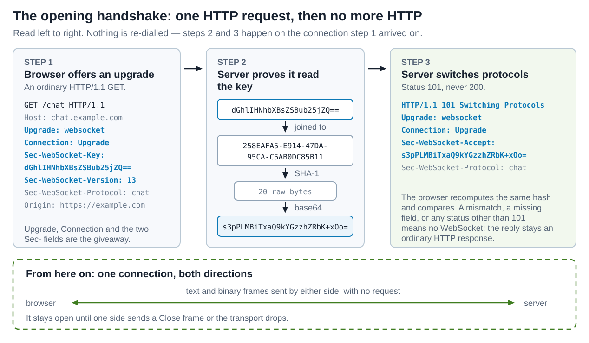
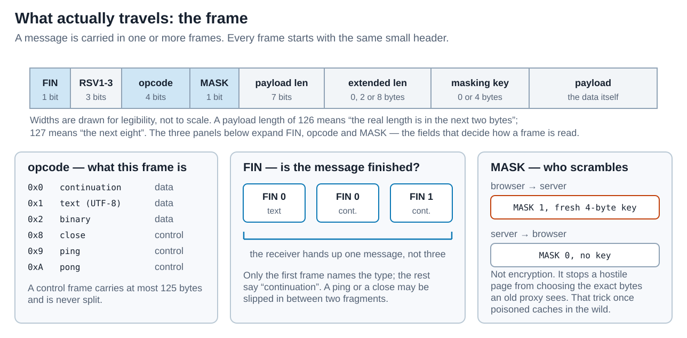
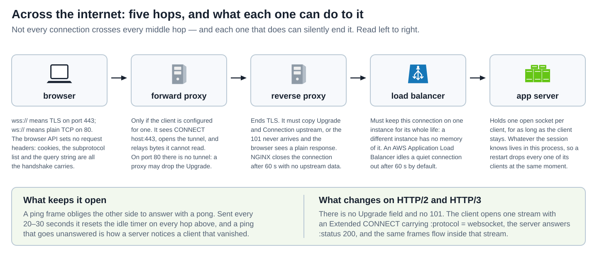
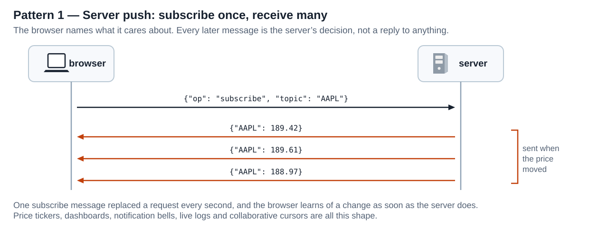
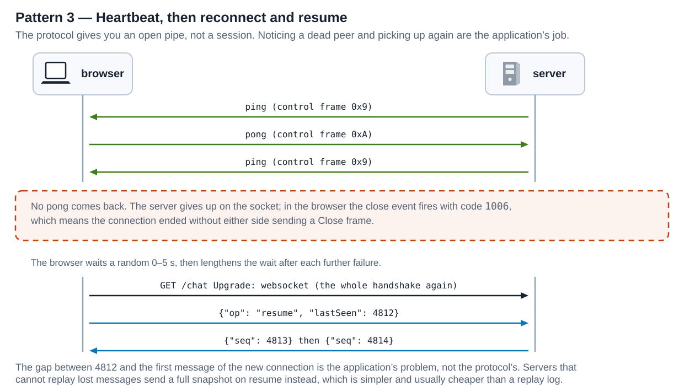
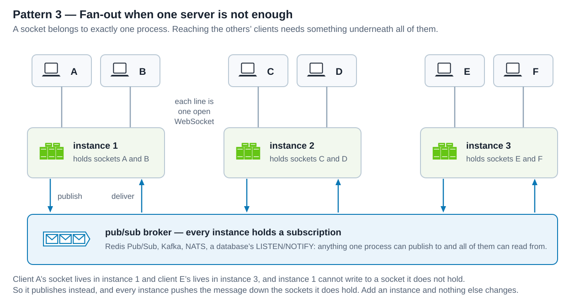
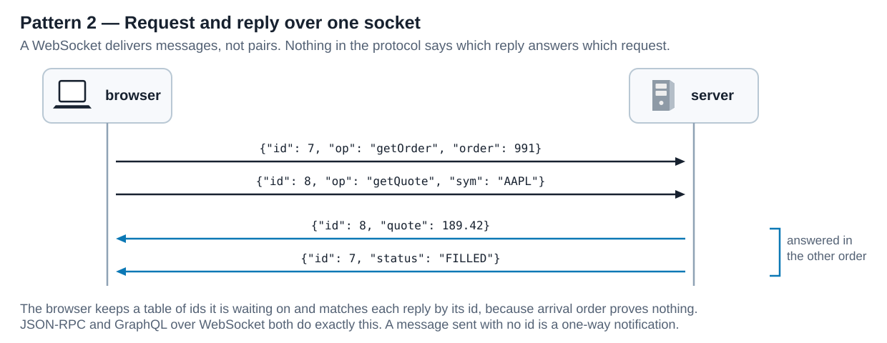
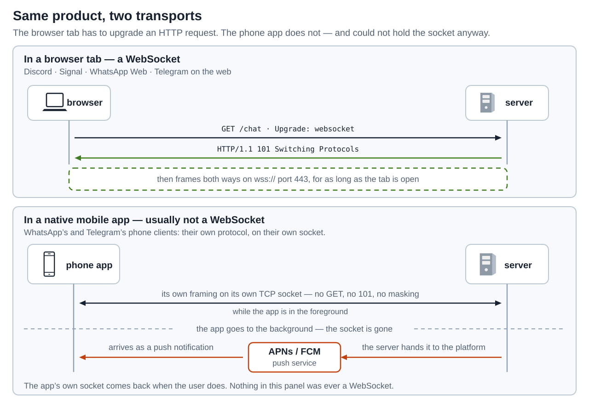

# WebSocket — The WebSocket Protocol

<sub>[Back to Computer Science](../Readme.md#content)</sub>

**A WebSocket is one connection, opened by an ordinary HTTP request, that both sides may write to whenever they like for as long as it lasts.** [HTTP](../Protocols.%20HTTP/Readme.md) gives a server no way to speak first: every response exists because some request asked for it. The WebSocket Protocol lifts that rule, and lifts it once — the cost of opening the channel is paid at the start rather than on every message.

This article builds the model in the order you need it: what the protocol is and how it differs both from the HTTP it begins as and from Server-Sent Events, the nearest thing to it, the handshake that opens it, the frames that travel afterwards, what a browser exposes to your code, what the hops between a browser and a server do to a connection that stays open for hours, then **five patterns** that nearly every WebSocket application is assembled from, then which real products actually run on one and which only look as though they do, and finally the limits that survive all of them. The running examples are a price feed for the ticker `AAPL` and a chat room, because between them they cover the two shapes everything else varies on.

The specification is **RFC 6455**, published in 2011 and still current; the version number carried in the handshake is `13`. Two later RFCs, 8441 and 9220, say how to start the same protocol over HTTP/2 and HTTP/3.

## What a WebSocket is

Compare the three panels below over the same stretch of time. Each holds the same browser and the same server, drawn as two vertical lifelines, and lower means later. Blue opens a connection. After that, an arrow's colour says whose decision it was rather than which way it points: black for a message that exists because the browser asked, orange for one the server sent on its own. That is why every arrow in the left panel is black, including the three that fly server to browser — a response is the server's message but the browser's decision, which is the whole complaint of the panel.

**Left — HTTP polling.** The browser asks, the server answers, six messages arranged as three exchanges, and each server message exists only because a request preceded it. To learn that a price changed, the browser has to ask again — and it has no way to know when asking is worthwhile.

**Middle — Server-Sent Events.** One `GET /events`, answered once with `200 OK` and a `text/event-stream` body the server then keeps writing to. The four messages in the dashed block are the server's own, and no second request is ever sent. They are not four responses, which is why the rule this article opened with survives: they are one response body still being written, and it exists because a request asked for it. This is the half-measure worth knowing from the start — every arrow in the panel runs server to browser, so the browser has no way to answer on that channel. Pattern 1 and the limits both come back to it.

**Right — WebSocket.** Two messages open the connection: a handshake request and a `101 Switching Protocols` reply. After that, the dashed block holds four messages that nobody requested. Three are the server's own initiative — it sent them because something happened, not because it was asked. The fourth, the third arrow down, runs the other way: the browser writing unprompted. That single arrow is the whole of what a WebSocket adds to the middle panel.



Two things in that picture are easy to misread.

The first is what "persistent" means. HTTP/1.1 already reuses a TCP connection for many request-response pairs, so an open connection is not what WebSockets added — and the middle panel shows that even an open, server-driven stream is available over ordinary HTTP. What a WebSocket adds is the right for **either** side to write into the connection unprompted. The left panel would look the same whether or not its six messages shared a connection.

The second is what the handshake costs. It happens once. A chat session that runs for an hour pays for one handshake; the equivalent in HTTP polling pays for a request every second or two, each with its own header block, whether or not anything changed.

### The words you need

Five terms recur throughout, and the rest of the article assumes them.

* A **connection** is the whole thing: one TCP connection (usually wrapped in TLS) that the handshake converted, living until one side closes it.
* A **message** is what your application sends and receives — one `send()` call, one `message` event. It is either text or binary.
* A **frame** is the unit on the wire. One message is carried by one or more frames; the split is invisible to your code.
* A **control frame** is a frame that says something about the connection rather than carrying application data. There are three: ping, pong, and close.
* A **subprotocol** is an agreement about what the messages *mean* — that a message is JSON with an `op` field, for example. The WebSocket Protocol carries bytes and takes no position on their meaning, so every application either picks a subprotocol off the shelf or invents one. This is the subject of the fifth pattern below.

The URL scheme is `ws://` or `wss://`. The `wss://` form runs the connection inside [TLS](../Protocols.%20HTTPS/Readme.md), exactly as `https://` does for HTTP. The default ports are the HTTP ones: **80** for `ws://`, **443** for `wss://`.

## How it works: the handshake

A WebSocket connection starts life as a normal HTTP request. That is deliberate: it means a WebSocket server can share a port, a hostname, and a TLS certificate with an ordinary web server, and it means the request travels through infrastructure that was built for HTTP.

Read the diagram below from left to right:
* Step 1 is the request, an HTTP/1.1 `GET` whose `Upgrade`, `Connection` and `Sec-WebSocket-*` fields make it an upgrade offer rather than a request for a page.
* Step 2 is what the server does with the `Sec-WebSocket-Key` it received: it joins that value to a fixed GUID written into the specification, hashes the result with SHA-1, and base64-encodes the hash.
* Step 3 is the reply, status `101` rather than `200`, carrying that computed value back as `Sec-WebSocket-Accept`. The dashed band underneath is the outcome — the same connection, now carrying frames.



### What each field is for

`Upgrade: websocket` and `Connection: Upgrade` are the HTTP upgrade mechanism itself, and they are why an HTTP server can recognise the request at all.

`Sec-WebSocket-Key` is a fresh random value from the client, and `Sec-WebSocket-Accept` is the server's proof that it understood. The key is **not** a secret and the exchange is **not** authentication: the GUID is a published constant, so anyone can compute the answer. What it rules out is a server that does not speak WebSocket being talked into behaving as though it does. An attacker can make a browser send a crafted `POST` or a form submission to any server; they cannot make an arbitrary server produce a correct `Sec-WebSocket-Accept`. So the browser refuses to send a single frame unless the value matches.

`Sec-WebSocket-Version: 13` names the protocol version. A server that does not support it answers with an error and lists what it does support.

`Origin` is the page that opened the connection, and it carries more weight than it looks. **The browser does not block a cross-origin WebSocket on your behalf.** A page on `evil.example` may open a connection to your server. Whether your cookies travel with it depends on `SameSite`: a cookie with no `SameSite` attribute is treated as `SameSite=Lax` and is withheld from that cross-site handshake, but a `SameSite=None; Secure` cookie is sent — and then the attacker's page is holding an authenticated socket. What the specification does say is that the server is *informed* of the origin and may reject it with an HTTP error — `403` is its suggestion. That check is yours to write, and forgetting it is the WebSocket version of [cross-site request forgery](../Cross-Site%20Request%20Forgery/Readme.md).

`Sec-WebSocket-Protocol` offers a list of subprotocol names; the server picks one and echoes it, or omits the field. `Sec-WebSocket-Extensions` offers extensions — in practice `permessage-deflate`, which compresses each message with DEFLATE and marks a compressed message by setting `RSV1`, one of the reserved bits in the frame header that the next section takes apart.

### When the handshake fails

Any status other than `101` means there is no WebSocket. This is a useful property rather than an inconvenience: the reply is still an ordinary HTTP response, so a server can answer `401`, `403`, or `404` and a browser will see it as such. The connection simply never becomes a WebSocket, and HTTP semantics continue to apply.

## How it works: frames

Once the handshake is done, HTTP is finished and a different, much smaller format takes over. There are no header names and no status lines: a frame header is two bytes plus whatever the length and masking need.

The strip at the top of the diagram is one frame, read left to right; the block widths are drawn for legibility and are not to scale. The three panels below it expand the three fields that decide how a frame is read.



### Text, binary, and the ones you never see

The **opcode** panel lists all six values in use. Three carry application data — `0x1` for text, `0x2` for binary, `0x0` for a continuation of a message already begun. Three are control frames — `0x8` close, `0x9` ping, `0xA` pong — and your application code normally never sees them, because the runtime handles them for you.

A text frame must be valid UTF-8, and a receiver that finds it is not must fail the connection. This is why a JSON message and a Protocol Buffers message are not interchangeable at this level: the first is text, the second is binary, and the opcode says which.

The **FIN** panel shows fragmentation. A large message may be split across frames: every frame but the last carries `FIN 0`, only the first names the type, and the rest say "continuation". The receiver reassembles them and hands your code one message. Control frames are allowed to be slipped in between two fragments, which is exactly why a ping can be answered while a large upload is still in flight.

The **MASK** panel shows a rule with no symmetry: every frame from a client to a server is masked with a fresh random 32-bit key, and every frame from a server to a client is not. Masking XORs the payload with that key, and since the key travels in the same frame it hides nothing — it is not encryption and it is not integrity protection. Its job is to stop a hostile page from choosing the exact bytes that appear on the wire. Before masking existed, a page could open an upgraded connection and then send bytes shaped like a `GET` request; some proxies in the wild read them as a real request and cached the response, poisoning the cache for everyone behind them. A fresh unpredictable key per frame makes that impossible to aim.

### Closing on purpose

A close is a handshake too. One side sends a Close frame, optionally with a two-byte status code and a short reason; the other side replies with a Close frame of its own and the TCP connection is then torn down. Doing it this way means both ends agree on where the message stream ended, which a bare TCP close does not guarantee when intermediaries are involved.

The status codes worth recognising:

| Code | Meaning | Who you see it from |
| --- | --- | --- |
| `1000` | Normal closure; the connection did its job. | Either side. |
| `1001` | Going away — a server shutting down, or a browser leaving the page. | Either side. |
| `1006` | **No Close frame was exchanged at all.** | Never on the wire: a local marker your code sees when the connection died. |
| `1011` | The server hit an unexpected condition. | Server. |

`1006` is the one to remember, because it is the one you will actually meet. It cannot be sent — it is what a runtime reports when the connection vanished without a closing handshake, which is what a dropped network, a killed process, or an intermediary's timeout looks like from the inside. A close code of `1000` means somebody decided; `1006` means nobody did.

## What the browser gives you

The browser API is deliberately small, and its shape explains several of the patterns further down.

```javascript
const ws = new WebSocket("wss://chat.example.com/chat", ["chat.v2"]);

ws.addEventListener("open",    () => ws.send(JSON.stringify({ op: "subscribe", topic: "AAPL" })));
ws.addEventListener("message", (event) => render(JSON.parse(event.data)));
ws.addEventListener("close",   (event) => scheduleReconnect(event.code));   // 1000 = deliberate
ws.addEventListener("error",   () => {/* no detail is exposed here, by design */});

ws.readyState;      // 0 CONNECTING, 1 OPEN, 2 CLOSING, 3 CLOSED
ws.bufferedAmount;  // bytes handed to send() that have not reached the network yet
ws.close(1000, "done");
```

Four details in that snippet matter more than they look.

* **The constructor takes a URL and a list of subprotocol names, and nothing else.** There is no way to set a request header, so there is no `Authorization` header on a WebSocket handshake from a browser. Credentials travel as cookies, as a value smuggled into the subprotocol list, as a query parameter, or — most commonly — as the first message after the connection opens. A query parameter is the weakest of these, because URLs end up in logs.
* **`send()` before the connection is open throws.** Calling it while `readyState` is `CONNECTING` raises an `InvalidStateError`; that is why the example sends its first message from the `open` handler.
* **`bufferedAmount` is your only backpressure signal.** `send()` never blocks and never fails when the peer is slow; it queues. A producer that ignores `bufferedAmount` and keeps sending to a client on a bad connection grows that queue until the tab runs out of memory.
* **`error` tells you nothing on purpose.** No status code, no reason. The detail that exists arrives in the subsequent `close` event, and even there a cross-origin failure is deliberately indistinguishable from a network failure so that a page cannot use a WebSocket to probe a private network.

Server libraries expose more — they can read headers, send pings explicitly, and see the raw frames — but the browser's constraints are the ones that shape protocol design, because the browser is usually the client you must support.

## How it works over the internet

Everything above describes two endpoints. A real connection crosses several machines that were designed for short requests, and a connection meant to last for hours gives each of them an opportunity.

Read the row below from left to right; the notes under each hop say what that hop must do for the connection to survive. Not every connection crosses every middle hop, but each one that does can end it.



### Why `wss://` is not only about privacy

`ws://` on port 80 is plaintext, so every intermediary along the way can read the handshake and decide what to do with it — and an intermediary that does not understand `Upgrade` may quietly drop the field, leaving the browser with a plain response and no explanation. `wss://` on port 443 is an opaque TLS tunnel, so the intermediaries have nothing to interfere with. The RFC recorded the consequence in 2011 and it still holds: connections on 443 succeed significantly more often than connections on 80. Encryption is the reason to use `wss://`; reliability is the reason people who do not care about the encryption still use it.

### What an intermediary can do to you

**A forward proxy** — the kind a corporate network configures — does not proxy the WebSocket at all. It receives `CONNECT chat.example.com:443`, opens a tunnel, and relays bytes it cannot read. There is nothing in the tunnel for it to mangle.

**A reverse proxy** is where connections are most often lost, and the failure is specific: the upgrade fields are hop-by-hop, so a proxy that does not deliberately copy `Upgrade` and `Connection` to the upstream server swallows them, the upstream never sees an upgrade offer, and no `101` comes back. NGINX needs this said explicitly:

```text
location /chat/ {
    proxy_pass http://backend;
    proxy_set_header Upgrade $http_upgrade;
    proxy_set_header Connection "upgrade";
}
```

Older NGINX also needed `proxy_http_version 1.1;` in that block; since 1.29.7 the two header lines are enough, which is why you will see both forms in the wild.

The same proxy has a second habit. By default NGINX closes the connection when the upstream server has sent nothing for **60 seconds** — a sensible default for requests, a disaster for a chat room that is quiet at night.

**A load balancer** adds the problem that outlives the connection: state. The socket belongs to one process on one instance, and everything that session knows lives in that process's memory. The balancer must keep this connection on that instance for its whole life, and when the instance restarts, every client it was holding disconnects at the same moment — and then tries to reconnect at the same moment. An AWS Application Load Balancer also idles a quiet connection out after **60 seconds** by default. This is the same pinning problem as [sticky sessions](../../distributed%20systems/Sticky%20Sessions/Readme.md), with one difference that makes it sharper: an HTTP session can be rebuilt on a new instance from a cookie, while an open socket cannot be moved at all.

The answer to both timeouts is the band headed *What keeps it open* in the diagram: a **ping** frame obliges the other side to answer with a **pong**, and one sent every twenty or thirty seconds resets the idle timer on every hop at once. It does double duty — a ping that goes unanswered is how a server notices a client that vanished without ever sending a Close frame.

### On HTTP/2 and HTTP/3

HTTP/2 has no `Upgrade` header field and no `101` status, because it multiplexes many streams over one connection and a connection-wide protocol switch has no meaning there. Bootstrapping was redefined: the server advertises `SETTINGS_ENABLE_CONNECT_PROTOCOL`, the client opens one stream with an **Extended CONNECT** request carrying `:protocol = websocket`, and the server answers `:status 200`. There is no `Sec-WebSocket-Key` and no `Sec-WebSocket-Accept` — the `:protocol` pseudo-header replaced them. HTTP/3 uses the same mechanism over a QUIC stream.

Everything after that point is identical. The same frames, the same opcodes, the same masking rule, with the stream standing in for the TCP connection. Every pattern below applies unchanged.

## Patterns

These five are what WebSocket applications are actually built from, and they are ordered by how soon a deployment forces each one on you. The first is why you opened a socket at all. The second is what production breaks on first, because the idle timeouts of the previous section start expiring on day one. The third arrives the moment there is a second instance. The fourth arrives only if your client asks the server questions, and plenty of clients never do. The fifth is the one to check before you hand-build any of the other four. The first four each get a diagram; the fifth is a table, because its lesson is which names already exist rather than how something moves.

They share one premise worth stating first. The protocol delivers messages over an open channel and does nothing else — no addressing, no correlation, no delivery guarantee, no session, no ordering across connections. Everything in this section is an application-level convention filling one of those gaps.

### 1. Server push

The browser names what it cares about once. Every later message is the server's decision.

Read the diagram downward. One `subscribe` message goes up. Three quote messages come back, and the bracket beside them marks the point: they were sent when the price moved, not when anybody asked.



This is the pattern the protocol was designed for and the one most systems only ever need. Price tickers, dashboards, notification bells, live logs, build progress, and the cursors in a collaborative editor are all this shape.

It is also the pattern with a real alternative, and it is the middle panel of the opening figure. If data only ever flows from server to client, **Server-Sent Events** does the same job over plain HTTP, reconnects by itself, and carries a `Last-Event-ID` for resumption — all the things pattern 2 below exists to rebuild by hand here. Choose a WebSocket when the client genuinely needs to send too, or when the message volume makes the per-message overhead matter.

### 2. Heartbeat, reconnect, resume

The protocol gives you an open pipe, not a session. Noticing that a peer has died, getting back, and working out what was missed are all the application's job.

The diagram reads downward and has three acts. A ping is answered by a pong. A second ping is not — the network dropped — and the browser's `close` event fires with code `1006`, the abnormal close from earlier. **The lifelines break there on purpose**: everything below the band is a second, brand-new connection, with a full handshake of its own. The browser then sends the last sequence number it saw, and the server replays what came after it.



Three parts of that are easy to get wrong.

* **Back off.** RFC 6455 asks clients to delay the first reconnect by a random amount — nought to five seconds is its suggestion — and to lengthen the delay after each further failure. The reason is the restart problem from *How it works over the internet*: every client an instance was holding is dropped at the same moment, so they all come back at the same moment, and a fleet that retries immediately and in step turns one instance's failure into an outage.
* **Resume, or snapshot.** The gap between the last message received and the first of the new connection is yours to close. A server that can replay sends the messages after a cursor; a server that cannot sends a fresh snapshot of the whole state, which is simpler and usually cheaper than keeping a replay log.
* **Reauthenticate.** The new connection is a new handshake. A token that expired during the outage will not be noticed until you check it.

Every serious WebSocket API ships this pattern because every one of them has to. Discord's gateway makes the heartbeat mandatory — the client sends opcode `1` at the interval the server names in its Hello event — and hands out a `session_id` plus a running sequence number `s`; a client that drops reconnects with Resume, opcode `6`, carrying the last `s` it saw, and the gateway replays the missed events and marks the end of the replay with a `Resumed` event. That is the diagram above, step for step — but one layer up, and the gap is worth seeing. Discord's `1` and `6` are opcodes of Discord's own JSON envelope, not the protocol's: its heartbeat is an ordinary text message that happens to carry `"op": 1`, not the `0x9` ping frame in the diagram. A socket built to RFC 6455 has a heartbeat already, and Discord still defined its own on top — because a ping frame is answered by the peer's WebSocket library, which proves the transport is alive without proving the application behind it still is. Slack's Socket Mode does not even wait for a failure: it refreshes connections on a schedule and warns roughly ten seconds before dropping one, so a client that cannot reconnect cleanly is broken by design rather than by bad luck.

### 3. Fan-out across instances

A socket belongs to exactly one process. When a message has to reach clients spread over several instances, the instance that received it cannot deliver it, because it cannot write to a socket it does not hold.

In the diagram, six browsers hold one socket each: A and B on instance 1, C and D on instance 2, E and F on instance 3. Underneath all three runs a broker that every instance subscribes to. Each instance has the same pair of arrows — one to publish, one to receive — though only the first pair is labelled.



A chat message from A therefore travels up to instance 1, out to the broker, back down to all three instances, and down the sockets each one holds. Redis Pub/Sub, Kafka, NATS, and a database's own `LISTEN`/`NOTIFY` all serve here; the requirement is only that one process can publish and every other can read. Adding an instance then changes nothing, which is the whole point.

Two consequences follow. Because a subscription is per instance rather than per client, an instance must still decide which of its own sockets a given message belongs to — so it keeps a local map from topic to sockets. And because the broker is now in the delivery path, its failure is a delivery failure, even though every WebSocket is still perfectly open.

This is why every mature framework ships a ready-made version of it. Socket.IO's Redis adapter publishes each broadcast to a Redis channel that the other servers in the cluster receive. ASP.NET Core SignalR calls the same component a backplane and states the failure it prevents without hedging: add a server and it holds connections the other servers know nothing about, so a message meant for all clients reaches only the clients of the server that sent it. Both documents also record the pinning half of the problem — both require sticky sessions on a server farm, for the reason *How it works over the internet* gave. SignalR's exception is worth reading, though, because it is this article's subject: a client configured to use WebSockets *only*, with the negotiation step skipped, does not need them. The stickiness SignalR usually demands is owed to that negotiation and to its long-polling fallback, not to the socket. A plain WebSocket still has to stay on the instance that holds it — an open socket cannot be moved — but it never needs an affinity cookie to find its way back to one, because it never makes a second request.

### 4. Request and reply over one socket

A WebSocket delivers messages, not pairs. Send two requests and two replies come back, but nothing in the protocol says which answers which. HTTP pairs them for you — in HTTP/1.1 by response order, in HTTP/2 by stream — and a WebSocket has neither mechanism, so replies may arrive in any order with nothing at the transport level to sort them out.

In the diagram the browser sends request `7` and then request `8` without waiting. The server answers `8` first. The bracket marks that reversal, and the `id` in each message, not its position, is what pairs it with a request.



It is also the one pattern here you can decline outright. Discord describes its gateway as a connection for receiving events and says most of what an app wants to *do* should go to an ordinary HTTP API instead — the gateway takes a short list of commands, presence and voice state among them, and nothing else; keeping requests on HTTP costs a second connection and buys back status codes, caching, and retry semantics you would otherwise rebuild inside messages. Reach for this pattern when the request genuinely belongs on the socket — because it is frequent, because it is part of an ordered stream, or because the reply is a subscription rather than a value.

When you do, the client keeps a table of the ids it is waiting on and resolves each one when its reply arrives. It also needs a timeout per entry, because a reply that never comes produces no event at all. This is not an exotic convention: **JSON-RPC 2.0** is built on exactly it — the response `id` must equal the request `id`, batch responses may come back in any order, and a request sent with no `id` is a one-way notification that gets no answer. The `graphql-transport-ws` subprotocol does the same, and says so plainly: its `id` exists to connect server responses with the client's requests, so several subscriptions can stay active at once with their messages interleaved on one connection.

### 5. Put a real subprotocol on top

The four patterns above are all conventions layered on a protocol that has none. You do not have to invent those conventions: several are standardised, registered with IANA, and named in `Sec-WebSocket-Protocol` during the handshake so that client and server agree before the first message.

| Subprotocol name | What it gives you |
| --- | --- |
| `mqtt` | Topics, subscriptions, and quality-of-service levels. The MQTT specification requires that packets travel in **binary** frames and that a client offer `mqtt` and a server return it; it also warns that one WebSocket frame may hold several MQTT packets, or part of one. |
| `v12.stomp` | A text, frame-based messaging protocol. `SUBSCRIBE` registers interest in a destination and must carry an `id`; `MESSAGE` frames deliver to that subscription; a `heart-beat` header on `CONNECT` negotiates the heartbeat half of pattern 2 for you. |
| `wamp` | Pub/sub and routed remote procedure calls over one connection — patterns 1 and 4 together, as a specification. |
| `xmpp`, `sip`, `amqp`, `coap`, `jmap` | WebSocket transports for existing protocols, so an existing server speaks to a browser without a gateway. |

The registry holds several dozen more. The reason to reach for one is not conformance for its own sake: it is that pattern 2's reconnect-and-resume and pattern 4's correlation are easy to design badly, and a tested client library that already implements them is worth more than a bespoke message envelope.

If you do invent your own, version it — put the version in the subprotocol name, as `v12.stomp` does. The handshake is the only moment when both sides can still disagree cheaply.

## Where it is actually used

The five patterns above are what you build *on* a WebSocket. This section asks the question that comes before them: whether a WebSocket is the right transport for your client at all. The unit here is no longer a mechanism but a client, which is why the same products come round again — above, they were evidence that a pattern is unavoidable; here, they are the answer.

A chat room has been the running example since the first paragraph, so it is worth being exact about what real chat systems do. The honest answer is not one answer: the same product frequently speaks WebSocket in one client and something else entirely in another, and the line between them is almost always the browser.

### In a browser, the answer is yes

| Product | What its browser client connects to |
| --- | --- |
| **Discord** | `wss://gateway.discord.gg/?v=10&encoding=json`. The Gateway is a WebSocket by definition, carrying JSON or binary ETF; its heartbeat and Resume flow are pattern 2. |
| **Signal** | Signal-Server maps two WebSocket paths: `/v1/websocket/` carries the message stream, `/v1/websocket/provisioning/` links a new device. |
| **WhatsApp Web** | `wss://web.whatsapp.com/ws/chat`, an ordinary `wss://` endpoint that completes the RFC 6455 handshake. WhatsApp documents no part of this; the endpoint comes from a reverse-engineered client, and it is the one row here not taken from the vendor. |
| **Telegram on the web** | MTProto over WebSocket. Telegram's transport page recommends it for browser clients over HTTP for its "full-duplex stream logic", requires transport obfuscation, and requires `Sec-WebSocket-Protocol: binary` in the handshake. |

That last row is worth a second look, because it is the handshake section and the subprotocol pattern meeting in production. `binary` is **not** in the IANA subprotocol registry, which is exactly what `Sec-WebSocket-Protocol` is for: the field is a private agreement between one client and one server that happens to have a public registry attached, not a lookup into that registry.

Slack is the instructive absence. It documents a WebSocket API in more detail than anyone else here — **Socket Mode**, which opens up to ten connections at once and has the app acknowledge each event by echoing its `envelope_id`, pattern 4 with the roles reversed — and none of it belongs in the table above, because that socket is held by a *third-party app* receiving events, not by anybody's browser tab. Slack's own reason for offering it is a developer who cannot expose a public HTTP endpoint to receive webhooks on. A vendor's best-documented WebSocket is not automatically its browser client's, which is why the question this section asks is what a given client connects to rather than which products "use WebSockets".

### On a phone, the answer is usually no

Read the diagram as two rows over the same product. The top row is the browser tab: one `wss://` handshake, then frames in both directions for as long as the tab is open. The bottom row is the phone: the app's own socket while it is in the foreground, and — below the dashed line, where the app has gone to the background and the socket is gone — a message routed instead through the platform's push service, Apple's Push Notification service (APNs) or Firebase Cloud Messaging (FCM). Both lifelines cross that line: the phone and the server survive, the socket between them does not.



Three things push a native mobile app away from a WebSocket, in the order they bite.

#### **The upgrade is a browser's problem, not an app's**

Everything in *How it works: the handshake* exists for two reasons — a browser cannot open a raw socket, and an intermediary will not forward what it does not recognise. A native app has neither constraint. It opens a TCP connection and writes whatever framing it likes, with no `GET`, no `101`, and no obligation to mask every frame it sends.

Native clients generally take that freedom. WhatsApp's own encryption white paper describes the channel between a client and a WhatsApp chat server as Noise Pipes — Curve25519, AES-GCM and SHA256 from the Noise Protocol Framework, "for long running interactive connections" — and never mentions WebSocket anywhere. Telegram documents five MTProto transports and singles out WebSocket as the one to implement *for browser clients*; a client that is not a browser picks from the others, TCP among them.

#### **The operating system takes the socket away**

This is the reason that survives every other argument. A phone does not let a backgrounded app keep a connection open.

Android's Doze suspends network access once a device has been idle for a while, and App Standby defers background network activity for an app the user has not touched — an app in that state may get network access about once a day. Google's guidance follows directly: an app that needs messaging with a backend service should use FCM rather than maintain its own persistent network connection, and a high-priority FCM message is what wakes the app and temporarily restores its network access. Apple's energy guide describes the same shape from the other side: the system suspends an app that is not performing important work, and a backgrounded app gets only a few seconds to finish what it was doing.

A message arriving while the app is not in front therefore cannot be a frame on a socket the process no longer holds. It is a platform push notification, delivered by APNs or FCM, and the app's own connection — if it opens one at all — comes back when the user does.

#### **A held socket costs radio, battery, and server memory**

Pattern 2's ping every twenty or thirty seconds is the right answer to a reverse proxy's idle timeout and an expensive habit on a battery, where each ping wakes the radio. The server side of the same bill is in *Limits worth knowing*: an idle socket still costs its buffers and its session state. A push service is the trade that removes both — one connection held by the operating system and shared by every app on the device, rather than one per app.

### What the slogan should say

So the accurate version of "chat uses WebSockets" is narrower and more useful than the slogan. **A chat client running in a browser tab uses a WebSocket. A chat client that is a native mobile app usually runs its own protocol over its own socket, and hands everything that happens while it is closed to the platform's push service.** The WebSocket's job in those products is to be the browser's way in — which is precisely the job RFC 6455 was written to do.

## Limits worth knowing

* **There is no delivery guarantee.** `send()` returning does not mean the peer received anything. It does not even mean the bytes left the machine; `bufferedAmount` tells you that much and no more. If a message matters, acknowledge it at the application level.
* **Ordering holds within a connection and nowhere else.** Frames arrive in the order they were sent, because TCP says so. Across a reconnect, ordering is whatever your resume logic makes it.
* **Open connections are the capacity limit.** A server's cost is no longer requests per second but sockets held, each with its buffers and its session state, whether or not it is carrying traffic. Idle connections are not free.
* **A restart drops every client at once.** There is no graceful handover of an open socket to a new process. A rolling deploy is a synchronised mass reconnection, which is why pattern 2's randomised backoff is not optional at scale.
* **Not every problem needs one.** If the client never sends, Server-Sent Events is less machinery for the same result. If updates are rare and staleness is acceptable, polling is less machinery still. A WebSocket earns its complexity when traffic is genuinely two-way, or frequent enough that per-message HTTP overhead dominates. And if the client is a native mobile app rather than a browser, *Where it is actually used* gives a third reason to look elsewhere.
* **Nothing about it is authenticated by default.** The handshake is an HTTP request, so it carries whatever HTTP authentication you attach to it — and nothing more. The `Sec-WebSocket-Key` exchange proves the peer speaks WebSocket, not who it is. Checking `Origin` and validating a token are both your server's work.

## Self-check

1. HTTP/1.1 already keeps a TCP connection open across several requests. What did WebSockets actually add?

   <details>
   <summary>Answer</summary>

   The server's right to send without being asked. Connection reuse was already there; what was missing was any way for the server to speak first, which is why the pre-WebSocket workarounds were all shapes of polling.

   </details>

2. A server replies to the handshake with `200 OK` and a body that says `{"ok": true}`. What does the browser do?

   <details>
   <summary>Answer</summary>

   It does not open a WebSocket and never sends a frame. Only `101 Switching Protocols` opens one; any other status leaves the exchange as ordinary HTTP. The `close` event fires and `readyState` becomes `CLOSED`.

   </details>

3. `Sec-WebSocket-Key` is random and `Sec-WebSocket-Accept` is derived from it. Does that authenticate anything?

   <details>
   <summary>Answer</summary>

   No. The GUID that goes into the hash is a published constant, so anyone can compute the answer. It proves only that the peer implements WebSocket, which stops an attacker tricking a non-WebSocket server into behaving like one. Identity is a separate problem.

   </details>

4. Why must a client mask its frames when a server must not?

   <details>
   <summary>Answer</summary>

   Because the threat is one-directional. A hostile page can choose the bytes a client sends, and before masking existed, bytes shaped like a `GET` request could be read as one by a proxy and poison its cache. A fresh unpredictable key per frame removes the attacker's control over what appears on the wire. A server is not under a hostile page's control, so it has nothing to defend against.

   </details>

5. Your connection dies every sixty seconds in production, but never locally. Where do you look first?

   <details>
   <summary>Answer</summary>

   An idle timeout on an intermediary that is not there locally: NGINX closes after 60 s with no upstream data, and an AWS Application Load Balancer idles a quiet connection out after 60 s. The fix is a ping every twenty or thirty seconds, which resets the timer on every hop.

   </details>

6. Your `close` handler receives code `1006`. What happened, and what did not?

   <details>
   <summary>Answer</summary>

   The connection ended without either side sending a Close frame — a dropped network, a killed process, or an intermediary's timeout. `1006` is never transmitted; it is a local marker. What did not happen is a decision: a closing handshake would have produced `1000` or `1001`.

   </details>

7. Your very first `send()` throws. Later, on a slow client, nothing throws at all but the tab's memory climbs. What are you looking at?

   <details>
   <summary>Answer</summary>

   Two things the browser API leaves entirely to you. `send()` throws an `InvalidStateError` while `readyState` is still `CONNECTING`, which is why the first message belongs in the `open` handler rather than on the line after the constructor. And `send()` never throws and never blocks when the peer is slow — it queues, and `bufferedAmount` is the only signal that the queue is growing. Ignore it and it grows until the tab runs out of memory.

   </details>

8. A rolling deploy restarts every instance in a fleet in turn. What does that look like from the fleet's side, and what keeps it from becoming an outage?

   <details>
   <summary>Answer</summary>

   Every client an instance held disconnects at the same instant, because an open socket cannot be handed over. They all try to reconnect together. Randomised backoff — RFC 6455 suggests a random initial delay of nought to five seconds, lengthening after each failure — is what spreads that burst out.

   </details>

9. Client A is connected to instance 1 and client E to instance 3. A sends a chat message that E must see. Why is a pub/sub broker involved at all?

   <details>
   <summary>Answer</summary>

   Because a socket lives in exactly one process. Instance 1 physically cannot write to a socket that instance 3 holds. Publishing to something every instance subscribes to is what turns one instance's message into a delivery on all of them, and it is what lets you add an instance without changing anything else.

   </details>

10. A client sends two requests without waiting and gets two replies. Can it assume the first reply answers the first request?

    <details>
    <summary>Answer</summary>

    No. The protocol preserves the order frames were sent in, but says nothing about the order a server chooses to answer in, and the second request may well be the quicker one. Pairing must come from an `id` carried in the messages, as JSON-RPC and GraphQL over WebSocket both do.

    </details>

11. You are about to design a message envelope with an `id` field, a heartbeat, and a resume cursor. What is worth checking first?

    <details>
    <summary>Answer</summary>

    Whether a registered subprotocol already does it. `v12.stomp` negotiates heartbeats through a `heart-beat` header on `CONNECT` and gives every subscription a mandatory `id`; `mqtt` brings topics and quality-of-service levels; `wamp` brings pub/sub and routed calls. Naming one in `Sec-WebSocket-Protocol` means both sides agree during the handshake, before the first message — and a tested client library has already got pattern 4's correlation and pattern 2's reconnect right. If you do invent your own, put a version in the name, as `v12.stomp` does.

    </details>

12. You need live updates for a read-only dashboard. Why might a WebSocket be the wrong choice?

    <details>
    <summary>Answer</summary>

    Because nothing flows upward. Server-Sent Events runs over plain HTTP, reconnects by itself, and carries a `Last-Event-ID` for resumption — the automatic version of pattern 2. Choosing a WebSocket there means building reconnection, resumption, and heartbeats by hand for a channel whose second direction is never used.

    </details>

13. WhatsApp Web reaches the server over an ordinary `wss://` WebSocket, but WhatsApp's own white paper describes the phone app's link to the chat server as Noise Pipes over a long-running connection and never mentions WebSocket. Why the difference?

    <details>
    <summary>Answer</summary>

    Because the handshake exists to get a two-way stream out of a browser. A browser cannot open a raw socket and an intermediary will not forward what it does not recognise, so a browser client has to upgrade an HTTP request. A native app has neither constraint, so it opens its own socket and picks its own framing rather than paying for a `101` and a masking rule it does not need. The operating system settles it either way: Android's Doze suspends network access on an idle device — Google's own guidance is to use FCM rather than maintain a persistent connection — and iOS suspends a backgrounded app, so anything arriving while the app is closed is a platform push notification, not a frame.

    </details>

# Sources

Primary specifications and vendor documentation. The protocol sources were opened and checked on 2026-09-21; the product, platform and deployment sources, from Telegram onwards, were opened and checked on 2026-09-22. RFC 6455 is the backbone: the handshake, the framing, masking, control frames, and the close codes all come from it directly. RFC 8441 and RFC 9220 supply the HTTP/2 and HTTP/3 bootstrap, the WHATWG standard supplies the browser API, and the NGINX and AWS pages supply the two concrete sixty-second timeouts. Every product named in *Where it is actually used* is taken from that vendor's own documentation or source, with one exception flagged in place: WhatsApp documents nothing about its web client, so that row rests on a reverse-engineered implementation instead. The `AAPL` feed, the chat room, the six lettered clients, and every message body in the diagrams are teaching examples.

- [RFC 6455 — The WebSocket Protocol](https://datatracker.ietf.org/doc/html/rfc6455)
- [RFC 6455, full text](https://www.rfc-editor.org/rfc/rfc6455.txt) — the handshake and the `Sec-WebSocket-Accept` computation with its GUID (§1.3, §4), the `ws`/`wss` schemes and their default ports 80 and 443 (§3), the independence from HTTP and the note that port 443 succeeds more often (§1.7–1.8), the base framing protocol with FIN, RSV, opcode, MASK and the 126/127 length escapes (§5.2), client-to-server masking (§5.3), control frames, ping, pong and the 125-byte limit (§5.5), the closing handshake and the defined status codes 1000, 1001, 1006 and 1011 (§5.5.1, §7.4.1), proxy usage with `CONNECT` (§4.1), randomised backoff after an abnormal closure (§7.2.3), `Origin` checking and the `403` response (§10.2), and the cache-poisoning experiment that masking exists to prevent (§10.3).
- [RFC 8441 — Bootstrapping WebSockets with HTTP/2](https://www.rfc-editor.org/rfc/rfc8441.txt) — why `Upgrade` and `101` cannot work over HTTP/2, `SETTINGS_ENABLE_CONNECT_PROTOCOL`, the Extended CONNECT request with `:protocol = websocket`, the `:status 200` reply, and the explicit statement that `Sec-WebSocket-Key` and `Sec-WebSocket-Accept` are superseded (§§1, 3, 5, 5.1).
- [RFC 9220 — Bootstrapping WebSockets with HTTP/3](https://www.rfc-editor.org/rfc/rfc9220.txt) — the same mechanism over an HTTP/3 stream, with identical pseudo-header semantics.
- [RFC 7692 — Compression Extensions for WebSocket](https://www.rfc-editor.org/rfc/rfc7692.txt) — `permessage-deflate`, its negotiation through `Sec-WebSocket-Extensions`, and its use of the `RSV1` bit to mark a compressed message (§§4, 5, 6).
- [WHATWG WebSockets Standard](https://websockets.spec.whatwg.org/) — the `WebSocket(url, protocols)` constructor and its scheme rules, the `CONNECTING`/`OPEN`/`CLOSING`/`CLOSED` values 0–3, `send()` throwing `InvalidStateError` while connecting, what `bufferedAmount` counts, the `close(code, reason)` restrictions, and the requirement that a user agent must not let a script tell an unresolvable host, an unroutable server and an abruptly closed connection apart, because "allowing a script to distinguish these cases would allow a script to probe the user's local network in preparation for an attack".
- [MDN — The WebSocket interface](https://developer.mozilla.org/en-US/docs/Web/API/WebSocket) — the `open`, `message`, `close` and `error` events.
- [MDN — The WebSocket() constructor](https://developer.mozilla.org/en-US/docs/Web/API/WebSocket/WebSocket) — the accepted URL schemes, and that the `protocols` values are those of the `Sec-WebSocket-Protocol` field, taken from the IANA registry or agreed privately between client and server.
- [MDN — Using HTTP cookies](https://developer.mozilla.org/en-US/docs/Web/HTTP/Guides/Cookies) — the `SameSite` attribute's `Strict`, `Lax` and `None` values, and that "if no SameSite attribute is set, the cookie is treated as Lax by default", which is why a cross-site WebSocket handshake carries a `SameSite=None; Secure` cookie but not a default one.
- [NGINX — WebSocket proxying](https://nginx.org/en/docs/http/websocket.html) — the required `Upgrade` and `Connection` header rewriting, the 60-second default before a connection with no upstream data is closed, and the suggestion to send periodic ping frames instead of raising the timeout.
- [AWS — Application Load Balancers](https://docs.aws.amazon.com/elasticloadbalancing/latest/application/application-load-balancers.html) — the `idle_timeout.timeout_seconds` attribute and its 60-second default.
- [IANA — WebSocket Protocol Registries](https://www.iana.org/assignments/websocket/websocket.xhtml) — the registered opcodes, the close-code ranges, and the subprotocol names including `mqtt`, `v12.stomp`, `wamp`, `xmpp`, `sip`, `amqp`, `coap` and `jmap`. Rechecked on 2026-09-22 for the claim in *Where it is actually used*: the registry has `bbf-usp-protocol`, `bfcp`, `bidib` and `binary.ircv3.net`, but no entry named `binary`, which is the name Telegram requires.
- [MQTT Version 5.0 (OASIS standard)](https://docs.oasis-open.org/mqtt/mqtt/v5.0/os/mqtt-v5.0-os.html) — §6: control packets must travel in binary frames, a client must offer `mqtt` and a server must return it, and packets are not aligned to WebSocket frame boundaries.
- [STOMP 1.2 specification](https://stomp.github.io/stomp-specification-1.2.html) — a frame-based protocol over a reliable two-way stream, `SUBSCRIBE` with its mandatory `id`, `MESSAGE` delivery, and the `heart-beat` header negotiated on `CONNECT`.
- [JSON-RPC 2.0 specification](https://www.jsonrpc.org/specification) — the response `id` must equal the request `id`, batch responses may be returned in any order and must be matched by `id`, and a request without an `id` is a notification.
- [The `graphql-transport-ws` protocol](https://github.com/enisdenjo/graphql-ws/blob/master/PROTOCOL.md) — the subprotocol name, and the `id` that exists to connect server responses with the client's requests so that several operations can stay active with their messages interleaved.
- [MDN — Using server-sent events](https://developer.mozilla.org/en-US/docs/Web/API/Server-sent_events/Using_server-sent_events) — that the connection is restarted by default when it closes, and that "this is a one-way connection, so you can't send events from a client to a server". This is the alternative weighed in pattern 1 and in the limits.
- [WHATWG HTML Standard — server-sent events](https://html.spec.whatwg.org/multipage/server-sent-events.html) — clients reconnect on their own, and a reconnect carries the last event ID string in a `Last-Event-ID` request header, which is the resumption that pattern 2 has to build by hand.
- [Telegram — MTProto transport protocols](https://core.telegram.org/mtproto/transports) — the five transports (TCP, WebSocket, WebSocket over HTTPS, HTTP, HTTPS), the recommendation of WebSocket over HTTP "when implementing browser clients, … thanks to its full-duplex stream logic similar to TCP's", the requirement that transport obfuscation be used with it, and the required `Sec-WebSocket-Protocol: binary` handshake header.
- [WhatsApp Encryption Overview, technical white paper version 9, 25 February 2026](https://www.whatsapp.com/security/WhatsApp-Security-Whitepaper.pdf) — the Transport Security section: communication between clients and WhatsApp chat servers is "layered within a separate encrypted channel using Noise Pipes with Curve25519, AES-GCM, and SHA256 from the Noise Protocol Framework for long running interactive connections". WebSocket is not mentioned in the document.
- [Discord — Gateway](https://docs.discord.com/developers/events/gateway) — the Gateway as a WebSocket connection for receiving events, the `wss://gateway.discord.gg/?v=10&encoding=json` form with its version and encoding parameters, JSON or binary ETF, the mandatory Heartbeat (opcode `1`) at the `heartbeat_interval` given in Hello, and the Resume flow: cache `session_id` and the last Dispatch sequence number `s`, send Resume (opcode `6`), and the Gateway replays the missed events in order, ending with `Resumed`. The page also states that most resource updates should use the HTTP API rather than the Gateway API, which is the basis for declining pattern 4.
- [Discord — Gateway Events](https://docs.discord.com/developers/events/gateway-events) — the complete set of Gateway Send Events, the eight commands an app may send up the socket: Identify, Resume, Heartbeat, Request Guild Members, Request Soundboard Sounds, Request Channel Info, Update Voice State and Update Presence. Everything else an app does goes over HTTP. These are opcodes of Discord's own JSON envelope, not RFC 6455 frame opcodes.
- [Slack — Using Socket Mode](https://docs.slack.dev/apis/events-api/using-socket-mode/) — the `hello` message on connect, that "connections refresh regularly" with a disconnect warning roughly ten seconds ahead and a `refresh_requested` message, up to ten simultaneous connections, and the requirement to acknowledge each event by returning its `envelope_id`. Also that Socket Mode exists so an app can use the Events API "*without* exposing a public HTTP Request URL", for developers behind a corporate firewall — which is why it is an app-facing WebSocket and not Slack's browser client, the point made after the table.
- [Signal-Server — `WhisperServerService.java`](https://github.com/signalapp/Signal-Server/blob/main/service/src/main/java/org/whispersystems/textsecuregcm/WhisperServerService.java) — the two WebSocket servlet paths `/v1/websocket/` and `/v1/websocket/provisioning/`, mapped through `WebSocketResourceProviderFactory`.
- [Android — Optimize for Doze and App Standby](https://developer.android.com/training/monitoring-device-state/doze-standby) — that Doze "suspends network access", that App Standby defers background network activity and may allow an idle app network access about once a day, that high-priority FCM messages wake an app and grant it temporary network access, and the recommendation to "use FCM if possible, rather than maintaining your own persistent network connection".
- [Apple — Energy Efficiency Guide for iOS Apps: Work Less in the Background](https://developer.apple.com/library/archive/documentation/Performance/Conceptual/EnergyGuide-iOS/WorkLessInTheBackground.html) — that the system may suspend an app not performing important work, and that a backgrounded app gets only a few seconds before it must request more time.
- [Microsoft — ASP.NET Core SignalR production hosting and scaling](https://learn.microsoft.com/en-us/aspnet/core/signalr/scale) — that a server farm requires sticky sessions "in all other scenarios (including when the Redis backplane is used)", and the three exceptions it lists, one of which is that all clients are configured to use WebSockets **only** with `SkipNegotiation` enabled; that a persistent connection consumes memory and a connection slot whether or not it is busy; and the scale-out statement that adding a server gives it connections the other servers do not know about, so a message meant for all clients reaches only the ones on the sending server; the Redis backplane forwards it to the rest.
- [Socket.IO — Redis adapter](https://socket.io/docs/v4/redis-adapter/) — that every packet sent to multiple clients is delivered to matching clients on the current server and also published to a Redis channel received by the other Socket.IO servers of the cluster; and, in its FAQ, that sticky sessions are still required with the adapter in place, because reaching a server unaware of the session produces an HTTP 400.
- [whatsmeow — `socket/constants.go`](https://github.com/tulir/whatsmeow/blob/main/socket/constants.go) — `URL = "wss://web.whatsapp.com/ws/chat"`, commented as the websocket URL for the multidevice protocol, with `Origin = "https://web.whatsapp.com"`. This is a third-party reverse-engineered client, not a WhatsApp publication, and it is the only non-vendor source in *Where it is actually used*; it is cited because WhatsApp documents no part of its web transport.
- The opening three-panel figure is adapted from the sibling article's own comparison, [`sse-vs-polling.svg`](../Protocols.%20SSE/images/sse-vs-polling.svg): the same panels, lifelines and message geometry, with the tint moved from the Server-Sent Events panel to the WebSocket panel and the two right-hand captions rewritten, because here the WebSocket is the subject rather than the contrast.
- Local icon sources: [System Design: stateful chat architecture](../../system%20design/12.%20Chat%20System/images/high-level-statefull-arch.svg) supplies the laptop symbol, [System Design: chat high-level design](../../system%20design/12.%20Chat%20System/images/high-level-design.svg) the load-balancer symbol, [System Design: CDN comparison](../../system%20design/18.%20Google%20Maps/images/cdn-vs-no-cdn.svg) the server symbol, [System Design: Google Drive high-level design](../../system%20design/15.%20Google%20Drive/images/high-level-design.svg) the server-rack and queue symbols, and [System Design: message synchronization](../../system%20design/12.%20Chat%20System/images/message-synchronization.svg) the phone symbol, copied as editable vector shapes into this article's diagrams.
