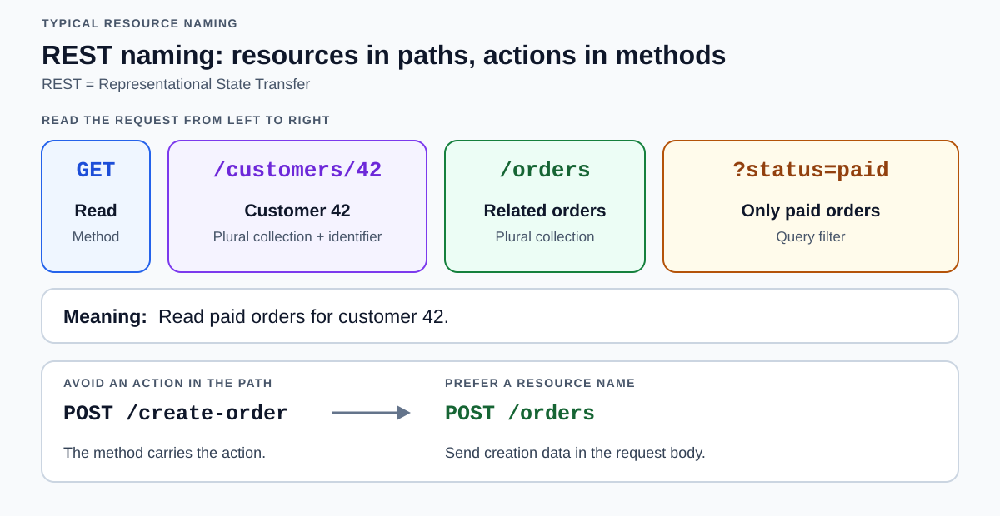

# REST naming convention

[Back to Computer Science](../Readme.md#content)

# Front

Which seven naming conventions make REST resource paths clear and consistent?

# Back

Use clear resource names, show relationships in paths, and put filters in query parameters. Express actions with HTTP (Hypertext Transfer Protocol) methods, such as `GET` or `POST`.

**REST (Representational State Transfer) is an architectural style**.

A **resource** is something a client can address, such as an order or a collection of orders.

Read the diagram from left to right: the method requests an action, the path identifies customer 42's orders, and the query selects paid orders.

## Seven practical conventions

These are a consistent design style, not universal REST requirements.

1. **Use lowercase, hyphens, and clear words in fixed path names.** Prefer `/customers/16/phone-number` over `/Customers/16/phone_number` or `/customers/16/tel-no`. Avoid obscure abbreviations.

2. **Use `/` to show relationships.** `/customers/42/orders` means orders belonging to customer 42. Keep nesting shallow.

3. **Use nouns; pluralize collections.** `/orders` is a collection; `/orders/42` is one member. Read it with `GET /orders/42`, rather than naming the path `/getOrder`. A single related resource can be singular, such as `/orders/42/customer`.

4. **Keep names simple.** Avoid raw spaces, `|`, or `^` in paths. If an identifier needs such characters, percent-encode them, e.g. a space becomes `%20`.

5. **Prefer paths without response-format extensions.** Use `/teams/42` with an `Accept: application/json` request header instead of `/teams/42.json`. A `?format=json` option works only if the service supports it.

6. **Use query parameters for filtering, sorting, and pagination.** For example, `/locations?country=USA` filters locations, and `/articles?page=2&per_page=10` requests a page. Parameter names are service-defined; some styles use `snake_case` here even where paths use hyphens.

7. **Omit trailing slashes consistently.** Prefer `/users/42` over `/users/42/` when defining this style.

## Two important distinctions

- **Placeholders are documentation:** `/users/{userId}` becomes `/users/42`. Placeholder names follow the service's style; `{user-id}` is not inherently wrong. Preserve the spelling of actual identifier values.
- **An identifier is not a filter:** `/locations/USA` can identify one resource named `USA`; `/locations?country=USA` selects a collection by country. Choose according to the intended meaning.

# Sources

- [Microsoft — REST resource naming, methods, relationships, and queries](https://learn.microsoft.com/en-us/azure/architecture/best-practices/api-design)
- [Zalando — Path naming, identifiers, and trailing slashes](https://opensource.zalando.com/restful-api-guidelines/)
- [Google AIP-190 — Clear names and abbreviations](https://google.aip.dev/190)
- [OpenAPI — Path parameter names and template placeholders](https://spec.openapis.org/oas/v3.1.0.html#parameter-object)
- [RFC 3986 — Characters, percent-encoding, paths, and queries, §§2–3](https://www.rfc-editor.org/rfc/rfc3986.html#section-2)
- [RFC 9110 — Requesting response formats with Accept, §12.5.1](https://www.rfc-editor.org/rfc/rfc9110.html#section-12.5.1)
