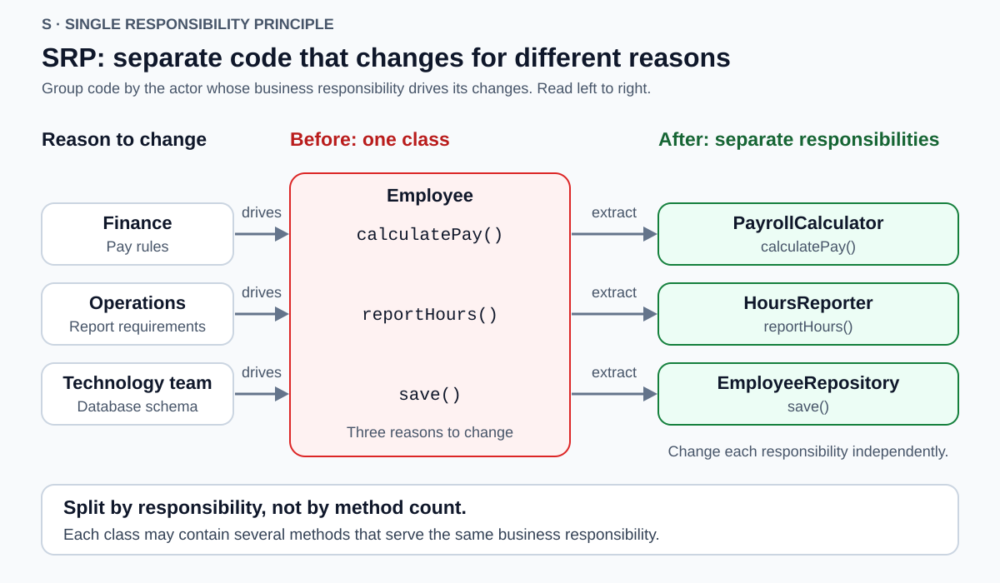
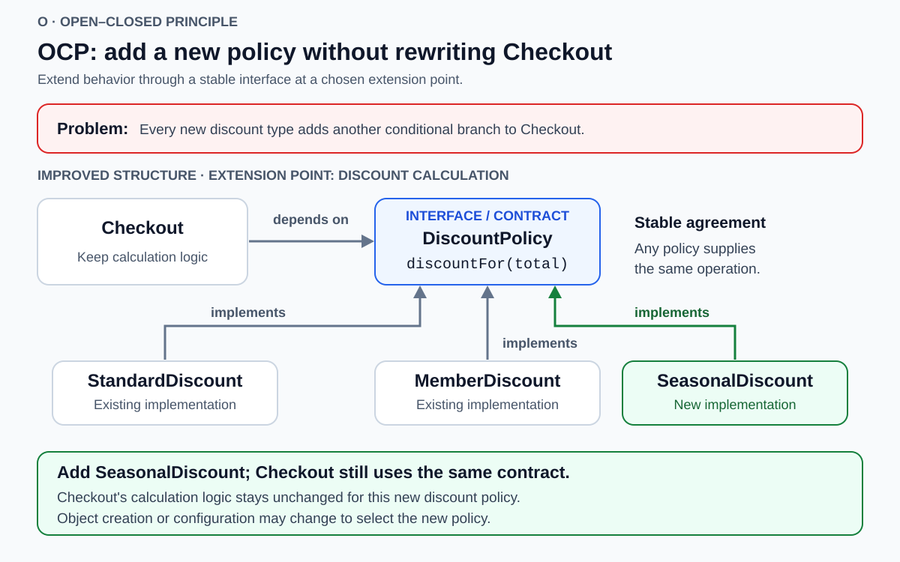
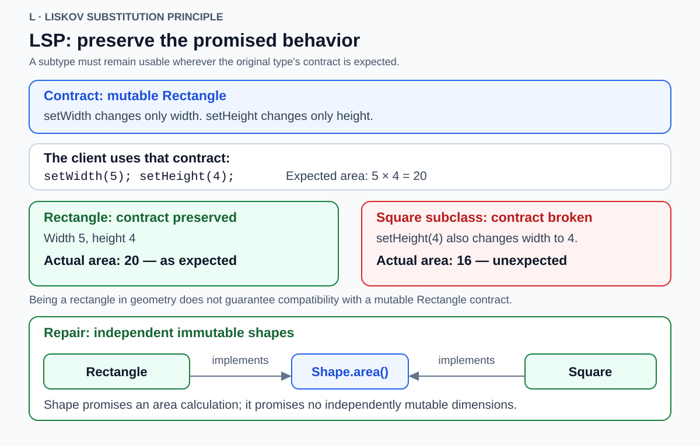
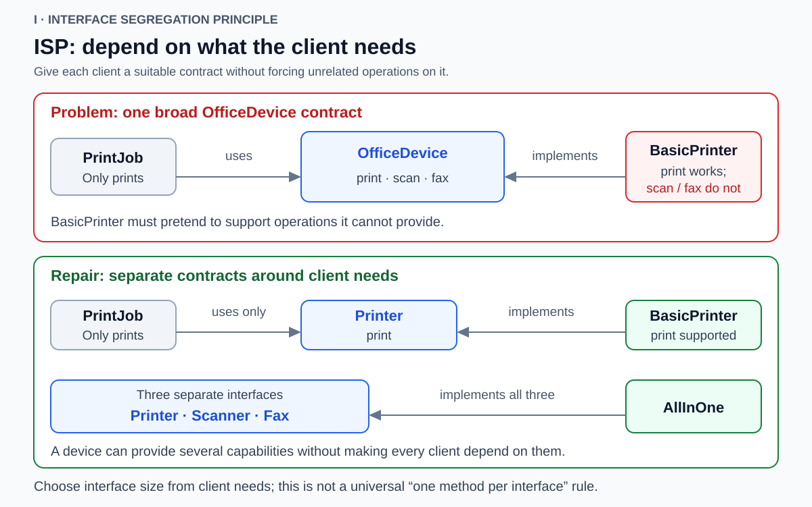
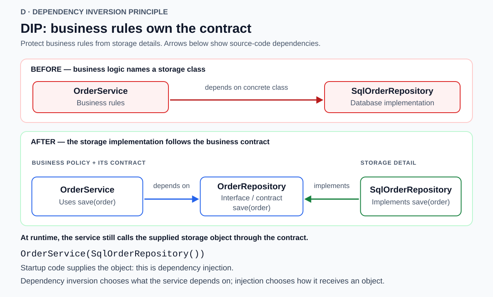

# SOLID

<!-- Card mode: complex. Validate with --mode complex. -->

## Front

What are the five SOLID principles, why do they matter, and how can you recognize and improve a design that violates each one?

## Back

**SOLID** is a set of five software-design principles for keeping changes local, implementations interchangeable, and business rules independent of technical details. They guide how you divide responsibilities and define dependencies; they are not a prescribed class structure.

This card explains each principle through its purpose, a concrete design problem, a diagram, and a possible improvement. The examples use classes and interfaces, but the ideas also apply to larger modules and implicit contracts.

### Vocabulary and the five questions

A **module** is a unit of code, such as a class or package. A **client** is code that uses another component. An **interface** describes available operations; its **contract** also includes their promised behavior. An **abstraction** expresses what a client needs, while an **implementation** supplies the details of how it works.

| Letter | Principle | Design question |
| --- | --- | --- |
| **S** | **Single Responsibility Principle (SRP)** | Which stakeholder's requirements make this module change? |
| **O** | **Open–Closed Principle (OCP)** | Can this kind of new behavior be added through an extension point? |
| **L** | **Liskov Substitution Principle (LSP)** | Does every substitute preserve the contract clients rely on? |
| **I** | **Interface Segregation Principle (ISP)** | Does this client depend on operations it does not need? |
| **D** | **Dependency Inversion Principle (DIP)** | Do business rules depend on their own abstractions or on technical details? |

## S — Single Responsibility Principle

**Group code by one coherent reason to change.** A responsibility belongs to an **actor**: a stakeholder or group representing a particular business function. Separate concerns when different actors can change their requirements independently.

**Problem:** An `Employee` class calculates pay, reports working hours, and saves employee data. Finance changes pay rules, Operations changes reporting requirements, and the technology team changes storage. Combining those concerns can make an unrelated report break during a payroll change.

Read the diagram by actor: each row connects a source of change to the corresponding behavior, then to a separate module.



**Improvement:** Give pay calculations to `PayrollCalculator`, reporting to `HoursReporter`, and persistence to `EmployeeRepository`. They can work with the same employee data while their rules change separately.

**Why it helps:** A change has a clearer home and fewer opportunities to disturb unrelated behavior.

**Avoid the misconception:** One responsibility does not mean one method. A payroll module may need several methods that serve the same business responsibility. Splitting related calculations into arbitrary tiny classes can make them harder to understand.

## O — Open–Closed Principle

**Design a module so a chosen kind of new behavior can be added without rewriting its existing logic.** An **extension point** is a deliberate place to supply that behavior, such as a policy interface or a function argument.

**Problem:** `Checkout` selects discount rules with a growing conditional. Every promotion requires editing that same calculation code.

In the diagram, `Checkout` depends on `DiscountPolicy`. Existing and new policies implement the same contract; adding a seasonal policy extends the system through that boundary.



**Improvement:** Make `Checkout` use the supplied policy. In this example, `discountFor(total)` returns a discount amount between zero and the total. The following is conceptual pseudocode, not a complete program:

```text
Checkout.totalAfterDiscount(total, policy: DiscountPolicy):
    return total - policy.discountFor(total)
```

`StandardDiscount`, `MemberDiscount`, and a new `SeasonalDiscount` provide different rules while preserving that contract. Startup code or configuration chooses the policy.

**Why it helps:** Adding a supported variation leaves the established checkout calculation unchanged.

**Avoid the misconception:** OCP does not prohibit bug fixes, refactoring, or changes to the contract itself. It protects a selected module against selected variations. Wiring may still change. Introduce extension points around demonstrated or reasonably expected change, rather than trying to anticipate every future feature.

## L — Liskov Substitution Principle

**A subtype or implementation must preserve the behavior promised by the type it substitutes for.** Client code that is correct against that contract should remain correct after substitution. Matching method names and parameter types is insufficient.

**Problem:** Suppose a mutable `Rectangle` contract promises that changing width preserves height, and changing height preserves width. A `Square` subclass instead updates both dimensions whenever either setter runs.

The diagram applies the same client operations to both objects. The expected result follows from the independent-setter contract, not merely from the word “rectangle.”



Conceptual client code:

```text
rectangle.setWidth(5)
rectangle.setHeight(4)
assert rectangle.area() == 20
```

The square implementation finishes with sides of length 4 and area 16. It violates the promised effect of `setHeight`, so it is not a valid substitute under this contract.

**Improvement:** Use independent immutable `Rectangle` and `Square` implementations of a smaller `Shape` contract that provides `area()`. **Immutable** means their dimensions do not change after construction. This shared contract makes no promise about independently changing dimensions.

For a behavioral contract, check:

- **Preconditions:** requirements before a call. A substitute must not demand more from a valid caller.
- **Postconditions:** guarantees after a call. A substitute must not guarantee less.
- **Invariants and allowed state changes:** properties clients can rely on across operations must remain true.

**Why it helps:** Clients can use the abstraction without special cases for unexpected implementations.

**Avoid the misconception:** LSP does not require identical results or forbid all exceptions. Different behavior is valid within the contract. The rectangle example concerns a particular mutable interface; it is not a ban on every possible square–rectangle model. LSP also applies to interface implementations without class inheritance.

## I — Interface Segregation Principle

**Give clients contracts that contain the capabilities their role needs.** Depending on an oversized interface ties a client to unrelated operations and their changes.

**Problem:** An `OfficeDevice` interface bundles `print`, `scan`, and `fax`. A print-only client depends on the whole contract, while a `BasicPrinter` has to reject operations it cannot support.

Read the diagram from the client to its contract. After the split, `PrintJob` depends on `Printer`; scanning and faxing have separate interfaces.



**Improvement:** Introduce client-focused `Printer`, `Scanner`, and `Fax` contracts. `BasicPrinter` implements `Printer`; an `AllInOne` device can implement several contracts. A print job receives the printer view of either device.

**Why it helps:** Print-only clients need not understand or track changes to scanning and faxing contracts. Implementations can expose only the capabilities they support.

**Avoid the misconception:** The goal is coherent client roles, not one method per interface or one interface per individual caller. Several methods can belong together if the same clients need them.

ISP and LSP can expose different aspects of the same problem: ISP questions why a print client depends on scanning; LSP questions whether an implementation honors the scanning behavior it promised.

## D — Dependency Inversion Principle

**High-level business policy and low-level technical details should depend on abstractions; the abstractions should not depend on those details.** High-level policy expresses what the application does. Low-level details implement mechanisms such as database access.

**Problem:** `OrderService` directly creates or names `SqlOrderRepository`. Its business code then depends on a particular database implementation. Here, SQL means Structured Query Language.

The diagram's arrows show **source-code dependencies**, meaning which types or interfaces the code knows about. After the redesign, both arrows point toward the business-facing `OrderRepository` contract.



**Improvement:** Define `OrderRepository` around the service's needs, for example `save(order)`. `OrderService` uses that interface; `SqlOrderRepository` implements it. Keep database-specific connection and result types out of the business-facing contract.

At runtime, the service still calls the supplied repository implementation. The inversion concerns source dependencies, not a reversal of execution.

**Dependency injection (DI)** is a technique for supplying a dependency from outside an object. This conceptual pseudocode illustrates constructor injection:

```text
OrderService(repository: OrderRepository):
    this.repository = repository

OrderService.place(order):
    this.repository.save(order)

# Startup code assembles the objects:
service = OrderService(SqlOrderRepository())
```

**Why it helps:** Another storage implementation or an in-memory test substitute can satisfy the same contract while the service's business logic stays independent of storage details.

**Avoid the misconception:** DIP and DI answer different questions. DIP concerns what the service depends on; DI concerns how it receives a collaborator. Injecting a parameter typed as concrete `SqlOrderRepository` is still injection, but retains that concrete dependency. A DI framework is neither required nor sufficient for DIP.

### How the principles work together

Use these as separate checks on a design: **S** groups changes, **O** provides extension points, **L** keeps replacements valid, **I** narrows client dependencies, and **D** protects policy from details.

For example, `DiscountPolicy` supports OCP by admitting a new promotion, but that promotion must satisfy its contract to preserve LSP. A storage interface can support DIP, while ISP keeps it focused on the operations its clients need.

Treat SOLID as design guidance. An interface is useful when it clarifies a contract or isolates meaningful variation; adding one for every class does not automatically improve a system. Start from an actual change, dependency, or contract problem and use the smallest redesign that addresses it.

## Sources

- [Robert C. Martin — The Single Responsibility Principle: actors and reasons to change](https://blog.cleancoder.com/uncle-bob/2014/05/08/SingleReponsibilityPrinciple.html)
- [Robert C. Martin — The Open Closed Principle: extension and plugin boundaries](https://blog.cleancoder.com/uncle-bob/2014/05/12/TheOpenClosedPrinciple.html)
- [Barbara Liskov and Jeannette Wing — A Behavioral Notion of Subtyping: contracts, invariants, and state changes](https://www.cs.cmu.edu/~wing/publications/LiskovWing94.pdf)
- [Robert C. Martin — Design Principles and Design Patterns: OCP, LSP, DIP, and ISP; author-attributed PDF mirror](https://cdn2.f-cdn.com/files/download/625001/XQ4sUPrinciples_and_Patterns.pdf)
- [Robert C. Martin — SOLID Relevance: modern scope and common misunderstandings](https://blog.cleancoder.com/uncle-bob/2020/10/18/Solid-Relevance.html)
- [Robert C. Martin — The Clean Architecture: source dependencies versus flow of control](https://blog.cleancoder.com/uncle-bob/2012/08/13/the-clean-architecture.html)
- [Martin Fowler — Inversion of Control Containers and the Dependency Injection pattern: construction, configuration, and use](https://martinfowler.com/articles/injection.html)

---

<sub>[Back to Computer Science](../Readme.md#content)</sub>
