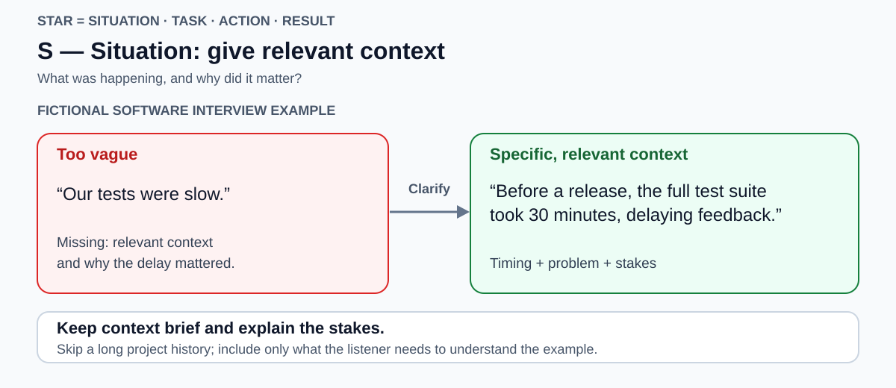
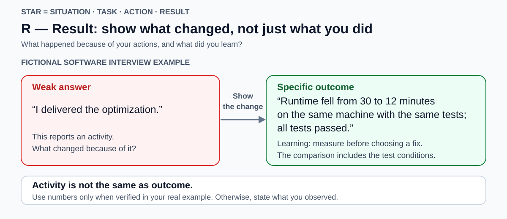

# STAR

<!-- Card mode: complex. Validate with --mode complex. -->

## Front

How do you use STAR to answer a behavioural interview question, and which common pitfalls weaken the answer?

## Back

**STAR** means **Situation, Task, Action, Result**: a structure for explaining a specific past experience so the interviewer can understand your contribution and its outcome. It helps turn a claim such as “I solve problems” into concrete evidence.

Use it for **behavioural questions**, which ask how you acted in a real situation—for example, “Tell me about a time you improved a process.” The sections below explain each part, then common pitfalls and a preparation check.

### The four parts at a glance

| Part | Question it answers | Include |
| --- | --- | --- |
| **Situation** | What was happening? | Relevant context, the problem, and why it mattered. |
| **Task** | What were you responsible for? | Your objective, ownership, and important constraints. |
| **Action** | What did you do, and why? | Your decisions, specific actions, and reasoning. |
| **Result** | What happened because of those actions? | The observed outcome, evidence, and relevant learning. |

Keep the setup brief enough to leave room for your actions and their consequences. STAR provides a structure, not a universal timing formula. For written application answers, UCL suggests devoting roughly 70–80% of the word count to Action. Treat this as guidance on emphasis, not a fixed interview timing rule.

The four diagrams use **one fictional software-interview example** about a **test suite**, the collection of automated checks run against software. Read each from the vague answer on the left to the more specific answer on the right. In an interview, use your own real experience; the example's numbers are illustrative.

## Step 1 — S: Situation

**Set the scene and explain the stakes.** Give enough context for someone unfamiliar with your project to understand the problem.

In the example, the full test suite took 30 minutes before a release, delaying feedback on changes. That explains why test speed mattered.

The interviewer does not need the project's entire history, every team member's role, or an explanation of every tool. Choose the details that make your later decisions understandable.

**Distinction:** Situation describes the surrounding problem. Task identifies your responsibility within it.

## Step 2 — T: Task

**State the goal you owned and what success would mean.** Explain your role, whether the work was assigned to you or you took the initiative, and any meaningful constraint.

Here, the personal objective is to bring the runtime below 15 minutes without removing tests. The target and constraint make the eventual outcome assessable.

“Make tests faster” leaves your role unclear. “I owned reducing the runtime” identifies it. Do not claim ownership you did not have; describe your actual part in a shared task.

**Distinction:** The task is the objective. Measuring slow tests and changing their setup belong in Action.

## Step 3 — A: Action

**Explain what you personally did, how you did it, and why you chose that approach.** This is where the interviewer can examine your judgment, rather than only the project's success.

In the fictional example:

- **Investigate:** I measured the slow tests to identify where time was being spent.
- **Choose and change:** I removed repeated setup of unchanged test data because that was the source of the delay.
- **Check:** I reran the complete suite to confirm that the tests still passed after the change.

“We improved the tests” hides both the decision and the contribution. A list of technologies also says little about what you accomplished with them.

Use **“I” for your actions and “we” for shared work or outcomes**. For example, you can explain your analysis while crediting a colleague's review. The aim is accurate attribution, not pretending you worked alone.

## Step 4 — R: Result

**Finish with the actual consequence, then useful learning.** Connect the outcome to the original objective.

In this example, runtime fell from 30 to 12 minutes on the same machine with the same tests, and all tests passed. This states a baseline, an outcome, and a meaningful comparison. “I delivered the optimization” describes completed work without showing whether it helped.

Use numbers when you know and can explain them. Otherwise, give concrete qualitative evidence, such as an agreed resolution, adoption of your recommendation, or specific feedback. Do not invent precision or present an estimate as a measurement.

Learning can complete the answer—for example, measuring the bottleneck before choosing a fix. It should not replace the outcome. If the goal was missed, say so and explain your responsibility and what you subsequently changed.

## Typical pitfalls and how to repair them

| Pitfall | Why it weakens the answer | Repair |
| --- | --- | --- |
| **A polished story that misses the question** | It may not demonstrate the skill being assessed. | Choose an example relevant to that skill. A speed improvement alone does not prove conflict resolution. |
| **A general habit or hypothetical answer** | “I usually…” or “I would…” does not show what happened on a particular occasion. | For a past-experience question, describe one real event. |
| **Too much background, rushed actions** | The listener hears the setting but cannot assess your decisions. | Shorten Situation and Task; explain the important choices in Action. |
| **A vague “we,” or taking all the credit** | Both obscure your actual contribution. | Separate your actions from the team's work and shared result. |
| **Ending with an activity** | “I sent the email” does not show its effect. | Explain the response or change it produced, including when there was no improvement. |
| **Unsupported numbers or inflated impact** | You may be unable to explain the evidence in follow-up questions. | Use genuine measurements, clearly labeled estimates, or specific qualitative evidence. |
| **Disguising a failure as a triumph** | It avoids a question about accountability or learning. | State the real setback, your part in it, and the concrete improvement you made afterward. |
| **Reciting a memorized script** | It can sound unnatural and be difficult to adapt to the question. | Practice from short prompts; listen and leave room for follow-up questions. |

### Preparation and recall check

Prepare several genuine examples that demonstrate different skills. They can come from employment, study, volunteering, or other relevant experiences. Use one coherent example for a question unless the interviewer asks for more.

Before practicing an answer, check:

- Does this example address the question actually asked?
- Can the listener distinguish the context from my responsibility?
- Are my decisions and contribution clear?
- Have I stated the outcome and the evidence behind it?
- Can I discuss the tradeoffs, limitations, and learning honestly?

**Recall:** What happened? What was my goal? What did I do and why? What changed?

## Sources

- [National Careers Service — The STAR method: structure, real examples, and conversational delivery](https://nationalcareers.service.gov.uk/careers-advice/interview-advice/the-star-method)
- [Oxford University Careers Service — Demonstrating job criteria and structuring STAR answers](https://www.careers.ox.ac.uk/demonstrate-you-fit-the-job-criteria)
- [The Open University — Using STAR: relevance, specificity, and personal actions](https://help.open.ac.uk/job-interviews/using-star-technique)
- [UCL Careers — How to shine like a STAR: concise setup, Action word-count guidance, and explaining what, how, and why](https://www.ucl.ac.uk/study/blog-posts/how-shine-star-your-next-application)
- [Harvard Mignone Center for Career Success — Interviewing: practice, accountability, and learning from mistakes](https://careerservices.fas.harvard.edu/resources/interviewing/)
- [Amazon — Common interview mistakes: personal contribution and quantitative or qualitative evidence](https://www.aboutamazon.com/news/workplace/amazon-jobs-interview-mistakes)
