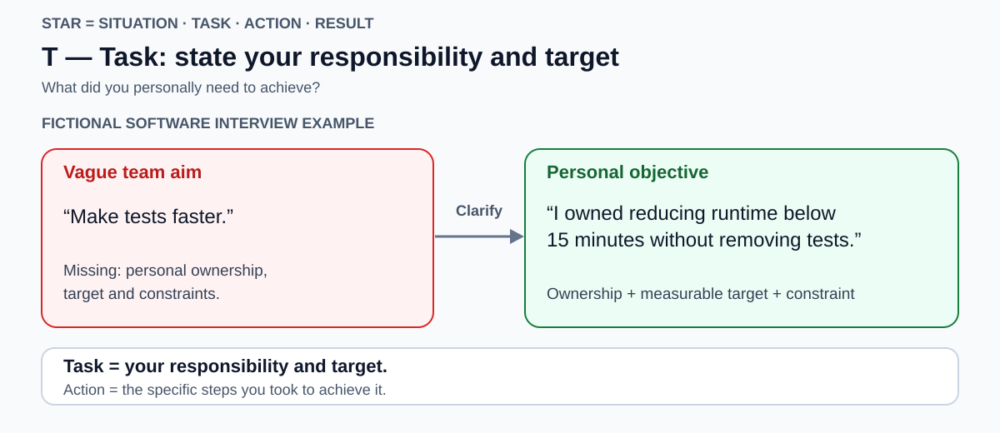
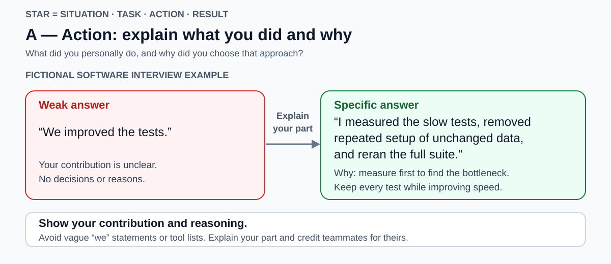

# STAR

[Back to Computer Science](../Readme.md#content)

# Front

How do you use STAR to answer a behavioural interview question, and which common pitfalls weaken the answer?

# Back

**STAR** means **Situation, Task, Action, Result**: a structure for explaining a specific past experience so the interviewer can understand your contribution and its outcome. Use it for questions such as “Tell me about a time you improved a process.”

The diagrams follow **one fictional software example**. A **test suite** is a collection of automated software checks. Read each diagram from a vague answer on the left to a specific answer on the right. Use your own real experience in an interview; these numbers are illustrative.

## S — Situation: what was happening?

Give the context, problem, and stakes. Here, the full test suite took 30 minutes before a release, delaying feedback. Keep the setup brief so your actions have room.

## T — Task: what was your responsibility?

State the goal you owned and any important constraint: “I owned reducing runtime below 15 minutes without removing tests.” Situation describes the problem; Task identifies your responsibility within it.

## A — Action: what did you do and why?

Explain your decisions and concrete steps: “I measured the slow tests, removed repeated setup of unchanged data, and reran the full suite.” Measuring first explains how you chose the fix; rerunning checks its effect.

Use **“I” for your actions and “we” for shared work**. Credit teammates accurately. A list of tools does not explain your contribution.

## R — Result: what changed?

Connect the outcome to the goal: “Runtime fell from 30 to 12 minutes on the same machine with the same tests; all tests passed.” This gives a baseline and a comparable result. “I delivered the optimization” only names an activity.

Use verified numbers or specific qualitative evidence. If the goal was missed, explain the actual outcome, your responsibility, and what you learned or changed afterward.

## Avoid common pitfalls

- **Missing the question:** choose an event that demonstrates the skill being assessed.
- **General or hypothetical answers:** describe one real occasion, rather than “I usually…” or “I would…”.
- **Too much setup:** keep Situation and Task concise; explain the important decisions in Action.
- **Vague ownership or inflated impact:** separate your contribution from the team's and explain your evidence.
- **A memorized script:** practise from short prompts, keep it conversational, and prepare for follow-up questions.

Prepare several genuine examples from work, study, or volunteering. Check: **What happened? What was my goal? What did I do and why? What changed?**

# Sources

- [National Careers Service — The STAR method: structure, real examples, and conversational delivery](https://nationalcareers.service.gov.uk/careers-advice/interview-advice/the-star-method)
- [Oxford University Careers Service — Demonstrating job criteria and structuring STAR answers](https://www.ox.ac.uk/careers/careers-guidance/job-search-and-applications/demonstrate-you-fit-the-job-criteria)
- [The Open University — Using STAR: relevance, specificity, and personal actions](https://help.open.ac.uk/job-interviews/using-star-technique)
- [UCL Careers — How to shine like a STAR: concise setup, Action word-count guidance, and explaining what, how, and why](https://www.ucl.ac.uk/study/blog-posts/how-shine-star-your-next-application)
- [Harvard Mignone Center for Career Success — Interviewing: practice, accountability, and learning from mistakes](https://careerservices.fas.harvard.edu/resources/interviewing/)
- [Amazon — Common interview mistakes: personal contribution and quantitative or qualitative evidence](https://www.aboutamazon.com/news/workplace/amazon-jobs-interview-mistakes)
