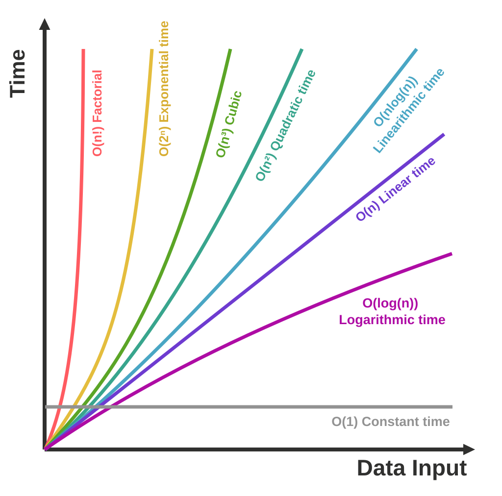

# Time Complexity

<!-- Card mode: simple. Validate with --mode simple. -->

## Front

How does time complexity describe an algorithm's growth as input size increases?

## Back

**Time complexity** describes how the number of basic operations an algorithm performs grows with input size `n`. For an array, `n` usually means its number of elements. Here, assume each array access or comparison takes constant time.

**Big-O, `O(f(n))`, gives an upper bound:** for sufficiently large `n`, the work is at most a fixed constant times `f(n)`. It hides constant factors and lower-order terms: `3n² + 5n + 7` is `O(n²)`. **Theta, `Θ(n²)`, states the tight growth rate** by bounding the work both above and below by constant multiples of `n²`.

Read **Data Input** as `n` and **Time** as growth in work. These schematic curves compare growth rates; their positions and crossings are not measured timings.

### Recognize common growth patterns

The examples below use worst-case bounds where the input affects the work.

| Bound | Name | Example or pattern |
| --- | --- | --- |
| `O(1)` | Constant | Read one array element by index; work stays bounded as `n` grows. |
| `O(log n)` | Logarithmic | Binary search an already sorted array: repeatedly halve the remaining range. |
| `O(n)` | Linear | Scan all `n` elements once. |
| `O(n log n)` | Linearithmic | Merge sort: about `log n` levels, with `O(n)` work per level. |
| `O(n²)` | Quadratic | Two nested loops, each running `n` times, with constant work inside. |
| `O(n³)` | Cubic | Three such nested loops. |

The chart also shows **exponential** `O(2ⁿ)` and **factorial** `O(n!)` growth. There are `2ⁿ` subsets of `n` distinct items and `n! = n × (n−1) × … × 1` orderings. Exploring them can be expensive; constructing or checking each candidate adds its own cost.

### Count work, not just loops

Two consecutive full scans do `n + n = 2n` work: `O(n)`. Two nested full scans do `n × n = n²` work: `O(n²)`. Doubling `n` doubles the first count and quadruples the second. Count actual iterations and the cost of the body; nesting alone does not prove quadratic time.

**Big-O does not mean worst case.** For inputs of the same size, best and worst cases describe the least and most work; an average case depends on an input distribution. State which case you mean.

A slower-growing bound helps assess scaling, but constants, hardware, and implementation still affect actual speed, especially for small inputs.

## Sources

- [Cornell CS 2110 — Analyzing Complexity: operation counts, growth classes, and search](https://courses.cis.cornell.edu/courses/cs2110/2026sp/lectures/lec05/)
- [NIST — Big-O notation: asymptotic upper bounds](https://xlinux.nist.gov/dads/HTML/bigOnotation.html)
- [NIST — Theta: asymptotically tight bounds](https://xlinux.nist.gov/dads/HTML/theta.html)
- [Cornell CS 2110 — Sorting Algorithms: merge sort and expected runtime](https://courses.cis.cornell.edu/courses/cs2110/2026sp/lectures/lec07/)
- [Princeton Algorithms — Analysis of Algorithms: cost models, loops, and practical limits](https://algs4.cs.princeton.edu/14analysis/)
- [Indiana University South Bend — Combinatorial Object Generation: subsets and permutations](https://www.cs.iusb.edu/~danav/teach/b424/b424_25_combin.html)
