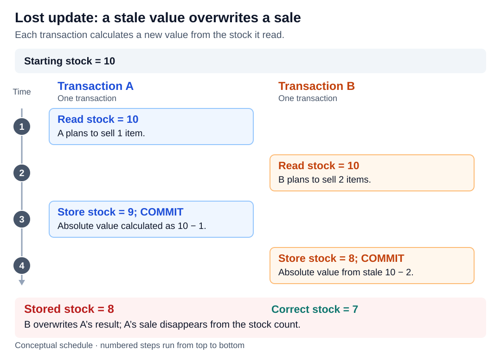
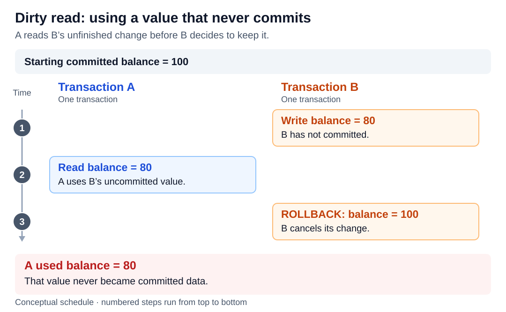
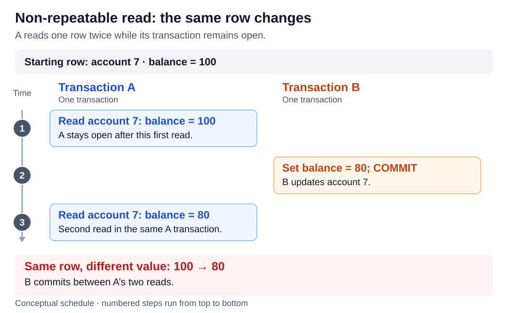
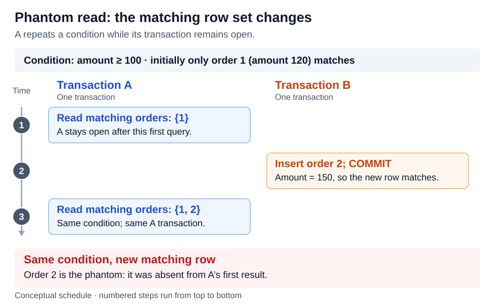
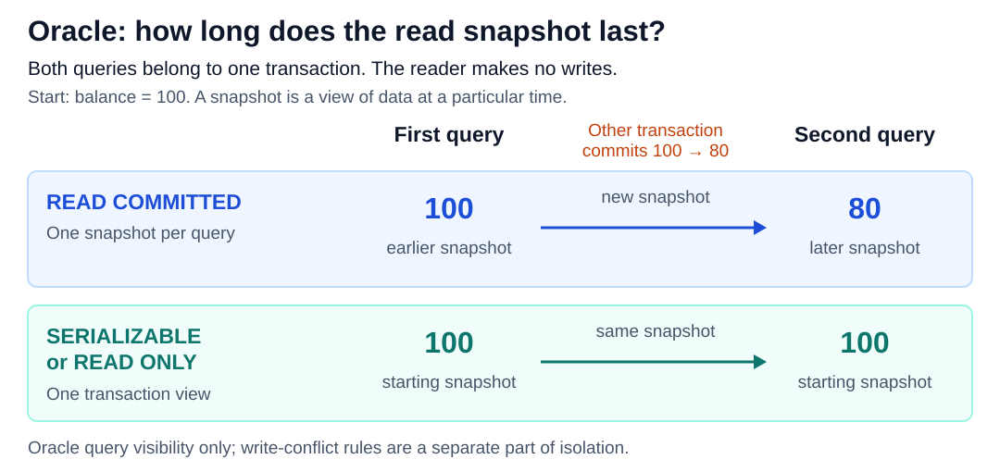

# Transaction isolation levels

<sub>[Back to Computer Science](../Readme.md#content)</sub>

**A transaction isolation level defines which effects of concurrent transactions you may observe and which concurrency anomalies the database must prevent.** The four standard levels are **Read Uncommitted, Read Committed, Repeatable Read, and Serializable**. Their names describe guarantees; databases can use different mechanisms and sometimes provide stronger guarantees than the minimum.

This article starts with lost updates and three read anomalies, then compares the standard levels using Oracle, PostgreSQL, and SQL Server to illustrate implementation differences. It then explains why stable snapshots can still break business rules, examines Oracle's snapshot scopes and read-only mode, and finishes with ways to protect updates and handle retries.

## What isolation controls

A **transaction** groups database operations into one unit. `COMMIT` makes its changes permanent; `ROLLBACK` cancels them. Isolation is the **I** in **ACID**: Atomicity, Consistency, Isolation, and Durability. See [ACID vs BASE](../ACID%20vs%20BASE/Readme.md) for the other properties.

Imagine creating a purchase order by inserting its header and then its lines in one transaction. A concurrent report might run between those operations. Whether it can see the unfinished header is an isolation question. Whether the header and lines commit together is an atomicity question.

Three terms help read the examples:

- A **committed value** comes from a transaction that completed successfully. An uncommitted change can still be rolled back.
- A **snapshot** is a view of database data at a particular point in time.
- A **predicate** is a condition that selects rows, such as `amount >= 100`.

In the diagrams, read numbered events from top to bottom. Each column is one transaction, and repeated reads remain inside the same transaction. These are conceptual schedules illustrating what happens **when the chosen implementation permits the anomaly**.

## Lost update: a stale value overwrites someone else's work

A **lost update** happens when a transaction reads a value, another transaction changes it, and the first transaction later writes a replacement calculated from its stale copy.

Here both buyers read a stock count of `10`. A sells one item and stores `9`. B sells two items but calculates `10 - 2`, then stores `8`. The correct remaining stock is `7`: A's decrement has disappeared.



This differs from a **dirty write**, which overwrites another transaction's *uncommitted* change. Preventing dirty writes does not prevent the stale-value sequence above: A has already committed when B overwrites its result. SQL Server protects writes even at Read Uncommitted, yet its Read Committed level can still allow this stale application update.

Also distinguish an absolute assignment such as `SET stock = 8` from an in-database arithmetic update such as `SET stock = stock - 2`. The latter calculates from the row value used by the update, rather than a previously fetched application value. This distinction matters more than simply putting both operations inside a transaction.

## Dirty read: reading a change that can disappear

A **dirty read** observes another transaction's uncommitted data. The writer might subsequently roll back, leaving the reader with a value that never became committed database state.

In this example, B temporarily changes a balance from `100` to `80`. A reads `80`, but B cancels the change. A may already have used an amount that never became permanent.



Read Uncommitted permits this anomaly. Read Committed and stronger standard levels forbid it. Reading your **own** earlier uncommitted changes is different and is normal transaction behavior.

## Non-repeatable read: the same row gives a different answer

A **non-repeatable read** occurs when a transaction reads data again and finds a change committed by another transaction in between. The first read was valid; it simply no longer matches the second.

A first reads account `7` with balance `100`. B changes that account to `80` and commits. A rereads account `7` and gets `80`, still within A's original transaction.



No dirty read occurred: both observed values were committed. A committed deletion of a previously read row can cause the same kind of problem. Repeatable Read and Serializable prevent this anomaly.

## Phantom read: the set of matching rows changes

A **phantom read** concerns the rows satisfying a predicate. Repeating a query returns a different matching set because another transaction committed a relevant change.

A asks for orders with `amount >= 100` and sees only order `1`. B inserts order `2` with amount `150` and commits. A repeats the same query and now sees orders `1` and `2`.



The distinguishing question is **“Which rows match?”**, rather than **“What value does this previously read row contain?”** A changed matching set can also change an aggregate such as `COUNT(*)` or `SUM(amount)`.

Protecting existing rows alone cannot necessarily protect against new matching rows. The standard allows phantoms at Repeatable Read, although an implementation may prevent them.

## The four standard isolation levels

A **serialization anomaly** means that the results of committed transactions cannot be explained by any ordering in which those transactions ran one at a time. This is broader than the three read anomalies.

The table states minimum guarantees. **Allowed** means the level need not prevent the anomaly; it does not mean every database will exhibit it.

| Isolation level | Dirty reads | Non-repeatable reads | Phantom reads | Serialization anomalies |
| --- | --- | --- | --- | --- |
| Read Uncommitted | Allowed | Allowed | Allowed | Allowed |
| Read Committed | Prevented | Allowed | Allowed | Allowed |
| Repeatable Read | Prevented | Prevented | Allowed | Allowed |
| Serializable | Prevented | Prevented | Prevented | Prevented |

Lost updates are discussed separately because an accurate prediction needs the engine, transaction boundaries, and update pattern. A table that marks every level as preventing “lost updates” may only be describing protection against dirty writes.

### Read Uncommitted

This level allows reading another transaction's unfinished work. It is unsuitable when decisions must use committed data. PostgreSQL treats a request for Read Uncommitted as Read Committed. Avoid equating the weaker level with “nonblocking reads”: versioned reads can avoid waiting for ordinary writers while still rejecting dirty data.

### Read Committed

Other transactions' uncommitted writes are hidden, but their later commits may become visible to subsequent statements. A transaction can therefore see different committed states during its lifetime.

In Oracle, ordinary queries use a fresh snapshot for each statement. In SQL Server, the `READ_COMMITTED_SNAPSHOT` database option selects how Read Committed reads work:

- **`OFF` — SQL Server's default:** reads use shared locks, which can make a query wait for an uncommitted writer.
- **`ON` — Azure SQL Database's default:** reads use row versioning, with a committed snapshot taken at the start of each statement.

The level's name alone does not specify a universal snapshot mechanism.

### Repeatable Read

Previously read data is protected against changes becoming visible on reread. Implementations differ: SQL Server holds shared read locks until transaction end, whereas PostgreSQL uses a transaction snapshot.

SQL Server still permits new matching rows. PostgreSQL 18 prevents phantoms as well, but permits serialization anomalies. **Repeatable Read is not a portable synonym for full serializability.**

### Serializable

The required outcome is equivalent to some serial order of the committed transactions. They may actually overlap; the database must prevent an incompatible combination from committing.

SQL Server uses key-range locking to protect query ranges. PostgreSQL adds dependency checks to snapshots and may abort a transaction with SQLSTATE `40001` (`serialization_failure`). Applications can identify the failure by that code and must retry the **whole transaction**, including the reads and decisions that selected its writes.

## Why a stable snapshot is not enough

Suppose a team requires at least one doctor on call, and initially Alice and Bob are both on call. Each doctor runs a transaction that reads both rows and goes off call only if the other doctor is available.

| Event | Alice's transaction | Bob's transaction |
| --- | --- | --- |
| Read the snapshot | Both doctors are on call | Both doctors are on call |
| Make a decision | Bob can cover; change Alice's row | Alice can cover; change Bob's row |
| Commit under snapshot isolation | Alice is off call | Bob is off call |

The final state has nobody on call. This is **write skew**: the transactions write different rows, so checking only for writes to the same row misses their shared business rule.

In either serial order, the second doctor would see that the first had already left and would stay on call. The concurrent outcome therefore cannot be serializable, even though each transaction read a stable snapshot. See [Multiversion concurrency control](../Multiversion%20concurrency%20control/Readme.md) for the versioning mechanism and another write-skew example.

## Oracle: statement snapshots, transaction snapshots, and read-only mode

Oracle AI Database 26 offers `READ COMMITTED` by default and `SERIALIZABLE`, plus `READ ONLY` transaction mode. It does not expose Read Uncommitted or Repeatable Read as separate isolation settings, and it does not permit dirty reads.

The diagram compares the scope of ordinary queries' snapshots. The top panel takes a new snapshot per query (`READ COMMITTED`); the bottom reuses the transaction's starting view (`SERIALIZABLE` or `READ ONLY`). Oracle's `READ ONLY` mode also prohibits ordinary data modifications. Another transaction changes the balance between the reader's two queries; the reader makes no changes of its own.



With Oracle `READ COMMITTED`, each query sees committed data as of its own start. With Oracle `SERIALIZABLE`, queries use the transaction's starting view plus that transaction's own changes. Updating a row changed by a transaction that committed after that starting point can raise `ORA-08177`.

These are Oracle's documented visibility and conflict rules. A stable view alone does not prove that an application rule spanning several rows is protected; analyze the concurrent reads and writes as in the example above.

### Read-only mode

Use Oracle's `SET TRANSACTION READ ONLY` when several report queries must describe the same committed state while other users keep working. It is an additional mode, rather than a fifth standard isolation level.

This illustrative Oracle SQL assumes an existing `orders` table with an `amount` column. Run it when no earlier transaction is pending; `SET TRANSACTION` must come first.

```sql
SET TRANSACTION READ ONLY;

SELECT COUNT(*) FROM orders;
SELECT SUM(amount) FROM orders;

COMMIT;
```

The final `COMMIT` ends the read-only transaction. This behavior is specific to Oracle's mode: do not assume that a generic “read-only” flag in every database automatically gives transaction-wide snapshots.

## Protecting updates in practice

Choose protection around the rule you need to preserve:

- **Single-row arithmetic:** calculate inside the database. For example, in PostgreSQL Read Committed, `UPDATE inventory SET stock = stock - 2 WHERE id = 7 AND stock >= 2;` combines the stock check and decrement. Verify that one row was updated before treating the reservation as successful.
- **Read, decide, then update a row:** PostgreSQL `SELECT ... FOR UPDATE` locks the selected row against competing modifications until transaction end. Keep the decision and update in that transaction.
- **Rules involving several rows or a query range:** protecting one existing row may be insufficient. Use a coordinated locking strategy or an isolation implementation that enforces serializability for the participating transactions.
- **Serialization failures:** in PostgreSQL, handle SQLSTATE `40001` (`serialization_failure`) by restarting the whole transaction from fresh reads. Repeating only the final write can reuse the stale decision that caused the conflict.

Stronger isolation can add waiting, tracking work, or retries. Multiversion concurrency control keeps older row versions so ordinary reads can coexist with writes, but it does not eliminate every conflict or every lock. Evaluate the required guarantees together with the database's implementation and workload.

# Sources

- [PostgreSQL 18 — Transactions: transaction boundaries, commit, and rollback](https://www.postgresql.org/docs/18/tutorial-transactions.html)
- [PostgreSQL 18 — Transaction Isolation: standard guarantees, PostgreSQL differences, and snapshot isolation versus serializability](https://www.postgresql.org/docs/18/transaction-iso.html)
- [PostgreSQL 18 — Introduction to concurrency control: versioned reads and their relationship to locking](https://www.postgresql.org/docs/18/mvcc-intro.html)
- [PostgreSQL 18 — Explicit Locking: row locks and SELECT FOR UPDATE](https://www.postgresql.org/docs/18/explicit-locking.html)
- [PostgreSQL 18 — Serialization Failure Handling: SQLSTATE 40001 and retrying the complete transaction and decision logic](https://www.postgresql.org/docs/18/mvcc-serialization-failure-handling.html)
- [PostgreSQL wiki — Serializable Snapshot Isolation: write skew and the business rules that snapshots alone cannot protect](https://wiki.postgresql.org/wiki/SSI#Simple_Write_Skew)
- [Berenson et al. — A Critique of ANSI SQL Isolation Levels: P0 dirty writes, P4 lost updates, and A5B write skew](https://www.microsoft.com/en-us/research/wp-content/uploads/2016/02/tr-95-51.pdf)
- [Microsoft — Understanding isolation levels: stale lost updates versus arithmetic updates and write protection](https://learn.microsoft.com/en-us/sql/connect/jdbc/understanding-isolation-levels?view=sql-server-ver17)
- [Microsoft — SET TRANSACTION ISOLATION LEVEL: READ_COMMITTED_SNAPSHOT settings and defaults, shared locks, snapshots, and key-range locks](https://learn.microsoft.com/en-us/sql/t-sql/statements/set-transaction-isolation-level-transact-sql?view=sql-server-ver17)
- [Oracle AI Database 26 — Data Concurrency and Consistency: read anomalies, snapshot scopes, supported levels, and ORA-08177](https://docs.oracle.com/en/database/oracle/oracle-database/26/cncpt/data-concurrency-and-consistency.html)
- [Oracle AI Database 26 — SET TRANSACTION: read-only mode, statement ordering, and consistent reports](https://docs.oracle.com/en/database/oracle/oracle-database/26/sqlrf/SET-TRANSACTION.html)
