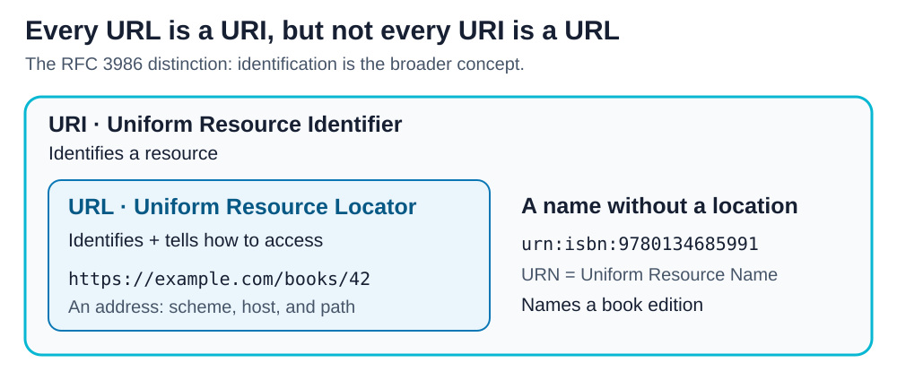

# URI vs URL

<sub>[Back to Computer Science](../Readme.md#content)</sub>

# Front

What is the difference between a URI and a URL?

# Back

In RFC 3986 terminology, a **URI (Uniform Resource Identifier)** identifies a **resource**, such as a page or a book. A **URL (Uniform Resource Locator)** is a URI that also describes how to locate and access the resource. **Every URL is a URI, but not every URI is a URL.**

## Compare two examples

The outer box contains URIs. The URL box sits inside it because locating a resource is one way of identifying it.



- **`https://example.com/books/42` — URI and URL.** It gives an access scheme (`https`), a host (`example.com`), and a path (`/books/42`). A URL does not guarantee that the resource is available.
- **`urn:isbn:9780134685991` — URI used as a name.** This **URN (Uniform Resource Name)** identifies a book edition by its **ISBN (International Standard Book Number)**. It gives no server address or retrieval path, so it is not a URL in this distinction.

## Java example

A library application can use a `URI` to store a book's URN as its identifier, without a download address. This example parses that name and demonstrates why it cannot become a `URL` with Java's standard protocol handlers:

```java
import java.net.MalformedURLException;
import java.net.URI;

class Example {
    public static void main(String[] args) {
        URI bookId = URI.create("urn:isbn:9780134685991");
        System.out.println(bookId.getSchemeSpecificPart());
        try {
            // A failed toURL() conversion is not a general test for whether
            // something is conceptually a URL.
            bookId.toURL();
        } catch (MalformedURLException e) {
            System.out.println(e.getMessage());
        }
    }
}
```

Output with the standard JDK handlers:

```text
isbn:9780134685991
unknown protocol: urn
```

`getSchemeSpecificPart()` reads the part after `urn:`. `URI` can parse it without knowing how to access the book. `URL` requires a **protocol handler**, code that understands the access scheme; the JDK has no built-in handler for `urn`. A custom handler could change that, but ordinary `URL` use cannot represent this name.

## Why terminology varies

The **WHATWG URL Standard**, used for web URL parsing, standardizes on the term **URL** more broadly. The subset rule above describes the RFC 3986 distinction; follow the terminology of the specification or library you are using.

# Sources

- [RFC 3986 — URI definitions, the URL subset, and identification versus access (§§1.1–1.2.2)](https://datatracker.ietf.org/doc/html/rfc3986#section-1.1.3)
- [RFC 8254 — ISBN URN namespace and ISBN-10/ISBN-13 identifiers (§2.1)](https://www.rfc-editor.org/rfc/rfc8254#section-2.1)
- [WHATWG URL Standard — Goals and the choice of URL terminology](https://url.spec.whatwg.org/#goals)
- [Java SE 25 — URI parsing, scheme-specific parts, and conversion to URL](https://docs.oracle.com/en/java/javase/25/docs/api/java.base/java/net/URI.html)
- [Java SE 25 — URL protocol handlers and unsupported protocols](https://docs.oracle.com/en/java/javase/25/docs/api/java.base/java/net/URL.html)
